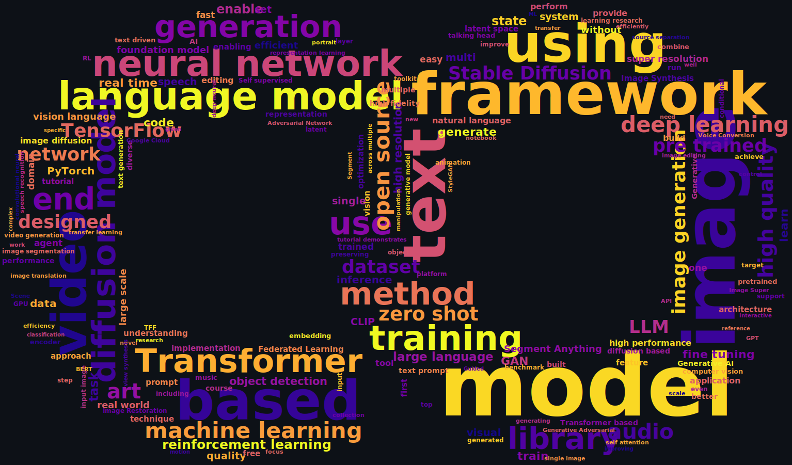

The page might not be rendered properly. Please open [README.md](https://github.com/amrzv/awesome-colab-notebooks/blob/main/README.md) file directly
# Awesome colab notebooks collection for ML experiments
## Trending
| repositories | papers | packages |
|---|---|---|
| <ul><li>timesfm	</li> <li>agent-starter-pack	</li> <li>part_1_ml_cv	</li> <li>ritm-interactive-segmentation	</li> <li>PaddleHub	</li> <li>vjepa2	</li> <li>langgraph	</li> <li>litellm	</li> <li>wmar	</li> <li>verl	</li> <li>prompt-eng-interactive-tutorial	</li> <li>ARENA_3.0	</li> <li>Qwen3-Omni	</li> <li>sglang	</li> <li>TabPFN	</li> <li>SAELens	</li> <li>unsloth	</li> <li>gemma	</li> <li>presidio	</li> <li>SwanLab	</li> <li>dinov3	</li></ul> | <ul><li>Gemma	</li> <li>FELIX	</li> <li>TorchGeo	</li> <li>AWQ	</li> <li>trlX	</li> <li>BiRefNet	</li> <li>LLaMA Factory	</li> <li>FastChat	</li> <li>ESM	</li> <li>DifFace	</li> <li>Classify text with BERT	</li> <li>Fine-tuning a BERT	</li> <li>GraphCast	</li> <li>Gaussian Splatting	</li> <li>EAT	</li> <li>VRT	</li> <li>FreeInit	</li> <li>LIDA	</li> <li>SAHI	</li> <li>AST	</li> <li>SadTalker	</li></ul> | <ul><li>trackers	</li> <li>sglang	</li> <li>imagededup	</li> <li>scikit-video	</li> <li>videoseal	</li> <li>onnxruntime	</li> <li>litellm	</li> <li>google-adk	</li> <li>anthropic	</li> <li>opik	</li> <li>maestro	</li> <li>gigaam	</li> <li>sahi	</li> <li>pyterrier	</li> <li>executorch	</li> <li>llamafactory	</li> <li>open-interpreter	</li> <li>magic-pdf	</li> <li>mistral-inference	</li> <li>crewai-tools	</li> <li>crewai	</li></ul> |
## Projects

PROJECTS

| name | description | authors | links | colaboratory | update |
|------|-------------|:--------|:------|:------------:|:------:|
| SHAP | SHapley Additive exPlanations is a game theoretic approach to explain the output of any machine learning model | <ul><li>[Scott Lundberg](https://scottlundberg.com/)</li> <li>[Su-In Lee](https://www.cs.washington.edu/people/faculty/su-in-lee/)</li></ul> |   <ul><li>, , , </li><li>, </li><li></li><li>, , , , , </li></ul> |  | 15.04.2026 |
| GigaAM | SSL pretraining framework that leverages masked language modeling with targets derived from a speech recognition model | <ul><li>[Aleksandr Kutsakov](https://github.com/Alexander4127)</li> <li>[Alexandr Maximenko](https://github.com/AlexMaximenko)</li> <li>[Georgii Gospodinov](https://github.com/georgygospodinov)</li> <li>[Pavel Bogomolov](https://github.com/Bobrosoft98)</li> <li>[Fyodor Minkin](https://www.researchgate.net/profile/Fyodor-Minkin)</li></ul> |  <ul><li>, , , , </li><li>, </li><li></li><li>, , , </li><li>[1](https://habr.com/ru/companies/sberdevices/articles/805569)</li></ul> |  | 15.04.2026 |
| dm_control | DeepMind Infrastructure for Physics-Based Simulation | <ul><li>[Saran Tunyasuvunakool](https://github.com/saran-t)</li> <li>[Alistair Muldal](https://github.com/alimuldal)</li> <li>[Yotam Doron](http://www.yotamdoron.com/)</li> <li>[Siqi Liu](http://siqi.fr/)</li>

others
<li>[Steven Bohez](https://github.com/sbohez)</li> <li>[Josh Merel](https://sites.google.com/site/jsmerel/)</li> <li>[Tom Erez](https://github.com/erez-tom)</li> <li>[Timothy Lillicrap](https://contrastiveconvergence.net/~timothylillicrap/index.php)</li> <li>[Nicolas Heess](https://scholar.google.com/citations?user=79k7bGEAAAAJ)</li> <li>[Yuval Tassa](https://github.com/yuvaltassa)</li></ul>
 |   <ul><li>, , , , , </li><li></li><li></li><li></li><li>, , </li></ul> |  | 14.04.2026 |
| Text Generation Web UI | The best local UI for large language models, with easy setup and powerful features. 100% offline. | [oobabooga](https://github.com/oobabooga) |  <ul><li></li><li></li><li>, , , , , , </li><li>, , , </li><li></li><li>[1](https://go.warp.dev/text-generation-webui), [2](https://tfwol.github.io/text-generation-webui), [3](https://jimmysong.io/ai/text-generation-webui), [4](https://tokk-nv.github.io/jetson-generative-ai-playground/tutorial_text-generation.html)</li></ul> |  | 13.04.2026 |
| DataChain | AI-dataframe to enrich, transform and analyze data from cloud storages for ML training and LLM apps | [Daniel K](https://github.com/volkfox) |  <ul><li></li><li></li><li>, </li><li>[1](https://datachain.dvc.ai/), [2](https://dvc.org/chat)</li></ul> |  | 13.04.2026 |
| CrewAI | Lean, lightning-fast Python framework built entirely from scratch—completely independent of LangChain or other agent frameworks | [João Moura](https://github.com/joaomdmoura) |  <ul><li></li><li></li><li>, </li><li>, </li><li>[website](https://crewai.com/)</li><li>, , , , , , , , </li><li>[1](https://app.crewai.com/), [2](https://learn.crewai.com/), [3](https://www.coursera.org/projects/multi-ai-agent-systems-with-crewai)</li></ul> |  | 12.04.2026 |
| ActionMesh | Temporal 3D diffusion framework that generates production-ready, topology-consistent animated 3D meshes from inputs like video, text, or static 3D shapes in a fast, feed-forward manner. | <ul><li>[Remy Sabathier](https://remysabathier.github.io/RemySabathier)</li> <li>[David Novotny](https://d-novotny.github.io)</li> <li>[Niloy J. Mitra](https://www0.cs.ucl.ac.uk/staff/n.mitra)</li> <li>[Tom Monnier](https://tmonnier.com)</li></ul> |  <ul><li></li><li>, , </li><li>, , , , , </li><li>, </li><li></li><li>[1](https://download.blender.org/release/Blender3.5), [2](https://sam2.metademolab.com/demo), [3](https://jnack.com/blog/2026/02/01/actionmesh-turns-video-into-3d)</li></ul> |  | 10.04.2026 |
| JAX MD | Differentiable physics and molecular dynamics simulation framework in JAX that enables scalable, GPU-accelerated simulations and end-to-end optimization of entire trajectories, with flexible primitives and neural network integration. | <ul><li>[Samuel S. Schoenholz](https://www.samuelsschoenholz.com)</li> <li>[Ekin D. Cubuk](https://scholar.harvard.edu/efthimios_kaxiras/ekin-dogus)</li></ul> |   <ul><li>, , , , , , </li><li></li><li></li><li></li><li>, , </li><li></li><li>[1](https://www.nature.com/articles/s41524-023-01189-z), [2](https://www.nature.com/articles/s41586-023-06735-9), [3](https://www.nature.com/articles/s41467-021-27241-4), [4](https://haruiz.github.io/blog/accelerating-science-with-jax-simulations-physics-and-beyond)</li></ul> |  | 05.04.2026 |
| The Autodiff Cookbook | You'll go through a whole bunch of neat autodiff ideas that you can cherry pick for your own work, starting with the basics | <ul><li>[Alex Wiltschko](https://github.com/alexbw)</li> <li>[Matthew Johnson](http://people.csail.mit.edu/mattjj/)</li></ul> |  <ul><li>, , , </li><li>, </li><li>, ), , </li><li>[1](https://mitpress.mit.edu/sites/default/files/titles/content/sicm_edition_2/book.html), [2](https://mitpress.mit.edu/books/functional-differential-geometry), [3](http://videolectures.net/deeplearning2017_johnson_automatic_differentiation/)</li></ul> |  | 01.04.2026 |
| GraphCast | Learning skillful medium-range global weather forecasting | <ul><li>[Rémi Lam](https://github.com/remilam)</li> <li>[Alvaro Sanchez-Gonzalez](https://github.com/alvarosg)</li> <li>[Matthew Willson](https://github.com/mjwillson)</li> <li>[Peter Wirnsberger](https://pewi.org/)</li>

others
<li>[Meire Fortunato](https://scholar.google.com/citations?user=_fMHSIUAAAAJ)</li> <li>[Ferran Alet](https://scholar.google.com/citations?user=1lmBq3QAAAAJ)</li> <li>[Suman Ravuri](https://www.linkedin.com/in/suman-ravuri-81928082)</li> <li>[Timo Ewalds](https://github.com/tewalds)</li> <li>[Zach Eaton-Rosen](https://scholar.google.com/citations?user=mQ3zD_wAAAAJ)</li> <li>[Weihua Hu](https://weihua916.github.io/)</li> <li>[Alexander Merose](https://alex.merose.com/)</li> <li>[Stephan Hoyer](https://stephanhoyer.com/)</li> <li>[George Holland](https://www.linkedin.com/in/g-aracil-holland)</li> <li>[Oriol Vinyals](https://research.google/people/oriol-vinyals/)</li> <li>[Jacklynn Stott](https://linkedin.com/in/jacklynnstott)</li> <li>[Alexander Pritzel](https://github.com/a-pritzel)</li> <li>[Shakir Mohamed](https://www.shakirm.com/)</li> <li>[Peter Battaglia](https://scholar.google.com/citations?user=nQ7Ij30AAAAJ)</li></ul>
 |   <ul><li></li><li>, , , , </li><li>, , , , </li><li>[1](https://www.ecmwf.int/en/forecasts/datasets/reanalysis-datasets/era5), [2](https://deepmind.google/discover/blog/graphcast-ai-model-for-faster-and-more-accurate-global-weather-forecasting/), [3](https://towardsdatascience.com/graphcast-how-to-get-things-done-f2fd5630c5fb)</li></ul> |  | 30.03.2026 |
| YOLOv8 | State-of-the-art model that builds upon the success of previous YOLO versions and introduces new features and improvements to further boost performance and flexibility | [Glenn Jocher](https://github.com/glenn-jocher) |   <ul><li></li><li></li><li></li><li></li><li></li><li>, , , , , </li><li>[1](https://ultralytics.com/discord), [2](http://cocodataset.org/), [3](https://www.image-net.org/), [4](https://habr.com/ru/articles/710016/)</li></ul> |  | 30.03.2026 |
| ignite | High-level library to help with training and evaluating neural networks in PyTorch flexibly and transparently. | [Anmol Joshi](https://github.com/anmolsjoshi) |  <ul><li></li><li></li><li></li><li>, , , , , , , , , , , , , , , , , , , , , , , , , , , , , , , , , , , </li><li>, </li><li></li><li></li><li></li><li>[1](https://numfocus.org/sponsored-projects/affiliated-projects), [2](https://pytorch-ignite.ai), [3](https://discuss.pytorch.org/c/ignite), [4](https://labs.quansight.org/blog/2021/06/distributed-made-easy-with-ignite), [5](https://labs.quansight.org/blog/2020/09/pytorch-ignite), [6](https://code-generator.pytorch-ignite.ai), [7](https://towardsdatascience.com/once-upon-a-repository-how-to-write-readable-maintainable-code-with-pytorch-951f03f6a829), [8](https://towardsdatascience.com/pytorch-ignite-classifying-tiny-imagenet-with-efficientnet-e5b1768e5e8f), [9](https://clear.ml/docs/latest/docs/integrations/ignite), [10](https://www.compilenrun.com/docs/library/pytorch/pytorch-ecosystem/pytorch-ignite), [11](https://www.geeksforgeeks.org/deep-learning/what-is-pytorch-ignite)</li></ul> |  | 25.03.2026 |
| Dopamine | Research framework for fast prototyping of reinforcement learning algorithms | <ul><li>[Pablo Castro](https://psc-g.github.io/)</li> <li>[Subhodeep Moitra](http://www.deepmoitra.com/)</li> <li>[Carles Gelada](https://github.com/cgel)</li> <li>[Saurabh Kumar](https://scholar.google.com/citations?user=Rkr2uT8AAAAJ)</li> <li>[Marc Bellemare](http://www.marcgbellemare.info/)</li></ul> |  <ul><li>, , , </li><li>, </li><li></li><li></li><li>, </li><li>[1](https://google.github.io/dopamine/docs/), [2](https://google.github.io/dopamine/baselines/), [3](https://google.github.io/dopamine/docker/), [4](https://opensource.googleblog.com/2019/02/dopamine-2.0.html)</li></ul> |  | 24.03.2026 |
| Kornia | Library is composed by a subset of packages containing operators that can be inserted within neural networks to train models to perform image transformations, epipolar geometry, depth estimation, and low-level image processing such as filtering and edge detection that operate directly on tensors | <ul><li>[Edgar Riba](https://github.com/edgarriba)</li> <li>[Dmytro Mishkin](https://dmytro.ai/)</li> <li>[Daniel Ponsa](https://github.com/DanielPonsa)</li> <li>[Ethan Rublee](https://github.com/ethanrublee)</li> <li>[Gary Bradski](https://github.com/garybradski)</li></ul> |   <ul><li></li><li></li><li></li><li></li><li></li><li></li><li>[website](https://kornia.github.io/)</li><li>, , </li><li>[1](https://opencv.org/kornia-an-open-source-differentiable-computer-vision-library-for-pytorch/)</li></ul> |  | 24.03.2026 |
| RF-DETR | Lightweight, real-time detection transformer that uses weight-sharing neural architecture search to automatically discover optimal accuracy-latency tradeoffs for object detection across diverse target datasets. | <ul><li>[Isaac Robinson](https://isaac-robinson.com)</li> <li>[Matvei Popov](https://matvezy.com)</li> <li>[Deva Ramanan](https://www.ri.cmu.edu/ri-faculty/deva-kannan-ramanan)</li> <li>[Neehar Peri](https://www.neeharperi.com)</li></ul> |   <ul><li>, , , , , </li><li>[blog](https://blog.roboflow.com/rf-detr)</li><li></li><li>, </li><li></li><li></li><li>, , , , </li><li>[website](https://rfdetr.roboflow.com)</li><li></li><li>[1](https://www.digitalocean.com/community/tutorials/rf-detr-real-time-object-detection)</li></ul> |  | 20.03.2026 |
| Opik | From RAG chatbots to code assistants to complex agentic pipelines and beyond, build LLM systems that run better, faster, and cheaper with tracing, evaluations, and dashboards | [Jacques Verré](https://github.com/jverre) |  <ul><li></li><li>, , </li><li></li><li>[website](https://www.comet.com/site/products/opik/)</li><li>, </li><li>[1](https://www.comet.com/docs/opik/), [2](https://chat.comet.com/), [3](https://www.comet.com/docs/opik/self-host/local_deployment/)</li></ul> |  | 19.03.2026 |
| pymdp | Package for simulating Active Inference agents in Markov Decision Process environments | <ul><li>[Conor Heins](https://github.com/conorheins)</li> <li>[Alec Tschantz](https://github.com/alec-tschantz)</li> <li>[Beren Millidge](https://www.beren.io/)</li> <li>[Brennan Klein](https://github.com/jkbren)</li>

others
<li>[Arun Niranjan](https://github.com/Arun-Niranjan)</li> <li>[Daphne Demekas](https://github.com/daphnedemekas)</li></ul>
 |  <ul><li></li><li></li></ul> |  | 19.03.2026 |
| Chronos-2 | Pretrained, zero-shot time series forecasting model that uses group attention and synthetic multivariate training to perform univariate, multivariate, and covariate-informed forecasting with state-of-the-art accuracy across diverse real-world benchmarks. | <ul><li>[Abdul Fatir Ansari](https://clear-nus.github.io/fatir)</li> <li>[Oleksandr Shchur](https://shchur.github.io)</li> <li>[Jaris Küken](https://www.amazon.science/author/jaris-kuken)</li> <li>[Andreas Auer](https://www.jku.at/en/institute-for-machine-learning/about-us/team/dipl-ing-andreas-auer)</li>

others
<li>[Boran Han](https://boranhan.github.io)</li> <li>[Pedro Mercado](https://melopeo.github.io)</li> <li>[Syama Sundar Rangapuram](https://dblp.org/pid/30/11348)</li> <li>[Huibin Shen](https://www.amazon.science/author/huibin-shen)</li> <li>[Lorenzo Stella](https://lostella.github.io)</li> <li>[Xiyuan Zhang](https://xiyuanzh.github.io)</li> <li>[Mononito Goswami](https://mononito.com)</li> <li>[Shubham Kapoor](https://www.shubhamkapoor.site)</li> <li>[Danielle C. Maddix](https://openreview.net/profile?id=~Danielle_C._Maddix1)</li> <li>[Pablo Guerron](https://sites.google.com/site/pabloaguerronquintana)</li> <li>[Tony Hu](https://www.jiangdonghu.com)</li> <li>[Junming Yin](https://junmingy.github.io)</li> <li>[Nick Erickson](https://scholar.google.com/citations?user=innixma)</li> <li>[Prateek Mutalik Desai](https://github.com/prateekdesai04)</li> <li>[Hao Wang](https://people.csail.mit.edu/haow)</li> <li>[Huzefa Rangwala](https://cs.gmu.edu/~rangwala)</li> <li>[George Karypis](https://karypis.github.io)</li> <li>[Yuyang Wang](https://wangyy.phd)</li> <li>[Michael Bohlke-Schneider](https://openreview.net/profile?id=~Michael_Bohlke-Schneider1)</li></ul>
 |  <ul><li>, </li><li></li><li>, , , , , </li><li>[1](https://auto.gluon.ai/dev/tutorials/timeseries/forecasting-chronos.html), [2](https://autogluon.com/chronos), [3](https://www.amazon.science/blog/introducing-chronos-2-from-univariate-to-universal-forecasting), [4](https://unit8co.github.io/darts/generated_api/darts.models.forecasting.chronos2_model.html)</li></ul> |  | 18.03.2026 |
| PEFT | Parameter-Efficient Fine-Tuning methods enable efficient adaptation of pre-trained language models to various downstream applications without fine-tuning all the model's parameters | <ul><li>[Sourab Mangrulkar](https://github.com/pacman100)</li> <li>[Sylvain Gugger](https://github.com/sgugger)</li> <li>[Lysandre Debut](http://lysand.re/)</li> <li>[Younes Belkada](https://github.com/younesbelkada)</li> <li>[Sayak Paul](https://sayak.dev/)</li></ul> |  <ul><li></li><li>, , , , , , </li><li></li><li>, , </li><li>[1](https://www.philschmid.de/fine-tune-flan-t5-peft)</li></ul> |  | 17.03.2026 |
| AlphaFold | Highly accurate protein structure prediction | <ul><li>[John Jumper](https://scholar.google.com/citations?user=a5goOh8AAAAJ)</li> <li>[Richard Evans](http://www.doc.ic.ac.uk/~re14/)</li> <li>[Alexander Pritzel](https://scholar.google.com/citations?user=GPgAyU0AAAAJ)</li> <li>[Tim Green](http://tfgg.me/)</li>

others
<li>[Michael Figurnov](https://figurnov.ru/)</li> <li>[Olaf Ronneberger](https://lmb.informatik.uni-freiburg.de/people/ronneber/)</li> <li>[Kathryn Tunyasuvunakool](https://scholar.google.com/citations?user=eEqNGagAAAAJ)</li> <li>[Russ Bates](https://scholar.google.com/citations?user=Koes5ewAAAAJ)</li> <li>[Augustin Žídek](https://augustin.zidek.eu/)</li> <li>[Anna Potapenko](http://apotapenko.com/)</li> <li>[Alex Bridgland](https://scholar.google.com/citations?user=VWmXKPMAAAAJ)</li> <li>[Clemens Meyer](https://scholar.google.com/citations?user=EWLZiM8AAAAJ)</li> <li>[Simon Kohl](https://www.simonkohl.com/)</li> <li>[Andrew Ballard](https://scholar.google.com/citations?user=syjQhAMAAAAJ)</li> <li>[Bernardino Romera-Paredes](https://sites.google.com/site/romeraparedes/)</li> <li>[Stanislav Nikolov](https://scholar.google.co.uk/citations?user=O-b7pBEAAAAJ)</li> <li>[Rishub Jain](http://rishub.me/)</li></ul>
 |   <ul><li>, </li><li>, , </li><li></li><li></li><li>, </li><li>[1](https://www.nature.com/articles/s41586-021-03828-1)</li></ul> |  | 17.03.2026 |
| spiky | This project introduces a spiking neural network paradigm that reframes modern AI models in terms of spike-based polychronization to achieve combinatorially large encoding capacity and dramatically higher energy efficiency than conventional artificial neural networks. | [Anatoli S tarostin](https://github.com/anatoli-starostin) |  <ul><li>, </li><li></li><li></li><li></li><li></li><li>[1](https://spiky.ai)</li></ul> |  | 14.03.2026 |
| DeepFloyd IF | State-of-the-art open-source text-to-image model with a high degree of photorealism and language understanding | <ul><li>[Alex Shonenkov](https://linktr.ee/shonenkovAI)</li> <li>[Misha Konstantinov](https://github.com/zeroshot-ai)</li> <li>[Daria Bakshandaeva](https://github.com/Gugutse)</li> <li>[Christoph Schuhmann](http://christoph-schuhmann.de/)</li>

others
<li>[Ksenia Ivanova](https://github.com/ivksu)</li> <li>[Nadiia Klokova](https://github.com/vauimpuls)</li></ul>
 |  <ul><li></li><li></li><li>, , , , , </li><li></li><li></li><li></li><li>[website](https://deepfloyd.ai/deepfloyd-if)</li><li>, , </li></ul> |  | 12.03.2026 |
| Diffusers | Provides pretrained diffusion models across multiple modalities, such as vision and audio, and serves as a modular toolbox for inference and training of diffusion models | [Hugging Face](https://huggingface.co/) |  <ul><li>, , , , </li><li>, , , </li><li>, , , , </li><li></li><li>[1](https://towardsdatascience.com/hugging-face-just-released-the-diffusers-library-846f32845e65)</li></ul> |  | 12.03.2026 |
| Hello, many worlds | This tutorial shows how a classical neural network can learn to correct qubit calibration errors | [Michael Broughton](https://github.com/MichaelBroughton) | <ul><li>, , </li><li></li><li></li></ul> |  | 11.03.2026 |
| CatBoost | High-performance open source library for gradient boosting on decision trees | <ul><li>[Anna Veronika Dorogush](https://github.com/annaveronika)</li> <li>[Vasily Ershov](https://linkedin.com/in/vasily-ershov-04768199)</li> <li>[Andrey Gulin](https://www.linkedin.com/in/andreygulin)</li> <li>[Liudmila Prokhorenkova](https://github.com/ostroumova-la)</li>

others
<li>[Gleb Gusev](https://scholar.google.com/citations?user=RWX4sYcAAAAJ)</li> <li>[Aleksandr Vorobev](https://scholar.google.com/citations?user=WiCXGGIAAAAJ)</li></ul>
 |  <ul><li>, </li><li></li><li></li><li></li><li></li><li>[website](https://catboost.ai/)</li><li></li><li>, , , , , , , , </li><li>[1](https://catboost.ai/en/docs/)</li></ul> |  | 09.03.2026 |
| s | This paper introduces O-Voxel, a new sparse voxel representation and compression framework that enables high-fidelity, efficient 3D asset generation with flexible geometry and detailed appearance from learned compact latent spaces | <ul><li>[Jianfeng Xiang](https://www.jianxiang.info)</li> <li>[Xiaoxue Chen](https://cxx226.github.io)</li> <li>[Sicheng Xu](https://dblp.org/pid/238/0224)</li> <li>[Ruicheng Wang](https://wrc042.github.io)</li>

others
<li>[Zelong Lv](https://openreview.net/profile?id=~Zelong_Lv1)</li> <li>[Yu Deng](https://sites.google.com/uchicago.edu/yudeng)</li> <li>[Hongyuan Zhu](https://hongyuanzhu.github.io)</li> <li>[Yue Dong](https://yuedong.us)</li> <li>[Hao Zhao](https://evanhaozhao.github.io)</li> <li>[Nicholas Jing Yuan](https://dblp.org/pid/131/4855)</li> <li>[Jiaolong Yang](http://jlyang.org)</li></ul>
 |  <ul><li></li><li>, , , </li><li>, </li><li>[project](https://trellis-2.org)</li><li>[1](https://microsoft.github.io/TRELLIS.2), [2](https://www.microsoft.com/en-us/research/articles/trellis-2), [3](https://3daistudio.com/Platform/API/Documentation/3d-generation/trellis2), [4](https://build.nvidia.com/microsoft/trellis)</li></ul> |  | 07.03.2026 |
| BEiT | Self-supervised vision representation model, which stands for Bidirectional Encoder representation from Image Transformers | <ul><li>[Hangbo Bao](https://addf400.github.io/)</li> <li>[Li Dong](https://dong.li/)</li> <li>[Songhao Piao](https://homepage.hit.edu.cn/piaosh)</li> <li>[Furu Wei](https://www.microsoft.com/en-us/research/people/fuwei/)</li></ul> |   <ul><li>, , </li><li>, , , </li><li></li><li></li><li></li><li>, </li></ul> |  | 07.03.2026 |
| Diffusion_models_tutorial | This project develops diffusion probabilistic models for high-quality image synthesis, leveraging a new connection to denoising score matching with Langevin dynamics to achieve state-of-the-art generative performance and a progressive lossy decompression scheme. | <ul><li>[Jonathan Ho](https://openreview.net/profile?id=~Jonathan_Ho1)</li> <li>[Ajay Jain](https://www.ajayjain.net)</li> <li>[Pieter Abbeel](https://www2.eecs.berkeley.edu/Faculty/Homepages/abbeel.html)</li></ul> |  <ul><li>, </li><li>, </li><li>[1](https://stability.ai/blog/stable-diffusion-public-release), [2](https://lilianweng.github.io/posts/2021-07-11-diffusion-models)</li></ul> |  | 05.03.2026 |
| Practical RL | An open course on reinforcement learning in the wild | <ul><li>[Pavel Shvechikov](https://github.com/pshvechikov)</li> <li>[Nikita Putintsev](https://github.com/qwasser)</li> <li>[Alexander Fritsler](https://github.com/Fritz449)</li> <li>[Oleg Vasilev](https://me.svin.in/)</li>

others
<li>[Dmitry Nikulin](https://github.com/pastafarianist)</li> <li>[Mikhail Konobeev](https://github.com/mknbv)</li> <li>[Ivan Kharitonov](https://kharitonov-ivan.github.io/)</li> <li>[Ravil Khisamov](https://github.com/zshrav)</li> <li>[Anna Klepova](https://github.com/q0o0p)</li> <li>[Fedor Ratnikov](https://github.com/justheuristic)</li></ul>
 |  <ul><li></li><li></li><li></li><li>, , , , , , , , </li><li>[1](https://yadi.sk/d/loPpY45J3EAYfU)</li></ul> |  | 05.03.2026 |
| ExecuTorch | PyTorch's unified solution for deploying AI models on-device, from smartphones to microcontrollers, built for privacy, performance, and portability | [SaoirseARM](https://github.com/SaoirseARM) |  <ul><li></li><li></li><li>, </li><li></li><li></li><li>[website](https://executorch.ai)</li><li>[1](https://engineering.fb.com/2025/07/28/android/executorch-on-device-ml-meta-family-of-apps), [2](https://newsroom.arm.com/news/executorch-1-0-ga-release-edge-ai), [3](https://www.intel.com/content/www/us/en/developer/articles/community/optimizing-executorch-on-ai-pcs.html), [4](https://alifsemi.com/press-release/alif-semiconductor-elevates-generative-ai-with-support-for-executorch-runtime), [5](https://alifsemi.com/alif-semiconductor-expands-embedded-ai-with-executorch), [6](https://www.ultralytics.com/blog/deploy-ultralytics-yolo-models-using-the-executorch-integration)</li></ul> |  | 04.03.2026 |
| Deep Learning School course (ML + CV) |  | [Nina Konovalova](https://github.com/Nina-Konovalova) |  <ul><li></li><li>[website](https://dls.samcs.ru/)</li><li>, </li></ul> |  | 04.03.2026 |
| PaperBanana | Agentic framework that uses advanced vision-language and image-generation models to automatically create and refine publication-ready academic illustrations, evaluated on a new benchmark of methodology diagrams and statistical plots. | <ul><li>[Dawei Zhu](https://dwzhu-pku.github.io)</li> <li>[Rui Meng](https://openreview.net/profile?id=~Rui_Meng1)</li> <li>[Yale Song](https://people.csail.mit.edu/yalesong)</li> <li>[Xiyu Wei](https://openreview.net/profile?id=~Xiyu_Wei1)</li>

others
<li>[Sujian Li](https://pku-tangent.github.io)</li> <li>[Tomas Pfister](https://tomas.pfister.fi)</li> <li>[Jinsung Yoon](https://sites.google.com/view/jinsungyoon)</li></ul>
 |  <ul><li></li><li></li><li>, , , , , , </li><li>, </li><li>, , , , , , </li><li>[1](https://dwzhu-pku.github.io/PaperBanana), [2](https://clawhub.ai/skills/paperbanana), [3](https://bughunters.google.com/open-source-security), [4](https://paperbanana.org), [5](https://paperbanana.co), [6](https://paperbanana.studio), [7](https://paper-banana.org)</li></ul> |  | 03.03.2026 |
| Nano Banana | An image generation and editing model powered by generative artificial intelligence and developed by Google DeepMind | [Guillaume Vernade](https://github.com/Giom-V) | <ul><li></li><li>[website](https://aistudio.google.com/models/gemini-2-5-flash-image)</li><li></li><li>, , , , , , </li><li>[1](https://ai.google.dev/gemini-api/docs/image-generation), [2](https://blog.google/technology/ai/nano-banana-pro), [3](https://deepmind.google/models/gemini-image/pro/), [4](https://deepmind.google/models/gemini-image/flash/)</li></ul> |  | 26.02.2026 |
| GigaAgent | Универсальный агент-оркестратор для решения широкого круга задач (ReAct + REPL) | [Mikelarg](https://github.com/Mikelarg) |  <ul><li>, , </li><li></li><li>[1](https://www.zdoc.app/ru/ai-forever/giga_agent), [2](https://gigachat.fastmcp.app/mcp)</li></ul> |  | 26.02.2026 |
| Giskard | Open-source library to detect hallucinations and security issues to turn them into test suites that you can automatically execute | <ul><li>[Jean-Marie John-Mathews](https://github.com/jmsquare)</li> <li>[Alex Combessie](https://alex.combessie.com/)</li></ul> |  <ul><li></li><li></li><li></li><li>, , , </li><li>[1](https://gisk.ar/discord)</li></ul> |  | 17.02.2026 |
| SGLang | Fast serving framework for large language models and vision language models | <ul><li>[Lianmin Zheng](https://lmzheng.net/)</li> <li>[Liangsheng Yin](https://www.lsyin.me/)</li> <li>[Zhiqiang Xie](https://zhiqiangxie.com/)</li> <li>[Chuyue Sun](https://web.stanford.edu/~chuyues/)</li>

others
<li>[Jeff Huang](https://engineering.tamu.edu/cse/profiles/huang-jeff.html)</li> <li>[Hao Yu](https://comaniac.github.io/)</li> <li>[Shiyi Cao](https://shiyicao.com/)</li> <li>[Christos Kozyrakis](https://web.stanford.edu/~kozyraki/)</li> <li>[Ion Stoica](https://people.eecs.berkeley.edu/~istoica/)</li> <li>[Joseph Gonzalez](https://people.eecs.berkeley.edu/~jegonzal/)</li> <li>[Clark Barrett](https://theory.stanford.edu/~barrett/)</li> <li>[Ying Sheng](https://zhyncs.com/)</li></ul>
 |  <ul><li></li><li></li><li>, , , </li><li></li><li>[project](https://sky.cs.berkeley.edu/project/sglang/)</li><li></li><li></li><li></li><li>, , , , </li><li>[1](https://lmsys.org/blog/2024-01-17-sglang/), [2](https://slack.sglang.ai/)</li></ul> |  | 15.02.2026 |
| Magenta RT | An open-weights live music model that allows you to interactively create, control and perform music in the moment | [Chris Donahue](https://chrisdonahue.com/) |  <ul><li>, , </li><li></li><li></li><li></li><li>, , , , </li><li>[1](https://ai.google.dev/gemini-api/docs/music-generation), [2](https://magenta.withgoogle.com/magenta-realtime), [3](https://labs.google/fx/tools/music-fx-dj/unsupported-country)</li></ul> |  | 11.02.2026 |
| Agent Starter Pack | Collection of production-ready Generative AI Agent templates built for Google Cloud | [Kristopher Overholt](https://github.com/koverholt) |  <ul><li>, </li><li></li><li></li><li>, , , </li></ul> |  | 06.02.2026 |
| YOLOv5 | You Only Look Once | [Glenn Jocher](https://github.com/glenn-jocher) |  <ul><li>, </li><li>[1](http://cocodataset.org/#upload)</li></ul> |  | 03.02.2026 |
| Thorsten-Voice | Free to use, offline working, high quality german TTS voice should be available for every project without any license struggling | [Thorsten Müller](https://www.Thorsten-Voice.de) |   <ul><li></li><li>, , , , , </li><li>, </li><li>[website](https://www.Thorsten-Voice.de)</li><li></li><li>, , </li><li>[1](https://www.linkedin.com/in/thorsten-m%C3%BCller-848a344), [2](https://www.instagram.com/thorsten_voice), [3](https://ko-fi.com/thorstenvoice), [4](https://soundcloud.com/thorsten-mueller-395984278/sets/thorsten-tts-tacotron2)</li></ul> |  | 02.02.2026 |
| fastai | The fastai deep learning library | [Sylvain Gugger](https://github.com/sgugger) |   <ul><li></li><li></li><li></li><li>, , </li><li></li><li></li><li>[project](https://fastai.github.io/fastai)</li><li>, </li><li></li><li>[website](https://fast.ai)</li><li></li><li>[1](https://course19.fast.ai/start_colab.html), [2](https://course.fast.ai), [3](https://fastai1.fast.ai), [4](https://forums.fast.ai)</li></ul> |  | 28.01.2026 |
| LM Evaluation Harness | Framework for few-shot evaluation of language models. | [Lintang Sutawika](https://lintang.sutawika.com/) |   <ul><li></li><li></li><li>, , , </li><li>[project](https://www.eleuther.ai/projects/large-language-model-evaluation)</li><li></li></ul> |  | 27.01.2026 |
| ADK | Collection provides ready-to-use agents built on top of the Agent Development Kit, designed to accelerate your development process | <ul><li>[Equious](https://github.com/Equious)</li> <li>[Ankur Sharma](https://github.com/ankursharmas)</li></ul> |  <ul><li></li><li>, </li><li></li><li></li><li></li><li>, , , , , , , </li><li>[1](https://google.github.io/adk-docs/), [2](https://developers.googleblog.com/en/agent-development-kit-easy-to-build-multi-agent-applications/)</li></ul> |  | 24.01.2026 |
| mlcourse.ai | Open Machine Learning Course | [Yury Kashnitsky](https://yorko.github.io/) |  <ul><li></li><li></li><li>[project](https://mlcourse.ai/book/index.html)</li><li></li><li></li><li>[1](https://habr.com/company/ods/blog/344044/)</li></ul> |  | 24.01.2026 |
| OpenSpiel | Collection of environments and algorithms for research in general reinforcement learning and search/planning in games | <ul><li>[Marc Lanctot](https://mlanctot.info/)</li> <li>[Edward Lockhart](https://github.com/elkhrt)</li> <li>[Jean-Baptiste Lespiau](https://scholar.google.com/citations?user=-mfwlpIAAAAJ)</li> <li>[Vinicius Zambaldi](https://github.com/Vinicius-Zambaldi)</li>

others
<li>[Satyaki Upadhyay](https://github.com/satyaki3794)</li> <li>[Julien Pérolat](https://scholar.google.com/citations?user=3DBCJt0AAAAJ)</li> <li>[Sriram Srinivasan](https://scholar.google.com/citations?user=fgO3SKsAAAAJ)</li> <li>[Finbarr Timbers](https://finbarr.ca/)</li> <li>[Karl Tuyls](https://www.karltuyls.net/)</li> <li>[Shayegan Omidshafiei](https://github.com/shayegano)</li> <li>[Daniel Hennes](https://scholar.google.com/citations?user=cMHsYdcAAAAJ)</li> <li>[Dustin Morrill](https://dmorrill10.github.io/)</li> <li>[Paul Muller](https://scholar.google.com/citations?user=mvb2bX0AAAAJ)</li> <li>[Timo Ewalds](https://github.com/tewalds)</li> <li>[Ryan Faulkner](https://scholar.google.com/citations?user=F0nxdKYAAAAJ)</li> <li>[János Kramár](https://scholar.google.com/citations?user=iW_lUIkAAAAJ)</li> <li>[Bart De Vylder](https://scholar.google.com/citations?user=lJOF61YAAAAJ)</li> <li>[Brennan Saeta](https://github.com/saeta)</li> <li>[James Bradbury](https://github.com/jekbradbury)</li> <li>[David Ding](https://github.com/fding)</li> <li>[Sebastian Borgeaud](https://github.com/seb5666)</li> <li>[Matthew Lai](https://matthewlai.ca/)</li> <li>[Julian Schrittwieser](https://www.furidamu.org/)</li> <li>[Thomas Anthony](https://scholar.google.com/citations?user=Ksz7c7YAAAAJ)</li> <li>[Edward Hughes](https://edwardhughes.io/)</li> <li>[Ivo Danihelka](https://github.com/fidlej)</li> <li>[Jonah Ryan-Davis](https://linkedin.com/in/jonahrd)</li></ul>
 |  <ul><li></li><li></li><li></li><li></li><li>, </li><li>[1](http://mlanctot.info/files/OpenSpiel_Tutorial_KU_Leuven_2022.pdf), [2](http://mlanctot.info/files/open_spiel_tutorial-mar2021-comarl.pdf)</li></ul> |  | 22.01.2026 |
| Keras | Multi-backend deep learning framework, with support for JAX, TensorFlow, PyTorch, and OpenVINO (for inference-only) | [François Chollet](https://fchollet.com/) |  <ul><li>, </li><li></li><li>, </li><li></li><li>[website](https://keras.io/)</li><li></li><li>, , , , , </li><li>[1](https://keras.io/api/), [2](https://towardsdatascience.com/introduction-to-deep-learning-with-keras-17c09e4f0eb2/)</li></ul> |  | 21.01.2026 |
| Grounding DINO | Marrying DINO with Grounded Pre-Training for Open-Set Object Detection | <ul><li>[Shilong Liu](https://github.com/SlongLiu)</li> <li>[Zhaoyang Zeng](https://scholar.google.com/citations?user=U_cvvUwAAAAJ)</li> <li>[Tianhe Ren](https://rentainhe.github.io/)</li> <li>[Feng Li](https://scholar.google.com/citations?user=ybRe9GcAAAAJ)</li>

others
<li>[Hao Zhang](https://scholar.google.com/citations?user=B8hPxMQAAAAJ)</li> <li>[Jie Yang](https://yangjie-cv.github.io/)</li> <li>[Chunyuan Li](https://scholar.google.com/citations?user=Zd7WmXUAAAAJ)</li> <li>[Jianwei Yang](https://jwyang.github.io/)</li> <li>[Hang Su](https://www.suhangss.me/)</li> <li>[Jun Zhu](https://scholar.google.com/citations?user=axsP38wAAAAJ)</li> <li>[Lei Zhang](https://www.leizhang.org/)</li></ul>
 |  <ul><li></li><li>, , , , , , </li><li>, , , </li><li>, , , </li></ul> |  | 19.01.2026 |
| NeMo | A conversational AI toolkit built for researchers working on automatic speech recognition, natural language processing, and text-to-speech synthesis | <ul><li>[Oleksii Kuchaiev](http://kuchaev.com/)</li> <li>[Jason Li](https://scholar.google.com/citations?user=V28bxDwAAAAJ)</li> <li>[Chip Huyen](https://huyenchip.com/)</li> <li>[Oleksii Hrinchuk](https://github.com/AlexGrinch)</li>

others
<li>[Ryan Leary](https://github.com/ryanleary)</li> <li>[Boris Ginsburg](https://github.com/borisgin)</li> <li>[Samuel Kriman](https://github.com/sam1373)</li> <li>[Stanislav Beliaev](https://github.com/stasbel)</li> <li>[Vitaly Lavrukhin](https://github.com/vsl9)</li> <li>[Jack Cook](https://jackcook.com/)</li></ul>
 |  <ul><li></li><li>, , </li><li>, </li><li></li></ul> |  | 16.01.2026 |
| GNN | Production-tested library for building GNNs at large scale | <ul><li>[Oleksandr Ferludin](https://github.com/aferludin)</li> <li>[Arno Eigenwillig](https://github.com/arnoegw)</li> <li>[Martin Blais](https://github.com/blais)</li> <li>[Dustin Zelle](https://github.com/dzelle)</li>

others
<li>[Jan Pfeifer](https://github.com/janpfeifer)</li> <li>[Alvaro Sanchez-Gonzalez](https://github.com/alvarosg)</li> <li>[Wai Lok Sibon Li](https://scholar.google.com/citations?user=qX9aUx8AAAAJ)</li> <li>[Sami Abu-El-Haija](https://samihaija.github.io/)</li> <li>[Peter Battaglia](https://scholar.google.com/citations?user=nQ7Ij30AAAAJ)</li> <li>[Neslihan Bulut](https://scholar.google.com/citations?user=k_cadGsAAAAJ)</li> <li>[Jonathan Halcrow](https://scholar.google.com/citations?user=2zZucy4AAAAJ)</li> <li>[Filipe Miguel Gonçalves de Almeida](https://github.com/fmgda)</li> <li>[Pedro Gonnet](https://research.google/people/pedro-gonnet/)</li> <li>[Liangze Jiang](https://liangzejiang.github.io/)</li> <li>[Parth Kothari](https://thedebugger811.github.io/)</li> <li>[Silvio Lattanzi](https://sites.google.com/site/silviolattanzi/)</li> <li>[André Linhares](https://scholar.google.com/citations?user=YYRnhTkAAAAJ)</li> <li>[Brandon Mayer](https://github.com/brandonmayer-zz)</li> <li>[Vahab Mirrokni](https://people.csail.mit.edu/mirrokni/Welcome.html)</li> <li>[John Palowitch](http://ml.johnpalowitch.com/)</li> <li>[Mihir Paradkar](https://www.linkedin.com/in/mihir-paradkar-22b88579)</li> <li>[Jennifer She](https://scholar.google.com/citations?user=Gjf_sd0AAAAJ)</li> <li>[Anton Tsitsulin](https://tsitsul.in/)</li> <li>[Kevin Villela](https://www.linkedin.com/in/kevin-villela-612a6443)</li> <li>[Lisa Wang](https://scholar.google.com/citations?user=5KmYPkIAAAAJ)</li> <li>[Bryan Perozzi](http://www.perozzi.net/)</li></ul>
 |  <ul><li></li><li></li><li></li><li></li><li>, </li><li>, , , , , </li></ul> |  | 14.01.2026 |
| Gin Config | Lightweight configuration framework for Python, based on dependency injection | <ul><li>[Dan Holtmann-Rice](https://github.com/dhr)</li> <li>[Sergio Guadarrama](https://github.com/sguada)</li> <li>[Nathan Silberman](http://nsilberman.com/)</li></ul> |  <ul><li></li><li>[1](https://towardsdatascience.com/stop-worrying-about-configs-with-gin-218562dd5c91)</li></ul> |  | 14.01.2026 |
| PyGlove | General-purpose library for Python object manipulation | <ul><li>[Daiyi Peng](https://github.com/daiyip)</li> <li>[Xuanyi Dong](https://xuanyidong.com/)</li> <li>[Esteban Real](https://www.estebanreal.com/)</li> <li>[Mingxing Tan](https://scholar.google.com/citations?user=6POeyBoAAAAJ)</li>

others
<li>[Yifeng Lu](https://github.com/yifenglou)</li> <li>[Gabriel Bender](https://scholar.google.com/citations?user=-kPFcUUAAAAJ)</li> <li>[Hanxiao Liu](https://quark0.github.io/)</li> <li>[Adam Kraft](https://adamwkraft.github.io/)</li> <li>[Chen Liang](https://crazydonkey200.github.io/)</li> <li>[Quoc Le](https://cs.stanford.edu/~quocle/)</li></ul>
 |  <ul><li></li><li></li><li></li><li></li><li></li><li></li></ul> |  | 14.01.2026 |
| Brax | A differentiable physics engine that simulates environments made up of rigid bodies, joints, and actuators | <ul><li>[Daniel Freeman](https://github.com/cdfreeman-google)</li> <li>[Erik Frey](https://fawx.com/)</li> <li>[Anton Raichuk](https://scholar.google.com/citations?user=fquIpvgAAAAJ)</li> <li>[Sertan Girgin](https://sites.google.com/site/girgint/home)</li>

others
<li>[Igor Mordatch](https://scholar.google.com/citations?user=Vzr1RukAAAAJ)</li> <li>[Olivier Bachem](http://olivierbachem.ch/)</li></ul>
 |  <ul><li></li><li></li></ul> |  | 14.01.2026 |
| T5 | Text-To-Text Transfer Transformer | <ul><li>[Colin Raffel](https://colinraffel.com/)</li> <li>[Noam Shazeer](https://scholar.google.com/citations?user=wsGvgA8AAAAJ)</li> <li>[Adam Roberts](https://github.com/adarob)</li> <li>[Katherine Lee](https://github.com/katelee168)</li>

others
<li>[Sharan Narang](https://github.com/sharannarang)</li> <li>[Michael Matena](https://scholar.google.com/citations?user=rN_9vroAAAAJ)</li> <li>[Yanqi Zhou](https://zhouyanqi.github.io)</li> <li>[Wei Li](https://research.google/people/106528/)</li> <li>[Peter J. Liu](https://scholar.google.com/citations?user=1EPxhywAAAAJ)</li></ul>
 |  <ul><li></li><li></li><li></li></ul> |  | 14.01.2026 |
| SeqIO | Library for processing sequential data to be fed into downstream sequence models | <ul><li>[Adam Roberts](https://github.com/adarob)</li> <li>[Hyung Won Chung](https://github.com/hwchung27)</li> <li>[Anselm Levskaya](https://anselmlevskaya.com/)</li> <li>[Gaurav Mishra](https://github.com/gauravmishra)</li>

others
<li>[James Bradbury](https://github.com/jekbradbury)</li> <li>[Daniel Andor](https://github.com/andorardo)</li> <li>[Sharan Narang](https://github.com/sharannarang)</li> <li>[Brian Lester](https://blester125.com/)</li> <li>[Colin Gaffney](https://github.com/cpgaffney1)</li> <li>[Afroz Mohiuddin](https://github.com/afrozenator)</li> <li>[Curtis Hawthorne](https://github.com/cghawthorne)</li> <li>[Aitor Lewkowycz](https://scholar.google.com/citations?user=Yum1ah0AAAAJ)</li> <li>[Alex Salcianu](https://scholar.google.com/citations?user=HSrT1wsAAAAJ)</li> <li>[Marc van Zee](https://github.com/marcvanzee)</li> <li>[Jacob Austin](https://jacobaustin123.github.io/)</li> <li>[Sebastian Goodman](https://github.com/0x0539)</li> <li>[Livio Baldini Soares](https://liviosoares.github.io/)</li> <li>[Haitang Hu](https://hthu.github.io/)</li> <li>[Sasha Tsvyashchenko](https://endl.ch/)</li> <li>[Aakanksha Chowdhery](http://www.achowdhery.com/)</li> <li>[Jasmijn Bastings](https://jasmijn.ninja/)</li> <li>[Jannis Bulian](http://bulian.org/)</li> <li>[Xavier Garcia](https://scholar.google.com/citations?user=Y2Hio6MAAAAJ)</li> <li>[Jianmo Ni](https://nijianmo.github.io/)</li> <li>[Andrew Chen](https://github.com/andrewluchen)</li> <li>[Kathleen Kenealy](https://github.com/kkenealy)</li> <li>[Jonathan Clark](http://www.cs.cmu.edu/~jhclark/)</li> <li>[Stephan Lee](https://github.com/stephanwlee)</li> <li>[Dan Garrette](https://www.dhgarrette.com/)</li> <li>[James Lee-Thorp](https://scholar.google.com/citations?user=qsPv098AAAAJ)</li> <li>[Colin Raffel](https://www.colinraffel.com/)</li> <li>[Noam Shazeer](https://github.com/nshazeer)</li> <li>[Marvin Ritter](https://github.com/Marvin182)</li> <li>[Maarten Bosma](https://scholar.google.com/citations?user=wkeFQPgAAAAJ)</li> <li>[Alexandre Passos](https://www.ic.unicamp.br/~tachard/)</li> <li>[Jeremy Maitin-Shepard](https://research.google/people/JeremyMaitinShepard/)</li> <li>[Noah Fiedel](https://scholar.google.com/citations?user=XWpV9DsAAAAJ)</li> <li>[Mark Omernick](https://github.com/markomernick)</li> <li>[Brennan Saeta](https://github.com/saeta)</li> <li>[Ryan Sepassi](https://ryansepassi.com/)</li> <li>[Alexander Spiridonov](https://research.google/people/AlexanderSpiridonov/)</li> <li>[Joshua Newlan](https://github.com/joshnewlan)</li> <li>[Andrea Gesmundo](https://github.com/agesmundo)</li></ul>
 |  <ul><li>, , , </li><li></li><li>, , , , , </li></ul> |  | 14.01.2026 |
| TFDS | Collection of ready-to-use datasets for use with TensorFlow, Jax, and other Machine Learning frameworks | [Ryan Sepassi](https://ryansepassi.com/) |  <ul><li></li><li></li><li>, , , </li><li>[1](https://towardsdatascience.com/youre-importing-data-wrong-c171f52eea00)</li></ul> |  | 14.01.2026 |
| TensorFlow Privacy | Library that includes implementations of TensorFlow optimizers for training machine learning models with differential privacy | <ul><li>[Galen Andrew](https://github.com/galenmandrew)</li> <li>[Steve Chien](https://github.com/schien1729)</li> <li>[Nicolas Papernot](https://www.papernot.fr/)</li></ul> |  <ul><li></li><li></li><li>, </li><li>, , </li></ul> |  | 14.01.2026 |
| TF-Agents | A reliable, scalable and easy to use TensorFlow library for Contextual Bandits and Reinforcement Learning | <ul><li>[Sergio Guadarrama](https://github.com/sguada)</li> <li>[Anoop Korattikara](https://github.com/kbanoop)</li> <li>[Oscar Ramirez](https://github.com/oars)</li> <li>[Pablo Castro](https://psc-g.github.io/)</li>

others
<li>[Ethan Holly](https://github.com/eholly-g)</li> <li>[Sam Fishman](http://sam.fish/)</li> <li>[Ke Wang](https://scholar.google.com/citations?user=QRYX59sAAAAJ)</li> <li>[Ekaterina Gonina](https://github.com/egonina)</li> <li>[Neal Wu](https://twitter.com/WuNeal)</li> <li>[Efi Kokiopoulou](https://github.com/efiko)</li> <li>[Luciano Sbaiz](https://scholar.google.com/citations?user=fKBmhcUAAAAJ)</li> <li>[Jamie Smith](https://scholar.google.com/citations?user=jk17mo8AAAAJ)</li> <li>[Gábor Bartók](https://github.com/bartokg)</li> <li>[Jesse Berent](https://www.linkedin.com/in/jesse-berent-a1b6875)</li> <li>[Chris Harris](https://www.linkedin.com/in/charris)</li> <li>[Vincent Vanhoucke](https://vincent.vanhoucke.com/)</li> <li>[Eugene Brevdo](https://ebrevdo.github.io/)</li></ul>
 |  <ul><li></li><li>, </li><li>, , , , , , , , </li><li>[1](https://towardsdatascience.com/introduction-to-tf-agents-a-library-for-reinforcement-learning-in-tensorflow-68ab9add6ad6)</li></ul> |  | 14.01.2026 |
| Reverb | Efficient and easy-to-use data storage and transport system designed for machine learning research | <ul><li>[Albin Cassirer](https://github.com/acassirer)</li> <li>[Gabriel Barth-Maron](https://github.com/fastturtle)</li> <li>[Eugene Brevdo](https://ebrevdo.github.io/)</li> <li>[Sabela Ramos](https://github.com/sabelaraga)</li>

others
<li>[Toby Boyd](https://github.com/tfboyd)</li> <li>[Thibault Sottiaux](https://github.com/thso)</li></ul>
 |  <ul><li>, , , , , , , </li><li></li><li></li></ul> |  | 14.01.2026 |
| ACME | A library of reinforcement learning components and agents | <ul><li>[Matthew Hoffman](https://www.mwhoffman.com/)</li> <li>[Bobak Shahriari](https://github.com/bshahr)</li> <li>[John Aslanides](https://www.aslanides.io/)</li> <li>[Gabriel Barth-Maron](https://github.com/fastturtle)</li>

others
<li>[Feryal Behbahani](https://feryal.github.io/)</li> <li>[Tamara Norman](https://github.com/tamaranorman)</li> <li>[Abbas Abdolmaleki](https://scholar.google.com/citations?user=cCYTVWQAAAAJ)</li> <li>[Albin Cassirer](https://github.com/acassirer)</li> <li>[Fan Yang](https://github.com/ddmbr)</li> <li>[Kate Baumli](https://github.com/katebaumli)</li> <li>[Sarah Henderson](https://www.linkedin.com/in/sarah-henderson-agilecoach/)</li> <li>[Alex Novikov](https://scholar.google.ru/citations?user=jMUkLqwAAAAJ)</li> <li>[Sergio Gómez Colmenarejo](https://scholar.google.ru/citations?user=0Dkf68EAAAAJ)</li> <li>[Serkan Cabi](https://scholar.google.ru/citations?&user=l-HhJaUAAAAJ)</li> <li>[Caglar Gulcehre](https://www.caglarg.com/)</li> <li>[Tom Le Paine](http://tomlepaine.github.io/)</li> <li>[Andrew Cowie](https://scholar.google.ru/citations?&user=aTvi5mUAAAAJ)</li> <li>[Ziyu Wang](https://ziyuw.github.io/)</li> <li>[Bilal Piot](https://scholar.google.ru/citations?&user=fqxNUREAAAAJ)</li> <li>[Nando de Freitas](https://github.com/nandodf)</li></ul>
 |  <ul><li></li><li></li><li></li><li></li><li>, , </li></ul> |  | 14.01.2026 |
| Gemma | Family of open-weights Large Language Model by Google DeepMind, based on Gemini research and technology | [Google](https://deepmind.google/) |   <ul><li></li><li></li><li>, , </li><li>, , </li><li></li><li>, , , , , , , </li><li>[1](https://blog.google/technology/developers/gemma-open-models/), [2](https://blog.google/technology/developers/google-gemma-2/), [3](https://blog.google/technology/developers/gemma-3/), [4](https://developers.googleblog.com/en/introducing-gemma3/)</li></ul> |  | 14.01.2026 |
| Sonnet | Library built on top of TensorFlow 2 designed to provide simple, composable abstractions for machine learning research | <ul><li>[Malcolm Reynolds](https://github.com/malcolmreynolds)</li> <li>[Jack Rae](https://github.com/dm-jrae)</li> <li>[Andreas Fidjeland](https://github.com/akfidjeland)</li> <li>[Fabio Viola](https://github.com/fabioviola)</li>

others
<li>[Adrià Puigdomènech](https://github.com/adria-p)</li> <li>[Frederic Besse](https://github.com/fbesse)</li> <li>[Tim Green](http://tfgg.me/)</li> <li>[Sébastien Racanière](https://scholar.google.com/citations?user=o-h0vrQAAAAJ)</li> <li>[Gabriel Barth-Maron](https://github.com/fastturtle)</li> <li>[Diego Casas](https://github.com/diegolascasas)</li></ul>
 |  <ul><li></li><li></li><li></li><li>, </li><li></li></ul> |  | 14.01.2026 |
| T5X | Modular, composable, research-friendly framework for high-performance, configurable, self-service training, evaluation, and inference of sequence models at many scales | <ul><li>[Adam Roberts](https://github.com/adarob)</li> <li>[Hyung Won Chung](https://github.com/hwchung27)</li> <li>[Anselm Levskaya](https://anselmlevskaya.com/)</li> <li>[Gaurav Mishra](https://research.google/people/GauravMishra/)</li>

others
<li>[James Bradbury](https://github.com/jekbradbury)</li> <li>[Daniel Andor](https://github.com/andorardo)</li> <li>[Sharan Narang](https://github.com/sharannarang)</li> <li>[Brian Lester](https://blester125.com/)</li> <li>[Colin Gaffney](https://github.com/cpgaffney1)</li> <li>[Afroz Mohiuddin](https://github.com/afrozenator)</li> <li>[Curtis Hawthorne](https://github.com/cghawthorne)</li> <li>[Aitor Lewkowycz](https://scholar.google.com/citations?user=Yum1ah0AAAAJ)</li> <li>[Alex Salcianu](https://scholar.google.com/citations?user=HSrT1wsAAAAJ)</li> <li>[Marc van Zee](https://github.com/marcvanzee)</li> <li>[Jacob Austin](https://jacobaustin123.github.io/)</li> <li>[Sebastian Goodman](https://github.com/0x0539)</li> <li>[Livio Baldini Soares](https://liviosoares.github.io/)</li> <li>[Haitang Hu](https://hthu.github.io/)</li> <li>[Sasha Tsvyashchenko](https://endl.ch/)</li> <li>[Aakanksha Chowdhery](http://www.achowdhery.com/)</li> <li>[Jasmijn Bastings](https://jasmijn.ninja/)</li> <li>[Jannis Bulian](http://bulian.org/)</li> <li>[Xavier Garcia](https://scholar.google.com/citations?user=Y2Hio6MAAAAJ)</li> <li>[Jianmo Ni](https://nijianmo.github.io/)</li> <li>[Kathleen Kenealy](https://scholar.google.com/citations?&user=HgRBC5gAAAAJ)</li> <li>[Jonathan Clark](http://www.cs.cmu.edu/~jhclark/)</li> <li>[Dan Garrette](http://www.dhgarrette.com/)</li> <li>[James Lee-Thorp](https://scholar.google.com/citations?user=qsPv098AAAAJ)</li> <li>[Colin Raffel](https://colinraffel.com/)</li> <li>[Noam Shazeer](https://scholar.google.com/citations?user=wsGvgA8AAAAJ)</li> <li>[Marvin Ritter](https://scholar.google.com/citations?user=arcf5FgAAAAJ)</li> <li>[Maarten Bosma](https://scholar.google.com/citations?user=wkeFQPgAAAAJ)</li> <li>[Alexandre Passos](https://www.ic.unicamp.br/~tachard/)</li> <li>[Jeremy Maitin-Shepard](https://research.google/people/JeremyMaitinShepard/)</li> <li>[Noah Fiedel](https://scholar.google.com/citations?user=XWpV9DsAAAAJ)</li> <li>[Brennan Saeta](https://github.com/saeta)</li> <li>[Ryan Sepassi](https://ryansepassi.com/)</li> <li>[Alexander Spiridonov](https://research.google/people/AlexanderSpiridonov/)</li> <li>[Joshua Newlan](https://github.com/joshnewlan)</li> <li>[Andrea Gesmundo](https://github.com/agesmundo)</li></ul>
 |  <ul><li>, </li><li></li><li>, </li><li>, , </li></ul> |  | 14.01.2026 |
| TFRS | Library for building recommender system models using TensorFlow | [Maciej Kula](https://github.com/maciejkula) |  <ul><li></li><li>, </li><li></li><li>, , </li><li>, , , </li></ul> |  | 14.01.2026 |
| Udacity Deep Learning class with TensorFlow | Learn how to apply deep learning to solve complex problems | [Mark Daoust](https://github.com/MarkDaoust) |  <ul><li></li><li>[1](https://www.udacity.com/course/deep-learning--ud730), [2](http://yaroslavvb.blogspot.com/2011/09/notmnist-dataset.html), [3](http://yann.lecun.com/exdb/mnist/)</li></ul> |  | 14.01.2026 |
| CycleGAN | This notebook demonstrates unpaired image to image translation using conditional GAN's | <ul><li>[Jun-Yan Zhu](https://www.cs.cmu.edu/~junyanz/)</li> <li>[Taesung Park](https://taesung.me/)</li> <li>[Phillip Isola](https://web.mit.edu/phillipi/)</li> <li>[Alexei Efros](https://people.eecs.berkeley.edu/~efros/)</li></ul> |  <ul><li></li><li>, </li></ul> |  | 14.01.2026 |
| Neural style transfer | This tutorial uses deep learning to compose one image in the style of another image | <ul><li>[Leon Gatys](https://scholar.google.com/citations?user=ADMVEmsAAAAJ)</li> <li>[Alexander Ecker](https://eckerlab.org/)</li> <li>[Matthias Bethge](https://bethgelab.org/)</li></ul> | <ul><li></li></ul> |  | 14.01.2026 |
| Pix2Pix | This notebook demonstrates image to image translation using conditional GAN's | <ul><li>[Phillip Isola](https://web.mit.edu/phillipi/)</li> <li>[Jun-Yan Zhu](https://www.cs.cmu.edu/~junyanz/)</li> <li>[Tinghui Zhou](https://tinghuiz.github.io/)</li> <li>[Alexei Efros](https://people.eecs.berkeley.edu/~efros/)</li></ul> |  <ul><li></li><li></li><li></li><li>[1](https://people.eecs.berkeley.edu/~tinghuiz/projects/pix2pix/datasets/)</li></ul> |  | 14.01.2026 |
| XLA | Accelerated Linear Algebra is an open-source machine learning compiler for GPUs, CPUs, and ML accelerators | [George Karpenkov](https://metaworld.me/) |  <ul><li>, </li><li></li><li></li><li></li><li>, , , </li></ul> |  | 13.01.2026 |
| TF-DF | TensorFlow Decision Forests is a library to train, run and interpret decision forest models (e.g., Random Forests, Gradient Boosted Trees) in TensorFlow | <ul><li>[Mathieu Guillame-Bert](https://mathieu.guillame-bert.com/)</li> <li>[Jan Pfeifer](https://github.com/janpfeifer)</li> <li>[Richard Stotz](https://github.com/rstz)</li> <li>[Sebastian Bruch](https://bruch.io/)</li> <li>[Arvind Srinivasan](https://www.cs.umd.edu/~srin/)</li></ul> |   <ul><li></li><li></li><li>, </li><li>, , , , , , </li></ul> |  | 12.01.2026 |
| DDSP | Differentiable Digital Signal Processing library, which enables direct integration of classic signal processing elements with deep learning methods | <ul><li>[Jesse Engel](https://github.com/jesseengel)</li> <li>[Lamtharn Hantrakul](https://lh-hantrakul.com/)</li> <li>[Chenjie Gu](https://scholar.google.com/citations?user=_4B6OTAAAAAJ)</li> <li>[Adam Roberts](https://github.com/adarob)</li></ul> |  <ul><li></li><li></li><li></li><li>[project](https://storage.googleapis.com/ddsp/index.html)</li><li></li><li>, , , , </li><li>, , , </li></ul> |  | 09.01.2026 |
| Langfun | PyGlove powered library that aims to make language models fun to work with | [Daiyi Peng](https://github.com/daiyip) |  <ul><li></li><li></li><li></li></ul> |  | 09.01.2026 |
| circuit-tracer | Library implements tools for finding circuits using features from (cross-layer) MLP transcoders | <ul><li>[Hanna Michael](https://hannamw.github.io/)</li> <li>[Mateusz Piotrowski](https://github.com/mntss)</li> <li>[Jack Lindsey](https://jlindsey15.github.io/)</li> <li>[Emmanuel Ameisen](https://github.com/hundredblocks)</li></ul> |  <ul><li></li><li></li><li>, </li><li></li><li>, , , , , , , </li><li>[1](https://towardsdatascience.com/circuit-tracing-a-step-closer-to-understanding-large-language-models/), [2](https://transformer-circuits.pub/2025/attribution-graphs/methods.html), [3](https://transformer-circuits.pub/2025/attribution-graphs/biology.html)</li></ul> |  | 08.01.2026 |
| MuJoCo | A general purpose physics engine that aims to facilitate research and development in robotics, biomechanics, graphics and animation, machine learning, and other areas which demand fast and accurate simulation of articulated structures interacting with their environment | <ul><li>[Emo Todorov](https://homes.cs.washington.edu/~todorov/)</li> <li>[Tom Erez](https://github.com/erez-tom)</li> <li>[Yuval Tassa](https://github.com/yuvaltassa)</li></ul> |   <ul><li></li><li>, </li><li></li><li></li><li>[website](https://mujoco.org/)</li><li>, , </li><li>, , </li></ul> |  | 07.01.2026 |
| NNCF | Neural Network Compression Framework is a PyTorch-based toolkit that applies methods like sparsity, quantization, and binarization with fine-tuning to produce hardware-efficient neural network models that accelerate inference while preserving accuracy. | <ul><li>[Alexander Kozlov](https://alexkozlov.com)</li> <li>[Ivan Lazarevich](https://lazarevi.ch)</li> <li>[Vasily Shamporov](https://github.com/vshamporov)</li> <li>[Nikolay Lyalyushkin](https://gist.github.com/ljaljushkin)</li> <li>[Yury Gorbachev](https://medium.com/@yury.gorbachev)</li></ul> |  <ul><li></li><li>, </li><li>, , </li><li>, , </li><li>[project](https://openvinotoolkit.github.io/nncf)</li><li></li><li>, , , , </li><li></li></ul> |  | 07.01.2026 |
| Transformer Engine | Library for accelerating Transformer models on NVIDIA GPUs, including using 8-bit floating point precision on Hopper, Ada, and Blackwell GPUs, to provide better performance with lower memory utilization in both training and inference | <ul><li>[Przemyslaw Tredak](https://github.com/ptrendx)</li> <li>[Kirthi Shankar Sivamani](https://ksivaman.github.io/)</li></ul> |  <ul><li>, , </li><li></li><li>, , , , , , , , , </li><li></li><li></li><li>[1](https://developer.nvidia.com/blog/new-nvidia-nemo-framework-features-and-nvidia-h200-supercharge-llm-training-performance-and-versatility/), [2](https://www.databricks.com/blog/turbocharged-training-optimizing-databricks-mosaic-ai-stack-fp8), [3](https://towardsdatascience.com/accelerating-pytorch-training-workloads-with-fp8-5a5123aec7d7/), [4](https://www.nvidia.com/en-us/on-demand/session/gtc24-s62457/)</li></ul> |  | 06.01.2026 |
| AlphaEvolve | Evolutionary coding agent that substantially enhances capabilities of state-of-the-art LLMs on highly challenging tasks such as tackling open scientific problems or optimizing critical pieces of computational infrastructure | <ul><li>[Alexander Novikov](https://scholar.google.com/citations?user=jMUkLqwAAAAJ)</li> <li>[Ngân Vu](https://linkedin.com/in/thuynganvu)</li> <li>[Marvin Eisenberger](https://cvg.cit.tum.de/members/eisenber)</li> <li>[Emilien Dupont](https://emiliendupont.github.io/)</li>

others
<li>[Po-Sen Huang](https://posenhuang.github.io/)</li> <li>[Adam Wagner](https://zawagner22.github.io/)</li> <li>[Sergey Shirobokov](https://github.com/shir994)</li> <li>[Borislav Kozlovskii](https://linkedin.com/in/borislav-kozlovskii-63801b192)</li> <li>[Francisco Ruiz](https://franrruiz.github.io/)</li> <li>[Abbas Mehrabian](https://abbasmehrabian.com/)</li> <li>[Pawan Kumar](https://www.ellis.ox.ac.uk/people/m-pawan-kumar)</li> <li>[Abigail See](https://cs.stanford.edu/people/abisee/)</li> <li>[Swarat Chaudhuri](https://www.cs.utexas.edu/~swarat/)</li> <li>[George Holland](https://www.linkedin.com/in/g-aracil-holland)</li> <li>[Alex Davies](https://www.alexdavies.net/)</li> <li>[Sebastian Nowozin](https://www.nowozin.net/sebastian/)</li> <li>[Pushmeet Kohli](https://en.wikipedia.org/wiki/Pushmeet_Kohli)</li> <li>[Matej Balog](http://matejbalog.eu/)</li></ul>
 |  <ul><li></li><li></li><li></li><li>, , , , , , , </li><li>[1](https://storage.googleapis.com/deepmind-media/DeepMind.com/Blog/alphaevolve-a-gemini-powered-coding-agent-for-designing-advanced-algorithms/AlphaEvolve.pdf), [2](https://deepmind.google/discover/blog/alphaevolve-a-gemini-powered-coding-agent-for-designing-advanced-algorithms/)</li></ul> |  | 05.01.2026 |
| OpenForecaster | Language-model-based system trained on automatically generated forecasting questions from news to improve the accuracy, calibration, and consistency of open-ended predictions about future events. | <ul><li>[Nikhil Chandak](https://nikhilchandak.github.io)</li> <li>[Shashwat Goel](https://shash42.github.io)</li> <li>[Ameya Prabhu](https://ameya.prabhu.be)</li> <li>[Moritz Hardt](https://www.mrtz.org)</li> <li>[Jonas Geiping](https://jonasgeiping.github.io)</li></ul> |  <ul><li></li><li>, , , </li><li>[project](https://openforecaster.github.io)</li><li></li><li>[1](https://hyper.ai/papers/2512.25070)</li></ul> |  | 04.01.2026 |
| SAM Audio | Foundation model for general audio source separation that integrates text, visual, and temporal prompts, enabling flexible and state-of-the-art separation of diverse sounds across multiple domains. | <ul><li>[Bowen Shi](https://bowershi.github.io)</li> <li>[Andros Tjandra](https://scholar.google.com/citations?user=Bvox_f8AAAAJ)</li> <li>[John Hoffman](https://johnmarianhoffman.github.io)</li> <li>[Helin Wang](https://wanghelin1997.github.io/helinwang)</li>

others
<li>[Yi-Chiao Wu](https://bigpon.github.io)</li> <li>[Luya Gao](https://scholar.google.com/citations?user=OHk0dbgAAAAJ)</li> <li>[Julius Richter](https://www.merl.com/people/richter)</li> <li>[Matt Le](https://lematt1991.github.io)</li> <li>[Apoorv Vyas](https://apoorv2904.github.io)</li> <li>[Sanyuan Chen](https://sanyuan-chen.github.io)</li> <li>[Christoph Feichtenhofer](https://feichtenhofer.github.io)</li> <li>[Piotr Dollár](https://pdollar.github.io/index.html)</li> <li>[Wei-Ning Hsu](https://wnhsu.github.io)</li> <li>[Ann Lee](https://www.stat.cmu.edu/~annlee)</li></ul>
 |  <ul><li>, </li><li>, </li><li>, , , , , , </li><li>, , </li><li>[1](https://aidemos.meta.com/segment-anything/editor/segment-audio), [2](https://about.fb.com/news/2025/12/our-new-sam-audio-model-transforms-audio-editing)</li></ul> |  | 30.12.2025 |
| TTUR | Two time-scale update rule for training GANs with stochastic gradient descent on arbitrary GAN loss functions | <ul><li>[Martin Heusel](https://github.com/mhex)</li> <li>[Hubert Ramsauer](https://github.com/HubiRa)</li> <li>[Thomas Unterthiner](https://github.com/untom)</li> <li>[Bernhard Nessler](https://www.scch.at/team/bernhard.nessler)</li> <li>[Sepp Hochreiter](https://scholar.google.com/citations?user=tvUH3WMAAAAJ)</li></ul> |  <ul><li></li><li>, </li><li></li><li></li><li>[1](https://bioinf.jku.at/research/ttur/), [2](https://mmlab.ie.cuhk.edu.hk/projects/CelebA.html)</li></ul> |  | 14.12.2025 |
| SamGeo | A Python package for segmenting geospatial data with the Segment Anything Model (SAM) | [Qiusheng Wu](https://gishub.org) |   <ul><li></li><li>, , , , , </li><li></li><li>, , , , , </li><li>, , </li><li>[1](https://samgeo.gishub.org), [2](https://joss.theoj.org/papers/10.21105/joss.05663), [3](https://geospatialtraining.com/metas-sam-3-a-game-changer-for-gis-feature-extraction)</li></ul> |  | 10.12.2025 |
| DiffSynth | Restructured architectures including Text Encoder, UNet, VAE, among others, maintaining compatibility with models from the open-source community while enhancing computational performance | <ul><li>[Zhongjie Duan GitHub](https://github.com/Artiprocher)</li> <li>[Chengyu Wang](https://chywang.github.io/biography.html)</li> <li>[Cen Chen](https://openreview.net/profile?id=~Cen_Chen4)</li> <li>[Weining Qian](https://wnqian.wordpress.com/)</li> <li>[Jun Huang](https://johnhuang2.github.io)</li></ul> |   <ul><li></li><li>, </li><li></li></ul> |  | 04.12.2025 |
| Segment Anything 3 | Unified model that detects, segments, and tracks objects in images and videos based on concept prompts, which we define as either short noun phrases (e.g., “yellow school bus”), image exemplars, or a combination of both | <ul><li>[Nicolas Carion](https://www.nicolascarion.com/)</li> <li>[Laura Gustafson](https://scholar.google.com/citations?user=c8IpF9gAAAAJ)</li> <li>[Yuan-Ting Hu](https://scholar.google.com/citations?user=E8DVVYQAAAAJ)</li> <li>[Shoubhik Debnath](https://scholar.google.com/citations?user=fb6FOfsAAAAJ)</li>

others
<li>[Ronghang Hu](https://ronghanghu.com/)</li> <li>[Didac Suris](https://www.didacsuris.com/)</li> <li>[Chaitanya Ryali](https://scholar.google.com/citations?user=4LWx24UAAAAJ)</li> <li>[Kalyan Vasudev Alwala](https://scholar.google.co.in/citations?user=m34oaWEAAAAJ)</li> <li>[Haitham Khedr](https://hkhedr.com/)</li> <li>[Andrew Huang]()</li> <li>[Jie Lei](https://jayleicn.github.io)</li> <li>[Tengyu Ma](https://scholar.google.com/citations?user=VeTSl0wAAAAJ)</li> <li>[Baishan Guo](https://scholar.google.com/citations?user=BC5wDu8AAAAJ)</li> <li>[Arpit Kalla](https://github.com/arpitkalla)</li> <li>[Markus Marks](https://damaggu.github.io)</li> <li>[Joseph Greer](https://scholar.google.com/citations?user=guL96CkAAAAJ)</li> <li>[Meng Wang]()</li> <li>[Peize Sun](https://peizesun.github.io)</li> <li>[Roman Rädle](https://scholar.google.com/citations?user=Tpt57v0AAAAJ)</li> <li>[Triantafyllos Afouras](https://www.robots.ox.ac.uk/~afourast)</li> <li>[Effrosyni Mavroudi](https://scholar.google.com/citations?user=vYRzGGEAAAAJ)</li> <li>[Katherine Xu](https://k8xu.github.io/)</li> <li>[Tsung-Han Wu](https://patrickthwu.com/)</li> <li>[Yu Zhou](https://yu-bryan-zhou.github.io/)</li> <li>[Liliane Momeni](https://scholar.google.com/citations?user=Lb-KgVYAAAAJ)</li> <li>[Rishi Hazra](https://rishihazra.github.io/)</li> <li>[Shuangrui Ding](https://mark12ding.github.io/)</li> <li>[Sagar Vaze](https://sgvaze.github.io/)</li> <li>[Francois Porcher](https://scholar.google.com/citations?user=LgHZ8hUAAAAJ)</li> <li>[Feng Li](https://fengli-ust.github.io/)</li> <li>[Siyuan Li](https://siyuanliii.github.io/)</li> <li>[Aishwarya Kamath](https://ashkamath.github.io/)</li> <li>[Ho Kei Cheng](https://hkchengrex.com/)</li> <li>[Piotr Dollár](https://pdollar.github.io/)</li> <li>[Nikhila Ravi](https://nikhilaravi.com/)</li> <li>[Kate Saenko](https://ai.bu.edu/ksaenko.html)</li> <li>[Pengchuan Zhang](https://pzzhang.github.io/pzzhang/)</li> <li>[Christoph Feichtenhofer](https://feichtenhofer.github.io)</li></ul>
 |  <ul><li></li><li>[demo](https://aidemos.meta.com/segment-anything)</li><li>, , , </li><li></li><li>, , </li><li></li><li></li><li>, </li><li>[1](https://about.fb.com/news/2025/11/new-sam-models-detect-objects-create-3d-reconstructions/)</li></ul> |  | 19.11.2025 |
| optax | This project introduces AlgoPerf, a competitive time-to-result benchmark designed to reliably compare and identify state-of-the-art neural network training algorithms across multiple workloads on fixed hardware. | <ul><li>[George E. Dahl](https://www.cs.toronto.edu/~gdahl/)</li> <li>[Frank Schneider](https://fsschneider.github.io)</li> <li>[Zachary Nado](https://zna.do/about)</li> <li>[Naman Agarwal](https://naman33k.github.io)</li>

others
<li>[Chandramouli Shama Sastry](https://scholar.google.com/citations?user=yR5pPqAAAAAJ)</li> <li>[Philipp Hennig](https://uni-tuebingen.de/en/faculties/faculty-of-science/departments/computer-science/lehrstuehle/methods-of-machine-learning/personen/philipp-hennig)</li> <li>[Sourabh Medapati](https://openreview.net/profile?id=~Sourabh_Medapati1)</li> <li>[Runa Eschenhagen](https://runame.github.io)</li> <li>[Priya Kasimbeg](https://scholar.google.com/citations?user=aBw895gAAAAJ)</li> <li>[Daniel Suo](https://www.danielsuo.com)</li> <li>[Juhan Bae](https://www.juhanbae.com)</li> <li>[Justin Gilmer](https://scholar.google.com/citations?user=kS6B6scAAAAJ)</li> <li>[Abel L. Peirson](https://orcid.org/0000-0001-6292-1911)</li> <li>[Bilal Khan](https://health.lehigh.edu/faculty/khan-bilal)</li> <li>[Rohan Anil](https://scholar.google.com/citations?user=m2qHgbwAAAAJ)</li> <li>[Mike Rabbat](https://mila.quebec/en/directory/michael-rabbat)</li> <li>[Shankar Krishnan](https://math.ou.edu/~shankar)</li> <li>[Daniel Snider](https://danielsnider.ca)</li> <li>[Ehsan Amid](https://sites.google.com/view/eamid)</li> <li>[Kongtao Chen](https://scholar.google.com/citations?user=SCyHo-UAAAAJ)</li> <li>[Chris J. Maddison](https://www.cs.toronto.edu/~cmaddis)</li> <li>[Rakshith Vasudev](https://scholar.google.com/citations?user=3YjHqRQAAAAJ)</li> <li>[Michal Badura](https://github.com/michbad)</li> <li>[Ankush Garg](https://www.ankushgarg.com)</li> <li>[Peter Mattson](https://dblp.org/pid/47/739)</li></ul>
 |  <ul><li>, </li><li></li><li></li><li>, , </li><li></li><li>[1](https://proceedings.mlr.press/v139/schmidt21a)</li></ul> |  | 14.11.2025 |
| PyTerrier | A Python framework for performing information retrieval experiments | <ul><li>[Craig Macdonald](https://www.dcs.gla.ac.uk/~craigm/)</li> <li>[Nicola Tonellotto](https://github.com/tonellotto)</li></ul> |   <ul><li></li><li></li><li>, , , , , , </li></ul> |  | 13.11.2025 |
| Transfer learning and fine-tuning | You will learn how to classify images of cats and dogs by using transfer learning from a pre-trained network | [François Chollet](https://fchollet.com/) | <ul><li></li><li></li><li></li></ul> |  | 11.11.2025 |
| Datasets | A Community Library for Natural Language Processing | <ul><li>[Quentin Lhoest](https://github.com/lhoestq)</li> <li>[Albert Villanova](https://albertvillanova.github.io/)</li> <li>[Yacine Jernite](https://yjernite.github.io/)</li> <li>[Abhishek Thakur](https://github.com/abhishekkrthakur)</li>

others
<li>[Patrick von Platen](https://github.com/patrickvonplaten)</li> <li>[Suraj Patil](https://github.com/patil-suraj)</li> <li>[Julien Chaumond](https://github.com/julien-c)</li> <li>[Mariama Dramé](https://scholar.google.com/citations?user=0pwfXH0AAAAJ)</li> <li>[Julien Plu](https://jplu.github.io/)</li> <li>[Lewis Tunstall](https://lewtun.github.io/blog/)</li> <li>[Joe Davison](https://joeddav.github.io/)</li> <li>[Mario Šaško](https://github.com/mariosasko)</li> <li>[Gunjan Chhablani](https://gchhablani.github.io/)</li> <li>[Bhavitvya Malik](https://github.com/bhavitvyamalik)</li> <li>[Simon Brandeis](https://github.com/SBrandeis)</li> <li>[Teven Le Scao](https://github.com/TevenLeScao)</li> <li>[Victor Sanh](https://github.com/VictorSanh)</li> <li>[Canwen Xu](https://www.canwenxu.net/)</li> <li>[Nicolas Patry](https://github.com/Narsil)</li> <li>[Angelina McMillan-Major](https://github.com/mcmillanmajora)</li> <li>[Philipp Schmid](https://www.philschmid.de/)</li> <li>[Sylvain Gugger](https://github.com/sgugger)</li> <li>[Clément Delangue](https://scholar.google.com/citations?user=bRMboT8AAAAJ)</li> <li>[Théo Matussière](https://theo.matussie.re/)</li> <li>[Lysandre Debut](http://lysand.re/)</li> <li>[Stas Bekman](https://stasosphere.com/machine-learning/)</li> <li>[Pierric Cistac](https://github.com/Pierrci)</li> <li>[Thibault Goehringer](https://github.com/beurkinger)</li> <li>[Victor Mustar](https://github.com/gary149)</li> <li>[François Lagunas](https://github.com/madlag)</li> <li>[Alexander Rush](https://rush-nlp.com/)</li> <li>[Thomas Wolf](https://thomwolf.io/)</li></ul>
 |  <ul><li></li><li>, </li><li></li><li></li><li></li></ul> |  | 10.11.2025 |
| Google Cloud Text-to-Speech | Enables easy integration of Google text recognition technologies into developer applications | <ul><li>[Holt Skinner](https://github.com/holtskinner)</li> <li>[Ivan Nardini](https://github.com/inardini)</li></ul> |  <ul><li></li><li>[website](https://cloud.google.com/text-to-speech)</li><li>, , , , , , , </li><li>[1](https://cloud.google.com/python/docs/reference/texttospeech/latest/summary_overview)</li></ul> |  | 06.11.2025 |
| Imagen 4 | Text-to-image model, with photorealistic images, near real-time speed, and sharper clarity | [Katie Nguyen](https://github.com/katiemn) | <ul><li></li><li>, </li><li>[1](https://deepmind.google/models/imagen/), [2](https://developers.googleblog.com/en/imagen-4-now-available-in-the-gemini-api-and-google-ai-studio/)</li></ul> |  | 06.11.2025 |
| Lyria 2 | Delivers high-fidelity music and professional-grade audio, capturing subtle nuances across a range of genres and intricate compositions | [Katie Nguyen](https://github.com/katiemn) | <ul><li></li><li></li><li>[1](https://deepmind.google/models/lyria/), [2](https://cloud.google.com/vertex-ai/generative-ai/docs/music/generate-music)</li></ul> |  | 06.11.2025 |
| Vertex AI | Search brings together the power of deep information retrieval, state-of-the-art natural language processing, and the latest in LLM processing to understand user intent and return the most relevant results for the user | [Megha Agarwal](https://github.com/agarwal22megha) |  <ul><li></li><li>, </li><li>, , , , </li><li>[1](https://cloud.google.com/generative-ai-app-builder/docs/enterprise-search-introduction), [2](https://blog.google/products/search/improving-search-next-20-years/v), [3](https://deepmind.google/technologies/gemini/pro/)</li></ul> |  | 06.11.2025 |
| AlphaEvolve problems | LLM-guided evolutionary coding system that autonomously discovers and optimizes mathematical constructions and solutions to complex open problems across multiple fields of mathematics. | <ul><li>[Bogdan Georgiev](https://lamarr-institute.org/person/georgiev-bogdan)</li> <li>[Javier Gómez-Serrano](https://sites.brown.edu/jgs)</li> <li>[Terence Tao](http://www.math.ucla.edu/~tao)</li> <li>[Adam Zsolt Wagner](https://zawagner22.github.io)</li></ul> |  <ul><li>, , , , </li><li>, , </li><li></li><li>[1](https://arxiviq.substack.com/p/mathematical-exploration-and-discovery), [2](https://blog.google/technology/google-deepmind/ai-for-math), [3](https://deepmind.google/blog/alphaevolve-a-gemini-powered-coding-agent-for-designing-advanced-algorithms), [4](https://terrytao.wordpress.com/2025/11/05/mathematical-exploration-and-discovery-at-scale), [5](https://deepmind.google/discover/blog/alphaevolve-a-gemini-powered-coding-agent-for-designing-advanced-algorithms), [6](https://graphcore-research.github.io/alpha-eval), [7](https://alpha-evolve.com/posts/alphaevolve-github-resources), [8](https://www.educative.io/newsletter/artificial-intelligence/what-is-alphaevolve)</li></ul> |  | 05.11.2025 |
| TRL | Set of tools to train transformer language models with Reinforcement Learning, from the Supervised Fine-tuning step, Reward Modeling step to the Proximal Policy Optimization step | <ul><li>[Leandro Werra](https://github.com/lvwerra)</li> <li>[Younes Belkada](https://github.com/younesbelkada)</li> <li>[Lewis Tunstall](https://lewtun.github.io/blog/)</li> <li>[Edward Beeching](https://edbeeching.github.io/)</li>

others
<li>[Tristan Thrush](http://www.tristanthrush.com/)</li> <li>[Nathan Lambert](https://www.natolambert.com/)</li></ul>
 |  <ul><li></li><li></li><li></li><li></li><li>, </li><li>[1](http://hf.co/docs/trl)</li></ul> |  | 05.11.2025 |
| SAE Lens | Training Sparse Autoencoders on Language Models | <ul><li>[Joseph Bloom](https://github.com/jbloomAus)</li> <li>[Curt Tigges](https://curttigges.com/)</li> <li>[David Chanin](https://chanind.github.io/)</li></ul> |  <ul><li></li><li></li><li>[1](https://jbloomaus.github.io/SAELens/)</li></ul> |  | 27.10.2025 |
| CSBDeep | Toolbox for content-aware restoration of fluorescence microscopy images (CARE), based on deep learning via Keras and TensorFlow | <ul><li>[Martin Weigert](https://github.com/maweigert)</li> <li>[Uwe Schmidt](https://github.com/uschmidt82)</li> <li>[Tobias Boothe](https://twitter.com/TobiasBoothe)</li> <li>[Andreas Müller](https://github.com/applied-systems-biology)</li>

others
<li>[Alexandr Dibrov](https://scholar.google.com/citations?user=5p0sIzUAAAAJ)</li> <li>[Akanksha Jain](https://scholar.google.com/citations?user=Rw-NjFwAAAAJ)</li> <li>[Benjamin Wilhelm](https://scholar.google.de/citations?user=YrFCXy0AAAAJ)</li> <li>[Deborah Schmidt](https://scholar.google.com/citations?user=FvE7FiUAAAAJ)</li> <li>[Coleman Broaddus](https://scholar.google.com/citations?user=1RtZuDgAAAAJ)</li> <li>[Siân Culley](https://twitter.com/sianculley)</li> <li>[Mauricio Rocha-Martins](https://twitter.com/murochama)</li> <li>[Fabián Segovia-Miranda](https://scholar.google.com/citations?user=magHmjgAAAAJ)</li> <li>[Caren Norden](https://nordenlab.org)</li> <li>[Ricardo Henriques](https://henriqueslab.github.io)</li> <li>[Marino Zerial](https://www.mpi-cbg.de/employee/1225/)</li> <li>[Michele Solimena](https://www.pcrc.de/index.php/en/michele-solimena)</li> <li>[Jochen Rink](https://www.mpi-cbg.de/research-groups/current-groups/jochen-rink/group-leader-jochen-rink/)</li> <li>[Pavel Tomancak](https://www.mpi-cbg.de/research-groups/current-groups/pavel-tomancak/group-leader-pavel-tomancak/)</li> <li>[Loic Royer](https://loicroyer.com/)</li> <li>[Florian Jug](https://juglab.com)</li> <li>[Eugene W. Myers](https://www.mpi-cbg.de/employee/1281/)</li></ul>
 |   <ul><li></li><li></li><li>[website](http://csbdeep.bioimagecomputing.com/)</li><li></li></ul> |  | 25.10.2025 |
| HYPIR | Image restoration framework that initializes a restoration model from a pre-trained diffusion model and fine-tunes it with adversarial training to achieve fast, high-fidelity, and controllable image restoration in a single forward pass. | <ul><li>[Xinqi Lin](https://xpixel.group/2009/03/09/Xinqilin.html)</li> <li>[Fanghua Yu](https://dblp.org/pid/339/8989.html)</li> <li>[Jinfan Hu](https://j-fhu.github.io)</li> <li>[Zhiyuan You](https://zhiyuanyou.github.io)</li>

others
<li>[Wu Shi](https://scholar.google.com/citations?user=pTH7MA4AAAAJ)</li> <li>[Jimmy S. Ren](https://scholar.google.com/citations?user=aZ0Bk1YAAAAJ)</li> <li>[Jinjin Gu](https://www.jasongt.com)</li> <li>[Chao Dong](https://chaodong12.github.io/chaodong)</li></ul>
 |  <ul><li></li><li></li><li></li><li>[website](https://www.hypir.org)</li><li>[1](https://hypir.xpixel.group), [2](https://hypirzh.xpixel.group), [3](https://replicate.com/0x3f3f3f3fun/hypir-sd2), [4](https://www.bilibili.com/video/BV1AMh8zEEK7), [5](https://community.topazlabs.com/t/please-bring-this-fast-and-amazing-flawless-model-to-video-ai-photo-ai-and-gigapixel-ai/93815)</li></ul> |  | 16.10.2025 |
| Intel® Neural Compressor | Aims to provide popular model compression techniques such as quantization, pruning (sparsity), distillation, and neural architecture search on mainstream frameworks such as TensorFlow, PyTorch, ONNX Runtime, and MXNet, as well as Intel extensions such as Intel Extension for TensorFlow and Intel Extension for PyTorch | [intel](https://www.intel.com/content/www/us/en/developer/topic-technology/open/overview.html) |  <ul><li>, , </li><li></li><li>, , , </li><li>, </li><li></li><li></li><li></li><li>, , , , , </li></ul> |  | 10.10.2025 |
| Edgeai for beginners | This course is designed to guide beginners through the exciting world of Edge AI, covering fundamental concepts, popular models, inference techniques, device-specific applications, model optimization, and the development of intelligent Edge AI agents. | [Lee Stott](http://aka.ms/ms-devcommunity) |  <ul><li>, </li><li>, , , , , , , , , , , , </li><li>[1](http://makeapullrequest.com), [2](https://aka.ms/langchain4j-for-beginners), [3](https://aka.ms/ml-beginners?WT.mc_id=academic-105485-koreyst), [4](https://aka.ms/datascience-beginners?WT.mc_id=academic-105485-koreyst), [5](https://aka.ms/ai-beginners?WT.mc_id=academic-105485-koreyst), [6](https://aka.ms/webdev-beginners?WT.mc_id=academic-105485-koreyst), [7](https://aka.ms/iot-beginners?WT.mc_id=academic-105485-koreyst), [8](https://aka.ms/GitHubCopilotAI?WT.mc_id=academic-105485-koreyst), [9](https://aka.ms/foundry/forum), [10](https://aka.ms/edgeai-for-beginners), [11](https://techcommunity.microsoft.com/blog/educatordeveloperblog/edge-ai-for-student-developers-learn-to-run-ai-locally/4457839), [12](https://techcommunity.microsoft.com/t5/microsoft-developer-community/from-cloud-to-chip-building-smarter-ai-at-the-edge-with-windows/ba-p/4459582), [13](https://techcommunity.microsoft.com/blog/-/edge-ai-for-beginners-getting-started-with-foundry-local/4464637), [14](https://techcommunity.microsoft.com/blog/azuredevcommunityblog/transform-your-ai-applications-with-local-llm-deployment/4462829), [15](https://jimmysong.io/ai/edgeai-for-beginners), [16](https://ecosistemastartup.com/edgeai-for-beginners-aprende-a-ejecutar-ia-local-en-dispositivos), [17](https://habr.com/ru/posts/955848)</li></ul> |  | 08.10.2025 |
| LangChain | Framework for developing applications powered by large language models | [Bagatur](https://github.com/baskaryan) |  <ul><li>, , , </li><li>, , </li><li></li><li></li><li></li><li>, , , , , , , , </li><li>[1](https://python.langchain.com/docs/introduction/)</li></ul> |  | 03.10.2025 |
| Compel | Text prompt weighting and blending library for transformers-type text embedding systems | [Damian Stewart](http://damianstewart.com/) |  <ul><li></li><li></li><li></li></ul> |  | 02.10.2025 |
| OWL-ViT | Simple Open-Vocabulary Object Detection with Vision Transformers | <ul><li>[Matthias Minderer](http://matthias.minderer.net/)</li> <li>[Alexey Gritsenko](https://github.com/AlexeyG)</li> <li>[Austin Stone](https://github.com/AustinCStone)</li> <li>[Maxim Neumann](https://github.com/maximneumann)</li>

others
<li>[Dirk Weissenborn](https://github.com/dirkweissenborn)</li> <li>[Alexey Dosovitskiy](https://scholar.google.com/citations?user=FXNJRDoAAAAJ)</li> <li>[Aravindh Mahendran](https://github.com/aravindhm)</li> <li>[Anurag Arnab](https://github.com/anuragarnab)</li> <li>[Mostafa Dehghani](https://mostafadehghani.com/)</li> <li>[Zhuoran Shen](https://cmsflash.github.io/)</li> <li>[Xiao Wang](https://scholar.google.com/citations?user=ukyXqzMAAAAJ)</li> <li>[Xiaohua Zhai](https://github.com/xiaohuazhai)</li> <li>[Thomas Kipf](https://tkipf.github.io/)</li> <li>[Neil Houlsby](https://neilhoulsby.github.io/)</li></ul>
 |  <ul><li></li><li></li></ul> |  | 29.09.2025 |
| PaddleSpeech | Open-source toolkit on PaddlePaddle platform for a variety of critical tasks in speech and audio, with the state-of-art and influential models | <ul><li>[Hui Zhang](https://person.zju.edu.cn/en/huizhang/0.html)</li> <li>[Tian Yuan](https://www.ytian.info)</li> <li>[Junkun Chen](https://github.com/LittleChenCc)</li> <li>[Xintong Li]()</li>

others
<li>[Renjie Zheng](https://github.com/phoenix060505)</li> <li>[Yuxin Huang](https://github.com/Jackwaterveg)</li> <li>[Xiaojie Chen](https://github.com/w1ndchan)</li> <li>[Enlei Gong]()</li> <li>[Zeyu Chen](https://github.com/ZeyuChen)</li> <li>[Xiaoguang Hu](https://github.com/XiaoguangHu01)</li> <li>[Dianhai Yu](https://www.researchgate.net/profile/Dianhai-Yu)</li> <li>[Yanjun Ma]()</li> <li>[Liang Huang](https://www.researchgate.net/profile/Liang-Huang)</li></ul>
 |  <ul><li>, , </li><li></li><li>, </li><li></li></ul> |  | 28.09.2025 |
| LlamaIndex | Data framework for your LLM application | [Jerry Liu](https://github.com/jerryjliu) |  <ul><li></li><li></li><li>, </li><li></li><li></li><li>[website](https://www.llamaindex.ai/)</li><li>, , , , , , , , </li><li>[1](https://llama.meta.com/docs/integration-guides/llamaindex/)</li></ul> |  | 26.09.2025 |
| CWM | Code World Model, a 32-billion-parameter open-weights LLM, to advance research on code generation with world models | <ul><li>[Jade Copet](https://scholar.google.com/citations?user=GRMLwjAAAAAJ)</li> <li>[Quentin Carbonneaux](https://fr.linkedin.com/in/quentin-carbonneaux-36730717a)</li> <li>[Gal Cohen](https://www.linkedin.com/in/gal-cohen-29b980122)</li> <li>[Jonas Gehring](https://jgehring.net)</li>

others
<li>[Jacob Kahn](https://jacobkahn.me)</li> <li>[Jannik Kossen](https://openreview.net/profile?id=~Jannik_Kossen2)</li> <li>[Felix Kreuk](https://openreview.net/profile?id=~Felix_Kreuk1)</li> <li>[Emily McMilin](https://2dot71mily.github.io/)</li> <li>[Michel Meyer](https://www.frenchweb.fr/a-la-rencontre-de-michel-meyer-technical-program-manager-pour-facebook-base-a-san-francisco/427606)</li> <li>[Yuxiang Wei](https://yuxiang.cs.illinois.edu)</li> <li>[David Zhang](https://davzha.netlify.app)</li> <li>[Kunhao Zheng](https://scholar.google.com/citations?user=zDy4jSYAAAAJ)</li> <li>[Jordi Armengol Estape](http://jordiae.com)</li> <li>[Pedram Bashiri](https://scholar.google.com/citations?user=weIwEtgAAAAJ)</li> <li>[Maximilian Beck](https://maximilianmbeck.github.io)</li> <li>[Pierre Chambon](https://scholar.google.com/citations?user=5e_2WW4AAAAJ)</li> <li>[Abhishek Charnalia](https://uk.linkedin.com/in/abhishekcharnalia)</li> <li>[Chris Cummins](https://chriscummins.cc)</li> <li>[Juliette Decugis](https://scholar.google.com/citations?user=QXSA4p4AAAAJ)</li> <li>[Zacharias Fisches](https://scholar.google.com/citations?user=nYfsAVcAAAAJ)</li> <li>[François Fleuret](https://fleuret.org)</li> <li>[Fabian Gloeckle](https://scholar.google.com/citations?user=_dF0fX4AAAAJ)</li> <li>[Alex Gu](https://minimario.github.io/)</li> <li>[Michael Hassid](https://scholar.google.com/citations?user=5d93np0AAAAJ)</li> <li>[Daniel Haziza](https://scholar.google.com/citations?user=2eSKdFMAAAAJ)</li> <li>[Badr Youbi Idrissi](https://scholar.google.com/citations?user=xB5UivYAAAAJ)</li> <li>[Christian Keller](https://fr.linkedin.com/in/kellerchristian)</li> <li>[Rahul Kindi](https://github.com/rkindi)</li> <li>[Hugh Leather](https://homepages.inf.ed.ac.uk/hleather/)</li> <li>[Gallil Maimon](https://pages.cs.huji.ac.il/gallilmaimon/)</li> <li>[Aram Markosyan](https://www.markosyanaram.com/)</li> <li>[Francisco Massa](https://fmassa.github.io)</li> <li>[Pierre-Emmanuel Mazaré](https://scholar.google.com/citations?user=IUod9t8AAAAJ)</li> <li>[Vegard Mella](https://github.com/tscmoo)</li> <li>[Naila Murray](https://nailamurray.github.io)</li> <li>[Keyur Muzumdar](https://scholar.google.com/citations?user=5mkv6-kAAAAJ)</li> <li>[Peter O’Hearn](https://ai.meta.com/people/567943484717417/peter-ohearn/)</li> <li>[Matteo Pagliardini](https://matteopagliardini.github.io)</li> <li>[Dmitrii Pedchenko](https://scholar.google.com/citations?user=izGGAnQAAAAJ)</li> <li>[Tal Remez](https://talremez.github.io/)</li> <li>[Volker Seeker](https://www.volkerseeker.com/)</li> <li>[Marco Selvi](https://github.com/marcoselvi)</li> <li>[Oren Sultan](https://github.com/orensul)</li> <li>[Sida Wang](https://ai.meta.com/people/327339230340379/sida-wang/)</li> <li>[Luca Wehrstedt](https://github.com/lw)</li> <li>[Ori Yoran](https://www.oriyoran.com/)</li> <li>[Lingming Zhang](https://lingming.cs.illinois.edu)</li> <li>[Taco Cohen](https://tacocohen.com)</li> <li>[Yossi Adi](https://ai.meta.com/people/1930846650664668/yossi-adi/)</li> <li>[Gabriel Synnaeve](https://ai.meta.com/people/1447559096135307/gabriel-synnaeve/)</li></ul>
 |  <ul><li>, , </li><li>, </li><li>, </li><li></li><li>, </li></ul> |  | 24.09.2025 |
| Qwen3-VL | Family of advanced vision-language models with long-context, interleaved multimodal support (text, images, video) and improved architectures that deliver state-of-the-art multimodal understanding and reasoning across diverse benchmarks and real-world applications. | <ul><li>[Shuai Bai](https://portal.research.lu.se/en/persons/shuai-bai)</li> <li>[Yuxuan Cai](https://nightsnack.github.io)</li> <li>[Ruizhe Chen](https://richhh520.github.io)</li> <li>[Keqin Chen](https://underline.io/speakers/213190-keqin-chen)</li>

others
<li>[Xionghui Chen](https://xionghuichen.github.io/)</li> <li>[Zesen Cheng](https://clownrat6.github.io)</li> <li>[Lianghao Deng](https://github.com/lianghaoDeng)</li> <li>[Wei Ding](https://www.cs.umb.edu/~ding)</li> <li>[Chang Gao](https://gaochangw.github.io)</li> <li>[Chunjiang Ge](https://john-ge.github.io)</li> <li>[Wenbin Ge](https://scholar.google.com/citations?user=rHg15BIAAAAJ)</li> <li>[Zhifang Guo](https://portfolio.jcu.edu.au/researchers/zhifang.guo)</li> <li>[Qidong Huang](https://shikiw.github.io)</li> <li>[Jie Huang](https://huangjie-uestc.github.io)</li> <li>[Fei Huang](https://sites.google.com/view/fei-huang)</li> <li>[Binyuan Hui](https://huybery.github.io)</li> <li>[Shutong Jiang](https://dblp.uni-trier.de/pid/423/7415.html)</li> <li>[Zhaohai Li](https://statistics.columbian.gwu.edu/zhaohai-li)</li> <li>[Mingsheng Li](https://www.bgsu.edu/business/departments-and-programs/finance/faculty-staff/mingsheng-li)</li> <li>[Mei Li](https://www.ou.edu/price/bios/mei-li.html)</li> <li>[Kaixin Li](https://likaixin2000.github.io)</li> <li>[Zicheng Lin](https://dblp.org/pid/364/9606)</li> <li>[Junyang Lin](https://justinlin610.github.io)</li> <li>[Xuejing Liu](https://gingl.github.io)</li> <li>[Jiawei Liu](https://jiaweiliu92.github.io)</li> <li>[Chenglong Liu](https://tjjt.tongji.edu.cn/info/3031/9790.htm)</li> <li>[Yang Liu](https://www.yliuu.com)</li> <li>[Dayiheng Liu](https://dayihengliu.github.io)</li> <li>[Shixuan Liu](https://profiles.utsouthwestern.edu/profile/229293/shixuan-liu.html)</li> <li>[Dunjie Lu](https://ludunjie1219.github.io)</li> <li>[Ruilin Luo](https://lrlbbzl.github.io)</li> <li>[Chenxu Lv](https://scholar.google.com/citations?user=37Zm36wAAAAJ)</li> <li>[Rui Men](https://scholar.google.com/citations?user=_0aiq2YAAAAJ)</li> <li>[Lingchen Meng](https://menglcool.github.io)</li> <li>[Xuancheng Ren](https://jklj077.github.io)</li> <li>[Xingzhang Ren](https://openreview.net/profile?id=~Xingzhang_Ren1)</li> <li>[Sibo Song](https://scholar.google.com/citations?user=kwWyE2cAAAAJ)</li> <li>[Yuchong Sun](https://scholar.google.com/citations?user=DuSxNqgAAAAJ)</li> <li>[Jun Tang](https://www.lamda.nju.edu.cn/tangj)</li> <li>[Jianhong Tu](https://openreview.net/profile?id=~Jianhong_Tu2)</li> <li>[Jianqiang Wan](https://openreview.net/profile?id=~Jianqiang_Wan1)</li> <li>[Peng Wang](https://peng8wang.github.io)</li> <li>[Pengfei Wang](https://sites.google.com/view/pengfeiwang)</li> <li>[Qiuyue Wang](https://plus.sist.shanghaitech.edu.cn/author/qiuyue-wang)</li> <li>[Yuxuan Wang](https://www.yuxuanwang.org)</li> <li>[Tianbao Xie](https://tianbaoxie.com)</li> <li>[Yiheng Xu](https://yihengxu.com)</li> <li>[Haiyang Xu](https://xxuhaiyang.github.io)</li> <li>[Jin Xu](https://imxj.github.io)</li> <li>[Zhibo Yang](https://www3.cs.stonybrook.edu/~zhibyang)</li> <li>[Mingkun Yang](https://mingkunyang.github.io)</li> <li>[Jianxin Yang](https://jason-yangjx.github.io)</li> <li>[An Yang](https://scholar.google.com/citations?user=vO9FZekAAAAJ)</li> <li>[Bowen Yu](https://yubowen-ph.github.io)</li> <li>[Fei Zhang](https://www.rit.edu/directory/fzhcis-fei-zhang)</li> <li>[Hang Zhang](https://hangzhang.org)</li> <li>[Xi Zhang](https://people.engr.tamu.edu/xizhang)</li> <li>[Bo Zheng](https://zheng-bo.com)</li> <li>[Humen Zhong](https://humanzhong.github.io)</li> <li>[Jingren Zhou](https://www.cs.columbia.edu/~jrzhou)</li> <li>[Fan Zhou](https://koalazf99.github.io)</li> <li>[Jing Zhou](https://www.jingzhouecon.com)</li> <li>[Yuanzhi Zhu](https://yuanzhi-zhu.github.io)</li> <li>[Ke Zhu](https://ke-zhu.github.io)</li></ul>
 |  <ul><li>, , , , </li><li></li><li></li><li></li><li>, , , , , </li><li>, , , </li><li>, , , , , , , , </li><li>[website](https://qwen3-vl.com)</li><li>[1](https://chat.qwenlm.ai), [2](https://modelscope.cn/collections/Qwen3-VL-5c7a94c8cb144b), [3](https://qwen.ai/blog?id=99f0335c4ad9ff6153e517418d48535ab6d8afef&from=research.latest-advancements-list), [4](https://qwenlm.github.io/blog/qwen2.5-vl-32b), [5](https://qwen-ai.chat/models/qwen3-vl), [6](https://ai-bytes.tech/blog/qwen3-vl-4b-thinking-small-yet-mighty-model), [7](https://the-decoder.com/open-source-qwen3-vl-outperforms-gemini-2-5-pro-in-major-vision-benchmarks-alibaba-reports), [8](https://www.therift.ai/news-feed/qwen-launches-qwen3-vl-flash-vision-language-model-on-alibaba-cloud-model-studio)</li></ul> |  | 23.09.2025 |
| SAHI | A lightweight vision library for performing large scale object detection & instance segmentation | <ul><li>[Fatih Cagatay Akyon](https://github.com/fcakyon)</li> <li>[Sinan Onur ALTINUÇ](https://github.com/sinanonur)</li> <li>[Alptekin Temizel](https://blog.metu.edu.tr/atemizel/)</li> <li>[Cemil Cengiz](https://scholar.google.com/citations?user=1Ull07EAAAAJ)</li>

others
<li>[Devrim Çavuşoğlu](https://github.com/devrimcavusoglu)</li> <li>[Kadir Şahin](https://github.com/ssahinnkadir)</li> <li>[Oğulcan Eryüksel](https://github.com/oulcan)</li></ul>
 |   <ul><li></li><li></li><li>, </li><li></li><li>, </li><li></li></ul> |  | 23.09.2025 |
| Qwen3-Omni | Single multimodal model that, for the first time, maintains state-of-the-art performance across text, image, audio, and video without any degradation relative to single-modal counterparts | <ul><li>[Jin Xu](https://jxu-thu.github.io)</li> <li>[Zhifang Guo](https://openreview.net/profile?id=~Zhifang_Guo3)</li> <li>[Hangrui Hu](https://github.com/hangruihu)</li> <li>[Yunfei Chu](https://scholar.google.com/citations?user=41QhCyYAAAAJ)</li>

others
<li>[Xiong Wang](https://github.com/wangxiongts)</li> <li>[Jinzheng He](https://github.com/JinzhengHe)</li> <li>[Yuxuan Wang](https://yuxuanw.me)</li> <li>[Xian Shi](https://scholar.google.com/citations?user=UCiUsSEAAAAJ)</li> <li>[Ting He](https://github.com/tinghe)</li> <li>[Xinfa Zhu](https://github.com/XinfaZhu)</li> <li>[Yuanjun Lv](https://github.com/YuanjunLv)</li> <li>[Yongqi Wang](https://github.com/YongqiWang03)</li> <li>[Dake Guo](https://github.com/DakeGuo)</li> <li>[He Wang](https://github.com/hwwang21)</li> <li>[Linhan Ma](https://github.com/LinhanMa)</li> <li>[Pei Zhang](https://github.com/PeiZhang98)</li> <li>[Xinyu Zhang](https://github.com/XinyuZhang97)</li> <li>[Hongkun Hao](https://github.com/HongkunHao)</li> <li>[Zishan Guo](https://github.com/ZishanGuo)</li> <li>[Baosong Yang](https://scholar.google.com/citations?user=DE68IOIAAAAJ)</li> <li>[Bin Zhang](https://github.com/binzhaozhao)</li> <li>[Ziyang Ma](https://github.com/ZiyangMa)</li> <li>[Xipin Wei](https://github.com/XipinWei)</li> <li>[Shuai Bai](https://scholar.google.com/citations?user=iv2dcv8AAAAJ)</li> <li>[Keqin Chen](https://github.com/keqinc)</li> <li>[Xuejing Liu](https://github.com/XuejingL)</li> <li>[Peng Wang](https://github.com/pengwang114)</li> <li>[Mingkun Yang](https://github.com/MingkunYang)</li> <li>[Dayiheng Liu](https://dayihengliu.com)</li> <li>[Xingzhang Ren](https://github.com/XingzhangRen)</li> <li>[Bo Zheng](https://github.com/BakerBunker)</li> <li>[Rui Men](https://github.com/RuiMen)</li> <li>[Fan Zhou](https://github.com/FanZhou920)</li> <li>[Bowen Yu](https://bowenyubig.github.io)</li> <li>[Jianxin Yang](https://github.com/JianxinYang)</li> <li>[Le Yu](https://github.com/YuLeAI)</li> <li>[Jingren Zhou](https://www.alibabagroup.com/en-US/news/cto-jingren-zhou)</li> <li>[Junyang Lin](https://github.com/linjunyang)</li></ul>
 |  <ul><li></li><li></li><li></li><li></li><li>, </li><li></li><li></li><li>, , , </li><li>[1](https://qwen.ai/blog?id=65f766fc2dcba7905c1cb69cc4cab90e94126bf4&from=research.latest-advancements-list), [2](https://chat.qwen.ai/), [3](https://help.aliyun.com/zh/model-studio/user-guide/qwen-omni)</li></ul> |  | 22.09.2025 |
| TorchGeo | PyTorch domain library that provides datasets, transforms, samplers, and pre-trained models specific to geospatial data | <ul><li>[Adam Stewart](https://github.com/adamjstewart)</li> <li>[Caleb Robinson](https://calebrob.com/)</li> <li>[Isaac Corley](https://github.com/isaaccorley)</li> <li>[Anthony Ortiz](https://github.com/anthonymlortiz)</li>

others
<li>[Juan Lavista Ferres](https://www.microsoft.com/en-us/research/people/jlavista/)</li> <li>[Arindam Banerjee](https://arindam.cs.illinois.edu/)</li></ul>
 |   <ul><li></li><li></li><li></li><li></li><li></li><li></li><li>[1](https://gisgeography.com/ndvi-normalized-difference-vegetation-index/), [2](https://custom-scripts.sentinel-hub.com/custom-scripts/sentinel-2/ndwi/), [3](https://www.linkedin.com/pulse/ndvi-ndbi-ndwi-calculation-using-landsat-7-8-tek-bahadur-kshetri/), [4](https://www.cogeo.org/)</li></ul> |  | 22.09.2025 |
| WMAR | Custom tokenizer-detokenizer finetuning procedure that improves RCC, and a complementary watermark synchronization layer | <ul><li>[Nikola Jovanović](https://www.sri.inf.ethz.ch/people/nikola)</li> <li>[Ismail Labiad](https://github.com/ilabiad)</li> <li>[Tomáš Souček](https://github.com/soCzech)</li> <li>[Martin Vechev](https://www.sri.inf.ethz.ch/people/martin)</li> <li>[Pierre Fernandez](https://pierrefdz.github.io/)</li></ul> |  <ul><li></li><li>, , , </li></ul> |  | 19.09.2025 |
| Курс "Машинное обучение" на ФКН ВШЭ | Конспекты лекций, материалы семинаров и домашние задания (теоретические, практические, соревнования) по курсу "Машинное обучение", проводимому на бакалаврской программе "Прикладная математика и информатика" Факультета компьютерных наук Высшей школы экономики | [Evgeny Sokolov](https://github.com/esokolov) |  <ul><li>, , , </li><li>[1](http://wiki.cs.hse.ru/%D0%9C%D0%B0%D1%88%D0%B8%D0%BD%D0%BD%D0%BE%D0%B5_%D0%BE%D0%B1%D1%83%D1%87%D0%B5%D0%BD%D0%B8%D0%B5_1), [2](http://wiki.cs.hse.ru/%D0%9C%D0%B0%D1%88%D0%B8%D0%BD%D0%BD%D0%BE%D0%B5_%D0%BE%D0%B1%D1%83%D1%87%D0%B5%D0%BD%D0%B8%D0%B5_2)</li></ul> |  | 14.09.2025 |
| LIMIT | On the Theoretical Limitations of Embedding-Based Retrieval | <ul><li>[Orion Weller](https://orionweller.github.io/)</li> <li>[Michael Boratko](https://www.mboratko.com/)</li> <li>[Iftekhar Naim](https://github.com/iftekharnaim)</li> <li>[Jinhyuk Lee](https://jhyuklee.github.io/)</li></ul> |  <ul><li></li><li></li><li>, </li><li></li></ul> |  | 27.08.2025 |
| fast-stable-diffusion | fast-stable-diffusion + DreamBooth | [Ben](https://github.com/TheLastBen) |  <ul><li></li><li>[1](https://dreambooth.github.io), [2](https://sourceforge.net/projects/fast-stable-diffusion.mirror), [3](https://cocalc.com/github/TheLastBen/fast-stable-diffusion), [4](https://lightrun.com/answers/thelastben-fast-stable-diffusion-switching-the-branch-of-the-colab-to-main-diffusers-branch), [5](https://prompthero.com/resources/fast-stable-diffusion), [6](https://neurocanvas.net/blog/stable-diffusion-colab-pro-guide)</li></ul> |  | 25.08.2025 |
| TensorRT | SDK for high-performance deep learning inference, includes a deep learning inference optimizer and runtime that delivers low latency and high throughput for inference applications | [nvidia](https://developer.nvidia.com/) |  <ul><li></li><li>[website](https://developer.nvidia.com/tensorrt)</li><li>, , , </li><li>[1](https://developer.nvidia.com/blog/speeding-up-deep-learning-inference-using-tensorrt-updated/), [2](https://forums.developer.nvidia.com/c/ai-data-science/deep-learning/tensorrt)</li></ul> |  | 19.08.2025 |
| DINOv3 | Produces high-quality dense features that achieve outstanding performance on various vision tasks, significantly surpassing previous self- and weakly-supervised foundation models | <ul><li>[Oriane Siméoni](https://orlanesimeoni.github.io/)</li> <li>[Huy Vo](https://huyvvo.github.io/)</li> <li>[Maximilian Seitzer](https://github.com/SeitzerM)</li> <li>[Federico Baldassarre](https://fedebal.dev/)</li>

others
<li>[Maxime Oquab](https://scholar.google.com/citations?user=5vteYV8AAAAJ)</li> <li>[Cijo Jose](https://github.com/cijojose)</li> <li>[Vasil Khalidov](https://scholar.google.com/citations?user=tjazz3AAAAAJ)</li> <li>[Marc Szafraniec](https://github.com/MarcSzafraniec)</li> <li>[Seungeun Yi](https://yi-seungeun.github.io/)</li> <li>[Michaël Ramamonjisoa](https://michaelramamonjisoa.github.io/)</li> <li>[Francisco Massa](https://github.com/fmassa)</li> <li>[Daniel Haziza](https://scholar.google.com/citations?user=2eSKdFMAAAAJ)</li> <li>[Luca Wehrstedt](https://lucawehrstedt.info/)</li> <li>[Jianyuan Wang](https://jianyuanwang.github.io/)</li> <li>[Timothée Darcet](https://github.com/TimDarcet)</li> <li>[Théo Moutakanni](https://github.com/TheoMoutak)</li> <li>[Leonel Sentana](https://leosentana.github.io/)</li> <li>[Claire Roberts](https://claire-roberts.github.io/)</li> <li>[Andrea Vedaldi](https://andrea-vedaldi.github.io/)</li> <li>[Jamie Tolan](https://jamietolan.github.io/)</li> <li>[John Brandt](https://johnbrandt.github.io/)</li> <li>[Camille Couprie](https://camillecouprie.github.io/)</li> <li>[Julien Mairal](http://thoth.inrialpes.fr/people/mairal/)</li> <li>[Hervé Jégou](https://github.com/jegou)</li> <li>[Patrick Labatut](https://github.com/patricklabatut)</li> <li>[Piotr Bojanowski](https://github.com/piotr-bojanowski)</li></ul>
 |  <ul><li>, </li><li>, </li><li></li><li></li><li>, , </li><li></li></ul> |  | 14.08.2025 |
| A2A | Google's Agent-to-Agent protocol, a standardized way for AI agents to communicate and collaborate | <ul><li>[Nilo Freitas](https://github.com/NiloFreitas)</li> <li>[Rajesh Velicheti](https://github.com/rvelicheti)</li> <li>[kthota-g](https://github.com/kthota-g)</li></ul> |  <ul><li>, , , , , , </li><li></li><li></li><li>, , , , , , , , </li><li>[1](https://developers.googleblog.com/en/agents-adk-agent-engine-a2a-enhancements-google-io/), [2](https://a2a-protocol.org/)</li></ul> |  | 07.08.2025 |
| pytorch-lightning | Pretrain, finetune ANY AI model of ANY size on 1 or 10,000+ GPUs with zero code changes. | [Aniket Maurya](https://aniketmaurya.com) |  <ul><li>, </li><li></li><li>, , , , </li><li>, , , , , , , , </li><li></li><li></li><li></li><li>, </li><li>[website](https://lightning.ai)</li><li></li><li>, </li><li>[1](https://dev.azure.com/Lightning-AI/lightning/_apis/build/status%2Fpytorch-lightning%20%28GPUs%29), [2](https://dev.azure.com/Lightning-AI/lightning/_build/latest), [3](https://stackoverflow.com/questions/tagged/pytorch-lightning)</li></ul> |  | 04.08.2025 |
| clean-fid | Investigates how low-level image processing choices—particularly aliased resizing and lossy compression—significantly and unpredictably affect GAN evaluation metrics like FID, and provides signal-processing-based recommendations and reference code for more reliable generative model assessment. | <ul><li>[Gaurav Parmar](http://gauravparmar.com)</li> <li>[Richard Zhang](https://richzhang.github.io)</li> <li>[Jun-Yan Zhu](https://www.cs.cmu.edu/~junyanz)</li></ul> |  <ul><li>, , , , , </li><li>, , , , , </li><li>[project](https://www.cs.cmu.edu/~clean-fid)</li><li></li><li>, </li></ul> |  | 02.08.2025 |
| MinerU | Open-source solution for high-precision document content extraction | <ul><li>[Bin Wang](https://wangbindl.github.io/)</li> <li>[Chao Xu](https://scholar.google.com/citations?user=3J8OquAAAAAJ)</li> <li>[Xiaomeng Zhao](https://myhloli.com/)</li> <li>[Linke Ouyang](https://scholar.google.com/citations?user=rDaVSiAAAAAJ)</li>

others
<li>[Fan Wu](https://scholar.google.com/citations?user=R_1tYzoAAAAJ)</li> <li>[Zhiyuan Zhao](https://scholar.google.com/citations?user=K0BNv0YAAAAJ)</li> <li>[Kaiwen Liu](https://github.com/papayalove)</li> <li>[Bo Zhang](https://bobrown.github.io/boZhang.github.io/)</li> <li>[Liqun Wei](https://scholar.google.com/citations?user=wZSVJosAAAAJ)</li> <li>[Zhihao Sui](https://scholar.google.com/citations?user=IsLjpT8AAAAJ)</li> <li>[Botian Shi](https://scholar.google.com/citations?user=K0PpvLkAAAAJ)</li> <li>[Yu Qiao](https://mmlab.siat.ac.cn/yuqiao)</li> <li>[Dahua Lin](http://dahua.site/)</li> <li>[Conghui He](https://conghui.github.io/)</li></ul>
 |  <ul><li></li><li></li><li></li><li>, , , , , , , , , , </li><li>, </li><li></li><li>[website](https://mineru.net/)</li></ul> |  | 31.07.2025 |
| Llama 4 | Open-weight natively multimodal models with unprecedented context length support and our first built using a MoE architecture | [meta](https://www.llama.com/) |  <ul><li></li><li></li><li></li><li></li><li></li><li>, , , , , </li><li>[1](https://www.llama.com/docs/overview), [2](https://github.blog/changelog/2025-04-14-the-llama-4-herd-is-now-generally-available-in-github-models/)</li></ul> |  | 29.07.2025 |
| VC | Client software for performing real-time voice conversion using various Voice Conversion AI | [w-okada](https://github.com/w-okada) |  <ul><li></li><li></li><li>, , , , , , , , </li></ul> |  | 19.07.2025 |
| Rembg | Tool to remove image backgrounds | [Arhenniuss](https://github.com/Ayusman-Singhal) |  <ul><li>, , , </li><li>, </li><li>, </li><li>[website](https://www.rembg.com/en)</li><li>[1](https://bgremoval.streamlit.app), [2](https://repomapr.com/danielgatis/rembg)</li></ul> |  | 16.07.2025 |
| guidance | Enables you to control modern language models more effectively and efficiently than traditional prompting or chaining | [Scott Lundberg](https://scottlundberg.com/) |  <ul><li></li><li></li><li>[website](https://www.microsoft.com/en-us/research/project/guidance-control-lm-output/)</li><li>, , </li></ul> |  | 16.07.2025 |
| Hogwild! Inference | Run LLM "workers" in parallel, allowing them to synchronize via a concurrently-updated attention cache and prompt these workers to decide how best to collaborate | <ul><li>[Gleb Rodionov](https://github.com/eqimp)</li> <li>[Roman Garipov](https://github.com/garipovroma)</li> <li>[Alina Shutova](https://github.com/goodevening13)</li> <li>[George Yakushev](https://github.com/Mr-DarkTesla)</li>

others
<li>[Vage Egiazarian](https://github.com/Vahe1994)</li> <li>[Anton Sinitsin](https://github.com/xtinkt)</li> <li>[Denis Kuznedelev](https://github.com/Godofnothing)</li> <li>[Dan Alistarh](https://github.com/dalistarh)</li></ul>
 |  <ul><li>, , , </li><li></li><li></li><li>[project](https://eqimp.github.io/hogwild_llm/)</li><li></li></ul> |  | 15.07.2025 |
| Autodistill | Uses big, slower foundation models to train small, faster supervised models | [autodistill](https://github.com/autodistill) |  <ul><li></li><li>, , , , , , , , , , , , , , , , </li><li>, , </li><li>[1](https://blog.roboflow.com/autodistill/)</li></ul> |  | 10.07.2025 |
| ComfyUI | Powerful and modular stable diffusion GUI and backend | [comfyanonymous](https://github.com/comfyanonymous) |  <ul><li></li><li></li><li>, , </li><li>[1](https://comfyanonymous.github.io/ComfyUI_examples/), [2](https://developer.apple.com/metal/pytorch/)</li></ul> |  | 09.07.2025 |
| AutoGen | Framework that enables development of LLM applications using multiple agents that can converse with each other to solve tasks | [microsoft](https://github.com/microsoft) |  <ul><li></li><li></li><li>[project](https://microsoft.github.io/autogen/)</li><li>, , </li><li>, , </li><li>[1](https://www.microsoft.com/en-us/research/blog/autogen-enabling-next-generation-large-language-model-applications/)</li></ul> |  | 07.07.2025 |
| Image classification | This tutorial shows how to classify images of flowers | [Billy Lamberta](https://github.com/lamberta) | <ul><li></li><li>, , </li></ul> |  | 01.07.2025 |
| Hunyuan | Open-source large language model built on a fine-grained Mixture-of-Experts architecture | [manayang](https://github.com/ManaEstras) |  <ul><li></li><li>, </li><li></li><li></li><li></li><li></li><li>[website](https://hunyuan.tencent.com/)</li><li>, , , </li><li>[1](), [2](https://cloud.tencent.com/product/tclm)</li></ul> |  | 01.07.2025 |
| RL Games | High performance RL library | <ul><li>[Denys Makoviichuk](https://github.com/Denys88)</li> <li>[Viktor Makoviychuk](https://github.com/ViktorM)</li></ul> |  <ul><li></li><li>, , </li><li></li></ul> |  | 26.06.2025 |
| Whisper | Automatic speech recognition system trained on 680,000 hours of multilingual and multitask supervised data collected from the web | <ul><li>[Alec Radford](http://newmu.github.io/)</li> <li>[Jong Wook Kim](https://jongwook.kim/)</li> <li>[Tao Xu](https://github.com/bayesian)</li> <li>[Greg Brockman](https://gregbrockman.com/)</li>

others
<li>[Christine McLeavey](http://christinemcleavey.com/)</li> <li>[Ilya Sutskever](http://www.cs.toronto.edu/~ilya/)</li></ul>
 |  <ul><li></li><li></li><li>, , </li><li>[1](https://openai.com/research/whisper)</li></ul> |  | 26.06.2025 |
| IT³ | Idempotent Test-Time Training, approach that enables on-the-fly adaptation to distribution shifts using only the current test instance, without any auxiliary task design | <ul><li>[Nikita Durasov](https://www.norange.io/about/)</li> <li>[Assaf Shocher](https://assafshocher.github.io/)</li> <li>[Doruk Oner](https://scholar.google.com/citations?user=ESA2CsAAAAAJ)</li> <li>[Gal Chechik](https://research.nvidia.com/person/gal-chechik)</li>

others
<li>[Alexei Efros](https://people.eecs.berkeley.edu/~efros/)</li> <li>[Pascal Fua](https://people.epfl.ch/pascal.fua/bio)</li></ul>
 |  <ul><li></li><li></li><li>[project](https://www.norange.io/projects/ittt/)</li><li></li><li>, </li><li>[1](https://icml.cc/virtual/2025/poster/45551)</li></ul> |  | 25.06.2025 |
| V-JEPA 2 | Self-supervised approach that combines internet-scale video data with a small amount of interaction data, to develop models capable of understanding, predicting, and planning in the physical world | [FAIR](https://ai.meta.com/research/) |  <ul><li></li><li></li><li></li><li></li><li>, </li><li>[1](https://andlukyane.com/blog/paper-review-vjepa2)</li></ul> |  | 11.06.2025 |
| Crawl4AI | LLM Friendly Web Crawler & Scrapper | [UncleCode](https://github.com/unclecode) |  <ul><li></li><li></li><li></li><li>, , , </li><li>[1](https://crawl4ai.com/mkdocs/)</li></ul> |  | 10.06.2025 |
| LightAutoML | Allows you create machine learning models using just a few lines of code, or build your own custom pipeline using ready blocks | <ul><li>[Alexander Ryzhkov](https://github.com/alexmryzhkov)</li> <li>[Anton Vakhrushev](https://www.kaggle.com/btbpanda)</li> <li>[Dmitry Simakov](https://github.com/DESimakov)</li></ul> |  <ul><li></li><li></li><li>, </li><li>, , , , , , </li><li></li><li></li><li>[website](https://developers.sber.ru/portal/products/lightautoml)</li><li>, , , , </li></ul> |  | 06.06.2025 |
| BEIR | Heterogeneous benchmark that evaluates the zero-shot out-of-distribution generalization of diverse information retrieval models across 18 text retrieval datasets and multiple retrieval paradigms. | <ul><li>[Nandan Thakur](https://thakur-nandan.github.io)</li> <li>[Nils Reimers](https://www.nils-reimers.de)</li> <li>[Andreas Rücklé](https://rueckle.net)</li> <li>[Abhishek Srivastava](https://www.asrivas.me)</li> <li>[Iryna Gurevych](https://www.informatik.tu-darmstadt.de/ukp/ukp_home/head_ukp/index.en.jsp)</li></ul> |   <ul><li>, </li><li>, </li><li>, , </li><li></li><li>[1](https://dl.acm.org/doi/10.1145/3626772.3657862), [2](https://public.ukp.informatik.tu-darmstadt.de/thakur/BEIR/datasets), [3](https://microsoft.github.io/msmarco), [4](https://ir.nist.gov/covidSubmit), [5](https://www.cl.uni-heidelberg.de/statnlpgroup/nfcorpus), [6](https://ai.google.com/research/NaturalQuestions), [7](https://sites.google.com/view/fiqa), [8](https://research.signal-ai.com/datasets/signal1m-tweetir.html), [9](https://trec.nist.gov/data/news2019.html), [10](https://trec.nist.gov/data/robust/04.guidelines.html), [11](http://argumentation.bplaced.net/arguana/data), [12](https://webis.de/events/touche-20/shared-task-1.html), [13](http://nlp.cis.unimelb.edu.au/resources/cqadupstack)</li></ul> |  | 04.06.2025 |
| Gorilla | Finetuned LLaMA-based model that surpasses the performance of GPT-4 on writing API calls | <ul><li>[Shishir Patil](https://shishirpatil.github.io/)</li> <li>[Tianjun Zhang](https://github.com/tianjunz)</li> <li>[Xin Wang](https://xinw.ai/)</li> <li>[Joseph Gonzalez](https://people.eecs.berkeley.edu/~jegonzal/)</li></ul> |  <ul><li></li><li></li><li></li><li></li><li>[project](http://gorilla.cs.berkeley.edu/)</li><li>, , , , , , , </li></ul> |  | 26.05.2025 |
| Amphion | Amphion is an open-source, beginner-friendly toolkit that provides a unified, extensible framework for audio, music, and speech generation, supporting tasks like text-to-speech, text-to-audio, and singing voice conversion with pretrained models and essential processing components. | <ul><li>[Xueyao Zhang](https://www.zhangxueyao.com)</li> <li>[Liumeng Xue](https://lmxue.github.io)</li> <li>[Yicheng Gu](https://www.yichenggu.com)</li> <li>[Yuancheng Wang](https://hecheng0625.github.io)</li>

others
<li>[Jiaqi Li](https://www.jiaqi.li)</li> <li>[Haorui He](https://harryhe11.github.io)</li> <li>[Chaoren Wang](https://imwcr.cn/)</li> <li>[Songting Liu](https://dblp.org/pid/393/2044.html)</li> <li>[Xi Chen](http://www.cs.columbia.edu/~xichen/Homepage/Welcome.html)</li> <li>[Junan Zhang](https://viewfinder-annn.github.io)</li> <li>[Zihao Fang](https://sites.google.com/view/zihaofang/home)</li> <li>[Haopeng Chen](https://openreview.net/profile?id=~Haopeng_Chen1)</li> <li>[Tze Ying Tang](https://ieeexplore.ieee.org/author/536219126248166)</li> <li>[Lexiao Zou](https://lokshaw-chau.github.io/)</li> <li>[Mingxuan Wang](https://mingxuan.github.io)</li> <li>[Jun Han](https://www.junhan.org/home)</li> <li>[Kai Chen](https://cse.hkust.edu.hk/~kaichen)</li> <li>[Haizhou Li](http://www.colips.org/~eleliha)</li> <li>[Zhizheng Wu](https://drwuz.com)</li></ul>
 |   <ul><li>, , , , , , , , , , , , , , , , , , , , , , , , , , </li><li></li><li>, , , , , , , , , </li><li>, , , , </li><li>[project](https://open-mmlab.github.io/Amphion)</li><li>[website](https://amphion.dev)</li><li></li><li>[1](https://modelscope.cn/organization/amphion), [2](https://versavoice.github.io), [3](https://readmex.com/en-US/open-mmlab/Amphion/page-4.6c9da71f9-ea94-4962-8bdb-15ec4b7d3f21)</li></ul> |  | 26.05.2025 |
| TimesFM | Time-series foundation model for forecasting whose out-of-the-box zero-shot performance on a variety of public datasets comes close to the accuracy of state-of-the-art supervised forecasting models for each individual dataset | <ul><li>[Abhimanyu Das](https://github.com/abhimanyudas747)</li> <li>[Weihao Kong](https://weihaokong.github.io/)</li> <li>[Rajat Sen](https://github.com/rajatsen91)</li> <li>[Yichen Zhou](https://github.com/siriuz42)</li></ul> |  <ul><li></li><li>, , </li><li></li><li>, , , </li><li>[1](https://research.google/blog/a-decoder-only-foundation-model-for-time-series-forecasting/)</li></ul> |  | 26.05.2025 |
| LLM Engineering Essentials course | 12-week course, created by experts from academia and industry, is designed specifically for developers and engineers | <ul><li>[Stanislav Fedotov](https://github.com/st-fedotov)</li> <li>[Alexey Bukhtiyarov](https://github.com/leshanbog)</li> <li>[Nikita Pavlichenko](https://www.pavlichenko.info/)</li> <li>[Sergei Petrov](https://www.linkedin.com/in/sergei-petrov-12589210b/)</li>

others
<li>[Sergei Skvortsov](https://github.com/southfreebird)</li> <li>[Alex Umnov](https://github.com/AlexUmnov)</li></ul>
 |  <ul><li></li><li>[website](https://academy.nebius.com/llm-engineering-essentials)</li></ul> |  | 22.05.2025 |
| Mem0 | Self-improving memory layer for LLM applications, enabling personalized AI experiences that save costs and delight users | <ul><li>[Prateek Chhikara](https://www.prateekchhikara.com/)</li> <li>[Dev Khant](https://github.com/Dev-Khant)</li> <li>[Saket Aryan](https://saketaryan.xyz/)</li> <li>[Taranjeet Singh](https://taranjeet.co/about/)</li> <li>[Deshraj Yadav](http://deshraj.xyz/)</li></ul> |  <ul><li></li><li></li><li></li><li></li><li></li><li>[website](https://mem0.ai/)</li><li>, </li><li>[1](https://mem0.dev/DiG), [2](https://app.mem0.ai/)</li></ul> |  | 21.05.2025 |
| LLaMA Factory | Easy-to-use and efficient platform for training and fine-tuning large language models | <ul><li>[Yaowei Zheng](https://github.com/hiyouga)</li> <li>[Richong Zhang](https://scholar.google.com/citations?&user=bjFPXksAAAAJ)</li> <li>[Junhao Zhang](https://scholar.google.com/citations?user=YnJFxEQAAAAJ)</li> <li>[Yanhan Ye](https://github.com/CoolColoury)</li>

others
<li>[Zhangchi Feng](https://github.com/BUAADreamer)</li> <li>[Yongqiang Ma](https://github.com/codemayq)</li></ul>
 |   <ul><li></li><li></li><li></li><li>, , , , , , , </li><li>, </li><li></li><li></li><li></li><li>, , , , , </li></ul> |  | 19.05.2025 |
| Llama 3.1 | First openly available model that rivals the top AI models when it comes to state-of-the-art capabilities in general knowledge, steerability, math, tool use, and multilingual translation | [unsloth](https://unsloth.ai/) |  <ul><li></li><li></li><li></li><li></li><li></li><li></li><li>, , , </li><li>[1](https://llama.meta.com/), [2](https://unsloth.ai/blog/llama3-1), [3](https://about.fb.com/news/2024/07/open-source-ai-is-the-path-forward/)</li></ul> |  | 17.05.2025 |
| Phi-3.5 | 3.8 billion parameter language model trained on 3.3 trillion tokens, whose overall performance, as measured by both academic benchmarks and internal testing, rivals that of models such as Mixtral 8x7B and GPT-3.5, despite being small enough to be deployed on a phone | [unsloth](https://unsloth.ai/) |  <ul><li></li><li></li><li></li><li></li><li></li><li>, </li><li></li><li>[website](https://azure.microsoft.com/en-us/products/phi-3)</li><li></li><li>[1](https://azure.microsoft.com/en-us/blog/introducing-phi-3-redefining-whats-possible-with-slms/)</li></ul> |  | 16.05.2025 |
| DPO Zephyr | Starting from a dataset of outputs ranked by a teacher model, we apply distilled direct preference optimization to learn a chat model with significantly improved intent alignment | <ul><li>[Lewis Tunstall](https://lewtun.github.io/blog/)</li> <li>[Edward Beeching](https://edbeeching.github.io/)</li> <li>[Nathan Lambert](https://www.natolambert.com/)</li> <li>[Nazneen Rajani](https://www.nazneenrajani.com/)</li>

others
<li>[Kashif Rasul](https://github.com/kashif)</li> <li>[Younes Belkada](https://github.com/younesbelkada)</li> <li>[Shengyi Huang](https://costa.sh/)</li> <li>[Leandro Werra](https://github.com/lvwerra)</li> <li>[Clémentine Fourrier](https://github.com/clefourrier)</li> <li>[Nathan Habib](https://github.com/NathanHB)</li> <li>[Nathan Sarrazin](https://nsarrazin.com/)</li> <li>[Omar Sanseviero](https://osanseviero.github.io/hackerllama/)</li> <li>[Alexander Rush](https://scholar.google.com/citations?user=LIjnUGgAAAAJ)</li> <li>[Thomas Wolf](https://thomwolf.io/)</li></ul>
 |  <ul><li></li><li></li><li></li><li>, </li><li>, </li><li></li><li></li><li></li><li>, , , </li></ul> |  | 16.05.2025 |
| Ray | Unified framework for scaling AI and Python applications | <ul><li>[Philipp Moritz](https://github.com/pcmoritz)</li> <li>[Robert Nishihara](https://github.com/robertnishihara)</li> <li>[Stephanie Wang](https://stephanie-wang.github.io/)</li> <li>[Alexey Tumanov](https://faculty.cc.gatech.edu/~atumanov/)</li>

others
<li>[Richard Liaw](https://github.com/richardliaw)</li> <li>[Eric Liang](https://github.com/ericl)</li> <li>[Melih Elibol](https://research.nvidia.com/person/melih-elibol)</li> <li>[Zongheng Yang](https://zongheng.me/)</li> <li>[William Paul](https://github.com/Wapaul1)</li> <li>[Michael Jordan](https://people.eecs.berkeley.edu/~jordan/)</li> <li>[Ion Stoica](https://people.eecs.berkeley.edu/~istoica/)</li></ul>
 |  <ul><li>, , , , </li><li></li><li>[website](https://www.ray.io/)</li><li>, , </li></ul> |  | 16.05.2025 |
| cutlass | CUDA Templates and Python DSLs for High-Performance Linear Algebra | [Kihiro Bando](https://github.com/bandokihiro) |  <ul><li>, , </li><li>, , , </li><li>[website](https://nvidia.github.io/cutlass)</li><li>[1](https://www.nvidia.com/en-us/on-demand/session/gtcsiliconvalley2018-s8854), [2](https://www.nvidia.com/en-us/on-demand/session/gtcsj20-s21745), [3](https://www.nvidia.com/en-us/on-demand/session/gtcspring21-s31883), [4](https://www.nvidia.com/en-us/on-demand/session/gtcspring22-s41996), [5](https://www.nvidia.com/en-us/on-demand/session/gtcfall22-a41131), [6](https://developer.nvidia.com/blog/cutlass-linear-algebra-cuda), [7](https://developer.nvidia.com/blog/cutlass-3-x-orthogonal-reusable-and-composable-abstractions-for-gemm-kernel-design), [8](https://developer.nvidia.com/blog/cutlass-principled-abstractions-for-handling-multidimensional-data-through-tensors-and-spatial-microkernels)</li></ul> |  | 13.05.2025 |
| LangGraph | Library for building stateful, multi-actor applications with LLMs, used to create agent and multi-agent workflows | [William FH](https://github.com/hinthornw) |  <ul><li></li><li></li><li></li><li>[website](https://www.langchain.com/langgraph)</li><li>, , , , </li><li>[1](https://langchain-ai.github.io/langgraph/), [2](https://www.langchain.com/langgraph), [3](https://towardsdatascience.com/from-basics-to-advanced-exploring-langgraph-e8c1cf4db787?gi=eb24d42206bf)</li></ul> |  | 09.05.2025 |
| CircleGuardBench | First-of-its-kind benchmark for evaluating the protection capabilities of large language model guard systems | [White Circle](https://github.com/whitecircle-ai) |  <ul><li>, , </li><li></li><li>[website](https://whitecircle.ai/)</li></ul> |  | 06.05.2025 |
| Optimum | Extension of Transformers and Diffusers, providing a set of optimization tools enabling maximum efficiency to train and run models on targeted hardware, while keeping things easy to use | [Hugging Face](https://huggingface.co/) |  <ul><li></li><li>, </li><li>, , </li></ul> |  | 29.04.2025 |
| Qwen2.5-Omni | End-to-end multimodal model designed to perceive diverse modalities, including text, images, audio, and video, while simultaneously generating text and natural speech responses in a streaming manner | <ul><li>[Jin Xu](https://jxu-thu.github.io/)</li> <li>[Zhifang Guo](https://scholar.google.com/citations?user=LHzzlAgAAAAJ)</li> <li>[Jinzheng He](https://scholar.google.com/citations?user=tsQVykcAAAAJ)</li> <li>[Ting He](https://scholar.google.com/citations?user=Yxat_NMAAAAJ)</li>

others
<li>[Shuai Bai](https://github.com/ShuaiBai623)</li> <li>[Keqin Chen](https://github.com/OliverChen0602)</li> <li>[Jialin Wang](https://github.com/JialinWangPKU)</li> <li>[Yang Fan](https://github.com/fyabc)</li> <li>[Peng Wang](https://scholar.google.com/citations?user=7fjqA0YAAAAJ)</li> <li>[Bin Zhang](https://zhangchbin.github.io/)</li> <li>[Xiong Wang](https://github.com/wangxiongts)</li> <li>[Yunfei Chu](https://scholar.google.com/citations?user=41QhCyYAAAAJ)</li> <li>[Junyang Lin](https://justinlin610.github.io/)</li></ul>
 |  <ul><li></li><li></li><li></li><li></li><li>, </li><li></li><li>, , , </li><li>[1](https://qwenlm.github.io/blog/qwen2.5-omni/), [2](https://help.aliyun.com/zh/model-studio/user-guide/qwen-omni), [3](https://chat.qwen.ai/)</li></ul> |  | 29.04.2025 |
| verl | HybridFlow, which combines single-controller and multi-controller paradigms in a hybrid manner to enable flexible representation and efficient execution of the RLHF dataflow | <ul><li>[Guangming Sheng](https://github.com/PeterSH6)</li> <li>[Chi Zhang](https://github.com/vermouth1992)</li> <li>[Zilingfeng Ye](https://www.researchgate.net/profile/Ye-Zilingfeng)</li> <li>[Xibin Wu](https://github.com/wuxibin89)</li>

others
<li>[Wang Zhang](https://zw0610.github.io/)</li> <li>[Ru Zhang](https://github.com/zhangru)</li> <li>[Yanghua Peng](https://sites.google.com/view/yanghuapeng/)</li> <li>[Haibin Lin](https://sites.google.com/view/haibinlin/)</li> <li>[Chuan Wu](https://i.cs.hku.hk/~cwu/)</li></ul>
 |  <ul><li>, , , </li><li></li><li>, , , , , , , </li><li></li><li></li></ul> |  | 29.04.2025 |
| Composable-Diffusion | Compositional generation framework that treats diffusion models as energy-based components which can be combined to generate complex, photorealistic scenes with precise object relations and attribute bindings beyond those seen during training. | <ul><li>[Nan Liu](https://nanliu.io)</li> <li>[Shuang Li](https://shuangli59.github.io)</li> <li>[Yilun Du](https://yilundu.github.io)</li> <li>[Antonio Torralba](https://groups.csail.mit.edu/vision/torralbalab)</li> <li>[Joshua B. Tenenbaum](https://web.mit.edu/cocosci/josh.html)</li></ul> |  <ul><li></li><li>, , , , </li><li>[website](https://energy-based-model.github.io/Compositional-Visual-Generation-with-Composable-Diffusion-Models)</li><li>[1](https://replicate.com/energy-based-model/compositional-vsual-generation-with-composable-diffusion-models-pytorch), [2](https://replicate.com/cjwbw/compositional-vsual-generation-with-composable-diffusion-models-pytorch)</li></ul> |  | 24.04.2025 |
| EAT | Emotional Adaptation for Audio-driven Talking-head method, which transforms emotion-agnostic talking-head models into emotion-controllable ones in a cost-effective and efficient manner through parameter-efficient adaptations | <ul><li>[Yuan Gan](https://yuangan.github.io/)</li> <li>[Zongxin Yang](https://z-x-yang.github.io/)</li> <li>[Xihang Yue](https://github.com/yuexihang)</li> <li>[Lingyun Sun](https://scholar.google.com/citations?user=zzW8d-wAAAAJ)</li> <li>[Yi Yang](https://scholar.google.com/citations?user=RMSuNFwAAAAJ)</li></ul> |   <ul><li></li><li>, , , , , , </li><li>[project](https://yuangan.github.io/eat/)</li><li></li><li>[1](https://drive.google.com/file/d/1sAoplzY4b6JCW0JQHf_HKEL5luuWuGAk/view)</li></ul> |  | 22.04.2025 |
| YOLOv3 | You Only Look Once | [Glenn Jocher](https://github.com/glenn-jocher) |  <ul><li>, </li><li>[1](http://cocodataset.org/#upload)</li></ul> |  | 18.04.2025 |
| Understanding Language Models | Course deals with language models, in particular (but not exclusively so) on transformer-based language models like GPT-x or LLama | <ul><li>[Michael Franke](https://michael-franke.github.io/)</li> <li>[Carsten Eickhoff](https://github.com/eickhoff)</li> <li>[Polina Tsvilodub](https://polina-tsvilodub.github.io/home/)</li></ul> |  <ul><li>, , </li><li>[website](https://cogsciprag.github.io/Understanding-LLMs-course/intro.html)</li><li></li><li>[1](https://web.stanford.edu/~jurafsky/slp3/)</li></ul> |  | 17.04.2025 |
| Trackers | clean, modular re-implementations of leading multi-object tracking algorithms released under the permissive Apache 2.0 license | [Piotr Skalski](https://huggingface.co/SkalskiP) |  <ul><li>, , </li><li></li><li></li><li></li><li></li><li></li><li>[1](https://trackers.roboflow.com), [2](https://blog.roboflow.com/sort-explained-real-time-object-tracking-in-python)</li></ul> |  | 16.04.2025 |
| Evidently | An open-source framework to evaluate, test and monitor ML models in production | <ul><li>[Elena Samuylova](https://github.com/elenasamuylova)</li> <li>[Emeli Dral](https://github.com/emeli-dral)</li> <li>[Olga Filippova](https://github.com/0lgaF)</li></ul> |  <ul><li></li><li></li><li>[website](https://evidentlyai.com/)</li><li>, </li></ul> |  | 08.04.2025 |
| Generative AI Knowledge Base | How to extract question & answer pairs out of documents using Generative AI | [David Cavazos](https://github.com/davidcavazos) |  <ul><li></li><li>[1](https://cloud.google.com/products/calculator-legacy#id=dcdd11ca-ca20-428b-86be-1c9b3c651042), [2](https://cloud.google.com/architecture/ai-ml/generative-ai-knowledge-base)</li></ul> |  | 04.04.2025 |
| Applied AI Engineering | Reference guides, blueprints, code samples, and hands-on labs developed by the Google Cloud Applied AI Engineering team | [Mikhail Chertushkin](https://github.com/misha-chertushkin) |  <ul><li>, </li><li>[1](https://googlecloudplatform.github.io/applied-ai-engineering-samples/)</li></ul> |  | 01.04.2025 |
| Moshi | Speech-text foundation model and full-duplex spoken dialogue framework | <ul><li>[Alexandre Défossez](https://github.com/adefossez)</li> <li>[Laurent Mazaré](http://laurentmazare.github.io)</li> <li>[Manu Orsini](https://www.facebook.com/orsini9/)</li> <li>[Amélie Royer](https://fr.linkedin.com/in/amélie-royer-aa26081a)</li>

others
<li>[Patrick Pérez](https://github.com/pppjer)</li> <li>[Hervé Jégou](https://github.com/jerfju)</li> <li>[Edouard Grave](https://fr.linkedin.com/in/edouard-grave-63099823)</li> <li>[Neil Zeghidour](https://scholar.google.com/citations?user=p_aUHWgAAAAJ)</li></ul>
 |  <ul><li>, , , , </li><li>[demo](https://moshi.chat/)</li><li>, , , </li><li></li><li></li><li></li><li>, , , , </li></ul> |  | 31.03.2025 |
| xFormers | Toolbox to Accelerate Research on Transformers | <ul><li>[Benjamin Lefaudeux](https://github.com/blefaudeux)</li> <li>[Francisco Massa](https://github.com/fmassa)</li> <li>[Diana Liskovich](https://www.linkedin.com/in/dianaliskovich)</li> <li>[Wenhan Xiong](https://xwhan.github.io/)</li>

others
<li>[Vittorio Caggiano](https://vittorio-caggiano.github.io/)</li> <li>[Sean Naren](https://github.com/SeanNaren)</li> <li>[Min Xu](https://github.com/min-xu-ai)</li> <li>[Jieru Hu](https://github.com/jieru-hu)</li> <li>[Marta Tintore](https://github.com/MartaTintore)</li> <li>[Susan Zhang](https://suchenzang.github.io/)</li> <li>[Patrick Labatut](https://github.com/patricklabatut)</li> <li>[Daniel Haziza](https://scholar.google.com/citations?user=2eSKdFMAAAAJ)</li></ul>
 |  <ul><li>, , , , , , , </li><li></li><li>[1](https://facebookresearch.github.io/xformers/)</li></ul> |  | 25.03.2025 |
| BiRefNet | Bilateral reference framework for high-resolution dichotomous image segmentation | <ul><li>[Peng Zheng](https://zhengpeng7.github.io/about/)</li> <li>[Dehong Gao](https://teacher.nwpu.edu.cn/dehonggao)</li> <li>[Deng-Ping Fan](https://dengpingfan.github.io/)</li> <li>[Li Liu](https://scholar.google.com/citations?user=9cMQrVsAAAAJ)</li>

others
<li>[Jorma Laaksonen](https://scholar.google.com/citations?user=qQP6WXIAAAAJ)</li> <li>[Wanli Ouyang](https://wlouyang.github.io/)</li> <li>[Nicu Sebe](https://disi.unitn.it/~sebe/)</li></ul>
 |   <ul><li>, </li><li></li><li>, , </li><li>, </li><li>[project](https://www.birefnet.top/)</li><li>, , </li></ul> |  | 24.03.2025 |
| ESM | Evolutionary Scale Modeling: Pretrained language models for proteins | <ul><li>[Zeming Lin](https://research.facebook.com/people/lin-zeming/)</li> <li>[Roshan Rao](https://rmrao.github.io/)</li> <li>[Brian Hie](https://brianhie.com/)</li> <li>[Zhongkai Zhu](https://www.linkedin.com/in/zhongkai-zhu-03a27424)</li>

others
<li>[Allan dos Santos Costa](https://scholar.google.com/citations?user=Zb4RsFsAAAAJ)</li> <li>[Maryam Fazel-Zarandi](https://www.maryamfazel.com/)</li> <li>[Tom Sercu](https://tom.sercu.me/)</li> <li>[Salvatore Candido](https://scholar.google.com/citations?user=BDgbhmEAAAAJ)</li> <li>[Alexander Rives](https://scholar.google.com/citations?user=vqb78-gAAAAJ)</li> <li>[Joshua Meier](https://scholar.google.com/citations?user=2M0OltAAAAAJ)</li> <li>[Robert Verkuil](https://dblp.org/pid/296/8930.html)</li> <li>[Jason Liu](https://www.linkedin.com/in/liujiayi/)</li> <li>[Chloe Hsu](https://chloe-hsu.com/)</li> <li>[Adam Lerer](https://scholar.google.com/citations?user=Ad6O4-0AAAAJ)</li></ul>
 |   <ul><li></li><li></li><li></li><li>, </li><li>[1](https://proceedings.mlr.press/v139/rao21a.html), [2](https://pubmed.ncbi.nlm.nih.gov/33876751/), [3](https://esmatlas.com/), [4](https://ftp.uniprot.org/pub/databases/uniprot/previous_releases/release-2018_03/uniref/)</li></ul> |  | 21.03.2025 |
| SkyThought | Train your own O1 preview model within $450 | [Sumanth Hegde](https://sumanthrh.com/) |  <ul><li>, </li><li></li><li></li><li></li><li></li></ul> |  | 20.03.2025 |
| Video Seal | Comprehensive framework for neural video watermarking and a competitive open-sourced model | <ul><li>[Pierre Fernandez](https://pierrefdz.github.io/)</li> <li>[Hady Elsahar](https://www.hadyelsahar.io/)</li> <li>[Zeki Yalniz](https://ai.meta.com/people/274060152308398/i-zeki-yalniz/)</li> <li>[Alexandre Mourachko](https://scholar.google.com/citations?user=OD9-erYAAAAJ)</li></ul> |  <ul><li>, </li><li>[demo](https://aidemos.meta.com/videoseal)</li><li></li><li></li></ul> |  | 17.03.2025 |
| SigLIP 2 | Family of new multilingual vision-language encoders that build on the success of the original SigLIP | <ul><li>[Michael Tschannen](https://mitscha.github.io/)</li> <li>[Alexey Gritsenko](https://github.com/AlexeyG)</li> <li>[Xiao Wang](https://scholar.google.com/citations?user=ukyXqzMAAAAJ)</li> <li>[Muhammad Ferjad Naeem](https://ferjad.github.io/)</li>

others
<li>[Ibrahim Alabdulmohsin](https://ibomohsin.github.io/)</li> <li>[Nikhil Parthasarathy](https://scholar.google.com/citations?user=X9mO4ckAAAAJ)</li> <li>[Talfan Evans](https://talfanevans.co.uk/)</li> <li>[Lucas Beyer](http://lucasb.eyer.be)</li> <li>[Ye Xia](https://scholar.google.com/citations?user=QQhJ1pAAAAAJ)</li> <li>[Basil Mustafa](https://www.basilmustafa.com/)</li> <li>[Olivier Hénaff](https://www.olivierhenaff.com/)</li> <li>[Jeremiah Harmsen](https://research.google/people/jeremiahharmsen)</li> <li>[Andreas Steiner](https://scholar.google.com/citations?user=vIZeAu4AAAAJ)</li> <li>[Xiaohua Zhai](https://sites.google.com/view/xzhai)</li></ul>
 |  <ul><li>, </li><li>, , </li><li></li><li>, </li><li></li></ul> |  | 17.03.2025 |
| Sentence Transformers | Multilingual Sentence, Paragraph, and Image Embeddings using BERT & Co | <ul><li>[Nils Reimers](https://www.nils-reimers.de/)</li> <li>[Iryna Gurevych](https://www.informatik.tu-darmstadt.de/ukp/ukp_home/head_ukp/index.en.jsp)</li></ul> |  <ul><li>, , </li><li>[1](https://www.sbert.net/)</li></ul> |  | 07.03.2025 |
| DeepLabCut | Efficient method for markerless pose estimation based on transfer learning with deep neural networks that achieves excellent results with minimal training data | <ul><li>[Alexander Mathis](https://github.com/AlexEMG)</li> <li>[Pranav Mamidanna](https://pranavm19.github.io/)</li> <li>[Kevin Cury](https://kevincury.com/)</li> <li>[Taiga Abe](https://cellistigs.github.io/)</li>

others
<li>[Venkatesh Murthy](https://github.com/venkateshnmurthy)</li> <li>[Mackenzie Mathis](https://github.com/MMathisLab)</li> <li>[Matthias Bethge](https://bethgelab.org/)</li></ul>
 |   <ul><li>, , , , , </li><li></li><li>, </li><li></li><li></li><li></li><li>[website](https://www.deeplabcut.org/)</li><li>, , </li><li>[1](https://forum.image.sc/tag/deeplabcut)</li></ul> |  | 28.02.2025 |
| TPOT | Automated Machine Learning tool that optimizes machine learning pipelines using genetic programming | <ul><li>[Jason Moore](https://epistasis.org/jason-h-moore-phd/)</li> <li>[Randal Olson](https://randalolson.com/)</li> <li>[Ryan Urbanowicz](https://ryanurbanowicz.com/)</li></ul> |   <ul><li></li><li>, , , , </li><li>[1](https://epistasislab.github.io/tpot/)</li></ul> |  | 24.02.2025 |
| piper | A fast, local neural text to speech system | [Mateo Cedillo](http://mateocedillo.260mb.net) |  <ul><li></li><li></li><li>, , , </li><li>, </li><li></li><li>[1](https://rhasspy.github.io/piper-samples), [2](https://piper.ttstool.com)</li></ul> |  | 24.02.2025 |
| Multimodal Maestro | Gives you more control over large multimodal models to get the outputs you want | [Piotr Skalski](https://github.com/SkalskiP) |  <ul><li>, </li><li></li><li></li><li></li><li>[website](https://maestro.roboflow.com/)</li><li>[1](https://blog.roboflow.com/multimodal-maestro-advanced-lmm-prompting/)</li></ul> |  | 18.02.2025 |
| YuE | Groundbreaking series of open-source foundation models designed for music generation, specifically for transforming lyrics into full songs | [Mozer](https://github.com/Mozer) |  <ul><li></li><li>, , , , , , </li><li></li><li>[project](https://map-yue.github.io/)</li><li></li><li>, </li><li>, </li></ul> |  | 16.02.2025 |
| YOLOv12 | Attention-centric, real-time object detection framework that matches the speed of CNN-based YOLO models while significantly improving accuracy across multiple model scales. | <ul><li>[Yunjie Tian](https://sunsmarterjie.github.io/YunjieTian.htm)</li> <li>[Qixiang Ye](https://scholar.google.com/citations?user=47_KecoAAAAJ)</li> <li>[David Doermann](https://cse.buffalo.edu/~doermann)</li></ul> |  <ul><li></li><li></li><li>, , </li><li></li><li></li><li>[website](https://yolov12.com)</li><li></li><li>, </li><li>[1](https://blog.roboflow.com/use-yolov12-with-roboflow), [2](https://learnopencv.com/yolov12), [3](https://blog.roboflow.com/train-yolov12-model), [4](https://roboflow.com/model/yolov12), [5](https://labelformat.com/formats/object-detection/yolov12), [6](https://digitalocean.com/community/tutorials/yolov12-next-big-leap-in-object-detection)</li></ul> |  | 06.02.2025 |
| moondream | Tiny vision language model that kicks ass and runs anywhere | [Vik Korrapati](https://github.com/vikhyat) |  <ul><li></li><li></li><li>, , </li><li></li><li>[website](https://moondream.ai/)</li></ul> |  | 06.02.2025 |
| Building Your Own Federated Learning Algorithm | We discuss how to implement federated learning algorithms without deferring to the tff.learning API | [Zachary Charles](https://zachcharles.com/) | <ul><li></li><li></li><li></li><li></li><li>[1](https://ai.googleblog.com/2020/05/federated-analytics-collaborative-data.html)</li></ul> |  | 29.01.2025 |
| Custom Federated Algorithms, Part 1: Introduction to the Federated Core | This tutorial is the first part of a two-part series that demonstrates how to implement custom types of federated algorithms in TensorFlow Federated using the Federated Core - a set of lower-level interfaces that serve as a foundation upon which we have implemented the Federated Learning layer | [Krzysztof Ostrowski](https://github.com/krzys-ostrowski) | <ul><li></li><li></li><li></li><li>, </li></ul> |  | 29.01.2025 |
| Custom Federated Algorithms, Part 2: Implementing Federated Averaging | This tutorial is the second part of a two-part series that demonstrates how to implement custom types of federated algorithms in TFF using the Federated Core, which serves as a foundation for the Federated Learning layer | [Krzysztof Ostrowski](https://github.com/krzys-ostrowski) |  <ul><li></li><li></li><li>, </li></ul> |  | 29.01.2025 |
| Federated Learning for Image Classification | We use the classic MNIST training example to introduce the Federated Learning API layer of TFF, tff.learning - a set of higher-level interfaces that can be used to perform common types of federated learning tasks, such as federated training, against user-supplied models implemented in TensorFlow | [Krzysztof Ostrowski](https://github.com/krzys-ostrowski) | <ul><li></li><li></li><li>, </li><li></li><li>[1](https://www.nist.gov/srd/nist-special-database-19)</li></ul> |  | 29.01.2025 |
| Federated Learning for Text Generation | We start with a RNN that generates ASCII characters, and refine it via federated learning | [Krzysztof Ostrowski](https://github.com/krzys-ostrowski) | <ul><li>, </li><li></li><li></li><li>[1](http://www.ibiblio.org/pub/docs/books/gutenberg/9/98/98.txt), [2](http://www.ibiblio.org/pub/docs/books/gutenberg/4/46/46.txt)</li></ul> |  | 29.01.2025 |
| Introduction to Deep Learning course |  | [Tatiana Gaintseva](https://atmyre.github.io/) |  <ul><li>, </li><li></li><li></li><li>, , , </li></ul> |  | 24.01.2025 |
| STAR | Spatial Temporal Augmentation with T2V models for Real-world video super-resolution, a novel approach that leverages T2V models for real-world video super-resolution, achieving realistic spatial details and robust temporal consistency | <ul><li>[Rui Xie](https://github.com/CSRuiXie)</li> <li>[Yinhong Liu](https://github.com/yhliu04)</li> <li>[Penghao Zhou](https://scholar.google.com/citations?user=yWq1Fd4AAAAJ)</li> <li>[Chen Zhao](https://scholar.google.com/citations?user=Uhp3JKgAAAAJ)</li>

others
<li>[Jun Zhou](https://scholar.google.com/citations?user=w03CHFwAAAAJ)</li> <li>[Kai Zhang](https://cszn.github.io/)</li> <li>[Zhenyu Zhang](https://jessezhang92.github.io/)</li> <li>[Jian Yang](https://scholar.google.com/citations?user=6CIDtZQAAAAJ)</li> <li>[Zhenheng Yang](https://scholar.google.com/citations?user=Ds5wwRoAAAAJ)</li> <li>[Ying Tai](https://tyshiwo.github.io/index.html)</li></ul>
 |  <ul><li></li><li>, , , </li><li></li><li></li><li>[project](https://nju-pcalab.github.io/projects/STAR)</li><li></li></ul> |  | 22.01.2025 |
| CodeGemma | How to load, fine-tune and deploy CodeGemma model on SQL by utilising Hugging Face | [Carlo Fisicaro](https://github.com/carlofisicaro) | <ul><li></li><li></li><li></li><li></li><li></li><li>[1](https://ai.google.dev/gemma/docs/codegemma)</li></ul> |  | 22.01.2025 |
| InvSR | Image super-resolution technique based on diffusion inversion, aiming at harnessing the rich image priors encapsulated in large pre-trained diffusion models to improve SR performance | <ul><li>[Zongsheng Yue](https://zsyoaoa.github.io/)</li> <li>[Kang Liao](https://kangliao929.github.io/)</li> <li>[Chen Change Loy](https://www.mmlab-ntu.com/person/ccloy/)</li></ul> |  <ul><li></li><li></li><li>, </li><li></li></ul> |  | 21.01.2025 |
| Invariant Agent Stack | Framework-less approach that currently consists of three key projects, each of which can be used independently or in combination to build, test, and secure AI agents | [Fei Xie](https://github.com/feixieliz) |  <ul><li>, </li><li></li><li></li><li></li><li></li><li></li><li>[1](https://explorer.invariantlabs.ai/docs/), [2](https://explorer.invariantlabs.ai/), [3](https://invariantlabs.ai/blog/icml2024-agents-formal-security), [4](https://embracethered.com/blog/posts/2023/google-bard-data-exfiltration/), [5](https://playground.invariantlabs.ai/)</li></ul> |  | 20.01.2025 |
| Contextualized Topic Models | Family of topic models that use pre-trained representations of language to support topic modeling | <ul><li>[Federico Bianchi](https://federicobianchi.io/)</li> <li>[Silvia Terragni](https://silviatti.github.io/)</li> <li>[Dirk Hovy](http://dirkhovy.com/)</li> <li>[Debora Nozza](https://www.deboranozza.com/)</li> <li>[Elisabetta Fersini](https://www.unimib.it/elisabetta-fersini)</li></ul> |   <ul><li></li><li></li><li>, </li><li></li><li></li><li>[1](https://pypi.python.org/pypi/contextualized_topic_models)</li></ul> |  | 16.01.2025 |
| Ollama | Get up and running with large language models | [Michael Yang](https://github.com/mxyng) |  <ul><li></li><li>, , </li><li></li><li></li><li>[website](https://ollama.com/)</li><li>, , , , , , </li></ul> |  | 13.01.2025 |
| NotebookLlama | Open Source version of NotebookLM | [Sanyam Bhutani](https://github.com/init27) |  <ul><li>, </li><li></li></ul> |  | 09.01.2025 |
| Anomalib | Deep learning library that aims to collect state-of-the-art anomaly detection algorithms for benchmarking on both public and private datasets | <ul><li>[Samet Akcay](https://github.com/samet-akcay)</li> <li>[Dick Ameln](https://github.com/djdameln)</li> <li>[Ashwin Vaidya](https://ashwinvaidya.com/)</li> <li>[Barath Lakshmanan](https://github.com/blakshma)</li>

others
<li>[Nilesh Ahuja](https://github.com/nahuja-intel)</li> <li>[Utku Genc](https://github.com/ugenc-intel)</li></ul>
 |  <ul><li></li><li>, </li><li></li><li>[1](https://openvinotoolkit.github.io/anomalib/), [2](https://www.mvtec.com/company/research/datasets/mvtec-ad), [3](https://towardsdatascience.com/getting-started-with-pytorch-image-models-timm-a-practitioners-guide-4e77b4bf9055)</li></ul> |  | 08.01.2025 |
| ARENA | Provide talented individuals with the skills, tools, and environment necessary for upskilling in ML engineering, for the purpose of contributing directly to AI alignment in technical roles | [Callum McDougall](https://www.perfectlynormal.co.uk/) |  <ul><li></li><li></li><li>[website](https://arena-resources.notion.site/)</li></ul> |  | 30.12.2024 |
| ModernBERT | Bringing modern model optimizations to encoder-only models and representing a major Pareto improvement over older encoders | <ul><li>[Benjamin Warner](https://benjaminwarner.dev/)</li> <li>[Antoine Chaffin](https://antoine.chaffin.fr/)</li> <li>[Benjamin Clavié](https://ben.clavie.eu/)</li> <li>[Orion Weller](https://orionweller.github.io/)</li>

others
<li>[Oskar Hallström](https://github.com/ohallstrom)</li> <li>[Said Taghadouini](https://github.com/staghado)</li> <li>[Alexis Gallagher](https://alexisgallagher.com/)</li> <li>[Raja Biswas](https://github.com/rbiswasfc)</li> <li>[Faisal Ladhak](https://github.com/fladhak)</li> <li>[Tom Aarsen](https://www.tomaarsen.com/home)</li> <li>[Nathan Cooper](https://nathancooper.io/)</li> <li>[Griffin Adams](https://github.com/griff4692)</li> <li>[Jeremy Howard](https://jeremy.fast.ai/)</li> <li>[Iacopo Poli](https://github.com/iacolippo)</li></ul>
 |  <ul><li></li><li>, </li><li></li><li></li><li>, , , </li></ul> |  | 22.12.2024 |
| TransformerLens | Library for doing mechanistic interpretability of GPT-2 Style language models | <ul><li>[Neel Nanda](https://www.neelnanda.io/about)</li> <li>[Joseph Bloom](https://github.com/jbloomAus)</li></ul> |  <ul><li>, </li><li></li><li></li><li></li><li></li><li>, </li><li>[1](https://transformerlensorg.github.io/TransformerLens/)</li></ul> |  | 09.12.2024 |
| Supervision | Reusable computer vision tools | [Piotr Skalski](https://github.com/SkalskiP) |  <ul><li></li><li></li><li>, </li><li></li><li></li><li></li><li>[website](https://supervision.roboflow.com/)</li><li>, , </li></ul> |  | 05.12.2024 |
| XManager | Framework for managing machine learning experiment | [Andrew Chen](https://github.com/andrewluchen) |  <ul><li></li><li>[1](https://storage.googleapis.com/gresearch/xmanager/deepmind_xmanager_slides.pdf)</li></ul> |  | 05.12.2024 |
| Flax | Neural network library and ecosystem for JAX designed for flexibility | <ul><li>[Jonathan Heek](https://github.com/jheek)</li> <li>[Anselm Levskaya](https://anselmlevskaya.com/)</li> <li>[Avital Oliver](https://github.com/avital)</li> <li>[Marvin Ritter](https://github.com/Marvin182)</li>

others
<li>[Bertrand Rondepierre](https://github.com/BertrandRdp)</li> <li>[Andreas Steiner](https://github.com/andsteing)</li> <li>[Marc van Zee](https://research.google/people/marc-van-zee/)</li></ul>
 |  <ul><li></li><li></li><li></li><li></li><li>, , </li></ul> |  | 05.12.2024 |
| Haiku | A library built on top of JAX designed to provide simple, composable abstractions for machine learning research | <ul><li>[Tom Hennigan](https://github.com/tomhennigan)</li> <li>[Trevor Cai](https://github.com/trevorcai)</li> <li>[Tamara Norman](https://github.com/tamaranorman)</li> <li>[Igor Babuschkin](https://www.babushk.in/)</li></ul> |  <ul><li></li><li>[website](https://www.haiku-os.org/)</li></ul> |  | 05.12.2024 |
| ComfyUI-Manager | Extension designed to enhance the usability of ComfyUI | [Dr.Lt.Data](https://github.com/ltdrdata) |  <ul><li>, </li><li>, , , </li><li></li><li>[website](https://comfyuimanager.com)</li><li>[1](https://ltdrdata.github.io/component-demo)</li></ul> |  | 05.12.2024 |
| TAPIR | Tracking Any Point with per-frame Initialization and temporal Refinement | <ul><li>[Carl Doersch](http://www.carldoersch.com/)</li> <li>[Yi Yang](https://yangyi02.github.io/)</li> <li>[Mel Vecerik](https://scholar.google.com/citations?user=Jvi_XPAAAAAJ)</li> <li>[Dilara Gokay](https://scholar.google.com/citations?user=cnbENAEAAAAJ)</li>

others
<li>[Ankush Gupta](https://ankushgupta.org/)</li> <li>[Yusuf Aytar](https://people.csail.mit.edu/yusuf/)</li> <li>[Joao Carreira](https://scholar.google.com/citations?user=IUZ-7_cAAAAJ)</li> <li>[Andrew Zisserman](https://www.robots.ox.ac.uk/~az/)</li></ul>
 |  <ul><li>, </li><li></li><li></li><li></li><li></li><li>, </li><li>[1](https://deepmind-tapir.github.io/), [2](https://deepmind-tapir.github.io/blogpost.html)</li></ul> |  | 30.11.2024 |
| ConsisID | Tuning-free DiT-based controllable IPT2V model to keep human identity consistent in the generated video | <ul><li>[Shenghai Yuan](https://shyuanbest.github.io/)</li> <li>[Jinfa Huang](https://infaaa.github.io/)</li> <li>[Xianyi He](https://scholar.google.com/citations?user=f72qwN8AAAAJ)</li> <li>[Yunyuan Ge](https://github.com/yunyangge)</li>

others
<li>[Yujun Shi](https://yujun-shi.github.io/)</li> <li>[Liuhan Chen](https://scholar.google.com/citations?user=eALObLQAAAAJ)</li> <li>[Jiebo Luo](https://www.cs.rochester.edu/u/jluo/)</li> <li>[Li Yuan](https://yuanli2333.github.io/)</li></ul>
 |  <ul><li></li><li>, , , , , , , , </li><li>, </li><li>[project](https://pku-yuangroup.github.io/ConsisID/)</li><li>, </li><li></li></ul> |  | 28.11.2024 |
| T2M-GPT | Conditional generative framework based on Vector Quantised-Variational AutoEncoder and Generative Pre-trained Transformer for human motion generation from textural descriptions | <ul><li>[Jianrong Zhang](https://github.com/Jiro-zhang)</li> <li>[Yangsong Zhang](https://github.com/Mael-zys)</li> <li>[Xiaodong Cun](https://vinthony.github.io/academic/)</li> <li>[Shaoli Huang](https://shaoli-huang.github.io/)</li>

others
<li>[Yong Zhang](https://yzhang2016.github.io/)</li> <li>[Hongwei Zhao](https://teachers.jlu.edu.cn/zhaohongwei/en/index.htm)</li> <li>[Hongtao Lu](https://www.cs.sjtu.edu.cn/en/PeopleDetail.aspx?id=156)</li> <li>[Xi Shen](https://xishen0220.github.io/)</li></ul>
 |   <ul><li></li><li>, , , </li><li>, </li><li></li><li>[project](https://mael-zys.github.io/T2M-GPT/)</li><li></li></ul> |  | 24.11.2024 |
| Feast | An open source feature store for machine learning | <ul><li>[Willem Pienaar](https://github.com/woop)</li> <li>[Danny Chiao](https://github.com/adchia)</li> <li>[Achal Shah](http://achals.com/)</li> <li>[Terence Lim](https://terryyylim.github.io/portfolio/)</li>

others
<li>[Ches Martin](https://github.com/ches)</li> <li>[Judah Rand](https://github.com/judahrand)</li> <li>[Matt Delacour](https://github.com/MattDelac)</li> <li>[Miguel Trejo Marrufo](https://github.com/TremaMiguel)</li> <li>[Francisco Javier Arceo](https://franciscojavierarceo.github.io/)</li></ul>
 |  <ul><li></li><li>, , , </li><li>[website](https://feast.dev/)</li><li>, </li></ul> |  | 22.11.2024 |
| FiftyOne | Open-source tool for building high-quality datasets and computer vision models | <ul><li>[Brian Moore](https://github.com/brimoor)</li> <li>[Jason Corso](https://web.eecs.umich.edu/~jjcorso/)</li></ul> |  <ul><li></li><li></li><li></li><li></li><li>[website](https://voxel51.com/fiftyone/)</li><li></li><li>[1](https://voxel51.com/blog/), [2](https://slack.voxel51.com/), [3](https://towardsdatascience.com/open-source-tools-for-fast-computer-vision-model-building-b39755aab490)</li></ul> |  | 21.11.2024 |
| Mistral Small | Enterprise-grade small model | [unsloth](https://unsloth.ai/) |  <ul><li></li><li></li><li></li><li>[website](https://mistral.ai/)</li><li></li></ul> |  | 17.11.2024 |
| ORPO | Get up and running with large language models | <ul><li>[Jiwoo Hong](https://jiwooya1000.github.io/)</li> <li>[Noah Lee](https://nlee-208.github.io/)</li> <li>[James Thorne](https://jamesthorne.com/)</li></ul> |  <ul><li></li><li></li><li></li><li>, </li><li>, </li><li></li><li></li><li>, , </li></ul> |  | 17.11.2024 |
| SwanLab | open-source, modern-design AI training tracking and visualization tool | <ul><li>[Zeyi Lin](https://github.com/Zeyi-Lin)</li> <li>[Shaohong Chen](https://github.com/ShaohonChen)</li> <li>[Kang Li](https://github.com/SAKURA-CAT)</li> <li>[Zirui Cai](https://github.com/Feudalman)</li> <li>[Kaifang Ji](https://github.com/Kaikaikaifang)</li></ul> |  <ul><li></li><li></li><li></li><li>, , , , , </li><li></li><li>[website](https://swanlab.cn/)</li></ul> |  | 16.11.2024 |
| XMem | Video object segmentation architecture for long videos that uses a multi-store memory model with sensory, working, and long-term feature memories plus a memory potentiation mechanism to achieve state-of-the-art performance while controlling memory usage. | <ul><li>[Ho Kei Cheng](https://hkchengrex.com)</li> <li>[Alexander Schwing](https://alexander-schwing.de)</li></ul> |  <ul><li></li><li>, , </li><li>, </li><li></li><li>[1](https://replicate.com/jd7h/xmem), [2](https://ecosystem.supervisely.com/apps/xmem/supervisely_integration/serve)</li></ul> |  | 15.11.2024 |
| Simple audio recognition | This tutorial will show you how to build a basic speech recognition network that recognizes ten different words | [Google](https://www.tensorflow.org/) | <ul><li></li><li>, </li><li>[1](https://www.coursera.org/lecture/audio-signal-processing/stft-2-tjEQe), [2](https://codelabs.developers.google.com/codelabs/tensorflowjs-audio-codelab/index.html)</li></ul> |  | 15.11.2024 |
| PuLID | Pure and Lightning ID customization, a tuning-free ID customization method for text-to-image generation | <ul><li>[Zinan Guo](https://github.com/guozinan126)</li> <li>[Yanze Wu](https://tothebeginning.github.io/)</li> <li>[Zhuowei Chen](https://scholar.google.com/citations?user=ow1jGJkAAAAJ)</li> <li>[Lang Chen](https://scholar.google.com/citations?user=h5xex20AAAAJ)</li> <li>[Qian He](https://scholar.google.com/citations?user=9rWWCgUAAAAJ)</li></ul> |  <ul><li></li><li>, , </li><li></li></ul> |  | 09.11.2024 |
| Cutie | Video object segmentation network that uses top-down, object-level memory reading with query-based transformers to robustly summarize and segment target objects, achieving state-of-the-art accuracy and efficiency on challenging datasets like MOSE. | <ul><li>[Ho Kei Cheng](https://hkchengrex.com)</li> <li>[Seoung Wug Oh](https://sites.google.com/view/seoungwugoh)</li> <li>[Brian Price](https://www.brianpricephd.com)</li> <li>[Joon-Young Lee](https://joonyoung-cv.github.io)</li> <li>[Alexander Schwing](https://www.alexander-schwing.de)</li></ul> |  <ul><li></li><li>, , , , </li><li>[project](https://hkchengrex.github.io/Cutie)</li><li></li></ul> |  | 08.11.2024 |
| YOLOE | Real-time, open-vocabulary object detection and segmentation framework that unifies text, visual, and prompt-free mechanisms into a single efficient model for “seeing anything” with strong zero-shot performance and low computational cost. | <ul><li>[Ao Wang](https://wangaoone.github.io)</li> <li>[Lihao Liu](https://lihaoliu-cambridge.github.io)</li> <li>[Hui Chen](https://chchenhui.github.io)</li> <li>[Zijia Lin](https://sites.google.com/site/linzijia72)</li>

others
<li>[Jungong Han](https://jungonghan.github.io)</li> <li>[Guiguang Ding](https://www.thss.tsinghua.edu.cn/en/faculty/guiguangding.htm)</li></ul>
 |  <ul><li></li><li>, , </li><li>, , </li><li>, , , , , , , </li><li>[1](https://obss.github.io/sahi/models/yoloe)</li></ul> |  | 07.11.2024 |
| High-performance simulations with TFF | This tutorial will describe how to setup high-performance simulations with TFF in a variety of common scenarios | [Krzysztof Ostrowski](https://github.com/krzys-ostrowski) | <ul><li></li><li></li><li></li></ul> |  | 01.11.2024 |
| forge-colab | Cagliostro Forge Colab | [Furqanil Taqwa](https://github.com/Linaqruf) |  <ul><li></li><li>, , , , , , </li><li></li><li></li></ul> |  | 30.10.2024 |
| VideoLingo | Netflix-level subtitle cutting, translation, alignment, and even dubbing - one-click fully automated AI video subtitle team | Netflix级字幕切割、翻译、对齐、甚至加上配音，一键全自动视频搬运AI字幕组 | [Huanyu](https://github.com/Huanshere) |  <ul><li></li><li>, , </li><li></li><li>[1](https://gpt302.saaslink.net/C2oHR9), [2](https://videolingo.io/en)</li></ul> |  | 30.10.2024 |
| XGBoost | Optimized distributed gradient boosting library designed to be highly efficient, flexible and portable | <ul><li>[Tianqi Chen](https://tqchen.com/)</li> <li>[Carlos Guestrin](https://guestrin.su.domains/)</li></ul> |   <ul><li></li><li>, </li><li>, , , , , , </li><li>[1](https://xgboost.readthedocs.org/), [2](https://pypi.python.org/pypi/xgboost/)</li></ul> |  | 22.10.2024 |
| Deep Learning Course at the University of Amsterdam | Series of Jupyter notebooks that are designed to help you understanding the "theory" from the lectures by seeing corresponding implementations | <ul><li>[Pascal Mettes](https://staff.fnwi.uva.nl/p.s.m.mettes/)</li> <li>[Melika Davood Zadeh](https://www.researchgate.net/profile/Melika-Davood-Zadeh)</li> <li>[Mohammadreza Salehidehnavi](https://smsd75.github.io/)</li> <li>[Danilo de Goede](https://ivi.fnwi.uva.nl/vislab/author/danilo-de-goede/)</li> <li>[Phillip Lippe](https://phlippe.github.io/)</li></ul> |  <ul><li></li><li>[website](https://uvadlc.github.io/)</li><li></li></ul> |  | 17.10.2024 |
| CoTracker | Architecture that jointly tracks multiple points throughout an entire video | <ul><li>[Nikita Karaev](https://nikitakaraevv.github.io/)</li> <li>[Ignacio Rocco](https://www.irocco.info/)</li> <li>[Benjamin Graham](https://ai.meta.com/people/benjamin-graham/)</li> <li>[Natalia Neverova](https://nneverova.github.io/)</li>

others
<li>[Andrea Vedaldi](https://www.robots.ox.ac.uk/~vedaldi/)</li> <li>[Christian Rupprecht](https://chrirupp.github.io/)</li></ul>
 |  <ul><li>, </li><li></li><li>[project](https://co-tracker.github.io/)</li><li></li></ul> |  | 16.10.2024 |
| Swarm | Educational framework exploring ergonomic, lightweight multi-agent orchestration | <ul><li>[Ilan Bigio](https://ilanbigio.com/)</li> <li>[James Hills](https://github.com/jhills20)</li> <li>[Shyamal Anadkat](https://shyamal.me/)</li> <li>[Charu Jaiswal](https://github.com/charuj)</li>

others
<li>[Colin Jarvis](https://github.com/colin-openai)</li> <li>[Katia Guzman](https://github.com/katia-openai)</li></ul>
 |  <ul><li></li><li></li><li>, , , </li><li>[1](https://ai.plainenglish.io/openai-releases-swarm-what-is-it-b61ecb88d67e)</li></ul> |  | 15.10.2024 |
| PIFu | Pixel-Aligned Implicit Function for High-Resolution Clothed Human Digitization | <ul><li>[Ryota Natsume](https://github.com/nanopoteto)</li> <li>[Shunsuke Saito](https://shunsukesaito.github.io/)</li> <li>[Zeng Huang](https://zeng.science/)</li> <li>[Angjoo Kanazawa](https://people.eecs.berkeley.edu/~kanazawa/)</li> <li>[Hao Li](http://hao.li)</li></ul> |   <ul><li></li><li></li></ul> |  | 08.10.2024 |
| DifFace | Method that is capable of coping with unseen and complex degradations more gracefully without complicated loss designs | <ul><li>[Zongsheng Yue](https://zsyoaoa.github.io/)</li> <li>[Chen Change Loy](https://www.mmlab-ntu.com/person/ccloy/)</li></ul> |   <ul><li></li><li>, , , </li><li></li></ul> |  | 05.10.2024 |
| Segment Anything 2 | Foundation model towards solving promptable visual segmentation in images and videos | <ul><li>[Nikhila Ravi](https://nikhilaravi.com/)</li> <li>[Valentin Gabeur](https://gabeur.github.io/)</li> <li>[Yuan-Ting Hu](https://scholar.google.com/citations?user=E8DVVYQAAAAJ)</li> <li>[Ronghang Hu](https://ronghanghu.com/)</li>

others
<li>[Chaitanya Ryali](https://scholar.google.com/citations?user=4LWx24UAAAAJ)</li> <li>[Tengyu Ma](https://scholar.google.com/citations?user=VeTSl0wAAAAJ)</li> <li>[Haitham Khedr](https://hkhedr.com/)</li> <li>[Roman Rädle](https://scholar.google.de/citations?user=Tpt57v0AAAAJ)</li> <li>[Chloé Rolland](https://scholar.google.com/citations?user=n-SnMhoAAAAJ)</li> <li>[Laura Gustafson](https://scholar.google.com/citations?user=c8IpF9gAAAAJ)</li> <li>[Eric Mintun](https://ericmintun.github.io/)</li> <li>[Junting Pan](https://junting.github.io/)</li> <li>[Kalyan Vasudev](lwala](https://scholar.google.co.in/citations?user=m34oaWEAAAAJ)</li> <li>[Nicolas Carion](https://www.nicolascarion.com/)</li> <li>[Chao-Yuan](u](https://chaoyuan.org/)</li> <li>[Ross Girshick](https://www.rossgirshick.info/)</li> <li>[Piotr Dollár](https://pdollar.github.io/)</li> <li>[Christoph Feichtenhofer](https://feichtenhofer.github.io/)</li></ul>
 |  <ul><li></li><li>[demo](https://sam2.metademolab.com/)</li><li></li><li></li><li>, , </li><li>[project](https://ai.meta.com/sam2/)</li><li></li><li>, , , </li></ul> |  | 01.10.2024 |
| Open-Unmix | A deep neural network reference implementation for music source separation, applicable for researchers, audio engineers and artists | <ul><li>[Fabian-Robert Stöter](http://faroit.com/)</li> <li>[Antoine Liutkus](https://github.com/aliutkus)</li></ul> |   <ul><li></li><li>[project](https://sigsep.github.io/open-unmix/)</li><li></li><li></li><li>[1](https://sigsep.github.io/datasets/musdb.html#musdb18-compressed-stems)</li></ul> |  | 25.09.2024 |
| Deep Painterly Harmonization | Algorithm produces significantly better results than photo compositing or global stylization techniques and that it enables creative painterly edits that would be otherwise difficult to achieve | <ul><li>[Fujun Luan](https://luanfujun.github.io/)</li> <li>[Sylvain Paris](http://people.csail.mit.edu/sparis/)</li> <li>[Eli Shechtman](https://research.adobe.com/person/eli-shechtman/)</li> <li>[Kavita Bala](https://www.cs.cornell.edu/~kb/)</li></ul> |  <ul><li>, </li><li>, , </li></ul> |  | 23.09.2024 |
| MONAI | AI Toolkit for Healthcare Imaging | [Project MONAI](https://project-monai.github.io) |  <ul><li></li><li></li><li>, , </li><li>, , , , , </li><li></li><li>[project](https://project-monai.github.io)</li><li>, </li><li></li><li></li><li>[website](https://monai.io)</li><li></li></ul> |  | 18.09.2024 |
| CogVideo | Large-scale text-to-video generation model based on diffusion transformer, which can generate 10-second continuous videos aligned with text prompt, with a frame rate of 16 fps and resolution of 768 * 1360 pixels | <ul><li>[Zhuoyi Yang](https://scholar.google.com/citations?user=tgAt-gEAAAAJ)</li> <li>[Jiayan Teng](https://tengjiayan20.github.io/)</li> <li>[Wendi Zheng](https://github.com/minkowski0125)</li> <li>[Ming Ding](https://scholar.google.com/citations?user=Va50YzkAAAAJ)</li>

others
<li>[Shiyu Huang](https://github.com/huangshiyu13)</li> <li>[Jiazheng Xu](https://github.com/xujz18)</li> <li>[Yuanming Yang](https://github.com/yomi1117)</li> <li>[Wenyi Hong](https://github.com/wenyihong)</li> <li>[Xiaohan Zhang](https://scholar.google.com/citations?user=RKyE8o0AAAAJ)</li> <li>[Guanyu Feng](https://github.com/jiguanglizipao)</li> <li>[Da Yin](https://somefive.github.io/)</li> <li>[Yuxuan Zhang](https://github.com/zRzRzRzRzRzRzR)</li> <li>[Weihan Wang](https://github.com/mactavish91)</li> <li>[Yean Cheng](https://liquidammonia.github.io/)</li> <li>[Bin Xu](https://keg.cs.tsinghua.edu.cn/persons/xubin/)</li> <li>[Xiaotao Gu](https://scholar.google.com/citations?user=YR4Lp0QAAAAJ)</li> <li>[Yuxiao Dong](https://keg.cs.tsinghua.edu.cn/yuxiao/)</li> <li>[Jie Tang](https://scholar.google.com/citations?user=XfFqozoAAAAJ)</li></ul>
 |  <ul><li>, </li><li>[demo](https://yzy-thu.github.io/CogVideoX-demo/)</li><li></li><li>, , , , , , , , , , , , , , </li><li>, , , </li><li></li><li>, , , , </li></ul> |  | 18.09.2024 |
| TFX | End-to-end platform for deploying production ML pipelines | <ul><li>[Denis Baylor](https://www.linkedin.com/in/denisbaylor)</li> <li>[Eric Breck](https://www.linkedin.com/in/eric-breck-6312606)</li> <li>[Heng-Tze Cheng](http://users.ece.cmu.edu/~hengtzec/MySite/index.html)</li> <li>[Noah Fiedel](https://scholar.google.com/citations?user=XWpV9DsAAAAJ)</li>

others
<li>[Chuan Yu Foo](https://dl.acm.org/profile/99659193746)</li> <li>[Zakaria Haque](https://www.linkedin.com/in/zakariahaque)</li> <li>[Salem Haykal](https://www.linkedin.com/in/salem-haykal-aba16031)</li> <li>[Mustafa Ispir](https://ch.linkedin.com/in/mustafa-ispir-66a7b31)</li> <li>[Vihan Jain](https://scholar.google.co.in/citations?user=_IK8IzgAAAAJ)</li> <li>[Levent Koc](https://pages.cs.wisc.edu/~koc/)</li> <li>[Chiu Yuen Koo](https://www.iacr.org/cryptodb/data/author.php?authorkey=1710)</li> <li>[Lukasz Lew](https://scholar.google.com/citations?user=q65lmCAAAAAJ)</li> <li>[Clemens Mewald](https://www.linkedin.com/in/clemensmewald)</li> <li>[Akshay Naresh](https://github.com/akshaym)</li> <li>[Neoklis Polyzotis](https://scholar.google.com/citations?user=vfIriy4AAAAJ)</li> <li>[Sukriti Ramesh](https://github.com/sukritiramesh)</li> <li>[Sudip Roy](https://scholar.google.com/citations?user=jRRrZZcAAAAJ)</li> <li>[Steven Euijong Whang](https://sites.google.com/view/whanglab/professor)</li> <li>[Martin Wicke](https://research.google/people/martinwicke/)</li> <li>[Jarek Wilkiewicz](http://jarekwilkiewicz.com/blog/about/)</li> <li>[Xin Zhang](https://dl.acm.org/profile/99659193152)</li> <li>[Martin Zinkevich](https://martin.zinkevich.org/)</li></ul>
 |  <ul><li>, </li><li></li><li></li><li>, </li><li>, </li><li>[1](https://dl.acm.org/doi/10.1145/3097983.3098021), [2](https://tensorflow.github.io/tfx/), [3](https://www.coursera.org/learn/introduction-to-machine-learning-in-production)</li></ul> |  | 18.09.2024 |
| TFDV | TensorFlow Data Validation is a library for exploring and validating machine learning data | <ul><li>[Eric Breck](https://www.linkedin.com/in/eric-breck-6312606)</li> <li>[Neoklis Polyzotis](https://scholar.google.com/citations?user=vfIriy4AAAAJ)</li> <li>[Sudip Roy](https://scholar.google.com/citations?user=jRRrZZcAAAAJ)</li> <li>[Steven Euijong Whang](https://sites.google.com/view/whanglab/professor)</li> <li>[Martin Zinkevich](https://martin.zinkevich.org/)</li></ul> |  <ul><li></li><li></li><li></li><li>, , </li><li>[1](https://proceedings.mlsys.org/paper_files/paper/2019/hash/928f1160e52192e3e0017fb63ab65391-Abstract.html)</li></ul> |  | 18.09.2024 |
| SAA+ | Framework, Segment Any Anomaly +, for zero-shot anomaly segmentation with hybrid prompt regularization to improve the adaptability of modern foundation models | <ul><li>[Yunkang Cao](https://caoyunkang.github.io/)</li> <li>[Xiaohao Xu](https://scholar.google.com/citations?user=3Ifn2DoAAAAJ)</li> <li>[Chen Sun](https://www.researchgate.net/profile/Chen-Sun-58)</li> <li>[Yuqi Cheng](https://scholar.google.com/citations?user=02BC-WgAAAAJ)</li>

others
<li>[Zongwei Du](https://github.com/duzongwei)</li> <li>[Liang Gao](https://scholar.google.com/citations?user=NqIi8_8AAAAJ)</li> <li>[Weiming Shen](https://scholar.google.com/citations?user=FuSHsx4AAAAJ)</li></ul>
 |  <ul><li></li><li>, </li><li></li></ul> |  | 13.09.2024 |
| audio2photoreal | Framework for generating full-bodied photorealistic avatars that gesture according to the conversational dynamics of a dyadic interaction | <ul><li>[Evonne Ng](https://people.eecs.berkeley.edu/~evonne_ng/)</li> <li>[Javier Romero](https://scholar.google.com/citations?user=Wx62iOsAAAAJ)</li> <li>[Timur Bagautdinov](https://scholar.google.ch/citations?user=oLi7xJ0AAAAJ)</li> <li>[Shaojie Bai](https://jerrybai1995.github.io/)</li>

others
<li>[Trevor Darrell](https://people.eecs.berkeley.edu/~trevor/)</li> <li>[Angjoo Kanazawa](https://people.eecs.berkeley.edu/~kanazawa/)</li> <li>[Alexander Richard](https://alexanderrichard.github.io/)</li></ul>
 |  <ul><li></li><li></li><li>[project](https://people.eecs.berkeley.edu/~evonne_ng/projects/audio2photoreal/)</li><li></li></ul> |  | 13.09.2024 |
| Fast Segment Anything | CNN Segment Anything Model trained using only 2% of the SA-1B dataset published by SAM authors | <ul><li>[Xu Zhao](https://scholar.google.com/citations?user=F0cYEyAAAAAJ)</li> <li>[Wenchao Ding](https://github.com/berry-ding)</li> <li>[Yongqi An](https://github.com/an-yongqi)</li> <li>[Yinglong Du](https://github.com/YinglongDu)</li>

others
<li>[Tao Yu](https://github.com/tianjinren)</li> <li>[Min Li](https://github.com/limin2021)</li> <li>[Ming Tang](https://www.researchgate.net/profile/Ming-Tang-2)</li> <li>[Jinqiao Wang](https://scholar.google.com/citations?user=7_BkyxEAAAAJ)</li></ul>
 |  <ul><li>, </li><li></li><li></li><li>, , </li></ul> |  | 10.09.2024 |
| FastSAM | Speed-optimized alternative to SAM that reframes segment-anything as an instance segmentation task using a standard CNN-based detector, achieving comparable performance with up to 50× faster runtime and significantly reduced training data requirements. | <ul><li>[Xu Zhao](https://www.xuzhaolab.com)</li> <li>[Wenchao Ding](https://wenchaoding.github.io)</li> <li>[Yongqi An](https://github.com/an-yongqi)</li> <li>[Yinglong Du](https://dblp.org/pid/199/1274)</li>

others
<li>[Tao Yu](https://taoyds.github.io)</li> <li>[Min Li](https://faculty.csu.edu.cn/limin1/en)</li> <li>[Ming Tang](https://mingtang.website)</li> <li>[Jinqiao Wang](https://nlpr.ia.ac.cn/iva/people.html)</li></ul>
 |  <ul><li></li><li>[blog](https://krbnite.github.io/segment-anything-fast)</li><li></li><li></li><li>, </li><li>[1](https://replicate.com/casia-iva-lab/fastsam), [2](https://roboflow.com/model/fastsam), [3](https://blog.roboflow.com/what-is-fastsam), [4](https://dataloop.ai/library/model/an-619_fastsam), [5](https://www.artificialmind.io/fastsam-vs-sam), [6](https://www.githubshare.com/article/1917)</li></ul> |  | 10.09.2024 |
| Arena-Hard-Auto | Automated pipeline that leverages LLMs to curate high-quality, open-ended prompts from large, crowd-sourced datasets, enabling continuous benchmark updates without human in the loop | <ul><li>[Tianle Li](https://github.com/CodingWithTim)</li> <li>[Wei-Lin Chiang](https://infwinston.github.io/)</li> <li>[Evan Frick](https://efrick2002.github.io/)</li> <li>[Lisa Dunlap](https://www.lisabdunlap.com/)</li>

others
<li>[Tianhao Wu](https://thwu1.github.io/tianhaowu/)</li> <li>[Banghua Zhu](https://people.eecs.berkeley.edu/~banghua/)</li> <li>[Joseph Gonzalez](https://people.eecs.berkeley.edu/~jegonzal/)</li> <li>[Ion Stoica](https://people.eecs.berkeley.edu/~istoica/)</li></ul>
 |  <ul><li></li><li>, </li><li></li><li>[1](https://lmsys.org/blog/2024-05-17-category-hard/), [2](https://lmsys.org/blog/2024-08-28-style-control/)</li></ul> |  | 09.09.2024 |
| TFF for Federated Learning Research: Model and Update Compression | We use the EMNIST dataset to demonstrate how to enable lossy compression algorithms to reduce communication cost in the Federated Averaging algorithm | [Weikang Song](https://github.com/swkpku) | <ul><li></li><li></li><li></li><li>, , </li><li>[1](http://jakubkonecny.com/files/tensor_encoding.pdf)</li></ul> |  | 05.09.2024 |
| Neuralangelo | Framework for high-fidelity 3D surface reconstruction from RGB video captures | <ul><li>[Zhaoshuo Li](https://mli0603.github.io/)</li> <li>[Thomas Müller](https://tom94.net/)</li> <li>[Alex Evans](https://scholar.google.com/citations?user=ToqGImkAAAAJ)</li> <li>[Russell Taylor](https://www.cs.jhu.edu/~rht/)</li>

others
<li>[Mathias Unberath](https://mathiasunberath.github.io/)</li> <li>[Ming-Yu Liu](https://mingyuliu.net/)</li> <li>[Chen-Hsuan Lin](https://chenhsuanlin.bitbucket.io/)</li></ul>
 |  <ul><li></li><li></li><li>[project](https://research.nvidia.com/labs/dir/neuralangelo/)</li><li>, , </li><li>[1](https://blogs.nvidia.com/blog/2023/06/01/neuralangelo-ai-research-3d-reconstruction/)</li></ul> |  | 02.09.2024 |
| Deforum Stable Diffusion | Open source project is designed to be free to use and easy to modify for custom needs and pipelines | <ul><li>[EnzymeZoo](https://linktr.ee/enzymezoo)</li> <li>[Артем Храпов](https://github.com/kabachuha)</li> <li>[Forest Star Walz](https://github.com/reallybigname)</li> <li>[pharmapsychotic](https://github.com/pharmapsychotic)</li></ul> |  <ul><li></li><li></li><li>[project](https://deforum.github.io/)</li><li>, , </li></ul> |  | 30.08.2024 |
| Machine Learning Simplified | A Gentle Introduction to Supervised Learning | [Andrew Wolf](https://5x12.ai/) |  <ul><li></li><li>, </li><li>[website](https://www.themlsbook.com/)</li></ul> |  | 29.08.2024 |
| ClearML | Auto-Magical CI/CD to streamline your AI workload. Experiment Management, Data Management, Pipeline, Orchestration, Scheduling & Serving in one MLOps/LLMOps solution | [pollfly](https://github.com/pollfly) |  <ul><li>, </li><li>, , , , , , , , , </li><li></li><li>, , , , , </li><li>[website](https://clear.ml)</li><li></li><li>[1](https://joinslack.clear.ml), [2](https://app.clear.ml), [3](https://clear.ml/docs), [4](https://stackoverflow.com/questions/tagged/clearml), [5](https://stackoverflow.com/questions/tagged/trains), [6](https://twimlai.com/conf/twimlcon/2021/session/clearml-your-r-d-on-mlops-from-zero-to-hero-in-two-lines-of-code), [7](https://prnewswire.com/news-releases/leading-open-source-machine-learning-ops-tool-suite-allegro-trains-rebrands-as-clearml-adds-new-features-and-free-hosted-plan-301201127.html), [8](https://kandi.openweaver.com/python/allegroai/clearml)</li></ul> |  | 27.08.2024 |
| Anthropic courses | Anthropic's educational courses | [Anthropic](https://www.anthropic.com/) |  <ul><li></li><li></li><li></li><li></li></ul> |  | 22.08.2024 |
| Python causality handbook | Causal Inference for the Brave and True - a light-hearted yet rigorous approach to learning about impact estimation and causality. | [Matheus Facure](https://matheusfacure.github.io) |  <ul><li>, , , , , </li><li>[1](https://www.aeaweb.org/conference/cont-ed/2017-webcasts), [2](https://www.aeaweb.org/conference/cont-ed/2020-webcasts), [3](https://www.mostlyharmlesseconometrics.com), [4](https://www.hsph.harvard.edu/miguel-hernan/causal-inference-book), [5](https://www.amazon.com/Causal-Inference-Python-Applying-Industry/dp/1098140257), [6](https://matheusfacure.github.io/python-causality-handbook), [7](https://pyfixest.org/brave_true.html), [8](https://www.aibrary.ai/books/causal-inference-for-the-brave-and-true)</li></ul> |  | 22.08.2024 |
| SPIN | Learning to Reconstruct 3D Human Pose and Shape via Model-fitting in the Loop | <ul><li>[Nikos Kolotouros](https://www.nikoskolot.com/)</li> <li>[Georgios Pavlakos](https://geopavlakos.github.io/)</li> <li>[Michael Black](https://ps.is.mpg.de/~black)</li> <li>[Kostas Daniilidis](https://www.cis.upenn.edu/~kostas/)</li></ul> |   <ul><li></li><li></li><li>, </li><li>[project](https://www.nikoskolot.com/projects/spin/)</li></ul> |  | 21.08.2024 |
| YOLOv10 | Aim to further advance the performance-efficiency boundary of YOLOs from both the post-processing and model architecture | <ul><li>[Ao Wang](https://github.com/jameslahm)</li> <li>[Hui Chen](https://huichen24.github.io/)</li> <li>[Kai Chen](https://scholar.google.com/citations?user=bZQX708AAAAJ)</li> <li>[Zijia Lin](https://sites.google.com/site/linzijia72)</li>

others
<li>[Jungong Han](https://jungonghan.github.io/)</li> <li>[Guiguang Ding](https://scholar.google.com/citations?user=B7F3yt4AAAAJ)</li></ul>
 |  <ul><li></li><li>[demo](https://openbayes.com/console/public/tutorials/im29uYrnIoz)</li><li>, , , , , , , </li><li>, , , </li><li>, </li><li></li><li>, , </li><li>[1](https://learnopencv.com/yolov10/)</li></ul> |  | 20.08.2024 |
| notebooks | A collection of tutorials on state-of-the-art computer vision models and techniques. Explore everything from foundational architectures like ResNet to cutting-edge models like RF-DETR, YOLO11, SAM 3, and Qwen3-VL. | [Piotr Skalski](https://huggingface.co/SkalskiP) |  <ul><li></li><li></li><li></li><li></li><li></li><li>[1](https://roboflow.com), [2](https://www.linkedin.com/company/roboflow-ai), [3](https://discuss.roboflow.com), [4](https://blog.roboflow.com), [5](https://tom-doerr.github.io/repo_posts/2025/09/14/roboflow-notebooks.html)</li></ul> |  | 20.08.2024 |
| Nerfstudio | API that allows for a simplified end-to-end process of creating, training, and testing NeRFs | <ul><li>[Matthew Tancik](https://github.com/tancik)</li> <li>[Ethan Weber](https://ethanweber.me/)</li> <li>[Evonne Ng](http://people.eecs.berkeley.edu/~evonne_ng/)</li> <li>[Ruilong Li](http://www.liruilong.cn/)</li>

others
<li>[Brent Yi](https://github.com/brentyi)</li> <li>[Justin Kerr](https://kerrj.github.io/)</li> <li>[Terrance Wang](https://github.com/terrancewang)</li> <li>[Alexander Kristoffersen](https://akristoffersen.com/)</li> <li>[Jake Austin](https://github.com/jake-austin)</li> <li>[Kamyar Salahi](https://github.com/TheQuantumFractal)</li> <li>[Abhik Ahuja](https://abhikahuja.com/)</li> <li>[David McAllister](https://github.com/mcallisterdavid)</li> <li>[Angjoo Kanazawa](https://github.com/akanazawa)</li></ul>
 |  <ul><li></li><li></li><li></li><li></li><li></li><li>, , , </li><li>[1](https://viewer.nerf.studio/)</li></ul> |  | 19.08.2024 |
| highway-env | A collection of environments for autonomous driving and tactical decision-making tasks | [Edouard Leurent](https://edouardleurent.com/) |  <ul><li>, , </li><li></li><li>, , </li></ul> |  | 09.08.2024 |
| Talk-to-Edit | Interactive GAN-based facial editing framework that enables fine-grained, continuous manipulation of facial attributes through natural-language dialog by modeling curved trajectories in a semantic latent field and providing language feedback to guide edits. | <ul><li>[Yuming Jiang](https://www.ntnu.edu/employees/yuming.jiang)</li> <li>[Ziqi Huang](https://ziqihuangg.github.io)</li> <li>[Xingang Pan](https://xingangpan.github.io)</li> <li>[Chen Change Loy](https://www.mmlab-ntu.com/person/ccloy)</li> <li>[Ziwei Liu](https://liuziwei7.github.io)</li></ul> |   <ul><li></li><li>, , , </li><li></li><li>[1](https://www.mmlab-ntu.com/project/talkedit)</li></ul> |  | 08.08.2024 |
| Kor | Half-baked prototype that "helps" you extract structured data from text using LLMs | [Eugene Yurtsev](https://eyurtsev.github.io/) |  <ul><li></li><li>[1](https://eyurtsev.github.io/kor/)</li></ul> |  | 20.07.2024 |
| Mistral Inference | Minimal code to run Mistral models | [mistral](https://mistral.ai/) |  <ul><li></li><li></li><li></li><li></li><li></li><li>[1](https://mistral.ai/news/announcing-mistral-7b/)</li></ul> |  | 16.07.2024 |
| XLand-MiniGrid | Suite of tools and grid-world environments for meta-reinforcement learning research | <ul><li>[Alexander Nikulin](https://howuhh.github.io/)</li> <li>[Vladislav Kurenkov](https://github.com/vkurenkov)</li> <li>[Ilya Zisman](https://zis.mn/)</li> <li>[Artem Agarkov](https://github.com/agarkovv)</li>

others
<li>[Viacheslav Sinii](https://github.com/ummagumm-a)</li> <li>[Sergey Kolesnikov](https://scitator.com/)</li></ul>
 |  <ul><li></li><li>, , </li><li></li><li></li><li></li><li></li><li>[1](https://deepmind.google/discover/blog/generally-capable-agents-emerge-from-open-ended-play/), [2](https://sites.google.com/view/adaptive-agent/)</li></ul> |  | 12.07.2024 |
| SpecVQGAN | Taming the visually guided sound generation by shrinking a training dataset to a set of representative vectors | <ul><li>[Vladimir Iashin](https://iashin.ai/)</li> <li>[Esa Rahtu](https://esa.rahtu.fi/)</li></ul> |  <ul><li>, , , , , </li><li>, , , </li><li>[project](https://iashin.ai/SpecVQGAN)</li><li>), , </li><li></li></ul> |  | 12.07.2024 |
| StableSR | Exploiting Diffusion Prior for Real-World Image Super-Resolution | [Jianyi Wang](https://iceclear.github.io) |  <ul><li></li><li>, , , , , , </li><li>, , , , , , , </li><li>, , </li><li></li><li>[1](https://iceclear.github.io/projects/stablesr), [2](https://modelscope.cn/models/xhlin129/cv_stablesr_image-super-resolution/summary), [3](https://replicate.com/cjwbw/stablesr), [4](https://www.scade.pro/processors/iceclear-stablesr), [5](https://www.dongaigc.com/p/IceClear/StableSR)</li></ul> |  | 12.07.2024 |
| PyTorch3D  | Library for deep learning with 3D data | <ul><li>[Nikhila Ravi](https://nikhilaravi.com/)</li> <li>[Jeremy Reizenstein](https://github.com/bottler)</li> <li>[David Novotny](https://d-novotny.github.io/)</li> <li>[Taylor Gordon](https://scholar.google.com/citations?user=CNOoeQ0AAAAJ)</li>

others
<li>[Wan-Yen Lo](https://github.com/wanyenlo)</li> <li>[Justin Johnson](https://web.eecs.umich.edu/~justincj/)</li> <li>[Georgia Gkioxari](https://gkioxari.github.io/)</li></ul>
 |  <ul><li>, </li><li></li><li></li><li>, </li><li>[website](https://pytorch3d.org/)</li><li>, , , , , , , </li><li>[1](https://pytorch3d.readthedocs.org/), [2](https://towardsdatascience.com/glimpse-into-pytorch3d-an-open-source-3d-deep-learning-library-291a4beba30f), [3](https://towardsdatascience.com/how-to-render-3d-files-using-pytorch3d-ef9de72483f8)</li></ul> |  | 11.07.2024 |
| Stable Diffusion Videos | Create videos with Stable Diffusion by exploring the latent space and morphing between text prompts | [Nathan Raw](https://github.com/nateraw) |  <ul><li>[1](https://gist.github.com/karpathy/00103b0037c5aaea32fe1da1af553355), [2](https://gist.github.com/nateraw/c989468b74c616ebbc6474aa8cdd9e53)</li></ul> |  | 11.07.2024 |
| LivePortrait | Video-driven portrait animation framework with a focus on better generalization, controllability, and efficiency for practical usage | <ul><li>[Jianzhu Guo](https://guojianzhu.com/)</li> <li>[Dingyun Zhang](https://github.com/DingyunZhang)</li> <li>[Xiaoqiang Liu](https://github.com/Liu-lxq)</li> <li>[Zhizhou Zhong](https://scholar.google.com/citations?user=t88nyvsAAAAJ)</li>

others
<li>[Yuan Zhang](https://scholar.google.com/citations?user=_8k1ubAAAAAJ)</li> <li>[Pengfei Wan](https://scholar.google.com/citations?user=P6MraaYAAAAJ)</li> <li>[Di Zhang](https://openreview.net/profile?id=~Di_ZHANG3)</li></ul>
 |  <ul><li></li><li>, , , , </li><li></li><li>[project](https://liveportrait.github.io/)</li><li></li><li>, , , , , </li></ul> |  | 10.07.2024 |
| Presidio | Context aware, pluggable and customizable PII de-identification service for text and images | [Omri Mendels](https://github.com/omri374) |  <ul><li>, , </li><li>, </li><li>, , , </li><li>, , , , </li><li>[1](https://microsoft.github.io/presidio/), [2](https://aka.ms/presidio-demo)</li></ul> |  | 10.07.2024 |
| Wav2Lip | A Lip Sync Expert Is All You Need for Speech to Lip Generation In the Wild | <ul><li>[Prajwal Renukanand](https://github.com/prajwalkr)</li> <li>[Rudrabha Mukhopadhyay](https://rudrabha.github.io/)</li> <li>[Vinay Namboodiri](https://vinaypn.github.io/)</li> <li>[C. V. Jawahar](https://faculty.iiit.ac.in/~jawahar/)</li></ul> |   <ul><li></li><li>[demo](http://bhaasha.iiit.ac.in/lipsync/)</li><li>[project](http://cvit.iiit.ac.in/research/projects/cvit-projects/a-lip-sync-expert-is-all-you-need-for-speech-to-lip-generation-in-the-wild/)</li><li></li><li>[1](https://www.robots.ox.ac.uk/~vgg/data/lip_reading/lrs2.html)</li></ul> |  | 27.06.2024 |
| LIT | Language Interpretability Tool, an open-source platform for visualization and understanding of NLP models | <ul><li>[Ian Tenney](https://iante.net)</li> <li>[James Wexler](https://scholar.google.com/citations?user=A5ywKY4AAAAJ)</li> <li>[Jasmijn Bastings](https://jasmijnbastings.com)</li> <li>[Tolga Bolukbasi](https://tolgab.com)</li>

others
<li>[Andy Coenen](https://cannoneyed.com/)</li> <li>[Sebastian Gehrmann](https://sebastian-gehrmann.github.io)</li> <li>[Ellen Jiang](https://github.com/ellenjiang7)</li> <li>[Mahima Pushkarna](https://mahimapushkarna.com/)</li> <li>[Carey Radebaugh](https://scholar.google.com/citations?user=0oftJqMAAAAJ)</li> <li>[Emily Reif](https://emilyreif.com)</li> <li>[Ann Yuan](https://github.com/annxingyuan)</li></ul>
 |   <ul><li>, , </li><li>[project](https://pair-code.github.io/lit/)</li><li></li><li>, </li><li>[1](https://research.google/blog/the-language-interpretability-tool-lit-interactive-exploration-and-analysis-of-nlp-models/)</li></ul> |  | 26.06.2024 |
| Generative AI for Marketing Using Google Cloud | Showcasing Google Cloud's generative AI for marketing scenarios via application frontend, backend, and detailed, step-by-step guidance for setting up and utilizing generative AI tools, including examples of their use in crafting marketing materials like blog posts and social media content, nl2sql analysis, and campaign personalization | [Renato Leite](https://github.com/leiterenato) |  <ul><li></li><li>, , , </li></ul> |  | 25.06.2024 |
| MARS5 | Speech model for insane prosody | [Matthew Baas](https://rf5.github.io/) |  <ul><li>[demo](https://6b1a3a8e53ae.ngrok.app/)</li><li></li><li></li><li></li><li>, , </li><li></li><li></li></ul> |  | 25.06.2024 |
| Deep RL Course | The Hugging Face Deep Reinforcement Learning Course | <ul><li>[Thomas Simonini](https://www.simoninithomas.com/)</li> <li>[Omar Sanseviero](https://osanseviero.github.io/hackerllama/)</li> <li>[Sayak Paul](https://sayak.dev/)</li></ul> |  <ul><li></li><li></li><li>, </li><li></li><li>, , </li><li>[1](https://simoninithomas.github.io/deep-rl-course)</li></ul> |  | 24.06.2024 |
| ToonCrafter | Can interpolate two cartoon images by leveraging the pre-trained image-to-video diffusion priors | <ul><li>[Jinbo Xing](https://doubiiu.github.io/)</li> <li>[Hanyuan Liu](https://github.com/hyliu)</li> <li>[Menghan Xia](https://menghanxia.github.io/)</li> <li>[Yong Zhang](https://yzhang2016.github.io/)</li>

others
<li>[Xintao Wang](https://xinntao.github.io/)</li> <li>[Ying Shan](https://scholar.google.com/citations?user=4oXBp9UAAAAJ)</li> <li>[Tien-Tsin Wong](https://ttwong12.github.io/myself.html)</li></ul>
 |  <ul><li></li><li>[project](https://doubiiu.github.io/projects/ToonCrafter/)</li><li></li><li>, , , , , </li></ul> |  | 20.06.2024 |
| FELIX | Feature Engineering with LLMs for Interpretability and Explainability, a novel approach harnessing the vast world knowledge embedded in pre-trained Large Language Models to automatically generate a set of features describing the data | <ul><li>[Simon Malberg](https://github.com/simonmalberg)</li> <li>[Edoardo Mosca](https://edoardomosca.github.io/)</li> <li>[Georg Groh](https://socvm1.cit.tum.de/)</li></ul> |    |  | 13.06.2024 |
| InstaFlow | Rectified-flow-based distillation pipeline that converts Stable Diffusion into an ultra-fast one-step text-to-image generator achieving Stable-Diffusion-level image quality at significantly reduced inference time. | <ul><li>[Xingchao Liu](https://gnobitab.github.io)</li> <li>[Xiwen Zhang](https://xiwen1995.github.io)</li> <li>[Jianzhu Ma](https://majianzhu.com)</li> <li>[Jian Peng](https://jianpeng.web.engr.illinois.edu)</li> <li>[Qiang Liu](https://john-qiangliu.tech)</li></ul> |  <ul><li>, </li><li>, , , , , </li><li>, , , </li><li>, , </li><li>[1](https://zhuanlan.zhihu.com/p/603740431), [2](https://weel.co.jp/media/tech/instaflow)</li></ul> |  | 07.06.2024 |
| PoolFormer | MetaFormer Is Actually What You Need for Vision | <ul><li>[Weihao Yu](https://whyu.me/)</li> <li>[Mi Luo](https://luomi97.github.io/)</li> <li>[Pan Zhou](https://panzhous.github.io/)</li> <li>[Chenyang Si](https://github.com/ChenyangSi)</li>

others
<li>[Yichen Zhou](https://dblp.org/pid/55/10422.html)</li> <li>[Xinchao Wang](https://sites.google.com/site/sitexinchaowang/)</li> <li>[Jiashi Feng](https://sites.google.com/site/jshfeng/)</li> <li>[Shuicheng Yan](https://yanshuicheng.ai/)</li></ul>
 |   <ul><li></li><li>, , </li><li></li></ul> |  | 01.06.2024 |
| Transformer | This tutorial trains a Transformer model to translate Portuguese to English | <ul><li>[Ashish Vaswani](https://en.wikipedia.org/wiki/Ashish_Vaswani)</li> <li>[Noam Shazeer](https://en.wikipedia.org/wiki/Noam_Shazeer)</li> <li>[Niki Parmar](https://scholar.google.com/citations?user=q2YXPSgAAAAJ)</li> <li>[Jakob Uszkoreit](http://jakob.uszkoreit.net/)</li>

others
<li>[Llion Jones](https://scholar.google.com/citations?user=_3_P5VwAAAAJ)</li> <li>[Aidan Gomez](https://aidangomez.ca/)</li> <li>[Łukasz Kaiser](https://scholar.google.com/citations?user=JWmiQR0AAAAJ)</li> <li>[Illia Polosukhin](https://scholar.google.com/citations?user=3SyxFIAAAAAJ)</li></ul>
 |  <ul><li>, </li><li></li><li></li><li></li></ul> |  | 31.05.2024 |
| laion-prepro | Get hundred of million of image+url from the crawling at home dataset and preprocess them | [Romain Beaumont](http://rom1504.fr) |  <ul><li></li><li>[1](https://laion.ai/laion-400-open-dataset), [2](https://rom1504.github.io/clip-retrieval), [3](https://laion.ai/blog/laion-400-open-dataset), [4](https://pypi.com.cn/project/clip-retrieval), [5](https://michal.io/notes/vision-language-models)</li></ul> |  | 26.05.2024 |
| SentencePiece | An unsupervised text tokenizer and detokenizer mainly for Neural Network-based text generation systems where the vocabulary size is predetermined prior to the neural model training | <ul><li>[Taku Kudo](http://chasen.org/~taku/)</li> <li>[John Richardson](https://scholar.google.com/citations?user=PEvmYfgAAAAJ)</li></ul> |  <ul><li>, , , , </li><li>, , , </li><li></li><li></li><li></li></ul> |  | 21.05.2024 |
| Llama3 from scratch | Llama3 from scratch, one tensor and matrix multiplication at a time | [Nishant Aklecha](https://www.naklecha.com/) |  <ul><li></li><li>, </li><li></li></ul> |  | 19.05.2024 |
| IC-Light | Manipulate the illumination of images | <ul><li>[Lvmin Zhang](https://github.com/lllyasviel)</li> <li>[Anyi Rao](https://anyirao.com/)</li> <li>[Maneesh Agrawala](https://graphics.stanford.edu/~maneesh/)</li></ul> |  <ul><li>, </li><li>, , </li></ul> |  | 09.05.2024 |
| StoryDiffusion | Way of self-attention calculation, termed Consistent Self-Attention, that significantly boosts the consistency between the generated images and augments prevalent pretrained diffusion-based text-to-image models in a zero-shot manner | <ul><li>[Yupeng Zhou](https://mmcheng.net/zyp/)</li> <li>[Daquan Zhou](https://github.com/zhoudaquan)</li> <li>[Ming-Ming Cheng](https://mmcheng.net/cmm/)</li> <li>[Jiashi Feng](https://sites.google.com/site/jshfeng/?pli=1)</li> <li>[Qibin Hou](https://houqb.github.io/)</li></ul> |  <ul><li></li><li>[project](https://storydiffusion.github.io/)</li><li></li><li>, , </li></ul> |  | 04.05.2024 |
| panoptic-segment-anything | Combining Segment Anything with Grounded DINO for zero-shot object detection and CLIPSeg for zero-shot segmentation | [Tobias Cornille](https://github.com/tobiascornille) |  <ul><li>, , </li><li></li></ul> |  | 03.05.2024 |
| FILM | A frame interpolation algorithm that synthesizes multiple intermediate frames from two input images with large in-between motion | <ul><li>[Fitsum Reda](https://fitsumreda.github.io/)</li> <li>[Janne Kontkanen](https://scholar.google.com/citations?user=MnXc4JQAAAAJ)</li> <li>[Eric Tabellion](http://www.tabellion.org/et/)</li> <li>[Deqing Sun](https://deqings.github.io/)</li>

others
<li>[Caroline Pantofaru](https://scholar.google.com/citations?user=vKAKE1gAAAAJ)</li> <li>[Brian Curless](https://homes.cs.washington.edu/~curless/)</li></ul>
 |   <ul><li></li><li></li><li>[project](https://film-net.github.io/)</li><li>, , </li><li></li><li>[1](http://data.csail.mit.edu/tofu/testset/vimeo_interp_test.zip), [2](https://vision.middlebury.edu/flow/data), [3](https://people.cs.umass.edu/~hzjiang/projects/superslomo/UCF101_results.zip)</li></ul> |  | 03.05.2024 |
| YOLO-World | Real-time open-vocabulary object detection system that augments YOLO with vision-language modeling to detect arbitrary text-specified objects efficiently and accurately in zero-shot and downstream tasks. | <ul><li>[Tianheng Cheng](https://huggingface.co/wondervictor)</li> <li>[Lin Song](https://sites.google.com/view/lin-song-homepage)</li> <li>[Yixiao Ge](https://geyixiao.com)</li> <li>[Wenyu Liu](https://wenyuliu.ch)</li>

others
<li>[Xinggang Wang](https://xwcv.github.io)</li> <li>[Ying Shan](https://yingshan.alphaxiv.io)</li></ul>
 |  <ul><li></li><li>, </li><li>, , , , </li><li>, , </li><li>, </li><li></li><li>[1](https://replicate.com/zsxkib/yolo-world), [2](https://supervision.roboflow.com/develop/notebooks/zero-shot-object-detection-with-yolo-world), [3](https://inference.roboflow.com/foundation/yolo_world), [4](https://blog.roboflow.com/what-is-yolo-world)</li></ul> |  | 28.04.2024 |
| LMDeploy | Toolkit for compressing, deploying, and serving LLM | [InternLM](https://github.com/InternLM) |  <ul><li></li><li></li><li>, , , , </li><li></li><li></li><li></li><li></li><li></li></ul> |  | 24.04.2024 |
| StarDist | Object Detection with Star-convex Shapes | <ul><li>[Uwe Schmidt](http://uweschmidt.org/)</li> <li>[Martin Weigert](https://github.com/maweigert)</li></ul> |   <ul><li>, , , , , </li><li></li><li>[website](https://stardist.net/)</li><li></li><li>, , , , , , </li><li>[1](doi.org/10.1109/ISBIC56247.2022.9854534), [2](https://forum.image.sc/)</li></ul> |  | 24.04.2024 |
| LAMP | Learn a Motion Pattern for Few-Shot Based Video Generation | [Rui-Qi Wu](https://rq-wu.github.io) |  <ul><li></li><li>, </li><li></li><li>[1](https://rq-wu.github.io/projects/LAMP), [2](https://meru.robots.ox.ac.uk/frozen-in-time)</li></ul> |  | 22.04.2024 |
| ReMoDiffuse | Retrieval-augmented diffusion framework for 3D text-driven human motion generation that improves generalizability, diversity, and motion quality by leveraging hybrid retrieval, semantic-modulated transformers, and condition mixture during denoising | <ul><li>[Mingyuan Zhang](https://mingyuan-zhang.github.io)</li> <li>[Xinying Guo](https://marslab.tech/members/xinying-guo.html)</li> <li>[Liang Pan](https://liangpan99.github.io)</li> <li>[Zhongang Cai](https://caizhongang.com)</li>

others
<li>[Fangzhou Hong](https://hongfz16.github.io)</li> <li>[Huirong Li](https://www.linkedin.com/in/huirong-li)</li> <li>[Lei Yang](https://leiyang0416.github.io)</li> <li>[Ziwei Liu](https://liuziwei7.github.io)</li></ul>
 |   <ul><li></li><li></li><li></li><li>[project](https://mingyuan-zhang.github.io/projects/ReMoDiffuse.html)</li><li></li><li>[1](https://mingyuan-zhang.github.io/projects/MotionDiffuse.html), [2](https://guytevet.github.io/mdm-page), [3](https://download.openmmlab.com/mmcv/dist/cu113/torch1.12.1)</li></ul> |  | 22.04.2024 |
| VoiceCraft | token infilling neural codec language model, that achieves state-of-the-art performance on both speech editing and zero-shot text-to-speech on audiobooks, internet videos, and podcasts | <ul><li>[Puyuan Peng](https://jasonppy.github.io/)</li> <li>[Po-Yao Huang](https://berniebear.github.io/)</li> <li>[Shang-Wen Li](https://swdanielli.github.io/)</li> <li>[Abdelrahman Mohamed](https://www.cs.toronto.edu/~asamir/)</li> <li>[David Harwath](https://www.cs.utexas.edu/~harwath/)</li></ul> |  <ul><li></li><li></li><li></li><li>[project](https://jasonppy.github.io/VoiceCraft_web/)</li><li></li><li>, , </li></ul> |  | 21.04.2024 |
| ZeST | Method for zero-shot material transfer to an object in the input image given a material exemplar image | <ul><li>[Ta-Ying Cheng](https://ttchengab.github.io/)</li> <li>[Prafull Sharma](https://prafullsharma.net/)</li> <li>[Andrew Markham](https://www.cs.ox.ac.uk/people/andrew.markham/)</li> <li>[Niki Trigoni](https://www.cs.ox.ac.uk/people/niki.trigoni/)</li> <li>[Varun Jampani](https://varunjampani.github.io/)</li></ul> |  <ul><li></li><li>, </li><li></li><li></li><li>[project](https://ttchengab.github.io/zest/)</li><li></li><li></li></ul> |  | 16.04.2024 |
| InstantMesh | Feed-forward framework for instant 3D mesh generation from a single image, featuring state-of-the-art generation quality and significant training scalability | <ul><li>[Jiale Xu](https://github.com/bluestyle97)</li> <li>[Weihao Cheng](https://www.cheng.website/)</li> <li>[Yiming Gao](https://scholar.google.com/citations?user=uRCc-McAAAAJ)</li> <li>[Xintao Wang](https://xinntao.github.io/)</li>

others
<li>[Shenghua Gao](https://scholar.google.com/citations?user=fe-1v0MAAAAJ)</li> <li>[Ying Shan](https://scholar.google.com/citations?user=4oXBp9UAAAAJ)</li></ul>
 |  <ul><li></li><li>, , </li><li></li><li></li><li></li></ul> |  | 16.04.2024 |
| Autoencoders | This tutorial introduces autoencoders with three examples: the basics, image denoising, and anomaly detection | [Billy Lamberta](https://github.com/lamberta) | <ul><li></li><li></li><li>[1](https://www.deeplearningbook.org/contents/autoencoders.html), [2](http://www.timeseriesclassification.com/description.php?Dataset=ECG5000), [3](https://blog.keras.io/building-autoencoders-in-keras.html), [4](https://anomagram.fastforwardlabs.com/#/)</li></ul> |  | 15.04.2024 |
| MagicTime | Metamorphic time-lapse video generation model, which learns real-world physics knowledge from time-lapse videos and implements metamorphic generation | <ul><li>[Shenghai Yuan](https://shyuanbest.github.io/)</li> <li>[Jinfa Huang](https://infaaa.github.io/)</li> <li>[Yujun Shi](https://yujun-shi.github.io/)</li> <li>[Yongqi Xu](https://cheliosoops.github.io/YongqiXu.io/)</li>

others
<li>[Ruijie Zhu](https://ruijie-zhu.github.io/)</li> <li>[Bin Lin](https://github.com/LinB203)</li> <li>[Xinhua Cheng](https://cxh0519.github.io/)</li> <li>[Li Yuan](https://yuanli2333.github.io/)</li> <li>[Jiebo Luo](https://www.cs.rochester.edu/u/jluo/)</li></ul>
 |  <ul><li>, </li><li>, , , , </li><li>, , </li><li>[project](https://pku-yuangroup.github.io/MagicTime/)</li><li></li><li>, </li></ul> |  | 14.04.2024 |
| LLM-grounded Diffusion | Enhancing Prompt Understanding of Text-to-Image Diffusion Models with Large Language Models | [Long Lian](https://tonylian.com) |  <ul><li>, , , , </li><li>, , </li><li>, , , , , </li><li>[project](https://llm-grounded-diffusion.github.io)</li><li></li><li>[1](https://pseudo-lab.github.io/pseudodiffusers/docs/review/LLM_grounded_Diffusion.html), [2](https://www.dongaigc.com/p/TonyLianLong/LLM-groundedDiffusion)</li></ul> |  | 13.04.2024 |
| SAGE | Methodology for generative spelling correction, which was tested on English and Russian languages and potentially can be extended to any language with minor changes | <ul><li>[Nikita Martynov](https://github.com/meduzick)</li> <li>[Mark Baushenko](https://github.com/e0xextazy)</li> <li>[Anastasia Kozlova](https://github.com/anastasia-kozlova)</li> <li>[Katerina Kolomeytseva](https://www.linkedin.com/in/katerina-kolomeytseva-394a7a21a)</li>

others
<li>[Aleksandr Abramov](https://github.com/Ab1992ao)</li> <li>[Alena Fenogenova](https://github.com/Alenush)</li></ul>
 |  <ul><li></li><li></li><li>, , , , </li><li></li><li></li></ul> |  | 11.04.2024 |
| Image segmentation | This tutorial focuses on the task of image segmentation, using a modified U-Net | <ul><li>[Olaf Ronneberger](https://lmb.informatik.uni-freiburg.de/people/ronneber/)</li> <li>[Philipp Fischer](https://scholar.google.com/citations?user=M2j8KYMAAAAJ)</li> <li>[Thomas Brox](https://lmb.informatik.uni-freiburg.de/people/brox/index.en.html)</li></ul> |  <ul><li></li><li></li><li></li><li>[1](https://www.robots.ox.ac.uk/~vgg/data/pets/)</li></ul> |  | 09.04.2024 |
| SuperGradients | Easily train or fine-tune SOTA computer vision models with one open source training library. The home of Yolo-NAS. | [Shay Aharon](https://github.com/shaydeci) |   <ul><li>, </li><li>, , </li><li>, , , </li><li>, </li><li>, </li><li></li><li></li><li></li><li>[website](https://www.supergradients.com)</li><li>, , , , </li><li>[1](http://bit.ly/41dkt89), [2](https://www.deci.ai/product/super-gradients), [3](https://www.deci.ai/resources/open-source-computer-vision-library-super-gradients), [4](https://www.deci.ai/resources/yolo-nas-object-detection-model)</li></ul> |  | 08.04.2024 |
| Open-Sora Plan | Simple and efficient design along with remarkable performance in text-to-video generation | [YUAN Lab at PKU](https://github.com/PKU-YuanGroup) |  <ul><li></li><li></li><li>, , </li><li>, </li><li>, </li></ul> |  | 07.04.2024 |
| Würstchen | Architecture for text-to-image synthesis that combines competitive performance with unprecedented cost-effectiveness for large-scale text-to-image diffusion models | <ul><li>[Pablo Pernias](https://github.com/pabloppp)</li> <li>[Dominic Rampas](https://github.com/dome272)</li> <li>[Mats Richter](https://scholar.google.com/citations?user=xtlV5SAAAAAJ)</li> <li>[Christopher Pal](https://www.polymtl.ca/expertises/pal-christopher-j)</li> <li>[Marc Aubreville](https://lme.tf.fau.de/person/aubreville/)</li></ul> |  <ul><li></li><li></li><li></li><li></li></ul> |  | 06.04.2024 |
| Anthropic's Prompt Engineering Interactive Tutorial | Course is intended to provide you with a comprehensive step-by-step understanding of how to engineer optimal prompts within Claude | [Anthropic](https://www.anthropic.com/) |  <ul><li></li><li></li><li></li><li>, </li></ul> |  | 02.04.2024 |
| FastChat | Open platform for training, serving, and evaluating large language model based chatbots | <ul><li>[Lianmin Zheng](https://lmzheng.net/)</li> <li>[Wei-Lin Chiang](https://infwinston.github.io/)</li> <li>[Ying Sheng](https://sites.google.com/view/yingsheng)</li> <li>[Siyuan Zhuang](https://github.com/suquark)</li>

others
<li>[Zhanghao Wu](https://github.com/Michaelvll)</li> <li>[Yonghao Zhuang](https://zyhowell.github.io/)</li> <li>[Zi Lin](https://x.com/suzzzylin)</li> <li>[Zhuohan Li](https://zhuohan.li/)</li> <li>[Dacheng Li](https://dachengli1.github.io/)</li> <li>[Eric Xing](https://www.linkedin.com/in/eric-xing-b34a0b)</li> <li>[Hao Zhang](https://cseweb.ucsd.edu/~haozhang/)</li> <li>[Joseph Gonzalez](https://people.eecs.berkeley.edu/~jegonzal/)</li> <li>[Ion Stoica](https://people.eecs.berkeley.edu/~istoica/)</li></ul>
 |   <ul><li>, </li><li>[demo](https://lmarena.ai/)</li><li></li><li>, , , , , </li><li></li><li></li><li></li><li></li><li></li><li>, </li></ul> |  | 31.03.2024 |
| Cleanlab | Helps you clean data and labels by automatically detecting issues in a ML dataset | <ul><li>[Curtis Northcutt](https://www.curtisnorthcutt.com/)</li> <li>[Lu Jiang](http://www.lujiang.info/)</li> <li>[Isaac Chuang](http://feynman.mit.edu/ike/homepage/index.html)</li></ul> |   <ul><li></li><li></li><li></li><li></li><li>, , </li><li>[1](https://cleanlab.ai/slack), [2](https://l7.curtisnorthcutt.com/confident-learning)</li></ul> |  | 30.03.2024 |
| AniPortrait | Framework for generating high-quality animation driven by audio and a reference portrait image | <ul><li>[Zejun Yang](https://github.com/Zejun-Yang)</li> <li>[Zhisheng Wang](https://scholar.google.com/citations?user=XrK2HNcAAAAJ)</li></ul> |  <ul><li></li><li>, , , , </li><li>, , , , </li><li></li><li>, </li></ul> |  | 27.03.2024 |
| OpenVINO | Open-source toolkit for optimizing and deploying AI inference | [intel](https://www.intel.com/content/www/us/en/developer/topic-technology/open/overview.html) |  <ul><li></li><li></li><li>, , , , , , </li><li></li><li>, </li><li></li><li>, , , , , , </li><li>[1](https://blog.openvino.ai/), [2](https://software.intel.com/en-us/forums/computer-vision)</li></ul> |  | 25.03.2024 |
| Google Generative AI | Documentation for Google's Gen AI site - including the Gemini API and Gemma | [Google](https://ai.google.dev/) |  <ul><li></li><li></li><li>[website](https://ai.google.dev/)</li><li>, , </li><li>[1](https://ai.google.dev/gemini-api/docs), [2](https://ai.google.dev/gemma/docs)</li></ul> |  | 22.03.2024 |
| Gazelle | Joint Speech Language Model | [Chris Hua](https://github.com/stillmatic) |  <ul><li>[demo](https://demo.tincans.ai/)</li><li></li><li>, , , , </li><li></li><li>)</li><li>[1](https://tincans.ai/slm)</li></ul> |  | 20.03.2024 |
| Intel® Extension for Transformers | Transformer-based Toolkit to Accelerate GenAI/LLM Everywhere | [intel](https://www.intel.com/content/www/us/en/developer/topic-technology/open/overview.html) |  <ul><li>, , , , </li><li></li><li>, , , , , </li><li>, , </li><li>, , , , </li><li>, , , , </li><li>[1](https://intel.github.io/intel-extension-for-transformers/latest/docs/Welcome.html)</li></ul> |  | 19.03.2024 |
| AudioSep | Foundation model for open-domain audio source separation with natural language queries | <ul><li>[Xubo Liu](https://liuxubo717.github.io/)</li> <li>[Qiuqiang Kong](https://qiuqiangkong.github.io/)</li> <li>[Yan Zhao](https://cliffzhao.github.io/)</li> <li>[Haohe Liu](https://haoheliu.github.io/)</li>

others
<li>[Yi Yuan](https://www.surrey.ac.uk/people/yi-yuan)</li> <li>[Yuzhuo Liu](https://github.com/redrabbit94)</li> <li>[Rui Xia](https://scholar.google.co.uk/citations?user=26oErxwAAAAJ)</li> <li>[Yuxuan Wang](https://scholar.google.com/citations?user=3RaOfJkAAAAJ)</li> <li>[Mark Plumbley](https://www.surrey.ac.uk/people/mark-plumbley)</li> <li>[Wenwu Wang](http://personal.ee.surrey.ac.uk/Personal/W.Wang/)</li></ul>
 |  <ul><li></li><li>[project](https://audio-agi.github.io/Separate-Anything-You-Describe/)</li></ul> |  | 15.03.2024 |
| Instructor | Library that makes it a breeze to work with structured outputs from large language models | [Jason Liu](https://jxnl.co/) |  <ul><li></li><li></li><li>, , </li><li>[1](https://python.useinstructor.com/)</li></ul> |  | 13.03.2024 |
| TensorFlow 2 | Software library for machine learning and artificial intelligence | [Billy Lamberta](https://github.com/lamberta) |  <ul><li></li><li>, </li><li></li><li>, , , , , </li><li>[1](https://www.coursera.org/specializations/tensorflow2-deeplearning), [2](http://yann.lecun.com/exdb/mnist/)</li></ul> |  | 12.03.2024 |
| AQLM | Extreme Compression of Large Language Models via Additive Quantization | <ul><li>[Vage Egiazarian](https://github.com/Vahe1994)</li> <li>[Andrei Panferov](https://blog.panferov.org/)</li> <li>[Denis Kuznedelev](https://github.com/Godofnothing)</li> <li>[Elias Frantar](https://efrantar.github.io/)</li>

others
<li>[Artem Babenko](https://scholar.google.com/citations?user=2Kv3JP0AAAAJ)</li> <li>[Dan Alistarh](https://github.com/dalistarh)</li></ul>
 |  <ul><li></li><li>, , </li><li></li><li>, </li></ul> |  | 08.03.2024 |
| YOLOv9 | Learning What You Want to Learn Using Programmable Gradient Information | <ul><li>[Chien-Yao Wang](https://scholar.google.com/citations?user=DkQh4M4AAAAJ)</li> <li>[I-Hau Yeh](https://ieeexplore.ieee.org/author/37088448531)</li> <li>[Hong-Yuan Mark Liao](https://homepage.iis.sinica.edu.tw/pages/liao/index_zh.html)</li></ul> |  <ul><li>, </li><li>, , </li><li>, </li><li></li><li>, , </li><li>[1](https://learnopencv.com/yolov9-advancing-the-yolo-legacy/)</li></ul> |  | 05.03.2024 |
| SLiMe | 1-shot image segmentation using Stable Diffusion | [Aliasghar Khani](https://aliasgharkhani.github.io) |   <ul><li></li></ul> |  | 04.03.2024 |
| Multi-LoRA Composition | LoRA Switch and LoRA Composite, approaches that aim to surpass traditional techniques in terms of accuracy and image quality, especially in complex compositions | <ul><li>[Ming Zhong](https://maszhongming.github.io/)</li> <li>[Yelong Shen](https://scholar.google.com/citations?user=S6OFEFEAAAAJ)</li> <li>[Shuohang Wang](https://www.microsoft.com/en-us/research/people/shuowa/)</li> <li>[Yadong Lu](https://adamlu123.github.io/)</li>

others
<li>[Yizhu Jiao](https://yzjiao.github.io/)</li> <li>[Siru Ouyang](https://ozyyshr.github.io/)</li> <li>[Donghan Yu](https://plusross.github.io/)</li> <li>[Jiawei Han](https://hanj.cs.illinois.edu/)</li> <li>[Weizhu Chen](https://www.microsoft.com/en-us/research/people/wzchen/)</li></ul>
 |  <ul><li></li><li></li><li></li><li></li><li>[website](https://maszhongming.github.io/Multi-LoRA-Composition/)</li></ul> |  | 03.03.2024 |
| AMARETTO | Multiscale and multimodal inference of regulatory networks to identify cell circuits and their drivers shared and distinct within and across biological systems of human disease | <ul><li>[Nathalie Pochet](http://portals.broadinstitute.org/pochetlab/)</li> <li>[Olivier Gevaert](https://profiles.stanford.edu/olivier-gevaert)</li> <li>[Mohsen Nabian](https://github.com/monabiyan)</li> <li>[Jayendra Shinde](https://jayendrashinde91.github.io/)</li>

others
<li>[Celine Everaert](http://www.crig.ugent.be/en/node/510)</li> <li>[Thorin Tabor](http://thorin.tabcreations.com/)</li></ul>
 |  <ul><li>[project](http://portals.broadinstitute.org/pochetlab/amaretto.html)</li><li>[1](https://bioconductor.org/packages/release/bioc/html/AMARETTO.html)</li></ul> |  | 28.02.2024 |
| MetaVoice | 1.2B parameter base model trained on 100K hours of speech for TTS | [MetaVoice](https://themetavoice.xyz/) |  <ul><li>[demo](https://ttsdemo.themetavoice.xyz/)</li><li></li><li></li><li>, </li></ul> |  | 26.02.2024 |
| Generative AI for Beginners - A Course | A 12 Lesson course teaching everything you need to know to start building Generative AI applications | [microsoft](https://www.microsoft.com/) |  <ul><li></li><li>[project](https://microsoft.github.io/generative-ai-for-beginners/)</li><li>[1](https://aka.ms/genai-discord)</li></ul> |  | 22.02.2024 |
| OmegaConf | Hierarchical configuration system, with support for merging configurations from multiple sources providing a consistent API regardless of how the configuration was created | [Omry Yadan](https://github.com/omry) |  <ul><li>, </li><li></li></ul> |  | 15.02.2024 |
| Optuna | An automatic hyperparameter optimization software framework, particularly designed for machine learning | <ul><li>[Takuya Akiba](https://iwiwi.github.io/)</li> <li>[Shotaro Sano](https://github.com/g-votte)</li> <li>[Toshihiko Yanase](https://github.com/toshihikoyanase)</li> <li>[Takeru Ohta](https://github.com/sile)</li> <li>[Masanori Koyama](https://scholar.google.com/citations?user=oY1gA10AAAAJ)</li></ul> |  <ul><li></li><li></li><li></li><li></li><li>[website](https://optuna.org/)</li><li>, , , </li></ul> |  | 15.02.2024 |
| Data augmentation | This tutorial demonstrates data augmentation: a technique to increase the diversity of your training set by applying random transformations such as image rotation | [Billy Lamberta](https://github.com/lamberta) | <ul><li></li><li>, </li><li></li></ul> |  | 14.02.2024 |
| Stable Cascade | Text to image model introduces an interesting three-stage approach, setting new benchmarks for quality, flexibility, fine-tuning, and efficiency with a focus on further eliminating hardware barriers | [Stability AI](https://stability.ai/research) |  <ul><li></li><li></li><li>, </li><li>, </li><li></li><li>, , , , , </li><li>[1](https://stability.ai/news/introducing-stable-cascade)</li></ul> |  | 14.02.2024 |
| CleanVision | Automatically detects potential issues in image datasets like images that are: blurry, under/over-exposed, (near) duplicates, etc | [Sanjana](https://github.com/sanjanag) |  <ul><li></li><li></li><li></li><li></li><li>[1](https://cleanlab.ai/slack), [2](https://cleanlab.ai/blog/cleanvision/)</li></ul> |  | 13.02.2024 |
| DynamiCrafter | Animating Open-domain Images with Video Diffusion Priors | <ul><li>[Jinbo Xing](https://doubiiu.github.io/)</li> <li>[Menghan Xia](https://menghanxia.github.io/)</li> <li>[Yong Zhang](https://yzhang2016.github.io/)</li> <li>[Haoxin Chen](https://scutpaul.github.io/)</li>

others
<li>[Wangbo Yu](https://github.com/GooDrYu)</li> <li>[Hanyuan Liu](https://github.com/hyliu)</li> <li>[Xintao Wang](https://xinntao.github.io/)</li> <li>[Tien-Tsin Wong](https://ttwong12.github.io/myself.html)</li> <li>[Ying Shan](https://scholar.google.com/citations?user=4oXBp9UAAAAJ)</li></ul>
 |  <ul><li></li><li>, , , , </li><li></li><li>[project](https://doubiiu.github.io/projects/DynamiCrafter/)</li><li></li><li></li><li>, </li></ul> |  | 12.02.2024 |
| LIDA | Tool for generating grammar-agnostic visualizations and infographics | [Victor Dibia](https://victordibia.com/) |   <ul><li></li><li>, </li><li></li><li>[project](https://microsoft.github.io/lida/)</li><li>, , </li></ul> |  | 06.02.2024 |
| ViT | Vision Transformer and MLP-Mixer Architectures | <ul><li>[Alexey Dosovitskiy](https://scholar.google.com/citations?user=FXNJRDoAAAAJ)</li> <li>[Lucas Beyer](http://lucasb.eyer.be)</li> <li>[Alexander Kolesnikov](https://github.com/akolesnikoff)</li> <li>[Dirk Weissenborn](https://github.com/dirkweissenborn)</li>

others
<li>[Xiaohua Zhai](https://github.com/xiaohuazhai)</li> <li>[Thomas Unterthiner](https://github.com/untom)</li> <li>[Mostafa Dehghani](https://www.mostafadehghani.com/)</li> <li>[Matthias Minderer](https://matthias.minderer.net/)</li> <li>[Georg Heigold](https://scholar.google.com/citations?user=WwqlChAAAAAJ)</li> <li>[Sylvain Gelly](https://scholar.google.com/citations?user=m7LvuTkAAAAJ)</li> <li>[Jakob Uszkoreit](https://scholar.google.com/citations?user=mOG0bwsAAAAJ)</li> <li>[Neil Houlsby](https://neilhoulsby.github.io/)</li></ul>
 |  <ul><li>, , , , , , </li><li>, </li><li></li><li></li><li>, , , , </li><li>[1](https://blog.research.google/2022/04/locked-image-tuning-adding-language.html)</li></ul> |  | 06.02.2024 |
| Composer | PyTorch library that enables you to train neural networks faster, at lower cost, and to higher accuracy | [The Mosaic ML Team](https://www.mosaicml.com/team) |  <ul><li>, </li><li></li><li></li><li></li><li></li><li>[website](https://www.mosaicml.com/composer)</li><li></li><li>, , </li><li>[1](https://www.mosaicml.com/blog/5-best-practices-for-efficient-model-training), [2](https://app.mosaicml.com/)</li></ul> |  | 01.02.2024 |
| Qwen | Comprehensive language model series that encompasses distinct models with varying parameter counts | [qwenlm](https://qwenlm.github.io/) |  <ul><li>, , , </li><li></li><li></li><li>, , , , , </li><li></li><li></li><li>, , </li></ul> |  | 30.01.2024 |
| Embedchain | Framework for personalizing LLM responses | <ul><li>[Taranjeet Singh](https://github.com/taranjeet)</li> <li>[Deshraj Yadav](http://deshraj.xyz/)</li></ul> |  <ul><li>[demo](https://embedchain.ai/demo/chat-pdf)</li><li></li><li></li><li></li><li></li><li>, , , , , , , , , </li><li>[1](https://embedchain.ai/slack), [2](https://embedchain.ai/discord)</li></ul> |  | 28.01.2024 |
| Google Cloud Medical Imaging ML Development Accelerators | Once you have labeled datasets we will ingest them in Healthcare API, use BigQuery to filter the cohorts of information, retrieve the relevant labeled images, train using the CXR foundation model, and ultimately test our trained model on staged data | [Jason Klotzer](https://github.com/jasonklotzer) |  <ul><li></li><li></li><li>[1](https://cloud.google.com/medical-imaging), [2](https://cloud.google.com/healthcare-api/docs/resources/public-datasets/nih-chest), [3](https://cloud.google.com/healthcare-api/docs/concepts/de-identification), [4](https://cloud.google.com/healthcare-api/docs/how-tos/dicom-bigquery-streaming)</li></ul> |  | 27.01.2024 |
| 3D Ken Burns | A reference implementation of 3D Ken Burns Effect from a Single Image using PyTorch - given a single input image, it animates this still image with a virtual camera scan and zoom subject to motion parallax | [Manuel Romero](https://mrm8488.github.io/) |   <ul><li></li><li></li></ul> |  | 24.01.2024 |
| VALL-E X | Cross-lingual neural codec language model for cross-lingual speech synthesis | <ul><li>[Ziqiang Zhang](https://github.com/onisac-K)</li> <li>[Long Zhou](https://long-zhou.github.io/)</li> <li>[Chengyi Wang](https://cywang97.github.io/)</li> <li>[Sanyuan Chen](https://sanyuan-chen.github.io/)</li>

others
<li>[Yu Wu](https://www.microsoft.com/en-us/research/people/yuwu1/)</li> <li>[Shujie Liu](https://www.microsoft.com/en-us/research/people/shujliu/)</li> <li>[Zhuo Chen](https://www.microsoft.com/en-us/research/people/zhuc/)</li> <li>[Yanqing Liu](https://scholar.google.com/citations?user=dIJFz4UAAAAJ)</li> <li>[Huaming Wang](https://scholar.google.com/citations?user=aJDLg5IAAAAJ)</li> <li>[Jinyu Li](https://www.microsoft.com/en-us/research/people/jinyli/)</li> <li>[Lei He](https://scholar.google.com/citations?user=EKl9yY8AAAAJ)</li> <li>[Sheng Zhao](https://scholar.google.com/citations?user=689bIIwAAAAJ)</li> <li>[Furu Wei](https://www.microsoft.com/en-us/research/people/fuwei/)</li></ul>
 |  <ul><li>, , </li><li>[demo](https://plachtaa.github.io/)</li><li></li><li></li><li></li><li></li><li>[project](https://www.microsoft.com/en-us/research/project/vall-e-x)</li><li></li></ul> |  | 19.01.2024 |
| PhotoMaker | Efficient personalized text-to-image generation method, which mainly encodes an arbitrary number of input ID images into a stack ID embedding for preserving ID information | <ul><li>[Zhen Li](https://paper99.github.io/)</li> <li>[Mingdeng Cao](https://github.com/ljzycmd)</li> <li>[Xintao Wang](https://xinntao.github.io/)</li> <li>[Zhongang Qi](https://scholar.google.com/citations?user=zJvrrusAAAAJ)</li>

others
<li>[Ming-Ming Cheng](https://mmcheng.net/cmm/)</li> <li>[Ying Shan](https://scholar.google.com/citations?user=4oXBp9UAAAAJ)</li></ul>
 |  <ul><li></li><li>, , , , , </li><li></li><li></li><li>[project](https://photo-maker.github.io/)</li><li></li><li>, </li></ul> |  | 18.01.2024 |
| Integrated gradients | This tutorial demonstrates how to implement Integrated Gradients, an Explainable AI technique | <ul><li>[Mukund Sundararajan](https://scholar.google.com/citations?user=q39nzokAAAAJ)</li> <li>[Ankur Taly](https://theory.stanford.edu/~ataly/)</li> <li>[Qiqi Yan](https://scholar.google.com/citations?user=Wn8xr_gAAAAJ)</li></ul> |  <ul><li></li><li></li><li></li><li></li><li>, , </li><li>[1](https://distill.pub/2020/attribution-baselines/), [2](https://towardsdatascience.com/understanding-deep-learning-models-with-integrated-gradients-24ddce643dbf)</li></ul> |  | 17.01.2024 |
| MAGNeT | Masked generative sequence modeling method that operates directly over several streams of audio tokens | <ul><li>[Alon Ziv](https://www.cs.huji.ac.il/w~alonzi/)</li> <li>[Itai Gat](https://itaigat.com/)</li> <li>[Gaël Le Lan](https://github.com/gl3lan)</li> <li>[Tal Remez](https://talremez.github.io/)</li>

others
<li>[Felix Kreuk](https://felixkreuk.github.io/)</li> <li>[Alexandre Défossez](https://ai.honu.io/)</li> <li>[Jade Copet](https://scholar.google.com/citations?&user=GRMLwjAAAAAJ)</li> <li>[Gabriel Synnaeve](https://syhw.github.io/)</li> <li>[Yossi Adi](https://www.cs.huji.ac.il/~adiyoss/)</li></ul>
 |  <ul><li>, , </li><li></li><li>, , </li><li>[project](https://pages.cs.huji.ac.il/adiyoss-lab/MAGNeT/)</li><li></li><li>[1](https://generativeai.pub/metas-ai-magnet-the-next-big-thing-in-text-to-audio-technology-7d524d9459ef)</li></ul> |  | 16.01.2024 |
| DDColor | End-to-end method with dual decoders for image colorization | <ul><li>[Xiaoyang Kang](https://piddnad.github.io/xiaoyangkang)</li> <li>[Tao Yang](https://cg.cs.tsinghua.edu.cn/people/~tyang/)</li> <li>[Wenqi Ouyang](https://vicky0522.github.io/Wenqi-Ouyang/)</li> <li>[Peiran Ren](https://scholar.google.com/citations?user=x5dEuxsAAAAJ)</li>

others
<li>[Lingzhi Li](https://lingzhili.com/)</li> <li>[Xuansong Xie](https://github.com/xungie)</li></ul>
 |  <ul><li></li><li>, </li></ul> |  | 15.01.2024 |
| PASD | Pixel-aware stable diffusion network to achieve robust Real-ISR as well as personalized stylization | <ul><li>[Tao Yang](https://cg.cs.tsinghua.edu.cn/people/~tyang)</li> <li>[Peiran Ren](http://renpr.org/)</li> <li>[Xuansong Xie](https://github.com/xungie)</li> <li>[Lei Zhang](https://www4.comp.polyu.edu.hk/~cslzhang)</li></ul> |  <ul><li></li><li></li><li>, </li><li></li></ul> |  | 12.01.2024 |
| AutoFaiss | Automatically create Faiss knn indices with the most optimal similarity search parameters | [Romain Beaumont](https://github.com/rom1504) |  <ul><li></li><li></li><li>[1](https://criteo.github.io/autofaiss/), [2](https://pypi.python.org/pypi/autofaiss)</li></ul> |  | 12.01.2024 |
| Retrieval based Voice Conversion WebUI | An easy-to-use Voice Conversion framework based on VITS | [源文雨](https://github.com/fumiama) |  <ul><li></li><li>, , , , , </li><li></li><li></li><li>, , , , </li></ul> |  | 11.01.2024 |
| HandRefiner | Refining Malformed Hands in Generated Images by Diffusion-based Conditional Inpainting | <ul><li>[Wenquan Lu](https://github.com/wenquanlu)</li> <li>[Yufei Xu](https://scholar.google.com/citations?user=hlYWxX8AAAAJ)</li> <li>[Jing Zhang](https://scholar.google.com/citations?user=9jH5v74AAAAJ)</li> <li>[Chaoyue Wang](https://wang-chaoyue.github.io/)</li> <li>[Dacheng Tao](https://scholar.google.com/citations?user=RwlJNLcAAAAJ)</li></ul> |  <ul><li></li><li>, , </li><li></li><li></li></ul> |  | 08.01.2024 |
| Big Vision | This codebase is designed for training large-scale vision models using Cloud TPU VMs or GPU machines | <ul><li>[Lucas Beyer](http://lucasb.eyer.be/)</li> <li>[Xiaohua Zhai](https://github.com/xiaohuazhai)</li> <li>[Alexander Kolesnikov](https://github.com/akolesnikoff)</li></ul> |  <ul><li>, , , , , , , , , , </li><li>, </li></ul> |  | 03.01.2024 |
| Open Interpreter | An open-source, locally running implementation of OpenAI's Code Interpreter | [Killian Lucas](https://github.com/KillianLucas) |  <ul><li></li><li></li><li></li><li>[website](https://openinterpreter.com/)</li><li>, , , , , , , </li></ul> |  | 03.01.2024 |
| ImaginAIry | Pythonic AI generation of images and videos | [Bryce Drennan](https://github.com/brycedrennan) |  <ul><li></li><li>, , </li><li></li><li></li><li>, , , , , , , , </li><li>[website](https://brycedrennan.github.io/imaginAIry)</li><li>[1](https://flat.badgen.net/discord/members/FdD7ut3YjW)</li></ul> |  | 02.01.2024 |
| LLaVA | Large Language and Vision Assistant, an end-to-end trained large multimodal model that connects a vision encoder and LLM for general-purpose visual and language understanding | <ul><li>[Haotian Liu](https://hliu.cc/)</li> <li>[Chunyuan Li](https://chunyuan.li/)</li> <li>[Qingyang Wu](https://qywu.github.io/)</li> <li>[Yong Jae Lee](https://pages.cs.wisc.edu/~yongjaelee/)</li> <li>[Yuheng Li](https://yuheng-li.github.io/)</li></ul> |  <ul><li>, , , , </li><li>[demo](https://llava.hliu.cc/)</li><li>, , , , </li><li>, </li><li></li><li>[project](https://llava-vl.github.io/)</li><li>, , , , , </li></ul> |  | 22.12.2023 |
| Background Matting V2 | Real-time, high-resolution background replacement technique which operates at 30fps in 4K resolution, and 60fps for HD on a modern GPU | <ul><li>[Shanchuan Lin](https://github.com/PeterL1n)</li> <li>[Andrey Ryabtsev](https://github.com/andreyryabtsev)</li> <li>[Soumyadip Sengupta](https://github.com/senguptaumd)</li> <li>[Brian Curless](https://homes.cs.washington.edu/~curless/)</li>

others
<li>[Steve Seitz](https://www.smseitz.com/)</li> <li>[Ira Kemelmacher-Shlizerman](https://www.irakemelmacher.com/)</li></ul>
 |   <ul><li></li><li>, </li><li>[project](https://grail.cs.washington.edu/projects/background-matting-v2/)</li><li>, </li></ul> |  | 22.12.2023 |
| FreeInit | Concise yet effective method to improve temporal consistency of videos generated by diffusion modelsconcise yet effective method to improve temporal consistency of videos generated by diffusion models | <ul><li>[Tianxing Wu](https://tianxingwu.github.io/)</li> <li>[Chenyang Si](http://chenyangsi.top/)</li> <li>[Yuming Jiang](https://yumingj.github.io/)</li> <li>[Ziqi Huang](https://ziqihuangg.github.io/)</li> <li>[Ziwei Liu](https://liuziwei7.github.io/)</li></ul> |   <ul><li></li><li></li><li></li><li>[project](https://tianxingwu.github.io/pages/FreeInit/)</li><li></li></ul> |  | 21.12.2023 |
| Gaussian Splatting | State-of-the-art visual quality while maintaining competitive training times and importantly allow high-quality real-time (≥ 100 fps) novel-view synthesis at 1080p resolution | <ul><li>[Bernhard Kerbl](https://www.cg.tuwien.ac.at/staff/BernhardKerbl)</li> <li>[Georgios Kopanas](https://grgkopanas.github.io/)</li> <li>[Thomas Leimkühler](https://people.mpi-inf.mpg.de/~tleimkue/)</li> <li>[George Drettakis](http://www-sop.inria.fr/members/George.Drettakis/)</li></ul> |   <ul><li></li><li></li><li></li><li>[project](https://repo-sam.inria.fr/fungraph/3d-gaussian-splatting/)</li><li></li><li>, , , , , , </li></ul> |  | 19.12.2023 |
| SMPLer-X | Scaling up EHPS towards the first generalist foundation model, with up to ViT-Huge as the backbone and training with up to 4.5M instances from diverse data sources | <ul><li>[Zhongang Cai](https://caizhongang.github.io/)</li> <li>[Wanqi Yin](https://scholar.google.com/citations?user=zlIJwBEAAAAJ)</li> <li>[Ailing Zeng](https://ailingzeng.site/)</li> <li>[Chen Wei](https://github.com/Wei-Chen-hub)</li>

others
<li>[Qingping Sun](https://github.com/ttxskk)</li> <li>[Yanjun Wang](https://github.com/WYJSJTU)</li> <li>[Hui En Pang](https://pangyyyyy.github.io/)</li> <li>[Haiyi Mei](https://haiyi-mei.com/)</li> <li>[Mingyuan Zhang](https://mingyuan-zhang.github.io/)</li> <li>[Lei Zhang](https://www.leizhang.org/)</li> <li>[Chen Change Loy](https://www.mmlab-ntu.com/person/ccloy/)</li> <li>[Lei Yang](https://scholar.google.com/citations?user=jZH2IPYAAAAJ)</li> <li>[Ziwei Liu](https://liuziwei7.github.io/)</li></ul>
 |  <ul><li></li><li>, , </li><li></li><li>[project](https://caizhongang.com/projects/SMPLer-X/)</li><li></li><li>, </li></ul> |  | 18.12.2023 |
| kohya-trainer | This project introduces Min-SNR-γ, a simple timestep weighting strategy that treats diffusion training as multi-task learning to resolve conflicting optimization directions, dramatically speeding up convergence and improving image generation performance on benchmarks like ImageNet 256×256. | <ul><li>[Tiankai Hang](https://tiankaihang.github.io)</li> <li>[Shuyang Gu](https://cientgu.github.io)</li> <li>[Chen Li](https://chenli.ics.uci.edu)</li> <li>[Jianmin Bao](https://jianminbao.github.io)</li>

others
<li>[Dong Chen](https://www.dongchen.pro)</li> <li>[Han Hu](https://ancientmooner.github.io)</li> <li>[Xin Geng](https://palm.seu.edu.cn/xgeng)</li> <li>[Baining Guo](https://www.microsoft.com/en-us/research/people/bainguo)</li></ul>
 |  <ul><li></li><li>, , , , </li><li></li><li>, , , , , , , , </li><li></li></ul> |  | 18.12.2023 |
| DeepCache | Training-free paradigm that accelerates diffusion models from the perspective of model architecture | <ul><li>[Xinyin Ma](https://horseee.github.io/)</li> <li>[Gongfan Fang](https://fangggf.github.io/)</li> <li>[Xinchao Wang](https://sites.google.com/site/sitexinchaowang/)</li></ul> |  <ul><li></li><li></li><li>[project](https://horseee.github.io/Diffusion_DeepCache/)</li><li></li></ul> |  | 18.12.2023 |
| MagicAnimate | Diffusion-based framework that aims at enhancing temporal consistency, preserving reference image faithfully, and improving animation fidelity | <ul><li>[Zhongcong Xu](https://scholar.google.com/citations?user=-4iADzMAAAAJ)</li> <li>[Jianfeng Zhang](http://jeff95.me/)</li> <li>[Jun Hao Liew](https://scholar.google.com/citations?user=8gm-CYYAAAAJ)</li> <li>[Hanshu Yan](https://hanshuyan.github.io/)</li>

others
<li>[Jiawei Liu](https://jia-wei-liu.github.io/)</li> <li>[Chenxu Zhang](https://zhangchenxu528.github.io/)</li> <li>[Jiashi Feng](https://sites.google.com/site/jshfeng/home)</li> <li>[Mike Shou](https://sites.google.com/view/showlab)</li></ul>
 |  <ul><li></li><li>, , </li><li></li><li>[project](https://showlab.github.io/magicanimate/)</li><li>[website](https://www.magicanimate.org/)</li><li>, , </li></ul> |  | 18.12.2023 |
| DiffBIR | Towards Blind Image Restoration with Generative Diffusion Prior | <ul><li>[Xinqi Lin](https://github.com/0x3f3f3f3fun)</li> <li>[Jingwen He](https://github.com/hejingwenhejingwen)</li> <li>[Ziyan Chen](https://github.com/ziyannchen)</li> <li>[Zhaoyang Lyu](https://zhaoyanglyu.github.io/)</li>

others
<li>[Ben Fei](https://scholar.google.com/citations?user=skQROj8AAAAJ)</li> <li>[Bo Dai](http://daibo.info/)</li> <li>[Wanli Ouyang](https://wlouyang.github.io/)</li> <li>[Yu Qiao](https://mmlab.siat.ac.cn/yuqiao)</li> <li>[Chao Dong](http://xpixel.group/2010/01/20/chaodong.html)</li></ul>
 |  <ul><li></li><li></li><li></li><li>[project](https://0x3f3f3f3fun.github.io/projects/diffbir/)</li><li>, </li></ul> |  | 18.12.2023 |
| Seamless Communication | Family of AI models that enable more natural and authentic communication across languages | <ul><li>[Loïc Barrault](https://loicbarrault.github.io/)</li> <li>[Yu-An Chung](https://iamyuanchung.github.io/)</li> <li>[Mariano Coria](https://www.linkedin.com/in/marianocoria)</li> <li>[David Dale](https://daviddale.ru/)</li>

others
<li>[Ning Dong](https://scholar.google.com/citations?user=gg1hvjoAAAAJ)</li> <li>[Mark Duppenthaler](https://github.com/mduppes)</li> <li>[Paul-Ambroise Duquenne](https://scholar.google.com/citations?user=Uah8IcAAAAAJ)</li> <li>[Hady Elsahar](https://www.hadyelsahar.io/)</li> <li>[Min-Jae Hwang](https://mjhwang93.github.io/)</li> <li>[Hirofumi Inaguma](https://hirofumi0810.github.io/)</li> <li>[Ilia Kulikov](https://github.com/uralik)</li> <li>[Pengwei Li](https://scholar.google.com/citations?user=hQB3YsYAAAAJ)</li> <li>[Daniel Licht](https://github.com/Lichtphyz)</li> <li>[Jean Maillard](https://scholar.google.com/citations?user=_ewOoK0AAAAJ)</li> <li>[Ruslan Mavlyutov](https://github.com/mavlyutovr)</li> <li>[Kaushik Ram Sadagopan](https://github.com/kauterry)</li> <li>[Abinesh Ramakrishnan](https://github.com/ibanesh)</li> <li>[Tuan Tran](https://antoine-tran.github.io/)</li> <li>[Guillaume Wenzek](https://github.com/gwenzek)</li> <li>[Yilin Yang](https://yilinyang7.github.io/)</li> <li>[Ethan Ye](https://github.com/yeyinthtoon)</li> <li>[Ivan Evtimov](https://ivanevtimov.eu/)</li> <li>[Pierre Fernandez](https://pierrefdz.github.io/)</li> <li>[Robin San Roman](https://scholar.google.com/citations?user=AJ3ir84AAAAJ)</li> <li>[Bokai Yu](https://scholar.google.com/citations?user=7jNmPwUAAAAJ)</li> <li>[Pierre Andrews](https://github.com/Mortimerp9)</li> <li>[Can Balioglu](http://canbalioglu.com/)</li> <li>[Peng-Jen Chen](https://scholar.google.com/citations?user=rOXs9VMAAAAJ)</li> <li>[Marta Costa-jussà](https://costa-jussa.com/)</li> <li>[Maha Elbayad](http://elbayadm.github.io/)</li> <li>[Hongyu Gong](https://github.com/hygong-fb)</li> <li>[Francisco Guzmán](https://guzmanhe.github.io/)</li> <li>[Kevin Heffernan](https://github.com/heffernankevin)</li> <li>[Somya Jain](https://scholar.google.com/citations?user=AmBxU3kAAAAJ)</li> <li>[Justine Kao](https://scholar.google.com/citations?user=Y9BLeTAAAAAJ)</li> <li>[Ann Lee](https://www.stat.cmu.edu/~annlee/)</li> <li>[Xutai Ma](https://github.com/xutaima)</li> <li>[Benjamin Peloquin](https://scholar.google.com/citations?user=5GNAjB8AAAAJ)</li> <li>[Juan Pino](https://scholar.google.com/citations?user=weU_-4IAAAAJ)</li> <li>[Sravya Popuri](https://scholar.google.com/citations?user=MtmqG3UAAAAJ)</li> <li>[Holger Schwenk](https://github.com/hoschwenk)</li> <li>[Anna Sun](https://github.com/annasun28)</li> <li>[Paden Tomasello](https://scholar.google.com/citations?user=sBtWMGYAAAAJ)</li> <li>[Changhan Wang](https://www.changhan.me/)</li> <li>[Skyler Wang](https://www.skylerwang.com/)</li> <li>[Mary Williamson](https://scholar.google.com/citations?user=Ys4xB-QAAAAJ)</li></ul>
 |  <ul><li></li><li>, , , , </li><li>, , </li><li></li><li></li><li>, , </li></ul> |  | 14.12.2023 |
| Segment and Track Anything | Framewoork that allows users to precisely and effectively segment and track any object in a video | <ul><li>[Yangming Cheng](https://github.com/yamy-cheng)</li> <li>[Liulei Li](https://github.com/lingorX)</li> <li>[Yuanyou Xu](https://github.com/yoxu515)</li> <li>[Xiaodi Li](https://github.com/LiNO3Dy)</li>

others
<li>[Zongxin Yang](https://z-x-yang.github.io/)</li> <li>[Wenguan Wang](https://sites.google.com/view/wenguanwang)</li> <li>[Yi Yang](https://scholar.google.com/citations?user=RMSuNFwAAAAJ)</li></ul>
 |  <ul><li>, </li><li></li><li></li><li>, , </li><li>, , , , , , , , , , , </li></ul> |  | 08.12.2023 |
| AudioLDM | Text-to-audio system that is built on a latent space to learn the continuous audio representations from contrastive language-audio pretraining latents | <ul><li>[Haohe Liu](https://haoheliu.github.io/)</li> <li>[Zehua Chen](https://github.com/zehuachenImperial)</li> <li>[Yi Yuan](https://www.surrey.ac.uk/people/yi-yuan)</li> <li>[Xinhao Mei](https://xinhaomei.github.io/)</li>

others
<li>[Xubo Liu](https://liuxubo717.github.io/)</li> <li>[Danilo Mandic](https://www.imperial.ac.uk/people/d.mandic)</li> <li>[Wenwu Wang](http://personal.ee.surrey.ac.uk/Personal/W.Wang/)</li> <li>[Mark Plumbley](https://www.surrey.ac.uk/people/mark-plumbley)</li></ul>
 |  <ul><li></li><li>, , </li><li>[project](https://audioldm.github.io/)</li><li></li></ul> |  | 02.12.2023 |
| PixArt-αv | Fast Training of Diffusion Transformer for Photorealistic Text-to-Image Synthesis | [Oleh](https://kopyloleh.com) |  <ul><li>, , , , , , </li><li></li><li>, , </li><li>, , , , , , </li><li>[project](https://pixart-alpha.github.io)</li><li>, </li><li></li><li>[1](https://mlops.community/pixart-%CE%B1-a-diffusion-transformer-model-for-text-to-image-generation)</li></ul> |  | 01.12.2023 |
| TabPFN | Neural network that learned to do tabular data prediction | <ul><li>[Noah Hollmann](https://github.com/noahho)</li> <li>[Samuel Müller](https://scholar.google.com/citations?user=pevYEjAAAAAJ)</li> <li>[Katharina Eggensperger](https://github.com/KEggensperger)</li> <li>[Frank Hutter](https://ml.informatik.uni-freiburg.de/profile/hutter/)</li></ul> |  <ul><li>, , , , , </li><li></li><li></li><li>[1](https://www.automl.org/tabpfn-a-transformer-that-solves-small-tabular-classification-problems-in-a-second/)</li></ul> |  | 29.11.2023 |
| CleanRL | Deep Reinforcement Learning library that provides high-quality single-file implementation with research-friendly features | <ul><li>[Shengyi Huang](https://costa.sh/)</li> <li>[Rousslan Dossa](https://dosssman.github.io/)</li> <li>[Chang Ye](https://github.com/yooceii)</li> <li>[Jeff Braga](https://github.com/bragajj)</li>

others
<li>[Dipam Chakraborty](https://github.com/dipamc)</li> <li>[Kinal Mehta](https://kinalmehta.github.io/)</li> <li>[João Araújo](https://github.com/joaogui1)</li></ul>
 |  <ul><li>, , , , , , </li><li></li><li></li><li>, , , </li><li></li><li>, </li><li>[1](https://www.jmlr.org/papers/v23/21-1342.html)</li></ul> |  | 28.11.2023 |
| Concept Sliders | Plug-and-play low rank adaptors applied on top of pretrained models | <ul><li>[Rohit Gandikota](https://rohitgandikota.github.io/)</li> <li>[Joanna Materzyńska](https://joaanna.github.io/)</li> <li>[Tingrui Zhou](https://www.p1at.dev/)</li> <li>[Antonio Torralba](https://groups.csail.mit.edu/vision/torralbalab/)</li> <li>[David Bau](https://baulab.info/)</li></ul> |  <ul><li>, </li><li></li><li></li><li>[project](https://sliders.baulab.info/)</li><li></li></ul> |  | 26.11.2023 |
| Qwen-VL | Set of large-scale vision-language models designed to perceive and understand both text and images | <ul><li>[Jinze Bai](https://github.com/jinze1994)</li> <li>[Shuai Bai](https://github.com/ShuaiBai623)</li> <li>[Shusheng Yang](https://shushengyang.com/)</li> <li>[Shijie Wang](https://scholar.google.com/citations?user=DuAqyTwAAAAJ)</li>

others
<li>[Sinan Tan](https://www.tinytangent.com/)</li> <li>[Peng Wang](https://scholar.google.com/citations?user=7fjqA0YAAAAJ)</li> <li>[Junyang Lin](https://justinlin610.github.io/)</li> <li>[Chang Zhou](https://scholar.google.com/citations?user=QeSoG3sAAAAJ)</li> <li>[Jingren Zhou](http://www.cs.columbia.edu/~jrzhou/)</li></ul>
 |  <ul><li>, , </li><li>[demo](https://modelscope.cn/studios/qwen/Qwen-VL-Chat-Demo/summary)</li><li></li><li>, , </li><li>, </li><li>, , </li></ul> |  | 24.11.2023 |
| AnimeGANv3 | Double-tail generative adversarial network for fast photo animation | <ul><li>[Gang Liu](https://github.com/lg0061408)</li> <li>[Xin Chen](https://github.com/TachibanaYoshino)</li></ul> |   <ul><li>[project](https://tachibanayoshino.github.io/AnimeGANv3/)</li><li>, , , , , </li></ul> |  | 23.11.2023 |
| AnimateDiff prompt travel | AnimateDiff with prompt travel + ControlNet + IP-Adapter | [Andi Powers-Holmes](https://neggles.dev) |  <ul><li>, , , , , , </li><li>, , </li><li>, , , , , , , , , </li><li></li><li>[1](https://ascii.jp/elem/000/004/155/4155433/2), [2](https://book.openi.cn/read/awesome-ai-painting/animatediff-README.md), [3](https://civitai.green/models/192131/diffex-desktop-ui-for-animatediff-prompt-travel)</li></ul> |  | 23.11.2023 |
| Ithaca | First Deep Neural Network for the textual restoration, geographical and chronological attribution of ancient Greek inscriptions | <ul><li>[Yannis Assael](https://www.assael.gr/)</li> <li>[Thea Sommerschield](https://theasommerschield.it/)</li> <li>[Brendan Shillingford](https://github.com/bshillingford)</li> <li>[Mahyar Bordbar](https://scholar.google.com/citations?user=KB3ldSQAAAAJ)</li>

others
<li>[John Pavlopoulos](https://ipavlopoulos.github.io/)</li> <li>[Marita Chatzipanagiotou](https://gr.linkedin.com/in/marita-chatzipanagiotou-b0611a1a2)</li> <li>[Ion Androutsopoulos](https://pages.aueb.gr/users/ion/)</li> <li>[Jonathan Prag](https://www.classics.ox.ac.uk/people/dr-jonathan-prag)</li> <li>[Nando de Freitas](https://www.cs.ox.ac.uk/people/nando.defreitas/)</li></ul>
 |   <ul><li></li><li></li><li>, </li><li>[project](https://ithaca.deepmind.com/)</li><li></li></ul> |  | 21.11.2023 |
| Vocos | Closing the gap between time-domain and Fourier-based neural vocoders for high-quality audio synthesis | [Hubert Siuzdak](https://github.com/hubertsiuzdak) |  <ul><li></li><li>[project](https://gemelo-ai.github.io/vocos/)</li></ul> |  | 21.11.2023 |
| X—LLM | Easy LLM Finetuning using the most advanced methods | [Boris Zubarev](https://github.com/BobaZooba) |  <ul><li></li><li></li><li>, , </li><li>, </li><li></li></ul> |  | 15.11.2023 |
| Pgx | A collection of GPU-accelerated parallel game simulators for reinforcement learning | <ul><li>[Sotetsu Koyamada](https://sotets.uk)</li> <li>[Shinri Okano](https://dl.acm.org/profile/81452610710)</li> <li>[Soichiro Nishimori](https://nissymori.github.io)</li> <li>[Yu Murata](https://corporate.murata.com/en-global/group/tohokumurata/corporate/overview)</li>

others
<li>[Keigo Habara](https://scholar.google.com/citations?user=Em0PidkAAAAJ)</li> <li>[Haruka Kita](https://openreview.net/profile?id=~Haruka_Kita2)</li> <li>[Shin Ishii](https://ishiilab.jp/member/ishii/)</li></ul>
 |  <ul><li>, </li><li>, </li><li></li><li></li><li>[1](https://www.sotets.uk/pgx/)</li></ul> |  | 15.11.2023 |
| fastsdcpu | Fast stable diffusion on CPU and AI PC | [Rupesh Sreeraman](https://rupeshs.github.io) |  <ul><li>, , , , </li><li>, , , , , , , , , , , , , , </li><li>, , , , , , , , , , , </li><li>, </li><li>[1](https://nolowiz.com/fast-stable-diffusion-on-cpu-using-fastsd-cpu-and-openvino), [2](https://www.intel.com/content/www/us/en/developer/tools/openvino-toolkit/overview.html), [3](https://nolowiz.com/how-to-use-comfyui-with-fastsdcpu-and-openvino), [4](https://www.dongaigc.com/a/fastsd-cpu-stable-diffusion)</li></ul> |  | 14.11.2023 |
| Distil-Whisper | Maintains the robustness of the Whisper model to difficult acoustic conditions, while being less prone to hallucination errors on long-form audio | <ul><li>[Sanchit Gandhi](https://github.com/sanchit-gandhi)</li> <li>[Patrick von Platen](https://github.com/patrickvonplaten)</li> <li>[Alexander Rush](https://scholar.google.com/citations?&user=LIjnUGgAAAAJ)</li></ul> |  <ul><li>, </li><li>, </li><li>, , , , , , , </li><li></li><li></li><li>, , </li></ul> |  | 08.11.2023 |
| PixArt-Σ | Weak-to-Strong Training of Diffusion Transformer for 4K Text-to-Image Generation | <ul><li>[Junsong Chen](https://lawrence-cj.github.io/)</li> <li>[Chongjian Ge](https://chongjiange.github.io/)</li> <li>[Enze Xie](https://xieenze.github.io/)</li> <li>[Yue Wu](https://yuewuhkust.github.io/)</li>

others
<li>[Lewei Yao](https://scholar.google.com/citations?user=hqDyTg8AAAAJ)</li> <li>[Xiaozhe Ren](https://scholar.google.com/citations?user=3t2j87YAAAAJ)</li> <li>[Zhongdao Wang](https://zhongdao.github.io/)</li> <li>[Ping Luo](http://luoping.me/)</li> <li>[Huchuan Lu](https://scholar.google.com/citations?user=D3nE0agAAAAJ)</li> <li>[Zhenguo Li](https://scholar.google.com/citations?user=XboZC1AAAAAJ)</li></ul>
 |  <ul><li>, , </li><li></li><li>, </li><li>[project](https://pixart-alpha.github.io/PixArt-sigma-project/)</li><li></li></ul> |  | 07.11.2023 |
| taesd | Tiny AutoEncoder for Stable Diffusion (and other image models) | [Ollin Boer Bohan](http://www.madebyoll.in) |  <ul><li>, , , , , , , , </li><li>, , , , , , , </li><li></li><li>, , , , , , , </li></ul> |  | 07.11.2023 |
| AnimateDiff | Practical framework to animate most of the existing personalized text-to-image models once and for all, saving efforts in model-specific tuning | <ul><li>[Yuwei Guo](https://github.com/guoyww)</li> <li>[Ceyuan Yang](https://github.com/limbo0000)</li> <li>[Anyi Rao](https://anyirao.com/)</li> <li>[Yaohui Wang](https://wyhsirius.github.io/)</li>

others
<li>[Yu Qiao](https://mmlab.siat.ac.cn/yuqiao/)</li> <li>[Dahua Lin](http://dahua.site/)</li> <li>[Bo Dai](https://daibo.info/)</li></ul>
 |  <ul><li></li><li>, </li><li>[project](https://animatediff.github.io/)</li><li>, , , </li></ul> |  | 30.10.2023 |
| Zero123++ | Image-conditioned diffusion model for generating 3D-consistent multi-view images from a single input view | <ul><li>[Ruoxi Shi](https://rshi.top/)</li> <li>[Hansheng Chen](https://lakonik.github.io/)</li> <li>[Zhuoyang Zhang](https://github.com/zhuoyang20)</li> <li>[Minghua Liu](https://cseweb.ucsd.edu/~mil070/)</li>

others
<li>[Chao Xu](https://chaoxu.xyz/)</li> <li>[Xinyue Wei](https://sarahweiii.github.io/)</li> <li>[Linghao Chen](https://ootts.github.io/)</li> <li>[Chong Zeng](https://www.chong-zeng.com/)</li> <li>[Hao Su](https://cseweb.ucsd.edu/~haosu/)</li></ul>
 |  <ul><li></li><li>, </li><li>, </li><li></li><li></li><li></li></ul> |  | 26.10.2023 |
| Bark | Transformer-based text-to-audio model | [suno](https://www.suno.ai/) |  <ul><li>, </li><li></li><li>, </li><li></li><li></li><li>, , , </li><li>[1](https://suno-ai.notion.site/Bark-Examples-5edae8b02a604b54a42244ba45ebc2e2)</li></ul> |  | 25.10.2023 |
| UniFormerV2 | Unified Transformer for Efficient Spatiotemporal Representation Learning | <ul><li>[Kunchang Li](https://github.com/Andy1621)</li> <li>[Yali Wang](https://scholar.google.com/citations?user=hD948dkAAAAJ)</li> <li>[Yinan He](https://github.com/yinanhe)</li> <li>[Yizhuo Li](http://liyizhuo.com/)</li>

others
<li>[Yi Wang](https://scholar.google.com/citations?user=Xm2M8UwAAAAJ)</li> <li>[Limin Wang](http://wanglimin.github.io/)</li> <li>[Yu Qiao](http://mmlab.siat.ac.cn/yuqiao/index.html)</li></ul>
 |   <ul><li></li><li>, , </li><li>, </li><li>, , , , </li></ul> |  | 20.10.2023 |
| LCM | Latent Consistency Models enable few-step, high-resolution text-to-image synthesis by distilling pre-trained latent diffusion models into fast latent-space predictors of probability flow ODE solutions, achieving state-of-the-art quality with rapid inference and supporting efficient fine-tuning on custom datasets. | <ul><li>[Simian Luo](https://luosiallen.github.io)</li> <li>[Yiqin Tan](https://tyq1024.github.io)</li> <li>[Longbo Huang](https://people.iiis.tsinghua.edu.cn/~huang)</li> <li>[Jian Li](https://people.iiis.tsinghua.edu.cn/~jianli)</li> <li>[Hang Zhao](https://hangzhaomit.github.io)</li></ul> |  <ul><li>, </li><li></li><li>, , , , , </li><li>, , , , , , , , , , </li><li>[project](https://latent-consistency-models.github.io)</li><li>, , , </li><li></li><li>[1](https://replicate.com/cjwbw/latent-consistency-model), [2](https://replicate.com/fofr/latent-consistency-model), [3](https://www.wisemodel.cn/organization/Latent-Consistency-Model), [4](https://tungsten.run/mjpyeon/lcm), [5](https://novita.ai/product/lcm-txt2img), [6](https://dblp.org/rec/journals/corr/abs-2310-04378)</li></ul> |  | 18.10.2023 |
| Show-1 | Hybrid model, dubbed as Show-1, which marries pixel-based and latent-based VDMs for text-to-video generation | <ul><li>[David Junhao Zhang](https://junhaozhang98.github.io/)</li> <li>[Jay Zhangjie Wu](https://zhangjiewu.github.io/)</li> <li>[Jiawei Liu](https://jia-wei-liu.github.io/)</li> <li>[Rui Zhao](https://ruizhaocv.github.io/)</li>

others
<li>[Lingmin Ran](https://siacorplab.nus.edu.sg/people/ran-lingmin/)</li> <li>[Yuchao Gu](https://ycgu.site/)</li> <li>[Difei Gao](https://scholar.google.com/citations?user=No9OsocAAAAJ)</li> <li>[Mike Zheng Shou](https://sites.google.com/view/showlab/home)</li></ul>
 |  <ul><li></li><li>, , , , , </li><li>[project](https://showlab.github.io/Show-1/)</li></ul> |  | 15.10.2023 |
| DA-CLIP | Degradation-aware vision-language model to better transfer pretrained vision-language models to low-level vision tasks as a universal framework for image restoration | <ul><li>[Ziwei Luo](https://algolzw.github.io/)</li> <li>[Fredrik Gustafsson](http://www.fregu856.com/)</li> <li>[Zheng Zhao](https://zz.zabemon.com/)</li> <li>[Jens Sjölund](https://github.com/jsjol)</li> <li>[Thomas Schön](https://user.it.uu.se/~thosc112/index.html)</li></ul> |  <ul><li></li><li></li><li></li><li>[project](https://algolzw.github.io/daclip-uir/)</li></ul> |  | 11.10.2023 |
| SadTalker | Generates 3D motion coefficients of the 3DMM from audio and implicitly modulates a novel 3D-aware face render for talking head generation | <ul><li>[Wenxuan Zhang](https://github.com/Winfredy)</li> <li>[Xiaodong Cun](https://vinthony.github.io/academic/)</li> <li>[Xuan Wang](https://xuanwangvc.github.io/)</li> <li>[Yong Zhang](https://yzhang2016.github.io/)</li>

others
<li>[Xi Shen](https://xishen0220.github.io/)</li> <li>[Yu Guo](https://yuguo-xjtu.github.io/)</li> <li>[Ying Shan](https://scholar.google.com/citations?user=4oXBp9UAAAAJ)</li> <li>[Fei Wang](http://gr.xjtu.edu.cn/zh/web/feynmanw)</li></ul>
 |   <ul><li></li><li></li><li>, , , , , , </li><li>[project](https://sadtalker.github.io/)</li><li>, , , </li></ul> |  | 10.10.2023 |
| Mistral Transformer | The most powerful language model for its size to date | <ul><li>[Albert Jiang](https://albertqjiang.github.io/)</li> <li>[Alexandre Sablayrolles](https://github.com/alexandresablayrolles)</li> <li>[Arthur Mensch](https://github.com/arthurmensch)</li> <li>[Chris Bamford](https://griddly.ai/)</li>

others
<li>[Devendra Chaplot](https://devendrachaplot.github.io/)</li> <li>[Diego Casas](https://github.com/diegolascasas)</li> <li>[Florian Bressand](https://www.linkedin.com/in/florianbressand)</li> <li>[Gianna Lengyel](https://www.linkedin.com/in/gianna-maria-lengyel)</li> <li>[Guillaume Lample](https://github.com/glample)</li> <li>[Lucile Saulnier](https://scholar.google.com/citations?user=Baj_9IsAAAAJ)</li> <li>[Lélio Renard Lavaud](https://github.com/lerela)</li> <li>[Marie-Anne Lachaux](https://scholar.google.com/citations?user=dSEMIJ8AAAAJ)</li> <li>[Pierre Stock](https://github.com/pierrestock)</li> <li>[Teven Scao](https://scholar.google.com/citations?user=ik0_vxsAAAAJ)</li> <li>[Thibaut Lavril](https://scholar.google.com/citations?user=9nPunCEAAAAJ)</li> <li>[Thomas Wang](https://github.com/thomasw21)</li> <li>[Timothée Lacroix](https://scholar.google.com/citations?&user=tZGS6dIAAAAJ)</li> <li>[William Sayed](https://www.linkedin.com/in/william-el-sayed-48672312a)</li></ul>
 |  <ul><li>, , , </li><li></li><li></li><li>, , , </li><li></li><li>, , , , </li><li>[1](https://mistral.ai/news/announcing-mistral-7b/), [2](https://towardsdatascience.com/mistral-7b-recipes-for-fine-tuning-and-quantization-on-your-computer-631401583f77)</li></ul> |  | 09.10.2023 |
| Musika | Music generation system that can be trained on hundreds of hours of music using a single consumer GPU, and that allows for much faster than real-time generation of music of arbitrary length on a consumer CPU | <ul><li>[Marco Pasini](https://github.com/marcoppasini)</li> <li>[Jan Schlüter](https://www.ofai.at/~jan.schlueter/)</li></ul> |  <ul><li>, </li><li>, </li><li></li><li>[project](https://marcoppasini.github.io/musika)</li><li></li><li>, </li></ul> |  | 09.10.2023 |
| YOLOv6 | Single-stage object detection framework dedicated to industrial applications | <ul><li>[Kaiheng Weng](https://github.com/khwengXU)</li> <li>[Meng Cheng](https://github.com/MTChengMeng)</li> <li>[Yiduo Li](https://github.com/yili123123)</li> <li>[Xiangxiang Chu](https://scholar.google.com/citations?&user=jn21pUsAAAAJ)</li> <li>[Xiaolin Wei](https://scholar.google.com/citations?user=s5b7lU4AAAAJ)</li></ul> |  <ul><li>, </li><li></li><li>, , , </li><li>, , , </li><li>[1](https://cocodataset.org/#download), [2](https://learnopencv.com/yolov6-object-detection/)</li></ul> |  | 08.10.2023 |
| DreamGaussian | Algorithm to convert 3D Gaussians into textured meshes and apply a fine-tuning stage to refine the details | <ul><li>[Jiaxiang Tang](https://me.kiui.moe/)</li> <li>[Jiawei Ren](https://jiawei-ren.github.io/)</li> <li>[Hang Zhou](https://hangz-nju-cuhk.github.io/)</li> <li>[Ziwei Liu](https://liuziwei7.github.io/)</li> <li>[Gang Zeng](http://www.cis.pku.edu.cn/info/1177/1378.htm)</li></ul> |  <ul><li></li><li>, , </li><li>[project](https://dreamgaussian.github.io/)</li></ul> |  | 04.10.2023 |
| Fooocus | Image generating software | [Lvmin Zhang](https://lllyasviel.github.io/Style2PaintsResearch/lvmin) |  <ul><li></li><li>, , , </li></ul> |  | 03.10.2023 |
| Actor-Critic | This tutorial demonstrates how to implement the Actor-Critic method using TensorFlow to train an agent on the Open AI Gym CartPole-V0 environment | <ul><li>[Vijay Konda](https://scholar.google.com/citations?user=bi-WXQIAAAAJ)</li> <li>[John Tsitsiklis](https://web.mit.edu/jnt/www/home.html)</li></ul> | <ul><li>, </li><li></li><li></li><li>[1](https://gym.openai.com/)</li></ul> |  | 28.09.2023 |
| LiteLLM | Call all LLM APIs using the OpenAI format [Bedrock, Huggingface, VertexAI, TogetherAI, Azure, OpenAI, Groq etc.] | <ul><li>[Ishaan Jaff](https://github.com/ishaan-jaff)</li> <li>[Krish Dholakia](http://www.krishdholakia.com/)</li></ul> |  <ul><li></li><li></li><li>, </li><li></li><li>[website](https://www.litellm.ai/)</li><li>, , , , </li></ul> |  | 23.09.2023 |
| MMagic | AIGC toolbox for professional AI researchers and machine learning engineers to explore image and video processing, editing and generation | [OpenMMLab](https://openmmlab.com/) |  <ul><li></li><li></li><li>, , , </li><li></li><li></li><li></li></ul> |  | 11.09.2023 |
| sd-scripts | Training, generation and utility scripts for Stable Diffusion and other image generation models | [Kohya Tech](https://github.com/kohya-ss) |  <ul><li>, , </li><li></li><li>, , , , , , , , , </li><li>[1](https://readmex.com/en-US/bmaltais/kohya_ss/page-1c92c0d26-c116-4b39-ac70-09b220a7cef6), [2](https://tom-doerr.github.io/repo_posts/2025/05/05/kohya-ss-sd-scripts.html)</li></ul> |  | 11.09.2023 |
| DEVA | Decoupled video segmentation framework that combines task-specific image-level segmentation with a universal, class-agnostic bi-directional temporal propagation model to enable tracking and segmenting arbitrary targets in videos without task-specific video training data. | <ul><li>[Ho Kei Cheng](https://hkchengrex.com)</li> <li>[Seoung Wug Oh](https://sites.google.com/view/seoungwugoh)</li> <li>[Brian Price](https://www.brianpricephd.com)</li> <li>[Alexander Schwing](https://www.alexander-schwing.de)</li> <li>[Joon-Young Lee](https://joonyoung-cv.github.io)</li></ul> |  <ul><li></li><li>, </li><li>[project](https://hkchengrex.github.io/Tracking-Anything-with-DEVA)</li><li></li><li>, </li><li>, , , </li></ul> |  | 08.09.2023 |
| MMAction2 | An open-source toolbox for video understanding based on PyTorch | [MMAction2 Contributors](https://openmmlab.com/aboutus) |  <ul><li>, , , , , </li><li></li><li></li><li>, , , , </li><li>[1](https://sdolivia.github.io/FineGym/), [2](http://www.svcl.ucsd.edu/projects/resound/dataset.html), [3](https://research.google.com/ava/index.html)</li></ul> |  | 06.09.2023 |
| ICON | Given a set of images, method estimates a detailed 3D surface from each image and then combines these into an animatable avatar | <ul><li>[Yuliang Xiu](https://xiuyuliang.cn/)</li> <li>[Jinlong Yang](https://is.mpg.de/~jyang)</li> <li>[Dimitrios Tzionas](https://ps.is.mpg.de/~dtzionas)</li> <li>[Michael Black](https://ps.is.mpg.de/~black)</li></ul> |   <ul><li></li><li>, , , , , , , </li><li></li><li>[project](https://icon.is.tue.mpg.de/)</li><li></li></ul> |  | 31.08.2023 |
| DINOv2 | Produce high-performance visual features that can be directly employed with classifiers as simple as linear layers on a variety of computer vision tasks; these visual features are robust and perform well across domains without any requirement for fine-tuning | <ul><li>[Maxime Oquab](https://scholar.google.com/citations?user=5vteYV8AAAAJ)</li> <li>[Timothée Darcet](https://github.com/TimDarcet)</li> <li>[Théo Moutakanni](https://github.com/TheoMoutakanni)</li> <li>[Huy Vo](https://huyvvo.github.io/)</li>

others
<li>[Marc Szafraniec](https://github.com/MarcSzafraniec/)</li> <li>[Vasil Khalidov](https://scholar.google.com/citations?user=tjazz3AAAAAJ)</li> <li>[Pierre Fernandez](https://pierrefdz.github.io/)</li> <li>[Daniel Haziza](https://scholar.google.com/citations?user=2eSKdFMAAAAJ)</li> <li>[Francisco Massa](https://github.com/fmassa)</li> <li>[Alaaeldin El-Nouby](https://aelnouby.github.io/)</li> <li>[Mahmoud Assran](http://www.midoassran.ca/)</li> <li>[Nicolas Ballas](https://scholar.google.com/citations?user=euUV4iUAAAAJ)</li> <li>[Wojciech Galuba](https://scholar.google.com/citations?user=jyaTX64AAAAJ)</li> <li>[Russell Howes](http://www.russellhowes.net/)</li> <li>[Po-Yao Huang](https://berniebear.github.io/)</li> <li>[Shang-Wen Li](https://swdanielli.github.io/)</li> <li>[Ishan Misra](http://imisra.github.io/)</li> <li>[Michael Rabbat](https://scholar.google.com/citations?user=cMPKe9UAAAAJ)</li> <li>[Vasu Sharma](https://vasusharma.github.io/)</li> <li>[Gabriel Synnaeve](https://syhw.github.io/)</li> <li>[Hu Xu](https://howardhsu.github.io/)</li> <li>[Hervé Jégou](https://github.com/jegou)</li> <li>[Julien Mairal](http://thoth.inrialpes.fr/people/mairal/)</li> <li>[Patrick Labatut](https://github.com/patricklabatut)</li> <li>[Armand Joulin](https://scholar.google.com/citations?user=kRJkDakAAAAJ)</li> <li>[Piotr Bojanowski](https://github.com/piotr-bojanowski)</li></ul>
 |  <ul><li></li><li>[demo](https://dinov2.metademolab.com/)</li><li></li><li></li><li>, , </li><li>[1](https://ai.facebook.com/blog/dino-v2-computer-vision-self-supervised-learning/), [2](https://towardsdatascience.com/meta-ais-another-revolutionary-large-scale-model-dinov2-for-image-feature-extraction-1114b287eadd)</li></ul> |  | 31.08.2023 |
| OFA | Unified, instruction-based sequence-to-sequence framework for multimodal pretraining that handles a wide range of vision, language, and cross-modal tasks without task- or modality-specific customizations. | <ul><li>[Peng Wang](https://peng8wang.github.io)</li> <li>[An Yang](https://scholar.google.com/citations?user=vO9FZekAAAAJ)</li> <li>[Rui Men](https://scholar.google.com/citations?user=_0aiq2YAAAAJ)</li> <li>[Junyang Lin](https://justinlin610.github.io)</li>

others
<li>[Shuai Bai](https://portal.research.lu.se/en/persons/shuai-bai)</li> <li>[Zhikang Li](https://tissueeng.net/team/visiting-researchers/zhikang-li)</li> <li>[Jianxin Ma](https://ag.purdue.edu/directory/maj)</li> <li>[Chang Zhou](https://www.uni-augsburg.de/en/fakultaet/fai/informatik/prof/hcm/team/former-staff/zhou)</li> <li>[Jingren Zhou](https://researchportal.helsinki.fi/en/persons/jingren-zhou)</li> <li>[Hongxia Yang](https://www4.comp.polyu.edu.hk/~hongxyang)</li></ul>
 |  <ul><li>, , , , , , </li><li>, , , , </li><li>, , , , , , , , , , , </li><li></li><li>[1](https://eval.ai/web/challenges/challenge-page/830/leaderboard/2278), [2](https://modelscope.cn/studios/damo/ofa_ocr_pipeline/summary), [3](https://eval.ai/web/challenges/challenge-page/830/overview), [4](https://qiyuan-tech.github.io/blog/ofa)</li></ul> |  | 31.08.2023 |
| Home Robot | Low-level API for controlling various home robots | [Chris Paxton](https://cpaxton.github.io/) |  <ul><li>, , , , , , , , </li></ul> |  | 30.08.2023 |
| Neural Tangents | Library designed to enable research into infinite-width neural networks | <ul><li>[Roman Novak](https://github.com/romanngg)</li> <li>[Lechao Xiao](https://sites.google.com/site/lechaoxiao/)</li> <li>[Jiri Hron](https://sites.google.com/view/jirihron)</li> <li>[Jaehoon Lee](https://jaehlee.github.io/)</li>

others
<li>[Alexander Alemi](https://www.alexalemi.com/)</li> <li>[Jascha Sohl-Dickstein](https://sohldickstein.com/)</li> <li>[Samuel Schoenholz](https://scholar.google.com/citations?user=mk-zQBsAAAAJ)</li></ul>
 |  <ul><li>, , , , , </li><li></li><li></li><li>, </li><li></li><li>[1](https://iclr.cc/virtual_2020/poster_SklD9yrFPS.html), [2](https://towardsdatascience.com/infinitely-wide-neural-networks-neural-tangents-explained-d6c6d896fcbf)</li></ul> |  | 29.08.2023 |
| Deep Reinforcement Learning | CS 285 at UC Berkeley | <ul><li>[Sergey Levine](https://people.eecs.berkeley.edu/~svlevine/)</li> <li>[Kyle Stachowicz](https://kylestaschowicz.com)</li> <li>[Vivek Myers](https://vmyers.github.io)</li> <li>[Joey Hong](https://joeyhong123.github.io)</li>

others
<li>[Kevin Black](https://kvablack.github.io)</li> <li>[Michael Janner](https://people.eecs.berkeley.edu/~janner/)</li> <li>[Vitchyr Pong](https://vitchyr.github.io)</li> <li>[Aviral Kumar](https://aviralkumar2907.github.io)</li></ul>
 |  <ul><li>[website](http://rail.eecs.berkeley.edu/deeprlcourse/)</li><li>, </li><li>[1](https://www.coursera.org/course/neuralnets), [2](https://www.coursera.org/learn/machine-learning/)</li></ul> |  | 29.08.2023 |
| DALL·E Mini | Generate images from a text prompt | <ul><li>[Boris Dayma](https://github.com/borisdayma)</li> <li>[Suraj Patil](https://github.com/patil-suraj)</li> <li>[Pedro Cuenca](https://github.com/pcuenca)</li> <li>[Khalid Saifullah](https://khalidsaifullaah.github.io/)</li>

others
<li>[Tanishq Abraham](https://github.com/tmabraham)</li> <li>[Phúc H. Lê Khắc](https://lkhphuc.com/)</li> <li>[Luke Melas](https://lukemelas.github.io/)</li> <li>[Ritobrata Ghosh](https://ghosh-r.github.io/)</li></ul>
 |  <ul><li>, , , , , </li><li>, </li><li></li><li>[1](https://wandb.ai/dalle-mini/dalle-mini/reports/DALL-E-mini--Vmlldzo4NjIxODA), [2](https://aclanthology.org/P18-1238/)</li></ul> |  | 22.08.2023 |
| Image Super-Resolution via Iterative Refinementv | Unofficial implementation of Image Super-Resolution via Iterative Refinement by Pytorch | [jiangliangwei](https://faculty.swjtu.edu.cn/jiangliangwei/en) |   <ul><li>, , , </li><li>, , , , , </li><li>, </li><li>[project](https://iterative-refinement.github.io)</li><li>, , , , </li></ul> |  | 19.08.2023 |
| Objaverse-XL | Large-scale dataset of over 10 million diverse, deduplicated 3D objects designed to advance 3D vision by enabling scalable training and strong zero-shot generalization for tasks like novel view synthesis. | <ul><li>[Matt Deitke](https://mattdeitke.com)</li> <li>[Ruoshi Liu](https://ruoshiliu.github.io)</li> <li>[Matthew Wallingford](https://mattwallingford.github.io)</li> <li>[Huong Ngo](https://www.huongngo.com)</li>

others
<li>[Oscar Michel](https://ojmichel.github.io)</li> <li>[Aditya Kusupati](https://adityakusupati.github.io)</li> <li>[Alan Fan](https://www.alanfan.com)</li> <li>[Christian Laforte](https://huggingface.co/claforte)</li> <li>[Vikram Voleti](https://voletiv.github.io)</li> <li>[Samir Yitzhak Gadre](https://sagadre.github.io)</li> <li>[Eli VanderBilt](https://openreview.net/profile?id=~Eli_VanderBilt1)</li> <li>[Aniruddha Kembhavi](https://anikem.github.io)</li> <li>[Carl Vondrick](https://www.cs.columbia.edu/~vondrick)</li> <li>[Georgia Gkioxari](https://georgiagkioxari.com)</li> <li>[Kiana Ehsani](https://research.nvidia.com/labs/srl/authors/kiana-ehsani)</li> <li>[Ludwig Schmidt](https://people.csail.mit.edu/ludwigs)</li> <li>[Ali Farhadi](https://homes.cs.washington.edu/~ali)</li></ul>
 |  <ul><li></li><li>, </li><li>, </li><li>[1](https://objaverse.allenai.org), [2](https://laion.ai/blog/objaverse-xl), [3](https://stability.ai/research/objaverse-xl-a-colossal-universe-of-3d-objects), [4](https://deepai.org/publication/objaverse-xl-a-universe-of-10m-3d-objects)</li></ul> |  | 17.08.2023 |
| IP-Adapter | Lightweight, decoupled cross-attention adapter that adds powerful, text-compatible image prompting to pretrained text-to-image diffusion models without retraining the base model. | <ul><li>[Hu Ye](https://sites.google.com/view/ye-hu)</li> <li>[Jun Zhang](https://halajun.github.io)</li> <li>[Sibo Liu](https://www.siboliu.com)</li> <li>[Xiao Han](https://hanxiao0607.github.io)</li> <li>[Wei Yang](http://wyang.me)</li></ul> |  <ul><li></li><li></li><li>, , , , , </li><li>, , , , , , , , </li><li>[project](https://ip-adapter.github.io)</li></ul> |  | 16.08.2023 |
| spreco | None | [luo9](https://luoy-oss.github.io) |  <ul><li>, </li><li></li></ul> |  | 14.08.2023 |
| StyleGAN 3 | Alias-Free Generative Adversarial Networks | <ul><li>[Tero Karras](https://research.nvidia.com/person/tero-karras)</li> <li>[Miika Aittala](https://research.nvidia.com/person/Miika-Aittala)</li> <li>[Samuli Laine](https://research.nvidia.com/person/Samuli-Laine)</li> <li>[Erik Härkönen](https://github.com/harskish)</li>

others
<li>[Janne Hellsten](https://research.nvidia.com/person/Janne-Hellsten)</li> <li>[Jaakko Lehtinen](https://users.aalto.fi/~lehtinj7/)</li> <li>[Timo Aila](https://research.nvidia.com/person/timo-aila)</li></ul>
 |  <ul><li>, , , , , </li><li>, , , , </li><li></li><li>[project](https://nvlabs.github.io/stylegan3)</li></ul> |  | 13.08.2023 |
| FateZero | Zero-shot text-based editing method on real-world videos without per-prompt training or use-specific mask | <ul><li>[Chenyang Qi](https://chenyangqiqi.github.io/)</li> <li>[Xiaodong Cun](https://vinthony.github.io/academic/)</li> <li>[Yong Zhang](https://yzhang2016.github.io/)</li> <li>[Chenyang Lei](https://chenyanglei.github.io/)</li>

others
<li>[Xintao Wang](https://xinntao.github.io/)</li> <li>[Ying Shan](https://scholar.google.com/citations?user=4oXBp9UAAAAJ)</li> <li>[Qifeng Chen](https://cqf.io/)</li></ul>
 |   <ul><li></li><li>, </li><li>, </li><li>[project](https://fate-zero-edit.github.io/)</li><li></li><li>[1](https://hkustconnect-my.sharepoint.com/personal/cqiaa_connect_ust_hk/_layouts/15/stream.aspx?id=%2Fpersonal%2Fcqiaa%5Fconnect%5Fust%5Fhk%2FDocuments%2Fdiffusion%2Fweb%5Fvideo%2Emp4&ga=1&referrer=StreamWebApp%2EWeb&referrerScenario=AddressBarCopied%2Eview%2E9b85614a%2D5af9%2D4485%2Dbcb1%2Db39f90e8d381)</li></ul> |  | 13.08.2023 |
| Classify text with BERT | This tutorial contains complete code to fine-tune BERT to perform sentiment analysis on a dataset of plain-text IMDB movie reviews | [Anirudh Dubey](https://github.com/anirudh161) |  <ul><li>, </li><li></li><li></li><li>[1](https://ai.stanford.edu/~amaas/data/sentiment/), [2](https://tfhub.dev/google/collections/bert/1)</li></ul> |  | 08.08.2023 |
| Kandinsky 2.1 | As text and image encoder it uses CLIP model and diffusion image prior between latent spaces of CLIP modalities | <ul><li>[Arseniy Shakhmatov](https://github.com/cene555)</li> <li>[Anton Razzhigaev](https://github.com/razzant)</li> <li>[Aleksandr Nikolich](https://github.com/AlexWortega)</li> <li>[Vladimir Arkhipkin](https://github.com/oriBetelgeuse)</li>

others
<li>[Igor Pavlov](https://github.com/boomb0om)</li> <li>[Andrey Kuznetsov](https://github.com/kuznetsoffandrey)</li> <li>[Denis Dimitrov](https://github.com/denndimitrov)</li></ul>
 |  <ul><li>[demo](https://editor.fusionbrain.ai/)</li><li></li><li>, , , </li><li>[1](https://habr.com/ru/companies/sberbank/articles/725282/)</li></ul> |  | 07.08.2023 |
| Stable Diffusion web UI | A web interface for Stable Diffusion, implemented using Gradio library | [AUTOMATIC1111](https://github.com/AUTOMATIC1111) |  <ul><li></li><li>, , , , , , , , , , , , , , , , , , </li><li></li><li>, , </li><li></li><li>, , </li></ul> |  | 05.08.2023 |
| Big GAN | Large Scale GAN Training for High Fidelity Natural Image Synthesis | <ul><li>[Andrew Brock](https://github.com/ajbrock)</li> <li>[Jeff Donahue](https://jeffdonahue.com/)</li> <li>[Karen Simonyan](https://scholar.google.com/citations?user=L7lMQkQAAAAJ)</li></ul> | <ul><li></li></ul> |  | 03.08.2023 |
| LaMa | Resolution-robust Large Mask Inpainting with Fourier Convolutions | <ul><li>[Roman Suvorov](https://github.com/windj007)</li> <li>[Elizaveta Logacheva](https://github.com/elimohl)</li> <li>[Anton Mashikhin](https://www.linkedin.com/in/heyt0ny/)</li> <li>[Anastasia Remizova](https://github.com/feathernox)</li>

others
<li>[Arsenii Ashukha](https://ashukha.com/)</li> <li>[Aleksei Silvestrov](https://www.linkedin.com/in/%D0%B0%D0%BB%D0%B5%D0%BA%D1%81%D0%B5%D0%B9-%D1%81%D0%B8%D0%BB%D1%8C%D0%B2%D0%B5%D1%81%D1%82%D1%80%D0%BE%D0%B2-141b99b6/)</li> <li>[Naejin Kong](https://github.com/naejin-kong)</li> <li>[Harshith Goka](https://github.com/h9399-goka)</li> <li>[Kiwoong Park](https://github.com/kyoong-park)</li> <li>[Victor Lempitsky](http://sites.skoltech.ru/compvision/members/vilem/)</li></ul>
 |   <ul><li></li><li>, , , </li><li>[project](https://saic-mdal.github.io/lama-project/)</li></ul> |  | 02.08.2023 |
| SoftVC VITS | Singing Voice Conversion | [svc develop team](https://github.com/svc-develop-team) |  <ul><li>, , , , , , </li><li></li></ul> |  | 31.07.2023 |
| threestudio | Unified framework for 3D content creation from text prompts, single images, and few-shot images, by lifting 2D text-to-image generation models | <ul><li>[Yuan-Chen Guo](https://github.com/bennyguo)</li> <li>[Ying-Tian Liu](https://github.com/thuliu-yt16)</li> <li>[Ruizhi Shao](https://github.com/DSaurus)</li> <li>[Christian Laforte](https://github.com/claforte)</li>

others
<li>[Vikram Voleti](https://github.com/voletiv)</li> <li>[Guan Luo](https://github.com/logan0601)</li> <li>[Chia-Hao Chen](https://scholar.google.com/citations?user=X0zirvMAAAAJ)</li> <li>[Zi-Xin Zou](https://github.com/zouzx)</li> <li>[Chen Wang](https://cwchenwang.github.io/)</li> <li>[Yanpei Cao](https://yanpei.me/)</li> <li>[Song-Hai Zhang](https://scholar.google.com/citations?user=AWtV-EQAAAAJ)</li></ul>
 |  <ul><li>, , </li><li></li><li>, , , , , , , , </li><li>, </li><li></li><li></li></ul> |  | 28.07.2023 |
| DWPose | https://github.com/IDEA-Research/DWPose | [Mesopotamia](https://yzd-v.github.io/page) |  <ul><li></li><li>, </li><li>, </li><li></li><li>[1](https://gitee.com/hf-models/DWPose)</li></ul> |  | 28.07.2023 |
| MakeItTalk | A method that generates expressive talking-head videos from a single facial image with audio as the only input | <ul><li>[Yang Zhou](https://people.umass.edu/~yangzhou/)</li> <li>[Xintong Han](http://users.umiacs.umd.edu/~xintong/)</li> <li>[Eli Shechtman](https://research.adobe.com/person/eli-shechtman/)</li> <li>[Jose Echevarria](http://www.jiechevarria.com/)</li>

others
<li>[Evangelos Kalogerakis](https://people.cs.umass.edu/~kalo/)</li> <li>[Dingzeyu Li](https://dingzeyu.li/)</li></ul>
 |   <ul><li></li><li>[project](https://people.umass.edu/~yangzhou/MakeItTalk/)</li><li></li><li>[1](https://drive.google.com/drive/folders/1EwuAy3j1b9Zc1MsidUfxG_pJGc_cV60O)</li></ul> |  | 27.07.2023 |
| Image captioning | Given an image our goal is to generate a caption | <ul><li>[Kelvin Xu](https://kelvinxu.github.io/)</li> <li>[Jimmy Ba](https://jimmylba.github.io/)</li> <li>[Ryan Kiros](https://github.com/ryankiros)</li> <li>[Kyunghyun Cho](https://kyunghyuncho.me/)</li>

others
<li>[Aaron Courville](https://mila.quebec/en/directory/aaron-courville)</li> <li>[Ruslan Salakhutdinov](https://www.cs.cmu.edu/~rsalakhu/)</li> <li>[Richard Zemel](https://www.cs.columbia.edu/~zemel/)</li> <li>[Yoshua Bengio](https://yoshuabengio.org/)</li></ul>
 | <ul><li></li><li></li><li></li><li>[1](https://cocodataset.org/#home)</li></ul> |  | 25.07.2023 |
| Word2Vec | Word2Vec is not a singular algorithm, rather, it is a family of model architectures and optimizations that can be used to learn word embeddings from large datasets | <ul><li>[Tomas Mikolov](https://scholar.google.com/citations?user=oBu8kMMAAAAJ)</li> <li>[Kai Chen](https://scholar.google.com/citations?user=TKvd_Z4AAAAJ)</li> <li>[Greg Corrado](https://research.google/people/gregcorrado/)</li> <li>[Jeffrey Dean](https://research.google/people/jeff/)</li></ul> | <ul><li></li><li>, </li><li></li><li>, </li><li></li><li>, </li><li>[1](https://web.stanford.edu/class/cs224n/readings/cs224n-2019-notes01-wordvecs1.pdf)</li></ul> |  | 25.07.2023 |
| Word embeddings | This tutorial contains an introduction to word embeddings | [Billy Lamberta](https://github.com/lamberta) | <ul><li>, </li><li>[1](http://ai.stanford.edu/~amaas/data/sentiment/)</li></ul> |  | 25.07.2023 |
| HiDT | A generative image-to-image model and a new upsampling scheme that allows to apply image translation at high resolution | <ul><li>[Denis Korzhenkov](https://github.com/denkorzh)</li> <li>[Gleb Sterkin](https://github.com/belkakari)</li> <li>[Sergey Nikolenko](https://logic.pdmi.ras.ru/~sergey/)</li> <li>[Victor Lempitsky](http://sites.skoltech.ru/compvision/members/vilem/)</li></ul> |   <ul><li></li><li>[project](https://saic-mdal.github.io/HiDT/)</li><li>, </li></ul> |  | 24.07.2023 |
| AWQ | Activation-aware Weight Quantization, a hardware-friendly approach for LLM low-bit weight-only quantization | <ul><li>[Ji Lin](http://linji.me/)</li> <li>[Jiaming Tang](http://jiamingtang.me/)</li> <li>[Haotian Tang](https://kentang.net/)</li> <li>[Shang Yang](https://github.com/ys-2020)</li>

others
<li>[Wei-Ming Chen](https://scholar.google.com/citations?user=6xFvyJwAAAAJ)</li> <li>[Wei-Chen Wang](https://weichenwang.me/)</li> <li>[Guangxuan Xiao](https://guangxuanx.com/)</li> <li>[Xingyu Dang](https://github.com/dangxingyu)</li> <li>[Chuang Gan](https://github.com/chuangg)</li> <li>[Song Han](https://songhan.mit.edu/)</li></ul>
 |   <ul><li>, , </li><li>[demo](https://vila.hanlab.ai/)</li><li>, , , , , </li><li></li><li></li><li>[project](https://hanlab.mit.edu/projects/awq)</li><li>, , </li><li>[1](https://www.dropbox.com/scl/fi/dtnp6h6y1mnp7g036axu6/AWQ-slide.pdf)</li></ul> |  | 24.07.2023 |
| Once-for-All | Train a once-for-all network that supports diverse architectural settings by decoupling training and search, to reduce the cost | <ul><li>[Han Cai](https://han-cai.github.io/)</li> <li>[Chuang Gan](https://people.csail.mit.edu/ganchuang/)</li> <li>[Tianzhe Wang](https://sites.google.com/view/tianzhe-wang/home)</li> <li>[Zhekai Zhang](https://scholar.google.com/citations?user=aYh01A4AAAA)</li> <li>[Song Han](https://hanlab.mit.edu/songhan)</li></ul> |   <ul><li>, , </li><li>, </li><li></li><li></li><li>, , , , , , , </li><li>[1](https://file.lzhu.me/projects/OnceForAll/OFA%20Slides.pdf)</li></ul> |  | 19.07.2023 |
| MasaCtrl | Tuning-free diffusion-based method that converts self-attention into mutual self-attention, enabling consistent image generation and complex non-rigid image editing by querying correlated content and using mask-guided attention for improved foreground–background separation. | <ul><li>[Mingdeng Cao](https://openreview.net/profile?id=~Mingdeng_Cao1)</li> <li>[Xintao Wang](https://xinntao.github.io)</li> <li>[Zhongang Qi](https://zhongangqi.github.io)</li> <li>[Ying Shan](https://yingshan.alphaxiv.io)</li>

others
<li>[Xiaohu Qie](https://dblp.org/pid/62/1827.html)</li> <li>[Yinqiang Zheng](https://www.ut-vision.org/authors/yinqiang-zheng)</li></ul>
 |  <ul><li></li><li>, , </li><li>, , , , </li><li>, , </li><li>[1](https://ljzycmd.github.io/projects/MasaCtrl), [2](https://replicate.com/adirik/masactrl-stable-diffusion-v1-4)</li></ul> |  | 18.07.2023 |
| HQ-SAM | Enhanced version of the Segment Anything Model that adds a high-quality output token and minimal extra parameters to produce more accurate, fine-grained segmentation masks while preserving SAM’s promptable, efficient, zero-shot capabilities. | <ul><li>[Lei Ke](https://www.kelei.site)</li> <li>[Mingqiao Ye](https://ymq2017.github.io)</li> <li>[Martin Danelljan](https://martin-danelljan.github.io)</li> <li>[Yifan Liu](https://yifliu3.github.io)</li>

others
<li>[Yu-Wing Tai](https://yuwingtai.github.io)</li> <li>[Chi-Keung Tang](https://home.cse.ust.hk/~cktang/bio.html)</li> <li>[Fisher Yu](https://www.yf.io)</li></ul>
 |  <ul><li>, , , </li><li>, , , , , , , , </li><li>, , , </li><li></li></ul> |  | 16.07.2023 |
| Tortoise | A multi-voice TTS system trained with an emphasis on quality | [James Betker](https://nonint.com/) |  <ul><li>, , </li><li></li><li>, </li><li></li><li>[1](https://nonint.com/static/tortoise_v2_examples.html)</li></ul> |  | 15.07.2023 |
| Zero-1-to-3 | Diffusion-based framework that uses geometric priors from large-scale image models to perform zero-shot novel view synthesis and 3D reconstruction of objects from a single input image. | <ul><li>[Ruoshi Liu](https://ruoshiliu.github.io)</li> <li>[Rundi Wu](https://rundiwu.github.io)</li> <li>[Basile Van Hoorick](https://basile.be)</li> <li>[Pavel Tokmakov](https://pvtokmakov.github.io/home)</li>

others
<li>[Sergey Zakharov](https://zakharos.github.io)</li> <li>[Carl Vondrick](https://cs.columbia.edu/~vondrick)</li></ul>
 |  <ul><li>, </li><li></li><li>, , </li><li>[project](https://zero123.cs.columbia.edu)</li><li></li></ul> |  | 13.07.2023 |
| RAM++ | Open-set image tagging model that combines fine-grained tag supervision, global text supervision, and LLM-generated tag descriptions to improve recognition and generalization across both predefined and novel visual categories. | <ul><li>[Xinyu Huang](https://xinyu1205.github.io)</li> <li>[Yi-Jie Huang](https://dblp.org/pid/184/6951)</li> <li>[Youcai Zhang](https://faculty.tju.edu.cn/YoucaiZhang/en)</li> <li>[Weiwei Tian](https://www.ntnu.edu/employees/weiwei.tian)</li>

others
<li>[Rui Feng](https://www.med.upenn.edu/apps/faculty/index.php/g275/p8200587)</li> <li>[Yuejie Zhang](https://openreview.net/profile?id=~Yuejie_Zhang2)</li> <li>[Yanchun Xie](https://scholar.google.com/citations?user=T0xk9-wAAAAJ)</li> <li>[Yaqian Li](https://yaqianli.com/about)</li> <li>[Lei Zhang](https://www.leizhang.org)</li></ul>
 |  <ul><li>, , </li><li>, , </li><li>, , , , </li><li>[project](https://recognize-anything.github.io)</li><li>[1](https://proceedings.iclr.cc/paper/2024/hash/19924dfc9cafa058edc94de327daf4bf-Abstract.html), [2](https://dblp.org/rec/conf/cvpr/ZhangHMLLXQLLLG22)</li></ul> |  | 09.07.2023 |
| Recognize Anything & Tag2Text | Vision language pre-training framework, which introduces image tagging into vision-language models to guide the learning of visual-linguistic features | <ul><li>[Xinyu Huang](https://xinyu1205.github.io/)</li> <li>[Youcai Zhang](https://github.com/Coler1994)</li> <li>[Jinyu Ma](https://github.com/majinyu666)</li> <li>[Zhaoyang Li](https://github.com/ZhaoyangLi-nju)</li>

others
<li>[Yanchun Xie](https://scholar.google.com/citations?user=T0xk9-wAAAAJ)</li> <li>[Yuzhuo Qin](https://scholar.google.com/citations?user=5ZG65AkAAAAJ)</li> <li>[Tong Luo](https://ieeexplore.ieee.org/author/37089387319)</li> <li>[Yaqian Li](https://openreview.net/profile?id=~Yaqian_Li1)</li> <li>[Yandong Guo](http://www.lsl.zone/)</li> <li>[Yandong Guo](https://scholar.google.com/citations?user=fWDoWsQAAAAJ)</li> <li>[Lei Zhang](https://www.leizhang.org/)</li></ul>
 |  <ul><li>, </li><li>, </li><li></li><li>[project](https://recognize-anything.github.io/), [project](https://recognize-anything.github.io/)</li></ul> |  | 09.07.2023 |
| Thin-Plate Spline Motion Model | End-to-end unsupervised motion transfer framework | <ul><li>[Jian Zhao](https://scholar.google.com/citations?user=OKm5CQYAAAAJ)</li> <li>[Hui Zhang](https://scholar.google.com/citations?user=w3mzCiwAAAAJ)</li></ul> |   <ul><li></li><li>, , , </li><li></li><li>[1](https://cloud.tsinghua.edu.cn/f/f7b8573bb5b04583949f/?dl=1)</li></ul> |  | 07.07.2023 |
| Petals | Run 100B+ language models at home, BitTorrent-style | [BigScience](https://bigscience.huggingface.co/) |  <ul><li>, </li><li>, </li><li></li><li>[project](https://petals.ml/)</li><li></li></ul> |  | 05.07.2023 |
| Caption-Anything | Versatile tool combining image segmentation, visual captioning, and ChatGPT, generating tailored captions with diverse controls for user preferences. https://huggingface.co/spaces/TencentARC/Caption-Anything https://huggingface.co/spaces/VIPLab/Caption-Anything | [Junjie Fei](https://feielysia.github.io) |  <ul><li></li><li>, </li><li>, </li></ul> |  | 04.07.2023 |
| MobileSAM | Towards Lightweight SAM for Mobile Applications | <ul><li>[Chaoning Zhang](https://github.com/ChaoningZhang)</li> <li>[Dongshen Han](https://github.com/dongshenhan)</li> <li>[Yu Qiao](https://github.com/qiaoyu1002)</li> <li>[Jung Uk Kim](https://visualai.khu.ac.kr/)</li>

others
<li>[Sung-Ho Bae](https://scholar.google.com/citations?user=EULut5oAAAAJ)</li> <li>[Seungkyu Lee](https://scholar.google.com/citations?user=3Pf6C6cAAAAJ)</li> <li>[Choong Seon Hong](https://scholar.google.com/citations?user=oKANWloAAAAJ)</li></ul>
 |  <ul><li></li><li>, , , , , , , </li><li></li><li></li></ul> |  | 30.06.2023 |
| Deep Voice 3 | Fully convolutional, attention-based neural text-to-speech system that achieves state-of-the-art naturalness while enabling much faster training and large-scale, multi-speaker deployment. | <ul><li>[Wei Ping](https://wpingnet.github.io)</li> <li>[Kainan Peng](https://dblp.org/pid/200/8392)</li> <li>[Andrew Gibiansky](https://andrew.gibiansky.com)</li> <li>[Sercan O. Arik](https://research.google/people/106303)</li>

others
<li>[Ajay Kannan](https://scholar.google.com/citations?user=XhtVU2UAAAAJ)</li> <li>[Sharan Narang](https://scholar.google.com/citations?user=CWOixywAAAAJ)</li> <li>[Jonathan Raiman](https://developer.nvidia.com/blog/author/jonathanraiman)</li> <li>[John Miller](https://www.johnmilleredu.com)</li></ul>
 |  <ul><li>, </li><li>, , , , , , </li><li></li><li>[project](https://r9y9.github.io/deepvoice3_pytorch)</li><li></li><li>[1](https://keithito.com/LJ-Speech-Dataset)</li></ul> |  | 29.06.2023 |
| Epistemic Neural Networks | A library for neural networks that know what they don't know | <ul><li>[Ian Osband](http://iosband.github.io/)</li> <li>[Zheng Wen](http://zheng-wen.com/)</li> <li>[Seyed Mohammad Asghari](https://github.com/mohammadasghari)</li> <li>[Vikranth Dwaracherla](https://github.com/dvikranth)</li>

others
<li>[Morteza Ibrahimi](https://github.com/mibrahimi)</li> <li>[Xiuyuan Lu](https://scholar.google.com/citations?user=SPL_2lIAAAAJ)</li> <li>[Benjamin Van Roy](https://web.stanford.edu/~bvr/)</li></ul>
 |  <ul><li></li><li></li><li></li></ul> |  | 27.06.2023 |
| normflows | PyTorch implementation of discrete normalizing flows | <ul><li>[Vincent Stimper](https://is.mpg.de/person/vstimper)</li> <li>[David Liu](https://davindicode.github.io/)</li> <li>[Andrew Campbell](https://github.com/andrew-cr)</li> <li>[Vincent Berenz](http://vincentberenz.is.tuebingen.mpg.de/)</li>

others
<li>[Lukas Ryll](https://github.com/lukasryll)</li> <li>[Bernhard Schölkopf](https://scholar.google.com/citations?user=DZ-fHPgAAAAJ)</li> <li>[José Miguel Hernández-Lobato](https://jmhl.org/)</li></ul>
 |  <ul><li></li><li>, </li><li></li><li>[1](https://vincentstimper.github.io/normalizing-flows/)</li></ul> |  | 26.06.2023 |
| MMPose | Toolbox for pose estimation based on PyTorch | [OpenMMLab](https://openmmlab.com/) |  <ul><li></li><li></li><li></li><li></li><li></li><li>, </li></ul> |  | 19.06.2023 |
| MyoSuite | A collection of musculoskeletal environments and tasks simulated with the MuJoCo physics engine and wrapped in the OpenAI gym API to enable the application of Machine Learning to bio-mechanic control problems | <ul><li>[Vittorio Caggiano](https://github.com/Vittorio-Caggiano)</li> <li>[Huawei Wang](https://huaweiwang.github.io/)</li> <li>[Guillaume Durandau](https://people.utwente.nl/g.v.durandau)</li> <li>[Massimo Sartori](https://people.utwente.nl/m.sartori)</li> <li>[Vikash Kumar](https://vikashplus.github.io/)</li></ul> |  <ul><li></li><li></li></ul> |  | 16.06.2023 |
| CodeTalker | Cast speech-driven facial animation as a code query task in a finite proxy space of the learned codebook, which effectively promotes the vividness of the generated motions by reducing the cross-modal mapping uncertainty | <ul><li>[Jinbo Xing](https://doubiiu.github.io/)</li> <li>[Menghan Xia](https://menghanxia.github.io/)</li> <li>[Yuechen Zhang](https://julianjuaner.github.io/)</li> <li>[Xiaodong Cun](https://vinthony.github.io/academic/)</li>

others
<li>[Jue Wang](https://juewang725.github.io/)</li> <li>[Tien-Tsin Wong](https://ttwong12.github.io/myself.html)</li></ul>
 |   <ul><li>, </li><li>, , , , , </li><li>[project](https://doubiiu.github.io/projects/codetalker/)</li><li></li></ul> |  | 16.06.2023 |
| Audiocraft | PyTorch library for deep learning research on audio generation | <ul><li>[Jade Copet](https://scholar.google.com/citations?&user=GRMLwjAAAAAJ)</li> <li>[Felix Kreuk](https://felixkreuk.github.io/)</li> <li>[Itai Gat](https://itaigat.com/)</li> <li>[Tal Remez](https://talremez.github.io/)</li>

others
<li>[David Kant](https://www.linkedin.com/in/david-kant-339a3b1b7)</li> <li>[Gabriel Synnaeve](https://syhw.github.io/)</li> <li>[Yossi Adi](https://www.cs.huji.ac.il/~adiyoss/)</li> <li>[Alexandre Défossez](https://ai.honu.io/)</li></ul>
 |  <ul><li>, </li><li>, </li><li></li><li>[project](https://ai.honu.io/papers/musicgen/)</li><li>, , , </li></ul> |  | 11.06.2023 |
| DragGAN | Drag Your GAN: Interactive Point-based Manipulation on the Generative Image Manifold | [Zeqiang Lai](https://zeqiang-lai.github.io) |  <ul><li></li><li>, , , , </li><li></li><li></li><li>[1](https://vcai.mpi-inf.mpg.de/projects/DragGAN), [2](https://zeqiang-lai.github.io/blog/posts/ai/drag_gan)</li></ul> |  | 05.06.2023 |
| Gen-L-Video | Extending off-the-shelf short video diffusion models for generating and editing videos comprising hundreds of frames with diverse semantic segments without introducing additional training, all while preserving content consistency | <ul><li>[Fu-Yun Wang](https://g-u-n.github.io/)</li> <li>[Wenshuo Chen](https://github.com/winshot-thu)</li> <li>[Guanglu Song](https://songguanglu.github.io/)</li> <li>[Han-Jia Ye](https://github.com/Han-Jia)</li>

others
<li>[Yu Liu](https://liuyu.us/)</li> <li>[Hongsheng Li](https://www.ee.cuhk.edu.hk/~hsli/)</li></ul>
 |  <ul><li></li><li>, , </li><li>[project](https://g-u-n.github.io/projects/gen-long-video/index.html)</li></ul> |  | 04.06.2023 |
| First Order Motion Model for Image Animation | Transferring facial movements from video to image | [Aliaksandr Siarohin](https://aliaksandrsiarohin.github.io/aliaksandr-siarohin-website/) |  <ul><li></li><li>[project](https://aliaksandrsiarohin.github.io/first-order-model-website/)</li><li></li></ul> |  | 04.06.2023 |
| PolyGen | Approach which models the mesh directly, predicting mesh vertices and faces sequentially using a Transformer-based architecture | <ul><li>[Charlie Nash](https://github.com/charlienash)</li> <li>[Yaroslav Ganin](https://yaroslav.ganin.net/)</li> <li>[Ali Eslami](http://arkitus.com/)</li> <li>[Peter Battaglia](https://scholar.google.com/citations?user=nQ7Ij30AAAAJ)</li></ul> |  <ul><li>, , </li><li></li><li></li></ul> |  | 02.06.2023 |
| Parallel WaveGAN | State-of-the-art non-autoregressive models to build your own great vocoder | [Tomoki Hayashi](https://kan-bayashi.github.io/) |   <ul><li>, , </li><li>[demo](https://kan-bayashi.github.io/ParallelWaveGAN/)</li><li>, </li></ul> |  | 01.06.2023 |
| ECON | designed for "Human digitization from a color image", which combines the best properties of implicit and explicit representations, to infer high-fidelity 3D clothed humans from in-the-wild images, even with loose clothing or in challenging poses | <ul><li>[Yuliang Xiu](https://xiuyuliang.cn/)</li> <li>[Jinlong Yang](https://is.mpg.de/~jyang)</li> <li>[Xu Cao](https://xucao-42.github.io/homepage/)</li> <li>[Dimitrios Tzionas](https://ps.is.mpg.de/~dtzionas)</li> <li>[Michael Black](https://ps.is.mpg.de/~black)</li></ul> |   <ul><li></li><li></li><li>, , , , , , , </li><li></li><li></li><li>, , , </li></ul> |  | 31.05.2023 |
| Detectron2 | FAIR's next-generation platform for object detection and segmentation | [Yuxin Wu](http://ppwwyyxx.com/) |  <ul><li></li><li></li><li>[1](https://ai.facebook.com/blog/-detectron2-a-pytorch-based-modular-object-detection-library-/)</li></ul> |  | 26.05.2023 |
| Fairseq | PyTorch-based sequence modeling toolkit for efficiently training custom models for translation, summarization, language modeling, and other text generation tasks with support for distributed and mixed-precision training. | <ul><li>[Myle Ott](https://myleott.com)</li> <li>[Sergey Edunov](https://genesis.ml/people)</li> <li>[Alexei Baevski](https://huggingface.co/abaevski)</li> <li>[Angela Fan](https://dblp.org/pid/192/1872)</li>

others
<li>[Sam Gross](https://sc.edu/study/colleges_schools/artsandsciences/theatre_and_dance/our_people/directory/gross_sam.php)</li> <li>[Nathan Ng](https://nng555.github.io)</li> <li>[David Grangier](https://david.grangier.info)</li> <li>[Michael Auli](https://michaelauli.github.io)</li></ul>
 |  <ul><li>, , , , , , </li><li></li><li>, , , , , </li><li>, </li><li></li><li></li><li>[1](https://facebookresearch.github.io/vizseq/docs/getting_started/fairseq_example), [2](https://developer.nvidia.com/tensor-cores), [3](https://arrow.apache.org/docs/python/install.html), [4](https://www.facebook.com/groups/fairseq.users), [5](https://groups.google.com/forum), [6](https://aclanthology.org/N19-4009)</li></ul> |  | 26.05.2023 |
| MMS | The Massively Multilingual Speech project expands speech technology from about 100 languages to over 1000 by building a single multilingual speech recognition model supporting over 1100 languages, language identification models able to identify over 4000 languages, pretrained models supporting over 1400 languages, and text-to-speech models for over 1100 languages | <ul><li>[Vineel Pratap](https://github.com/vineelpratap)</li> <li>[Andros Tjandra](https://github.com/androstj)</li> <li>[Bowen Shi](https://scholar.google.com/citations?user=xqyoorYAAAAJ)</li> <li>[Paden Tomasello](https://scholar.google.com/citations?user=sBtWMGYAAAAJ)</li>

others
<li>[Arun Babu](https://scholar.google.com/citations?user=oJfoTakAAAAJ)</li> <li>[Sayani Kundu](https://www.linkedin.com/in/sayani-kundu)</li> <li>[Ali Elkahky](https://scholar.google.com/citations?user=KB3S8RoAAAAJ)</li> <li>[Zhaoheng Ni](https://scholar.google.com/citations?user=SYFMSNsAAAAJ)</li> <li>[Apoorv Vyas](https://apoorv2904.github.io/)</li> <li>[Maryam Fazel-Zarandi](https://www.maryamfazel.com/)</li> <li>[Alexei Baevski](https://github.com/alexeib)</li> <li>[Yossi Adi](https://www.cs.huji.ac.il/~adiyoss/)</li> <li>[Xiaohui Zhang](https://github.com/xiaohui-zhang)</li> <li>[Wei-Ning Hsu](https://wnhsu.github.io/)</li> <li>[Alexis Conneau](https://github.com/aconneau)</li> <li>[Michael Auli](https://github.com/michaelauli)</li></ul>
 |  <ul><li></li><li>, , </li><li>, </li><li>[1](https://ai.facebook.com/blog/multilingual-model-speech-recognition/)</li></ul> |  | 26.05.2023 |
| RectifiedFlow | Simple and scalable method for learning neural ODE models that transport between data distributions via nearly straight trajectories, enabling efficient high-quality generative modeling and domain transfer with minimal time discretization. | <ul><li>[Xingchao Liu](https://gnobitab.github.io)</li> <li>[Chengyue Gong](https://sites.google.com/view/chengyue-gong)</li> <li>[Qiang Liu](https://www.cs.utexas.edu/~lqiang)</li></ul> |  <ul><li>, </li><li></li><li>[project](https://www.cs.utexas.edu/~lqiang/rectflow/html/intro.html)</li></ul> |  | 24.05.2023 |
| MMDetection | Open source object detection toolbox based on PyTorch | [OpenMMLab](https://openmmlab.com/) |  <ul><li>, , </li><li></li><li></li><li>, , </li><li></li><li>, , </li><li></li><li></li><li>, , , , , </li></ul> |  | 17.05.2023 |
| Scalable Diffusion Models with Transformers | Transformer-based latent diffusion architecture for image generation that replaces U-Nets with latent patch transformers and achieves state-of-the-art FID on class-conditional ImageNet benchmarks. | <ul><li>[William Peebles](https://openreview.net/profile?id=~William_Peebles1)</li> <li>[Saining Xie](https://www.sainingxie.com)</li></ul> |  <ul><li></li><li></li><li></li><li>[website](https://www.wpeebles.com/DiT)</li><li>[1](https://replicate.com/arielreplicate/scalable_diffusion_with_transformers)</li></ul> |  | 16.05.2023 |
| sige | Efficient Spatially Sparse Inference for Conditional GANs and Diffusion Models | [Muyang Li](https://lmxyy.me) |  <ul><li></li><li>, , , , , , , , </li><li>[project](https://www.cs.cmu.edu/~sige)</li><li></li><li></li><li></li><li>[1](https://hanlab.mit.edu/projects/sige)</li></ul> |  | 16.05.2023 |
| ComfyUI-Impact-Pack | Custom nodes pack for ComfyUI This custom node helps to conveniently enhance images through Detector, Detailer, Upscaler, Pipe, and more. | [Dr.Lt.Data](https://github.com/ltdrdata) |  <ul><li>, , , , , , , , , </li><li></li><li></li><li>[1](https://civitai.com/models/138970/billions-of-wildcards-all-in-one), [2](https://www.instasd.com/comfyui/custom-nodes/impact-pack), [3](https://www.comfyonline.app/comfyui-nodes/nodes/ImpactGaussianBlurMask), [4](https://forum.comfy.org/t/comfyui-impact-pack-not-installing/788)</li></ul> |  | 08.05.2023 |
| ChatRWKV | Like ChatGPT but powered by RWKV (100% RNN) language model, which is the only RNN that can match transformers in quality and scaling, while being faster and saves VRAM | <ul><li>[Bo Peng](https://github.com/BlinkDL)</li> <li>[Eric Alcaide](https://hypnopump.github.io/)</li> <li>[Quentin Anthony](https://quentin-anthony.github.io/)</li> <li>[Alon Albalak](https://alon-albalak.github.io/)</li>

others
<li>[Samuel Arcadinho](https://github.com/SSamDav)</li> <li>[Matteo Grella](http://www.matteogrella.com/)</li> <li>[Kranthi Kiran](https://kranthigv.github.io/)</li> <li>[Haowen Hou](https://github.com/howard-hou)</li> <li>[Przemyslaw Kazienko](https://kazienko.eu/en)</li> <li>[Jan Kocon](https://github.com/KoconJan)</li> <li>[Bartlomiej Koptyra](https://github.com/bkoptyra)</li> <li>[Ipsit Mantri](https://ipsitmantri.github.io/)</li> <li>[Ferdinand Mom](https://3outeille.github.io/)</li> <li>[Xiangru Tang](https://github.com/tangxiangru)</li> <li>[Johan Wind](https://johanwind.github.io/)</li> <li>[Stanisław Woźniak](https://www.researchgate.net/profile/Stanislaw-Wozniak-3)</li> <li>[Qihang Zhao](https://www.researchgate.net/profile/Qihang-Zhao-2)</li> <li>[Peng Zhou](https://pengzhou.sites.ucsc.edu/)</li> <li>[Jian Zhu](https://lingjzhu.github.io/)</li> <li>[Rui-Jie Zhu](https://scholar.google.com/citations?user=08ITzJsAAAAJ)</li></ul>
 |  <ul><li></li><li></li><li>, , , </li><li></li><li></li><li></li><li>[website](https://www.rwkv.com/)</li><li></li></ul> |  | 08.05.2023 |
| Python Data Science Handbook | Jupyter notebook version of the Python Data Science Handbook by Jake VanderPlas | [Jacob VanderPlas](http://vanderplas.com/) |  <ul><li>[project](https://jakevdp.github.io/PythonDataScienceHandbook/)</li></ul> |  | 06.05.2023 |
| PGMax | General factor graphs for discrete probabilistic graphical models, and hardware-accelerated differentiable loopy belief propagation in JAX | <ul><li>[Guangyao Zhou](https://stanniszhou.github.io/)</li> <li>[Nishanth Kumar](http://nishanthjkumar.com/)</li> <li>[Antoine Dedieu](https://github.com/antoine-dedieu)</li> <li>[Miguel Lázaro-Gredilla](https://www.tsc.uc3m.es/~miguel/)</li>

others
<li>[Shrinu Kushagra](https://cs.uwaterloo.ca/~skushagr/)</li> <li>[Dileep George](https://dileeplearning.github.io/)</li></ul>
 |  <ul><li></li><li></li></ul> |  | 05.05.2023 |
| BELLE | Two-stage prompting and quality-assessment framework to generate high-quality, diverse domain-specific data for fine-tuning large language models, improving domain performance without degrading their generalization abilities. | <ul><li>[Jianwei Sun](https://jianwei-sun.github.io)</li> <li>[Chaoyang Mei](https://github.com/Johnmcy)</li> <li>[Linlin Wei](https://github.com/linlin-00812)</li> <li>[Kaiyu Zheng](https://kaiyuzheng.me)</li>

others
<li>[Na Liu](https://www.naliu.info)</li> <li>[Ming Cui](https://annescollege.fsu.edu/faculty-staff/dr-ming-cui)</li> <li>[Tianyi Li](https://tianyili.xyz)</li></ul>
 |  <ul><li>, , , , </li><li></li><li>, , </li><li>, , , </li></ul> |  | 04.05.2023 |
| FAB | Flow AIS Bootstrap uses AIS to generate samples in regions where the flow is a poor approximation of the target, facilitating the discovery of new modes | <ul><li>[Laurence Midgley](https://lollcat.github.io/laurence-midgley/)</li> <li>[Vincent Stimper](https://is.mpg.de/person/vstimper)</li> <li>[Gregor N. C. Simm](https://www.gncs.me/)</li> <li>[Bernhard Schölkopf](https://scholar.google.com/citations?user=DZ-fHPgAAAAJ)</li> <li>[José Miguel Hernández-Lobato](https://jmhl.org/)</li></ul> |  <ul><li></li><li>, </li><li></li></ul> |  | 29.04.2023 |
| StableLM | Stability AI Language Models | [Stability AI](https://stability.ai/research) |  <ul><li>, , , , , </li><li>, , </li><li>, , , </li><li>[1](https://stability.ai/blog/stability-ai-launches-the-first-of-its-stablelm-suite-of-language-models)</li></ul> |  | 27.04.2023 |
| TTS | A library for advanced Text-to-Speech generation, built on the latest research, was designed to achieve the best trade-off among ease-of-training, speed and quality | <ul><li>[Eren Gölge](https://github.com/erogol)</li> <li>[Aya-AlJafari](https://github.com/Aya-AlJafari)</li> <li>[Edresson Casanova](https://github.com/Edresson)</li> <li>[Josh Meyer](http://jrmeyer.github.io/)</li>

others
<li>[Kelly Davis](https://github.com/kdavis-coqui)</li> <li>[Reuben Morais](https://github.com/reuben)</li></ul>
 |  <ul><li></li><li></li><li>[website](https://coqui.ai/)</li><li>, , </li><li>[1](https://erogol.github.io/ddc-samples/), [2](https://coqui.ai/blog/tts/solving-attention-problems-of-tts-models-with-double-decoder-consistency)</li></ul> |  | 26.04.2023 |
| SPLADE | Simple end-to-end first-stage neural ranker that learns highly sparse lexical and expansion-based representations with explicit sparsity regularization and log-saturated term weights, achieving competitive retrieval effectiveness while retaining the efficiency benefits of inverted indexes. | <ul><li>[Thibault Formal](https://europe.naverlabs.com/people_user_naverlabs/Thibault-Formal)</li> <li>[Benjamin Piwowarski](https://www.piwowarski.fr)</li></ul> |   <ul><li>, , , </li><li>, </li><li>, , , , , , , </li><li></li><li>[1](https://europe.naverlabs.com/blog/splade-a-sparse-bi-encoder-bert-based-model-achieves-effective-and-efficient-first-stage-ranking), [2](https://europe.naverlabs.com/research/machine-learning-and-optimization/splade-models)</li></ul> |  | 26.04.2023 |
| CodeFormer | Transformer-based prediction network to model global composition and context of the low-quality faces for code prediction, enabling the discovery of natural faces that closely approximate the target faces even when the inputs are severely degraded | <ul><li>[Shangchen Zhou](https://shangchenzhou.com/)</li> <li>[Kelvin Chan](https://ckkelvinchan.github.io/)</li> <li>[Chongyi Li](https://li-chongyi.github.io/)</li> <li>[Chen Change Loy](https://www.mmlab-ntu.com/person/ccloy/)</li></ul> |  <ul><li></li><li>, , </li><li></li><li>[project](https://shangchenzhou.com/projects/CodeFormer/)</li><li>, , , </li></ul> |  | 21.04.2023 |
| finetuner | Task-oriented finetuning for better embeddings on neural search | [Michael Günther](https://github.com/guenthermi) |  <ul><li>, , , </li><li></li><li></li><li>[website](https://finetuner.jina.ai)</li><li>, </li><li>[1](https://discord.jina.ai), [2](https://jina.ai/news/what-is-neural-search-and-learn-to-build-a-neural-search-engine), [3](https://jina.ai/news/fine-tuning-with-low-budget-and-high-expectations), [4](https://jina.ai/news/hype-and-hybrids-multimodal-search-means-more-than-keywords-and-vectors-2), [5](https://jina.ai/news/improving-search-quality-non-english-queries-fine-tuned-multilingual-clip-models), [6](https://jina.ai/news/applying-jina-ai-finetuner-to-clip-less-data-smaller-models-higher-performance)</li></ul> |  | 20.04.2023 |
| OpenCLIP | An open source implementation of CLIP | <ul><li>[Ross Wightman](https://rwightman.com/)</li> <li>[Cade Gordon](https://cadegordon.io/)</li> <li>[Vaishaal Shankar](http://vaishaal.com/)</li></ul> |  <ul><li>, , , , , </li><li>, , , </li><li>, , , , </li><li>[1](https://ai.google.com/research/ConceptualCaptions/download), [2](https://laion.ai/blog/laion-5b/), [3](https://laion.ai/blog/laion-400-open-dataset/)</li></ul> |  | 16.04.2023 |
| RL Baselines3 Zoo | Training Framework for Stable Baselines3 Reinforcement Learning Agents | [Antonin Raffin](https://araffin.github.io/) |  <ul><li></li><li></li><li>, , </li><li></li></ul> |  | 14.04.2023 |
| Stable Baselines3 | Set of reliable implementations of reinforcement learning algorithms in PyTorch | <ul><li>[Antonin Raffin](https://araffin.github.io/)</li> <li>[Ashley Hill](https://hill-a.me/)</li> <li>[Adam Gleave](https://www.gleave.me/)</li> <li>[Anssi Kanervisto](https://github.com/Miffyli)</li>

others
<li>[Maximilian Ernestus](https://github.com/ernestum)</li> <li>[Noah Dormann](https://github.com/ndormann)</li></ul>
 |  <ul><li>, , </li><li></li><li></li><li></li><li>[1](https://stable-baselines3.readthedocs), [2](https://jmlr.org/papers/v22/20-1364.html)</li></ul> |  | 14.04.2023 |
| Image2Paragraph | Transform Image into Unique Paragraph with ChatGPT, BLIP2, OFA, GRIT, Segment Anything, ControlNet | [Jinpeng Wang](https://fingerrec.github.io) |  <ul><li>, </li><li>, , </li><li>[project](https://image2paragraph.github.io)</li><li></li></ul> |  | 13.04.2023 |
| Grounded-SAM | Marrying Grounding DINO with Segment Anything & Stable Diffusion & Recognize Anything - Automatically Detect, Segment and Generate Anything | [IDEA-Research](https://www.idea.edu.cn/) |  <ul><li>, </li><li>, , , , , , , , , , , </li><li>, , , </li></ul> |  | 12.04.2023 |
| Text2Video-Zero | Text-to-Image Diffusion Models are Zero-Shot Video Generators | <ul><li>[Levon Khachatryan](https://github.com/lev1khachatryan)</li> <li>[Andranik Movsisyan](https://github.com/19and99)</li> <li>[Vahram Tadevosyan](https://www.linkedin.com/in/vtadevosian)</li> <li>[Roberto Henschel](https://github.com/rob-hen)</li>

others
<li>[Zhangyang Wang](https://www.ece.utexas.edu/people/faculty/atlas-wang)</li> <li>[Shant Navasardyan](https://scholar.google.com/citations?user=VJSh59sAAAAJ)</li> <li>[Humphrey Shi](https://www.humphreyshi.com/)</li></ul>
 |   <ul><li>, , </li><li>, , , </li><li></li><li>[project](https://text2video-zero.github.io/)</li><li>, </li><li>[1](https://www.dropbox.com/s/uv90mi2z598olsq/Text2Video-Zero.MP4)</li></ul> |  | 11.04.2023 |
| Spark NLP | State-of-the-Art Natural Language Processing & LLMs Library | <ul><li>[Veysel Kocaman](https://github.com/vkocaman)</li> <li>[David Talby](https://davidtalby.com/)</li></ul> |   <ul><li></li><li></li><li></li><li></li><li>[website](https://sparknlp.org/)</li><li></li><li>, , , , , , </li></ul> |  | 10.04.2023 |
| Segment Anything | The Segment Anything Model produces high quality object masks from input prompts such as points or boxes, and it can be used to generate masks for all objects in an image | <ul><li>[Alexander Kirillov](https://alexander-kirillov.github.io/)</li> <li>[Eric Mintun](https://ericmintun.github.io/)</li> <li>[Nikhila Ravi](https://nikhilaravi.com/)</li> <li>[Hanzi Mao](https://hanzimao.me/)</li>

others
<li>[Chloé Rolland](https://scholar.google.com/citations?user=n-SnMhoAAAAJ)</li> <li>[Laura Gustafson](https://scholar.google.com/citations?user=c8IpF9gAAAAJ)</li> <li>[Tete Xiao](https://tetexiao.com/)</li> <li>[Spencer Whitehead](https://www.spencerwhitehead.com/)</li> <li>[Alex Berg](http://acberg.com/)</li> <li>[Wan-Yen Lo](https://github.com/wanyenlo)</li> <li>[Piotr Dollár](https://pdollar.github.io/)</li> <li>[Ross Girshick](https://www.rossgirshick.info/)</li></ul>
 |  <ul><li></li><li>[website](https://segment-anything.com/)</li><li>, , </li><li>[1](https://ai.facebook.com/research/publications/segment-anything/), [2](https://ai.facebook.com/blog/segment-anything-foundation-model-image-segmentation/), [3](https://ai.facebook.com/datasets/segment-anything/)</li></ul> |  | 10.04.2023 |
| FollowYourPose | Two-stage training scheme that can utilize image pose pair and pose-free video datasets and the pre-trained text-to-image model to obtain the pose-controllable character videos | <ul><li>[Yue Ma](https://mayuelala.github.io/)</li> <li>[Yingqing He](https://yingqinghe.github.io/)</li> <li>[Xiaodong Cun](https://vinthony.github.io/academic/)</li> <li>[Xintao Wang](https://xinntao.github.io/)</li>

others
<li>[Siran Chen](https://github.com/Sranc3)</li> <li>[Ying Shan](https://scholar.google.com/citations?user=4oXBp9UAAAAJ)</li> <li>[Xiu Li](https://scholar.google.com/citations?user=Xrh1OIUAAAAJ)</li> <li>[Qifeng Chen](https://cqf.io/)</li></ul>
 |   <ul><li>, </li><li>, </li><li>, </li><li>[project](https://follow-your-pose.github.io/)</li><li>[1](https://underline.io/lecture/91712-follow-your-pose-pose-guided-text-to-video-generation-using-pose-free-videos)</li></ul> |  | 07.04.2023 |
| EVA3D | High-quality unconditional 3D human generative model that only requires 2D image collections for training | <ul><li>[Fangzhou Hong](https://hongfz16.github.io/)</li> <li>[Zhaoxi Chen](https://frozenburning.github.io/)</li> <li>[Yushi Lan](https://github.com/NIRVANALAN)</li> <li>[Liang Pan](https://github.com/paul007pl)</li> <li>[Ziwei Liu](https://liuziwei7.github.io/)</li></ul> |  <ul><li></li><li>[project](https://hongfz16.github.io/projects/EVA3D.html)</li><li>, </li></ul> |  | 06.04.2023 |
| MMOCR | Open source toolkit based on PyTorch and MMDetection, supporting numerous OCR-related models, including text detection, text recognition, and key information extraction | <ul><li>[Zhanghui Kuang](https://jeffreykuang.github.io)</li> <li>[Hongbin Sun](https://github.com/cuhk-hbsun)</li> <li>[Zhizhong Li](https://zhizhong.li/)</li> <li>[Xiaoyu Yue](https://yuexy.github.io/#/)</li>

others
<li>[Tsui Hin Lin](https://dl.acm.org/profile/99659894554)</li> <li>[Jianyong Chen](https://github.com/HolyCrap96)</li> <li>[Huaqiang Wei](https://github.com/weihuaqiang)</li> <li>[Yiqin Zhu](https://scholar.google.com/citations?user=ZH9cp50AAAAJ)</li> <li>[Tong Gao](https://github.com/gaotongxiao)</li> <li>[Wenwei Zhang](https://zhangwenwei.cn/)</li> <li>[Kai Chen](https://chenkai.site/)</li> <li>[Wayne Zhang](https://www.statfe.com/)</li> <li>[Dahua Lin](http://dahua.site/)</li></ul>
 |   <ul><li></li><li></li><li></li><li>, </li><li></li><li></li><li></li><li>, , , </li></ul> |  | 06.04.2023 |
| MMDeploy | Provides useful tools for deploying OpenMMLab models to various platforms and devices | [VVsssssk](https://github.com/VVsssssk) |  <ul><li></li><li></li><li></li><li></li><li></li><li></li><li></li><li></li></ul> |  | 06.04.2023 |
| Stable Dreamfusion | Using a pretrained 2D text-to-image diffusion model to perform text-to-3D synthesis | <ul><li>[Jiaxiang Tang](https://me.kiui.moe/)</li> <li>[Ben Poole](https://cs.stanford.edu/~poole/)</li> <li>[Ajay Jain](https://ajayj.com/)</li> <li>[Jon Barron](https://jonbarron.info/)</li> <li>[Ben Mildenhall](https://bmild.github.io/)</li></ul> |  <ul><li></li><li>, </li><li></li><li>[project](https://dreamfusion3d.github.io/)</li><li></li><li>, , , </li></ul> |  | 04.04.2023 |
| MMSegmentation | Open source semantic segmentation toolbox based on PyTorch | [OpenMMLab](https://openmmlab.com/) |  <ul><li></li><li></li><li>, </li><li></li><li></li><li></li></ul> |  | 31.03.2023 |
| PIFuHD | Multi-Level Pixel-Aligned Implicit Function for High-Resolution 3D Human Digitization | <ul><li>[Shunsuke Saito](https://shunsukesaito.github.io/)</li> <li>[Tomas Simon](http://www.cs.cmu.edu/~tsimon/)</li> <li>[Jason Saragih](https://scholar.google.com/citations?user=ss-IvjMAAAAJ)</li> <li>[Hanbyul Joo](https://jhugestar.github.io/)</li></ul> |   <ul><li></li><li>, </li></ul> |  | 26.03.2023 |
| LAVIS | Python deep learning library for LAnguage-and-VISion intelligence research and applications | <ul><li>[Dongxu Li](https://github.com/dxli94)</li> <li>[Junnan Li](https://github.com/LiJunnan1992)</li> <li>[Hung Le](https://sites.google.com/view/henryle2018/home)</li> <li>[Guangsen Wang](https://github.com/guangsen-wang)</li>

others
<li>[Silvio Savarese](https://scholar.google.com/citations?user=ImpbxLsAAAAJ)</li> <li>[Steven Hoi](https://sites.google.com/view/stevenhoi)</li></ul>
 |  <ul><li>, , , , </li><li></li><li>[1](https://opensource.salesforce.com/LAVIS//latest/index.html), [2](https://blog.salesforceairesearch.com/lavis-language-vision-library/)</li></ul> |  | 24.03.2023 |
| AudioLM | Framework for high-quality audio generation with long-term consistency | <ul><li>[Phil Wang](https://lucidrains.github.io/)</li> <li>[Zalán Borsos](https://zalanborsos.com/)</li> <li>[Raphaël Marinier](https://github.com/RaphaelMarinier)</li> <li>[Damien Vincent](https://www.linkedin.com/in/damien-vincent-1958381)</li>

others
<li>[Eugene Kharitonov](https://eugene-kharitonov.github.io/)</li> <li>[Olivier Pietquin](https://research.google/people/105812)</li> <li>[Matt Sharifi](https://scholar.google.com/citations?user=GeQNBz0AAAAJ)</li> <li>[Olivier Teboul](https://scholar.google.com/citations?user=ep0OfyAAAAAJ)</li> <li>[David Grangier](http://david.grangier.info/)</li> <li>[Marco Tagliasacchi](https://scholar.google.com/citations?user=zwH1rZQAAAAJ)</li> <li>[Neil Zeghidour](https://github.com/lienz)</li></ul>
 |   <ul><li>, , , , , , , , , , , </li><li></li><li>, </li><li>[project](https://google-research.github.io/seanet/audiolm/examples/)</li><li>, , </li><li>[1](https://blog.research.google/2022/10/audiolm-language-modeling-approach-to.html)</li></ul> |  | 23.03.2023 |
| U-ViT | Simple ViT-based backbone for diffusion models that treats all inputs as tokens and uses long skip connections to achieve state-of-the-art image and text-to-image generation performance without relying on CNN-based U-Nets. | <ul><li>[Fan Bao](https://baofff.github.io)</li> <li>[Shen Nie](https://nieshenx.github.io)</li> <li>[Kaiwen Xue](https://kaiwenxue.top)</li> <li>[Yue Cao](https://yue-cao.me)</li>

others
<li>[Chongxuan Li](https://zhenxuan00.github.io)</li> <li>[Hang Su](https://suhangpro.github.io)</li> <li>[Jun Zhu](https://sse.cuhk.edu.cn/en/faculty/zhujun)</li></ul>
 |  <ul><li>, </li><li>, , , , , , </li><li>[1](https://ml-gsai.github.io/DPT-demo), [2](https://lichtung612.github.io/posts/10-diffusion-models)</li></ul> |  | 22.03.2023 |
| clip-interrogator | Image to prompt with BLIP and CLIP | [pharmapsychotic](https://pharmapsychotic.com) |  <ul><li>, </li><li>, </li><li>, , , , </li><li>[1](https://replicate.com/pharmapsychotic/clip-interrogator), [2](https://cloud.lambdalabs.com/demos/ml/CLIP-Interrogator), [3](https://openai.com/blog/clip), [4](https://blog.salesforceairesearch.com/blip-bootstrapping-language-image-pretraining)</li></ul> |  | 20.03.2023 |
| VideoReTalking | System to edit the faces of a real-world talking head video according to input audio, producing a high-quality and lip-syncing output video even with a different emotion | <ul><li>[Kun Cheng](https://github.com/kunncheng)</li> <li>[Xiaodong Cun](https://vinthony.github.io/)</li> <li>[Yong Zhang](https://yzhang2016.github.io/)</li> <li>[Menghan Xia](https://menghanxia.github.io/)</li>

others
<li>[Fei Yin](https://feiiyin.github.io/)</li> <li>[Mingrui Zhu](https://web.xidian.edu.cn/mrzhu/en/index.html)</li> <li>[Xuan Wang](https://xuanwangvc.github.io/)</li> <li>[Jue Wang](https://juewang725.github.io/)</li> <li>[Nannan Wang](https://web.xidian.edu.cn/nnwang/en/index.html)</li></ul>
 |   <ul><li></li><li>, , , </li><li></li><li>[project](https://opentalker.github.io/video-retalking/)</li><li></li><li>, , </li></ul> |  | 19.03.2023 |
| video-retalking | Audio-driven talking-head video editing system that automatically generates high-quality, photo-realistic, and emotion-consistent lip-synced face videos from real-world inputs without person-specific retraining. | <ul><li>[Kun Cheng](https://pharmacy.umkc.edu/profiles/faculty/kun-cheng.html)</li> <li>[Xiaodong Cun](https://vinthony.github.io/academic)</li> <li>[Yong Zhang](https://sites.google.com/view/yong-zhang-research/home)</li> <li>[Menghan Xia](https://menghanxia.github.io)</li>

others
<li>[Fei Yin](https://feiiyin.github.io)</li> <li>[Mingrui Zhu](https://ceme.ece.illinois.edu/people/mingrui-zhu)</li> <li>[Xuan Wang](https://xuanwang91.github.io)</li> <li>[Jue Wang](https://juewang725.github.io)</li> <li>[Nannan Wang](https://faculty.xidian.edu.cn/WNN/en/index/381798/list)</li></ul>
 |  <ul><li></li><li>, , , , , </li><li>[project](https://vinthony.github.io/video-retalking)</li><li>[1](https://replicate.com/cjwbw/video-retalking), [2](https://vinthony.github.io/project-page-template)</li></ul> |  | 19.03.2023 |
| DiffusionFastForward | Free course and experimental framework for diffusion-based generative models | [mikonvergence](https://mikonvergence.github.io) |  <ul><li>, , , </li><li></li><li></li><li>, , , , , , , , , , , </li><li>[1](https://lilianweng.github.io/posts/2021-07-11-diffusion-models), [2](https://zeqiang-lai.github.io/Awesome-Diffusion-Models/resources_introductory_videos.html), [3](https://diff-usion.github.io/Awesome-Diffusion-Models)</li></ul> |  | 18.03.2023 |
| UniDiffuser | Unified transformer-based diffusion model that jointly learns marginal, conditional, and joint distributions over multi-modal image-text data, enabling high-quality image, text, and cross-modal generation within a single framework. | <ul><li>[Fan Bao](https://baofff.github.io)</li> <li>[Shen Nie](https://nieshenx.github.io)</li> <li>[Kaiwen Xue](https://kaiwenxue.top)</li> <li>[Chongxuan Li](https://zhenxuan00.github.io)</li>

others
<li>[Shi Pu](https://pu-shi.github.io)</li> <li>[Yaole Wang](https://scholar.google.com/citations?user=0009-0003-5796-0627)</li> <li>[Gang Yue](https://sdm.rutgers.edu/gang-yue)</li> <li>[Yue Cao](https://yue-cao.me)</li> <li>[Hang Su](https://suhangpro.github.io)</li> <li>[Jun Zhu](https://ml.cs.tsinghua.edu.cn/~jun)</li></ul>
 |  <ul><li></li><li>, </li><li>, , , </li><li>, , </li><li>[1](https://replicate.com/cjwbw/unidiffuser), [2](https://scrapbox.io/work4ai/UniDiffuser)</li></ul> |  | 15.03.2023 |
| TaskMatrix | Visual ChatGPT is a system that integrates ChatGPT with multiple visual foundation models to enable interactive multi-step image understanding, generation, and editing through natural language and image-based conversations | <ul><li>[Chenfei Wu](https://chenfei-wu.github.io)</li> <li>[Shengming Yin](https://scholar.google.com/citations?user=yfLGk14AAAAJ)</li> <li>[Weizhen Qi](https://qiweizhen.github.io)</li> <li>[Xiaodong Wang](https://sites.google.com/view/xiaodongwang)</li>

others
<li>[Zecheng Tang](https://zetangforward.github.io)</li> <li>[Nan Duan](https://nanduan.github.io)</li></ul>
 |  <ul><li></li><li>, </li><li></li><li>[1](https://www.microsoft.com/en-us/legal/intellectualproperty/trademarks), [2](https://riseofmachine.com/tools/visual-chatgpt), [3](https://devtrends.ru/python/microsoft-visual-chatgpt)</li></ul> |  | 15.03.2023 |
| Visual ChatGPT | Connects ChatGPT and a series of Visual Foundation Models to enable sending and receiving images during chatting | <ul><li>[Chenfei Wu](https://github.com/chenfei-wu)</li> <li>[Shengming Yin](https://github.com/shengming-yin)</li> <li>[Weizhen Qi](https://github.com/WeizhenQ)</li> <li>[Xiaodong Wang](https://wang-xiaodong1899.github.io/)</li>

others
<li>[Zecheng Tang](https://github.com/CODINNLG)</li> <li>[Nan Duan](https://nanduan.github.io/)</li></ul>
 |  <ul><li></li><li>, , , </li><li>, </li></ul> |  | 15.03.2023 |
| MMSelfSup | Open-source framework for visual pre-training | <ul><li>[Xiaohang Zhan](https://xiaohangzhan.github.io/)</li> <li>[Jiahao Xie](https://jiahao000.github.io/)</li> <li>[Enze Xie](https://xieenze.github.io/)</li> <li>[Xiangxiang Chu](https://github.com/cxxgtxy)</li> <li>[Zijian He](https://github.com/scnuhealthy)</li></ul> |  <ul><li></li><li></li><li></li><li></li><li></li><li></li><li></li></ul> |  | 14.03.2023 |
| Tzer | Coverage-Guided Tensor Compiler Fuzzing with Joint IR-Pass Mutation | <ul><li>[Jiawei Liu](https://jiawei-site.github.io/)</li> <li>[Yuxiang Wei](https://yuxiang.cs.illinois.edu/)</li> <li>[Sen Yang](https://github.com/syang-ng)</li> <li>[Yinlin Deng](https://dengyinlin.github.io/)</li> <li>[Lingming Zhang](http://lingming.cs.illinois.edu/)</li></ul> |  <ul><li></li><li></li><li></li><li></li></ul> |  | 09.03.2023 |
| kohya_ss | GUI and CLI for training diffusion models | [bmaltais](http://netputing.com) |  <ul><li>, </li><li></li><li>, , , </li><li>[1](https://www.digitalcreativeai.net/en/post/kohya-ss-gui-installation-basic-operations)</li></ul> |  | 07.03.2023 |
| ArtLine | A Deep Learning based project for creating line art portraits | [Vijish Madhavan](https://github.com/vijishmadhavan) |  <ul><li>, , , </li><li>, </li><li>[1](https://cg.cs.tsinghua.edu.cn/people/~Yongjin/APDrawingDB.zip)</li></ul> |  | 03.03.2023 |
| trlX | Distributed training framework designed from the ground up to focus on fine-tuning large language models with reinforcement learning using either a provided reward function or a reward-labeled dataset | <ul><li>[Alexander Havrilla](https://github.com/Dahoas)</li> <li>[Maksym Zhuravinskyi](https://github.com/maxreciprocate)</li> <li>[Duy Phung](https://github.com/PhungVanDuy)</li> <li>[Aman Tiwari](https://scholar.google.com/citations?user=yp1T9P0AAAAJ)</li>

others
<li>[Jonathan Tow](https://jon-tow.github.io/)</li> <li>[Stella Biderman](https://github.com/StellaAthena)</li> <li>[Quentin Anthony](https://quentin-anthony.github.io/)</li> <li>[Louis Castricato](https://www.louiscastricato.com/)</li></ul>
 |   <ul><li></li><li></li><li>, </li><li>, </li></ul> |  | 03.03.2023 |
| DDNM | Zero-Shot Image Restoration Using Denoising Diffusion Null-Space Model | [Yinhuai Wang](https://wyhuai.github.io/info) |  <ul><li>, </li><li>, , , </li><li></li><li>[project](https://wyhuai.github.io/ddnm.io)</li><li>[1](https://devzhk.github.io/InverseBench)</li></ul> |  | 01.03.2023 |
| MultiDiffusion | Unified, training-free framework that fuses multiple diffusion generation processes from a pre-trained text-to-image model to produce high-quality, controllable images that follow user-specified constraints such as aspect ratios, segmentation masks, and bounding boxes. | <ul><li>[Omer Bar-Tal](https://omerbt.github.io)</li> <li>[Lior Yariv](https://lioryariv.github.io)</li> <li>[Yaron Lipman](https://www.wisdom.weizmann.ac.il/~ylipman)</li> <li>[Tali Dekel](https://people.csail.mit.edu/talidekel)</li></ul> |  <ul><li></li><li>, , , , </li><li>[project](https://multidiffusion.github.io)</li><li></li><li>[1](https://replicate.com/cjwbw/multidiffusion), [2](https://proceedings.mlr.press/v202/bar-tal23a.html)</li></ul> |  | 25.02.2023 |
| AmpliGraph | A suite of neural machine learning models for relational Learning, a branch of machine learning that deals with supervised learning on knowledge graphs | <ul><li>[Luca Costabello](https://luca.costabello.info/)</li> <li>[Adrianna Janik](https://github.com/adrijanik)</li> <li>[Chan Le Van](https://github.com/chanlevan)</li> <li>[Nicholas McCarthy](https://github.com/NicholasMcCarthy)</li>

others
<li>[Rory McGrath](http://www.rorymcgrath.ie/)</li> <li>[Sumit Pai](https://github.com/sumitpai)</li></ul>
 |  <ul><li>, , , , , </li><li></li><li>, </li><li></li></ul> |  | 23.02.2023 |
| Tune-A-Video | One-Shot Tuning of Image Diffusion Models for Text-to-Video Generation | <ul><li>[Jay Zhangjie Wu](https://zhangjiewu.github.io/)</li> <li>[Yixiao Ge](https://geyixiao.com/)</li> <li>[Xintao Wang](https://xinntao.github.io/)</li> <li>[Stan Weixian Lei](https://github.com/StanLei52)</li>

others
<li>[Yuchao Gu](https://ycgu.site/)</li> <li>[Yufei Shi](https://scholar.google.com/citations?user=rpnlkwEAAAAJ)</li> <li>[Wynne Hsu](https://www.comp.nus.edu.sg/~whsu/)</li> <li>[Ying Shan](https://scholar.google.com/citations?user=4oXBp9UAAAAJ)</li> <li>[Xiaohu Qie](https://scholar.google.com/citations?user=mk-F69UAAAAJ)</li> <li>[Mike Zheng Shou](https://sites.google.com/view/showlab)</li></ul>
 |   <ul><li>, </li><li>, , </li><li>[project](https://tuneavideo.github.io/)</li><li>, </li></ul> |  | 23.02.2023 |
| gradio | Python package that lets researchers rapidly create and share interactive web interfaces for machine learning models, enabling easy testing, feedback, and collaboration by non-technical stakeholders via a simple URL. | <ul><li>[Abubakar Abid](https://abidlabs.github.io)</li> <li>[Ali Abdalla](https://github.com/aliabd)</li> <li>[Ali Abid](https://alyabid.com)</li> <li>[Dawood Khan](https://ddak.github.io)</li>

others
<li>[Abdulrahman Alfozan](https://www.raed.vc/team/abdulrahman-alfozan)</li> <li>[James Zou](https://www.james-zou.com)</li></ul>
 |  <ul><li></li><li>, </li><li></li><li></li><li></li></ul> |  | 21.02.2023 |
| Self-Attention Diffusion Guidance | Improving Sample Quality of Diffusion Models Using Self-Attention Guidance | <ul><li>[Susung Hong](https://susunghong.github.io)</li> <li>[Gyuseong Lee](https://gseonglee.github.io)</li> <li>[Wooseok Jang](https://dblp.org/pid/30/4458)</li> <li>[Seungryong Kim](https://seungryong.github.io)</li></ul> |  <ul><li></li><li></li><li>, </li><li>[project](https://ku-cvlab.github.io/Self-Attention-Guidance)</li><li></li><li>[1](https://stable-diffusion-art.com/self-attention-guidance), [2](https://aicompetence.org/self-attention-guidance-elevating-diffusion-models-image-quality), [3](https://serp.ai/posts/self-attention-guidance)</li></ul> |  | 19.02.2023 |
| GLUE using BERT on TPU | This tutorial contains complete end-to-end code to train models on a TPU | [Anirudh Dubey](https://github.com/anirudh161) | <ul><li></li><li>, </li><li>[1](https://gluebenchmark.com/)</li></ul> |  | 15.02.2023 |
| NMT with attention | This notebook trains a seq2seq model for Spanish to English translation | <ul><li>[Minh-Thang Luong](https://nlp.stanford.edu/~lmthang/)</li> <li>[Hieu Pham](https://huyhieupham.github.io/)</li> <li>[Christopher Manning](https://nlp.stanford.edu/~manning/)</li></ul> | <ul><li>, </li><li></li><li></li><li>[1](http://www.manythings.org/anki/)</li></ul> |  | 15.02.2023 |
| GPEN | GAN Prior Embedded Network for Blind Face Restoration in the Wild | <ul><li>[Tao Yang](https://cg.cs.tsinghua.edu.cn/people/~tyang/)</li> <li>[Peiran Ren](https://scholar.google.com/citations?&user=x5dEuxsAAAAJ)</li> <li>[Xuansong Xie](https://scholar.google.com/citations?user=M0Ei1zkAAAAJ)</li> <li>[Lei Zhang](http://www4.comp.polyu.edu.hk/~cslzhang/)</li></ul> |  <ul><li></li><li>[demo](https://vision.aliyun.com/experience/detail?spm=a211p3.14020179.J_7524944390.17.66cd4850wVDkUQ&tagName=facebody&children=EnhanceFace)</li><li>, </li></ul> |  | 15.02.2023 |
| PyMAF-X | Кegression-based approach to recovering parametric full-body models from monocular images | <ul><li>[Hongwen Zhang](https://hongwenzhang.github.io/)</li> <li>[Yating Tian](https://github.com/tinatiansjz)</li> <li>[Yuxiang Zhang](https://zhangyux15.github.io/)</li> <li>[Mengcheng Li](https://github.com/Dw1010)</li>

others
<li>[Liang An](https://anl13.github.io/)</li> <li>[Zhenan Sun](http://www.cbsr.ia.ac.cn/users/znsun/)</li> <li>[Yebin Liu](https://www.liuyebin.com/)</li></ul>
 |   <ul><li></li><li>, , , , </li><li>[project](https://www.liuyebin.com/pymaf-x/)</li><li></li></ul> |  | 14.02.2023 |
| SDEdit | Image Synthesis and Editing with Stochastic Differential Equations | [chenlin9](https://github.com/chenlin9) |  <ul><li>, , </li><li>, , , </li><li>[project](https://sde-image-editing.github.io)</li><li></li><li></li></ul> |  | 12.02.2023 |
| Disco Diffusion | A frankensteinian amalgamation of notebooks, models and techniques for the generation of AI Art and Animations | <ul><li>[Max Ingham](https://github.com/somnai-dreams)</li> <li>[Adam Letts](https://linktr.ee/gandamu)</li> <li>[Daniel Russell](https://github.com/russelldc)</li> <li>[Chigozie Nri](https://github.com/chigozienri)</li></ul> |  <ul><li></li><li>, , </li></ul> |  | 11.02.2023 |
| TensorBoard | Suite of web applications for inspecting and understanding your TensorFlow runs and graphs | [Yuan Tang](https://terrytangyuan.github.io/) |  <ul><li></li><li>, , , , </li><li>[website](https://tensorboard.dev/)</li><li></li><li>, , , </li></ul> |  | 10.02.2023 |
| Hard Prompts Made Easy | Gradient-based optimization method to automatically discover effective, interpretable hard text prompts for both text-to-image diffusion models and text-to-text language model tasks, enabling users to control and tune generative models without manual prompt engineering. | <ul><li>[Yuxin Wen](https://yuxinwenrick.github.io)</li> <li>[Neel Jain](https://neelsjain.github.io)</li> <li>[John Kirchenbauer](https://www.cs.umd.edu/people/jkirchen)</li> <li>[Micah Goldblum](https://goldblum.github.io)</li>

others
<li>[Jonas Geiping](https://jonasgeiping.github.io)</li> <li>[Tom Goldstein](https://www.cs.umd.edu/~tomg)</li></ul>
 |  <ul><li></li><li></li><li></li><li></li><li>[1](https://replicate.com/cjwbw/hard-prompts-made-easy/readme)</li></ul> |  | 08.02.2023 |
| GrooVAE | Some applications of machine learning for generating and manipulating beats and drum performances | <ul><li>[Jon Gillick](https://www.jongillick.com/)</li> <li>[Adam Roberts](https://github.com/adarob)</li> <li>[Jesse Engel](https://github.com/jesseengel)</li></ul> |  <ul><li></li><li></li><li>[1](https://g.co/magenta/groovae), [2](https://g.co/magenta/groove-datasets), [3](https://groove-drums.glitch.me/)</li></ul> |  | 02.02.2023 |
| Multitrack MusicVAE | The models in this notebook are capable of encoding and decoding single measures of up to 8 tracks, optionally conditioned on an underlying chord | <ul><li>[Ian Simon](https://github.com/iansimon)</li> <li>[Adam Roberts](https://github.com/adarob)</li> <li>[Colin Raffel](https://colinraffel.com//)</li> <li>[Jesse Engel](https://github.com/jesseengel)</li>

others
<li>[Curtis Hawthorne](https://github.com/cghawthorne)</li> <li>[Douglas Eck](https://github.com/douglaseck)</li></ul>
 | <ul><li></li><li>[1](http://g.co/magenta/multitrack)</li></ul> |  | 02.02.2023 |
| MusicVAE | A Hierarchical Latent Vector Model for Learning Long-Term Structure in Music | <ul><li>[Adam Roberts](https://github.com/adarob)</li> <li>[Jesse Engel](https://github.com/jesseengel)</li> <li>[Colin Raffel](https://colinraffel.com//)</li> <li>[Curtis Hawthorne](https://github.com/cghawthorne)</li> <li>[Douglas Eck](https://github.com/douglaseck)</li></ul> | <ul><li></li><li>[project](https://magenta.tensorflow.org/music-vae)</li><li></li><li>[1](https://g.co/magenta/music-vae)</li></ul> |  | 02.02.2023 |
| Learning to Paint | Learning to Paint With Model-based Deep Reinforcement Learning | [Manuel Romero](https://mrm8488.github.io/) |  <ul><li></li><li></li><li></li></ul> |  | 01.02.2023 |
| High-performance Simulation with Kubernetes | This tutorial will describe how to set up high-performance simulation using a TFF runtime running on Kubernetes | [Jason Roselander](https://github.com/roselander) | <ul><li></li><li></li><li>[1](https://cloud.google.com/kubernetes-engine/), [2](https://cloud.google.com/shell/)</li></ul> |  | 31.01.2023 |
| LORA | Low-Rank Adaptation, which freezes the pre-trained model weights and injects trainable rank decomposition matrices into each layer of the Transformer architecture, greatly reducing the number of trainable parameters for downstream tasks | <ul><li>[Edward Hu](https://edwardjhu.com/)</li> <li>[Yelong Shen](https://scholar.google.com/citations?user=S6OFEFEAAAAJ)</li> <li>[Phillip Wallis](https://scholar.google.com/citations?user=8IqHSXYAAAAJ)</li> <li>[Zeyuan Allen-Zhu](http://zeyuan.allen-zhu.com/)</li>

others
<li>[Yuanzhi Li](https://scholar.google.com/citations?user=aHtfItQAAAAJ)</li> <li>[Shean Wang](https://www.linkedin.com/in/shean-wang-18a20841)</li> <li>[Lu Wang](https://scholar.google.com/citations?user=JWJ_SNcAAAAJ)</li> <li>[Weizhu Chen](https://www.microsoft.com/en-us/research/people/wzchen/)</li></ul>
 |  <ul><li>, , , , </li><li></li><li>, </li><li></li><li></li><li>, </li><li>, , , , , </li><li>[1](https://towardsdatascience.com/understanding-lora-low-rank-adaptation-for-finetuning-large-models-936bce1a07c6/)</li></ul> |  | 30.01.2023 |
| DALL·E Flow | An interactive workflow for generating high-definition images from text prompt | <ul><li>[Han Xiao](https://hanxiao.io/)</li> <li>[Delgermurun Purevkhuu](https://delgermurun.com/)</li> <li>[Alex Cureton-Griffiths](http://blog.alexcg.net/)</li></ul> |  <ul><li>, </li><li></li><li>, </li></ul> |  | 26.01.2023 |
| Instant-NGP | Instant Neural Graphics Primitives with a Multiresolution Hash Encoding | <ul><li>[Thomas Müller](https://tom94.net/)</li> <li>[Alex Evans](https://research.nvidia.com/person/alex-evans)</li> <li>[Christoph Schied](https://research.nvidia.com/person/christoph-schied)</li> <li>[Alexander Keller](https://research.nvidia.com/person/alex-keller)</li></ul> |   <ul><li></li><li>, , , , </li><li>[project](https://nvlabs.github.io/instant-ngp/)</li><li>, , , </li><li>[1](https://developer.nvidia.com/blog/getting-started-with-nvidia-instant-nerfs/), [2](https://www.nvidia.com/en-us/on-demand/session/siggraph2022-sigg22-s-16/)</li></ul> |  | 18.01.2023 |
| Fourier Feature Networks | Fourier Features Let Networks Learn High Frequency Functions in Low Dimensional Domains | <ul><li>[Matthew Tancik](https://www.matthewtancik.com/)</li> <li>[Pratul Srinivasan](https://pratulsrinivasan.github.io/)</li> <li>[Ben Mildenhall](https://bmild.github.io/)</li> <li>[Sara Fridovich-Keil](https://people.eecs.berkeley.edu/~sfk/)</li>

others
<li>[Nithin Raghavan](https://cseweb.ucsd.edu//~n2raghavan/)</li> <li>[Utkarsh Singhal](https://scholar.google.com/citations?user=lvA86MYAAAAJ)</li> <li>[Ravi Ramamoorthi](https://cseweb.ucsd.edu//~ravir/)</li> <li>[Jon Barron](https://jonbarron.info/)</li> <li>[Ren Ng](https://www2.eecs.berkeley.edu/Faculty/Homepages/yirenng.html)</li></ul>
 |  <ul><li></li><li>, </li><li>[project](https://bmild.github.io/fourfeat/)</li><li></li></ul> |  | 17.01.2023 |
| Sample Factory | One of the fastest RL libraries focused on very efficient synchronous and asynchronous implementations of policy gradients | <ul><li>[Aleksei Petrenko](https://alex-petrenko.github.io/)</li> <li>[Zhehui Huang](https://zhehui-huang.github.io/)</li> <li>[Tushar Kumar](https://github.com/tushartk)</li> <li>[Gaurav Sukhatme](http://robotics.usc.edu/~gaurav/)</li> <li>[Vladlen Koltun](http://vladlen.info/)</li></ul> |  <ul><li></li><li></li><li></li><li>[1](https://www.samplefactory.dev/), [2](http://proceedings.mlr.press/v119/petrenko20a.html)</li></ul> |  | 17.01.2023 |
| Deforum Stable Diffusion | Deforum extension for AUTOMATIC1111's Stable Diffusion webui | [kabachuha](https://github.com/kabachuha) |  <ul><li></li><li>[1](https://deforum.art)</li></ul> |  | 15.01.2023 |
| Open-Assistant | Chat-based assistant that understands tasks, can interact with third-party systems, and retrieve information dynamically to do so | <ul><li>[Andreas Köpf](https://github.com/andreaskoepf)</li> <li>[Yannic Kilcher](https://github.com/yk)</li> <li>[Huu Nguyen](https://github.com/ontocord)</li> <li>[Christoph Schuhmann](http://christoph-schuhmann.de/)</li>

others
<li>[Keith Stevens](https://fozziethebeat.github.io/)</li> <li>[Abdullah Barhoum](https://github.com/AbdBarho)</li> <li>[Nguyen Minh Duc](https://github.com/notmd)</li> <li>[Oliver Stanley](https://olliestanley.github.io/)</li> <li>[James Melvin Ebenezer](https://github.com/melvinebenezer)</li></ul>
 |  <ul><li></li><li></li><li>[website](https://open-assistant.io/)</li><li>, , </li><li>[1](https://projects.laion.ai/Open-Assistant/), [2](https://generativeai.pub/open-assistant-a-free-and-open-source-alternative-to-chatgpt-67d15229813)</li></ul> |  | 14.01.2023 |
| IOPaint | Image inpainting tool powered by SOTA AI Model. Remove any unwanted object, defect, people from your pictures or erase and replace(powered by stable diffusion) any thing on your pictures. |  |  <ul><li></li><li>, </li><li>, , , , , , , , , , </li><li>, </li><li></li><li></li><li>[1](https://www.iopaint.com/models/diffusion/brushnet), [2](https://www.iopaint.com/models/diffusion/powerpaint_v2), [3](https://www.iopaint.com/plugins), [4](https://www.iopaint.com/install/download_model), [5](https://iopaint.com)</li></ul> |  | 11.01.2023 |
| panda-gym | Set of robotic environments based on PyBullet physics engine and gymnasium | <ul><li>[Quentin Gallouédec](https://gallouedec.com/)</li> <li>[Nicolas Cazin](https://github.com/NicolasCAZIN)</li> <li>[Emmanuel Dellandréa](http://perso.ec-lyon.fr/emmanuel.dellandrea/)</li> <li>[Liming Chen](https://sites.google.com/view/limingchen/accueil)</li></ul> |  <ul><li></li><li></li><li></li><li></li></ul> |  | 02.01.2023 |
| HybrIK | Hybrid Analytical-Neural Inverse Kinematics Solution for 3D Human Pose and Shape Estimation | <ul><li>[Jiefeng Li](https://jeffli.site/)</li> <li>[Chao Xu](https://www.isdas.cn/)</li> <li>[Zhicun Chen](https://github.com/chenzhicun)</li> <li>[Siyuan Bian](https://github.com/biansy000)</li>

others
<li>[Lixin Yang](https://lixiny.github.io/)</li> <li>[Cewu Lu](https://www.mvig.org/)</li></ul>
 |   <ul><li></li><li></li><li>[project](https://jeffli.site/HybrIK/)</li><li></li><li></li><li>[1](https://openaccess.thecvf.com/content/CVPR2021/supplemental/Li_HybrIK_A_Hybrid_CVPR_2021_supplemental.zip)</li></ul> |  | 01.01.2023 |
| BANMo | Given multiple casual videos capturing a deformable object, BANMo reconstructs an animatable 3D model, including an implicit canonical 3D shape, appearance, skinning weights, and time-varying articulations, without pre-defined shape templates or registered cameras | <ul><li>[Gengshan Yang](https://gengshan-y.github.io/)</li> <li>[Minh Vo](https://minhpvo.github.io/)</li> <li>[Natalia Neverova](https://nneverova.github.io/)</li> <li>[Deva Ramanan](http://www.cs.cmu.edu/~deva/)</li>

others
<li>[Andrea Vedaldi](https://www.robots.ox.ac.uk/~vedaldi/)</li> <li>[Hanbyul Joo](https://jhugestar.github.io/)</li></ul>
 |  <ul><li></li><li>, , , </li><li>[project](https://banmo-www.github.io/)</li><li>, </li></ul> |  | 30.12.2022 |
| tensor_parallel | Run large PyTorch models on multiple GPUs in one line of code with potentially linear speedup | [Andrei Panferov](https://blog.panferov.org/) |  <ul><li>, , , , </li><li></li><li>, </li><li></li></ul> |  | 29.12.2022 |
| TF Quant Finance | Library provides high-performance components leveraging the hardware acceleration support and automatic differentiation of TensorFlow | [Google](https://www.tensorflow.org/) |  <ul><li></li><li></li><li></li><li></li></ul> |  | 26.12.2022 |
| Composable-Diffusion | Method can generate scenes at test time that are substantially more complex than those seen in training, composing sentence descriptions, object relations, human facial attributes, and even generalizing to new combinations that are rarely seen in the real world | <ul><li>[Nan Liu](https://nanliu.io)</li> <li>[Shuang Li](https://shuangli01.github.io)</li> <li>[Yilun Du](https://yilundu.github.io)</li> <li>[Antonio Torralba](https://www.csail.mit.edu/person/antonio-torralba)</li> <li>[Joshua Tenenbaum](http://web.mit.edu/cocosci/josh.html)</li></ul> |   <ul><li></li><li>, </li><li></li><li>[project](https://energy-based-model.github.io/Compositional-Visual-Generation-with-Composable-Diffusion-Models/)</li><li>, , </li><li></li></ul> |  | 23.12.2022 |
| Compositional-Visual-Generation-with-Composable-Diffusion-Models-PyTorch | This project introduces a structured, compositional approach to image generation that combines multiple diffusion models—each modeling a different image component—via an energy-based framework to produce complex, photorealistic scenes that accurately bind attributes and relations, even in novel combinations beyond the training data. | <ul><li>[Nan Liu](https://sites.google.com/site/nanliuacademic)</li> <li>[Shuang Li](https://shuangli59.github.io)</li> <li>[Yilun Du](https://yilundu.github.io)</li> <li>[Antonio Torralba](http://web.mit.edu/torralba/www)</li> <li>[Joshua B. Tenenbaum](http://web.mit.edu/cocosci/josh.html)</li></ul> |  <ul><li>, </li><li></li><li>[project](https://energy-based-model.github.io/Compositional-Visual-Generation-with-Composable-Diffusion-Models)</li><li>, </li></ul> |  | 23.12.2022 |
| DiT | Scalable Diffusion Models with Transformers | [William Peebles](https://www.wpeebles.com) |  <ul><li></li><li>, </li><li>, </li><li>[project](https://www.wpeebles.com/DiT)</li><li>, </li><li>[1](https://replicate.com/arielreplicate/scalable_diffusion_with_transformers)</li></ul> |  | 22.12.2022 |
| TPU | Reference models and tools for Cloud TPUs | [Hongkun Yu](https://github.com/saberkun) |  <ul><li>[website](https://cloud.google.com/tpu/)</li><li></li><li>, , , , , , </li></ul> |  | 20.12.2022 |
| rliable | Library for reliable evaluation, even with a handful of runs, on reinforcement learning and machine learnings benchmarks | <ul><li>[Rishabh Agarwal](https://agarwl.github.io/)</li> <li>[Max Schwarzer](https://scholar.google.com/citations?user=YmWRSvgAAAAJ)</li> <li>[Pablo Castro](https://psc-g.github.io/)</li> <li>[Aaron Courville](https://mila.quebec/en/directory/aaron-courville)</li> <li>[Marc Bellemare](http://www.marcgbellemare.info/)</li></ul> |  <ul><li></li><li>[project](https://agarwl.github.io/rliable/)</li><li></li><li>, , , , , </li><li>[1](https://research.google/blog/rliable-towards-reliable-evaluation-reporting-in-reinforcement-learning/), [2](https://psc-g.github.io/), [3](https://araffin.github.io/post/rliable/), [4](https://agarwl.github.io/rliable/assets/slides_mlc.pdf), [5](https://agarwl.github.io/rliable/pdfs/Precipice_poster.pdf), [6](https://podcasts.apple.com/dk/podcast/deep-reinforcement-learning-at-the-edge-of/id1116303051?i=1000551066163)</li></ul> |  | 19.12.2022 |
| PyG | Library built upon PyTorch to easily write and train Graph Neural Networks for a wide range of applications related to structured data | <ul><li>[Matthias Fey](https://rusty1s.github.io/#/)</li> <li>[Jan Eric Lenssen](https://github.com/janericlenssen)</li></ul> |  <ul><li>, , , , , , , </li><li></li><li>, , , , , </li><li>, , </li><li></li><li>, , </li></ul> |  | 08.12.2022 |
| SINE | Single-image editing method that distills a model trained on one image into a pre-trained text-to-image diffusion model using novel model-based and patch-based guidance, enabling high-quality, text-driven edits such as style changes, content addition, and object manipulation from just one input image. | <ul><li>[Zhixing Zhang](https://zhang-zx.github.io)</li> <li>[Ligong Han](https://phymhan.github.io)</li> <li>[Arnab Ghosh](https://arnabgho.github.io)</li> <li>[Dimitris Metaxas](https://dimitris.metaxas.cs.rutgers.edu)</li> <li>[Jian Ren](https://www.egr.msu.edu/~renjian)</li></ul> |  <ul><li></li><li></li><li>[project](https://zhang-zx.github.io/SINE)</li><li></li></ul> |  | 08.12.2022 |
| ruGPT3 | Example of inference of RuGPT3XL | [Anton Emelyanov](https://github.com/king-menin) |  <ul><li></li><li></li><li>[1](https://www.deepspeed.ai/tutorials/sparse-attention/), [2](https://sbercloud.ru/ru/christofari)</li></ul> |  | 07.12.2022 |
| CLIP-based-NSFW-Detector | Lightweight Autokeras model that takes CLIP ViT L/14 embbedings as inputs | [Christoph Schuhmann](http://christoph-schuhmann.de) |  <ul><li>, </li></ul> |  | 06.12.2022 |
| Score Jacobian Chaining | Apply chain rule on the learned gradients, and back-propagate the score of a diffusion model through the Jacobian of a differentiable renderer, which we instantiate to be a voxel radiance field | <ul><li>[Haochen Wang](https://whc.is/)</li> <li>[Xiaodan Du](https://xiaodan.io/)</li> <li>[Jiahao Li](https://jiahao.ai/)</li> <li>[Raymond Yeh](https://raymond-yeh.com/)</li> <li>[Greg Shakhnarovich](https://home.ttic.edu/~gregory/)</li></ul> |   <ul><li>, </li><li></li><li>[project](https://pals.ttic.edu/p/score-jacobian-chaining)</li><li></li><li>, </li></ul> |  | 05.12.2022 |
| Transfer learning with YAMNet for environmental sound classification | Pre-trained deep neural network that can predict audio events from 521 classes, such as laughter, barking, or a siren | [Filip Hráček](https://filiph.net/) |  <ul><li>, </li><li></li><li></li><li></li><li>[1](https://research.google.com/audioset/)</li></ul> |  | 29.11.2022 |
| TFP | TensorFlow Probability is a library for probabilistic reasoning and statistical analysis in TensorFlow | <ul><li>[Joshua Dillon](https://github.com/jvdillon)</li> <li>[Ian Langmore](https://github.com/langmore)</li> <li>[Dustin Tran](https://dustintran.com/)</li> <li>[Eugene Brevdo](https://ebrevdo.github.io/)</li>

others
<li>[Srinivas Vasudevan](https://github.com/srvasude)</li> <li>[Dave Moore](https://davmre.github.io/)</li> <li>[Brian Patton](https://github.com/brianwa84)</li> <li>[Alexander Alemi](https://www.alexalemi.com/)</li> <li>[Matthew Hoffman](http://matthewdhoffman.com/)</li> <li>[Rif Saurous](https://derifatives.github.io/about/)</li></ul>
 |  <ul><li>, </li><li></li><li></li><li></li><li>, </li><li>, </li><li>, , </li></ul> |  | 24.11.2022 |
| DDCap | Diffusion-based image captioning model that replaces standard auto-regressive decoding with discrete diffusion and specialized techniques (best-first inference, attention masking, length prediction, and image-free training) to improve caption quality and flexibility over strong baselines. | <ul><li>[Yixuan Wei](https://weiyx16.github.io)</li> <li>[Jianfeng Wang](https://jianfengwang.me)</li> <li>[Zhe Gan](https://zhegan27.github.io)</li> <li>[Zheng Zhang](https://zhengzhang.me)</li>

others
<li>[Le Wang](https://www.lewangecon.com)</li> <li>[Gang Hua](https://www.ganghua.org/ghweb)</li> <li>[Lijuan Wang](https://www.microsoft.com/en-us/research/people/lijuanw)</li> <li>[Zicheng Liu](https://sites.google.com/view/zichengliu/home)</li> <li>[Han Hu](https://ancientmooner.github.io)</li></ul>
 |  <ul><li></li></ul> |  | 21.11.2022 |
| Demucs | Hybrid Spectrogram and Waveform Source Separation | [Alexandre Défossez](https://ai.honu.io/) |  <ul><li>, , , </li><li>, , , </li></ul> |  | 21.11.2022 |
| Noodle Soup Prompts | Terminology database for creating unique prompts for Disco Diffusion or other related AI Art Generators. | [WAS](https://github.com/WASasquatch) |  <ul><li></li><li>[1](https://rebrand.ly/noodle-soup-prompts), [2](https://discodiffusion.com)</li></ul> |  | 18.11.2022 |
| safetensors | This project empirically analyzes how and why developers on Hugging Face adopt the safetensors serialization format, examining usage trends, automated conversion efforts, and developers’ perceptions and challenges around secure model serialization. | <ul><li>[Beatrice Casey](https://s2e-lab.github.io/members)</li> <li>[Kaia Damian](https://kaiadamian.github.io/)</li> <li>[Andrew Cotaj](https://s2e-lab.github.io/members)</li> <li>[Joanna C. S. Santos](https://joannacss.github.io)</li></ul> |  <ul><li></li><li></li><li>, , </li><li></li><li>[1](https://crates.io/crates/safetensors), [2](https://capnproto.org/language.html), [3](https://mlverse.r-universe.dev/safetensors)</li></ul> |  | 18.11.2022 |
| safe-latent-diffusion | This project introduces Safe Latent Diffusion (SLD), a method and evaluation framework that detects and suppresses inappropriate content (e.g., nudity, violence) during text-to-image diffusion generation without retraining or degrading image quality or text alignment. | <ul><li>[Patrick Schramowski](https://ml-research.github.io/people/pschramowski)</li> <li>[Manuel Brack](https://www.ml.informatik.tu-darmstadt.de/people/mbrack)</li> <li>[Björn Deiseroth](https://openreview.net/profile?id=~Bj%C3%B6rn_Deiseroth1)</li> <li>[Kristian Kersting](https://www.ml.informatik.tu-darmstadt.de/people/kkersting)</li></ul> |  <ul><li>, </li><li>, , , </li><li>[1](https://replicate.com/m1guelpf/safe-latent-diffusion), [2](https://www.opentrain.ai/papers/safe-latent-diffusion-mitigating-inappropriate-degeneration-in-diffusion-models--arxiv-2211.05105)</li></ul> |  | 17.11.2022 |
| FSGAN | Face Swapping GAN for face swapping and reenactment | <ul><li>[Yuval Nirkin](https://nirkin.com/)</li> <li>[Yosi Keller](https://yosikeller.github.io/)</li> <li>[Tal Hassner](https://talhassner.github.io/home/)</li></ul> |   <ul><li></li><li></li><li></li><li>[project](https://nirkin.com/fsgan/), [project](https://nirkin.com/fsgan-v2/)</li><li>, , , </li></ul> |  | 16.11.2022 |
| npNLG | The course introduces the basics of NLG, neural language models and their implementation in PyTorch, as well as a selection of recent pragmatic neural NLG approaches | [Michael Franke](https://github.com/michael-franke) |   <ul><li></li><li>[1](https://michael-franke.github.io/npNLG/000-intro.html)</li></ul> |  | 09.11.2022 |
| StyleCLIP | Text-Driven Manipulation of StyleGAN Imager | <ul><li>[Or Patashnik](https://orpatashnik.github.io/)</li> <li>[Zongze Wu](https://github.com/betterze)</li> <li>[Eli Shechtman](https://research.adobe.com/person/eli-shechtman/)</li> <li>[Daniel Cohen-Or](https://danielcohenor.com/)</li> <li>[Dani Lischinski](https://pages.cs.huji.ac.il/danix/)</li></ul> |   <ul><li>, </li><li></li><li>, , , </li></ul> |  | 30.10.2022 |
| High-Resolution Image Editing via Multi-Stage Blended Diffusion | A multi-stage image editing pipeline that uses a low-resolution diffusion model combined with iterative super-resolution and Blended Diffusion to perform high-fidelity, globally consistent edits on megapixel images. | <ul><li>[Johannes Ackermann](https://johannesack.github.io)</li> <li>[Minjun Li](https://minjun.li)</li></ul> |  <ul><li></li><li></li><li></li><li>[1](https://replicate.com/arielreplicate/multi-stage-blended-diffusion)</li></ul> |  | 25.10.2022 |
| AST | Audio Spectrogram Transformer, the first convolution-free, purely attention-based model for audio classification | <ul><li>[Yuan Gong](https://yuangongnd.github.io/)</li> <li>[Yu-An Chung](https://iamyuanchung.github.io/)</li> <li>[James Glass](https://scholar.google.com/citations?user=pfGI-KcAAAAJ)</li></ul> |   <ul><li>, , , </li><li>, , </li><li></li><li>, , </li></ul> |  | 18.10.2022 |
| DSP theory | Theory of digital signal processing: signals, filtration (IIR, FIR, CIC, MAF), transforms (FFT, DFT, Hilbert, Z-transform) etc | <ul><li>[Alexander Kapitanov](https://github.com/hukenovs)</li> <li>[Vladimir Fadeev](https://github.com/kirlf)</li> <li>[Karina Kvanchiani](https://github.com/karinakvanchiani)</li> <li>[Elizaveta Petrova](https://github.com/kleinsbotle)</li> <li>[Andrei Makhliarchuk](https://github.com/anotherhelloworld)</li></ul> |  <ul><li>[1](https://habr.com/ru/articles/460445/)</li></ul> |  | 18.10.2022 |
| Mubert | Prompt-based music generation via Mubert API | [Ilya Belikov](https://github.com/ferluht) |  <ul><li>[project](https://mubert.com/)</li><li>, , </li><li>[1](https://mubert2.docs.apiary.io/)</li></ul> |  | 18.10.2022 |
| MotionDiffuse | The first diffusion model-based text-driven motion generation framework, which demonstrates several desired properties over existing methods | <ul><li>[Mingyuan Zhang](https://mingyuan-zhang.github.io/)</li> <li>[Zhongang Cai](https://caizhongang.github.io/)</li> <li>[Liang Pan](https://github.com/paul007pl)</li> <li>[Fangzhou Hong](https://hongfz16.github.io/)</li>

others
<li>[Xinying Guo](https://gxyes.github.io/)</li> <li>[Lei Yang](https://scholar.google.com/citations?user=jZH2IPYAAAAJ)</li> <li>[Ziwei Liu](https://liuziwei7.github.io/)</li></ul>
 |  <ul><li></li><li></li><li>[project](https://mingyuan-zhang.github.io/projects/MotionDiffuse.html)</li><li></li></ul> |  | 13.10.2022 |
| VToonify | Leverages the mid- and high-resolution layers of StyleGAN to render high-quality artistic portraits based on the multi-scale content features extracted by an encoder to better preserve the frame details | <ul><li>[Shuai Yang](https://williamyang1991.github.io/)</li> <li>[Liming Jiang](https://liming-jiang.com/)</li> <li>[Ziwei Liu](https://liuziwei7.github.io/)</li> <li>[Chen Change Loy](https://www.mmlab-ntu.com/person/ccloy/)</li></ul> |   <ul><li>, </li><li>, , </li><li>, </li><li>[project](https://www.mmlab-ntu.com/project/vtoonify/)</li><li></li></ul> |  | 07.10.2022 |
| PyMAF | Pyramidal Mesh Alignment Feedback loop in regression network for well-aligned body mesh recovery and extend it for the recovery of expressive full-body models | <ul><li>[Hongwen Zhang](https://hongwenzhang.github.io/)</li> <li>[Yating Tian](https://github.com/tinatiansjz)</li> <li>[Yuxiang Zhang](https://zhangyux15.github.io/)</li> <li>[Mengcheng Li](https://github.com/Dw1010)</li>

others
<li>[Liang An](https://anl13.github.io/)</li> <li>[Zhenan Sun](http://www.cbsr.ia.ac.cn/users/znsun/)</li> <li>[Yebin Liu](https://www.liuyebin.com/)</li></ul>
 |  <ul><li>, </li><li>, , , </li><li>[project](https://www.liuyebin.com/pymaf-x/)</li><li>, </li></ul> |  | 06.10.2022 |
| clip2latent | Text-to-image generation method that trains a CLIP-conditioned diffusion model to sample latent codes of a pre-trained StyleGAN, enabling high-resolution, controllable image synthesis from text prompts without additional data or fine-tuning. | [Chuan Li](https://www.visualcomputing.informatik.uni-mainz.de/chuanli) |   <ul><li></li><li></li><li>, </li></ul> |  | 06.10.2022 |
| RuDOLPH | A fast and light text-image-text transformer designed for a quick and easy fine-tuning setup for the solution of various tasks: from generating images by text description and image classification to visual question answering and more | <ul><li>[Alex Shonenkov](https://github.com/shonenkov)</li> <li>[Misha Konstantinov](https://github.com/zeroshot-ai)</li></ul> |  <ul><li>, , </li><li></li></ul> |  | 06.10.2022 |
| AlphaTensor | Discovering faster matrix multiplication algorithms with reinforcement learning | <ul><li>[Alhussein Fawzi](http://www.alhusseinfawzi.info/)</li> <li>[Matej Balog](http://matejbalog.eu/)</li> <li>[Aja Huang](https://en.wikipedia.org/wiki/Aja_Huang)</li> <li>[Thomas Hubert](https://scholar.google.com/citations?user=WXG0QfMAAAAJ)</li>

others
<li>[Bernardino Romera-Paredes](https://sites.google.com/site/romeraparedes/)</li> <li>[Mohammadamin Barekatain](http://barekatain.me/)</li> <li>[Alexander Novikov](https://scholar.google.com/citations?user=jMUkLqwAAAAJ)</li> <li>[Francisco Ruiz](https://franrruiz.github.io/)</li> <li>[Julian Schrittwieser](https://www.furidamu.org/)</li> <li>[Grzegorz Swirszcz](https://sites.google.com/site/grzegorzswirszcz/home)</li> <li>[David Silver](https://www.davidsilver.uk/)</li> <li>[Demis Hassabis](https://en.wikipedia.org/wiki/Demis_Hassabis)</li> <li>[Pushmeet Kohli](https://sites.google.com/site/pushmeet/)</li></ul>
 |   <ul><li></li><li>, , , </li></ul> |  | 04.10.2022 |
| Batch RL | Offline RL using the DQN replay dataset comprising the entire replay experience of a DQN agent on 60 Atari 2600 games | <ul><li>[Rishabh Agarwal](https://agarwl.github.io/)</li> <li>[Dale Schuurmans](https://webdocs.cs.ualberta.ca/~dale/)</li> <li>[Mohammad Norouzi](https://norouzi.github.io/)</li></ul> |  <ul><li>, </li><li></li><li>, , , </li><li>[project](https://offline-rl.github.io/)</li><li></li><li>[1](https://www.nature.com/articles/nature14236), [2](https://console.cloud.google.com/storage/browser/atari-replay-datasets), [3](https://ai.googleblog.com/2020/04/an-optimistic-perspective-on-offline.html), [4](https://slideslive.com/38928373/an-optimistic-perspective-on-offline-deep-reinforcement-learning), [5](https://research.google/resources/datasets/dqn-replay/)</li></ul> |  | 04.10.2022 |
| Swin2SR | Novel Swin Transformer V2, to improve SwinIR for image super-resolution, and in particular, the compressed input scenario | <ul><li>[Marcos Conde](https://mv-lab.github.io/)</li> <li>[Ui-Jin Choi](https://github.com/Choiuijin1125)</li> <li>[Maxime Burchi](https://scholar.google.com/citations?user=7S_l2eAAAAAJ)</li> <li>[Radu Timofte](https://www.informatik.uni-wuerzburg.de/computervision/home/)</li></ul> |   <ul><li>, , , </li><li>, , </li><li></li><li>, , </li></ul> |  | 03.10.2022 |
| EfficientDet | New family of object detectors, called EfficientDet, which consistently achieve much better efficiency than prior art across a wide spectrum of resource constraints | <ul><li>[Mingxing Tan](https://scholar.google.com/citations?user=6POeyBoAAAAJ)</li> <li>[Ruoming Pang](https://scholar.google.com/citations?user=1fsmwB8AAAAJ)</li> <li>[Quoc Le](https://cs.stanford.edu/~quocle/)</li></ul> |   <ul><li>, , , </li><li></li><li>, , </li><li>[1](https://tfhub.dev/s?network-architecture=efficientdet), [2](https://cloud.google.com/tpu/docs/tutorials/efficientnet), [3](https://ai.googleblog.com/2020/04/efficientdet-towards-scalable-and.html)</li></ul> |  | 27.09.2022 |
| Functa | From data to functa: Your data point is a function and you can treat it like one | <ul><li>[Emilien Dupont](https://emiliendupont.github.io/)</li> <li>[Hyunjik Kim](https://hyunjik11.github.io/)</li> <li>[Ali Eslami](http://arkitus.com/)</li> <li>[Danilo Rezende](https://danilorezende.com/about/)</li> <li>[Dan Rosenbaum](https://danrsm.github.io/)</li></ul> |  <ul><li></li><li>, </li><li></li></ul> |  | 24.09.2022 |
| CLIPSeg | Unified image segmentation system that, after a single training phase, can perform arbitrary binary segmentations at test time using either text or image prompts, enabling tasks like referring expression, zero-shot, and one-shot segmentation without retraining. | <ul><li>[Timo Lüddecke](https://timojl.github.io)</li> <li>[Alexander S. Ecker](https://eckerlab.org)</li></ul> |  <ul><li></li><li>, , , , </li><li>, </li></ul> |  | 23.09.2022 |
| RWKV | Reinventing RNNs for the Transformer Era | <ul><li>[Bo Peng](https://github.com/BlinkDL)</li> <li>[Eric Alcaide](https://hypnopump.github.io/)</li> <li>[Quentin Anthony](https://quentin-anthony.github.io/)</li> <li>[Alon Albalak](https://alon-albalak.github.io/)</li>

others
<li>[Samuel Arcadinho](https://github.com/SSamDav)</li> <li>[Matteo Grella](http://www.matteogrella.com/)</li> <li>[Kranthi Kiran](https://kranthigv.github.io/)</li> <li>[Haowen Hou](https://github.com/howard-hou)</li> <li>[Przemyslaw Kazienko](https://kazienko.eu/en)</li> <li>[Jan Kocon](https://github.com/KoconJan)</li> <li>[Bartlomiej Koptyra](https://github.com/bkoptyra)</li> <li>[Ipsit Mantri](https://ipsitmantri.github.io/)</li> <li>[Ferdinand Mom](https://3outeille.github.io/)</li> <li>[Xiangru Tang](https://github.com/tangxiangru)</li> <li>[Johan Wind](https://johanwind.github.io/)</li> <li>[Stanisław Woźniak](https://www.researchgate.net/profile/Stanislaw-Wozniak-3)</li> <li>[Qihang Zhao](https://www.researchgate.net/profile/Qihang-Zhao-2)</li> <li>[Peng Zhou](https://pengzhou.sites.ucsc.edu/)</li> <li>[Jian Zhu](https://lingjzhu.github.io/)</li> <li>[Rui-Jie Zhu](https://scholar.google.com/citations?user=08ITzJsAAAAJ)</li></ul>
 |  <ul><li>, , </li><li>[demo](https://josephrocca.github.io/rwkv-v4-web/demo/)</li><li></li><li>, , , , , , , , , </li><li>, </li><li></li><li>, </li><li>[website](https://www.rwkv.com/)</li><li>, , </li><li>[1](https://dldata-public.s3.us-east-2.amazonaws.com/simplebooks.zip)</li></ul> |  | 21.09.2022 |
| DeOldify (photo) | Colorize your own photos! | <ul><li>[Jason Antic](https://github.com/jantic)</li> <li>[Matt Robinson](https://github.com/mc-robinson)</li> <li>[María Benavente](https://github.com/mariabg)</li></ul> |  <ul><li>, </li><li></li><li></li><li>[website](https://deoldify.ai/)</li><li>[1](https://data.deepai.org/deoldify/ColorizeArtistic_gen.pth)</li></ul> |  | 19.09.2022 |
| DeOldify (video) | Colorize your own videos! | [Jason Antic](https://github.com/jantic) |  <ul><li>, </li><li></li><li>, </li><li></li><li>[website](https://deoldify.ai/)</li><li>, </li><li>[1](https://data.deepai.org/deoldify/ColorizeVideo_gen.pth)</li></ul> |  | 19.09.2022 |
| Real-ESRGAN | Extend the powerful ESRGAN to a practical restoration application, which is trained with pure synthetic data | <ul><li>[Xintao Wang](https://xinntao.github.io/)</li> <li>[Liangbin Xie](https://liangbinxie.github.io/)</li> <li>[Chao Dong](https://scholar.google.com/citations?user=OSDCB0UAAAAJ)</li> <li>[Ying Shan](https://scholar.google.com/citations?user=4oXBp9UAAAAJ)</li></ul> |   <ul><li></li><li>, , , , </li></ul> |  | 18.09.2022 |
| VDM | Variational diffusion models that optimize the noise schedule and leverage a simplified variational lower bound to achieve state-of-the-art likelihoods and near-optimal lossless compression on image density estimation benchmarks | <ul><li>[Diederik Kingma](https://dpkingma.com)</li> <li>[Tim Salimans](https://scholar.google.com/citations?user=JicYPdAAAAAJ)</li> <li>[Ben Poole](https://cs.stanford.edu/~poole)</li> <li>[Jonathan Ho](https://hojonathanho.github.io)</li></ul> |  <ul><li></li><li></li><li></li><li></li></ul> |  | 16.09.2022 |
| NetKet | Open-source project delivering cutting-edge methods for the study of many-body quantum systems with artificial neural networks and machine learning techniques | <ul><li>[Filippo Vicentini](https://filippovicentini.com/)</li> <li>[Damian Hofmann](https://github.com/femtobit)</li> <li>[Attila Szabó](https://github.com/attila-i-szabo)</li> <li>[Dian Wu](https://github.com/wdphy16)</li>

others
<li>[Christopher Roth](https://github.com/chrisrothUT)</li> <li>[Clemens Giuliani](https://github.com/inailuig)</li> <li>[Gabriel Pescia](https://github.com/gpescia)</li> <li>[Jannes Nys](https://github.com/jwnys)</li> <li>[Vladimir Vargas-Calderón](https://github.com/VolodyaCO)</li> <li>[Nikita Astrakhantsev](https://github.com/nikita-astronaut)</li> <li>[Giuseppe Carleo](https://github.com/gcarleo)</li> <li>[Kenny Choo](https://github.com/kchoo1118)</li> <li>[James Smith](https://jamesetsmith.github.io/)</li> <li>[Tom Westerhout](https://github.com/twesterhout)</li> <li>[Fabien Alet](https://github.com/fabienalet)</li> <li>[Emily Davis](https://github.com/emilyjd)</li> <li>[Stavros Efthymiou](https://github.com/stavros11)</li> <li>[Ivan Glasser](https://www.researchgate.net/profile/Ivan-Glasser)</li> <li>[Sheng-Hsuan Lin](https://shhslin.github.io/)</li> <li>[Marta Mauri](https://github.com/martamau)</li> <li>[Mazzola Guglielmo](https://www.ics.uzh.ch/en/research/research-groups/Guglielmo-Mazzola0.html)</li> <li>[Christian Mendl](http://christian.mendl.net/)</li> <li>[Evert Nieuwenburg](https://evert.info/)</li> <li>[Ossian O'Reilly](https://github.com/ooreilly)</li> <li>[Hugo Théveniaut](https://github.com/theveniaut)</li> <li>[Giacomo Torlai](https://github.com/GTorlai)</li> <li>[Alexander Wietek](https://awietek.github.io/)</li></ul>
 |  <ul><li></li><li></li><li>, </li><li>[website](https://www.netket.org/)</li><li></li></ul> |  | 15.09.2022 |
| txt2imghd | A port of GOBIG for Stable Diffusion | [Jeffrey Quesnelle](http://jeffq.com) |  <ul><li>, </li><li></li><li></li><li>[1](https://replicate.com/cjwbw/stable-diffusion-high-resolution), [2](https://www.howtogeek.com/832436/want-stable-diffusion-in-hd-this-ai-art-generator-delivers), [3](https://qiita.com/Yasu81126297/items/752df11a1e5e70c8b9fe), [4](https://replicate.com/cjwbw/stable-diffusion-high-resolution/readme), [5](https://aiitscience.github.io/stable-diffusion-webui-japanese), [6](https://github-wiki-see.page/m/linwownil/stable-diffusion-webui/wiki/Features), [7](https://mirrors.sustech.edu.cn/git/github_fork/stable-diffusion-webui/-/blame/b99a47b12d98c7324ae174c2a3418d999161f1bd/README.md)</li></ul> |  | 10.09.2022 |
| IDE-3D | Interactive Disentangled Editing for High-Resolution 3D-aware Portrait Synthesis | <ul><li>[Jingxiang Sun](https://mrtornado24.github.io/)</li> <li>[Xuan Wang](https://xuanwangvc.github.io/)</li> <li>[Yichun Shi](https://seasonsh.github.io/)</li> <li>[Lizhen Wang](https://lizhenwangt.github.io/)</li>

others
<li>[Jue Wang](https://juewang725.github.io/)</li> <li>[Yebin Liu](http://www.liuyebin.com/)</li></ul>
 |   <ul><li></li><li>, , </li><li></li></ul> |  | 08.09.2022 |
| Decision Transformers | An architecture that casts the problem of RL as conditional sequence modeling | <ul><li>[Lili Chen](http://www.lilichen.me/)</li> <li>[Kevin Lu](https://kzl.github.io/)</li> <li>[Aravind Rajeswaran](https://aravindr93.github.io/)</li> <li>[Kimin Lee](https://sites.google.com/view/kiminlee)</li>

others
<li>[Aditya Grover](https://aditya-grover.github.io/)</li> <li>[Michael Laskin](https://www.mishalaskin.com/)</li> <li>[Pieter Abbeel](http://people.eecs.berkeley.edu/~pabbeel/)</li> <li>[Aravind Srinivas](https://github.com/aravindsrinivas)</li> <li>[Igor Mordatch](https://scholar.google.com/citations?user=Vzr1RukAAAAJ)</li></ul>
 |  <ul><li></li><li>, , </li><li>[project](https://sites.google.com/berkeley.edu/decision-transformer)</li><li></li><li>, , , </li></ul> |  | 06.09.2022 |
| DreamBooth | Method for personalizing text-to-image diffusion models by fine-tuning them on a few images of a subject and binding that subject to a unique text identifier, enabling photorealistic generation of the subject in diverse new scenes, views, and artistic styles. | <ul><li>[Nataniel Ruiz](https://natanielruiz.github.io)</li> <li>[Yuanzhen Li](https://people.csail.mit.edu/yzli)</li> <li>[Varun Jampani](https://varunjampani.github.io)</li> <li>[Yael Pritch](https://research.google/people/106214)</li>

others
<li>[Michael Rubinstein](https://people.csail.mit.edu/mrub)</li> <li>[Kfir Aberman](https://kfiraberman.github.io)</li></ul>
 |  <ul><li></li><li></li><li>, </li><li>, , , , , , , </li><li></li></ul> |  | 06.09.2022 |
| textual-inversion | An Image is Worth One Word: Personalizing Text-to-Image Generation using Textual Inversion | <ul><li>[Rinon Gal](https://rinongal.github.io/)</li> <li>[Yuval Alaluf](https://yuval-alaluf.github.io/)</li> <li>[Yuval Atzmon](https://research.nvidia.com/person/yuval-atzmon)</li> <li>[Or Patashnik](https://orpatashnik.github.io/)</li>

others
<li>[Amit Bermano](https://www.cs.tau.ac.il/~amberman/)</li> <li>[Gal Chechik](https://research.nvidia.com/person/gal-chechik)</li> <li>[Daniel Cohen-Or](https://danielcohenor.com/)</li></ul>
 |  <ul><li></li><li>[project](https://textual-inversion.github.io/)</li><li>, </li></ul> |  | 21.08.2022 |
| StyleGAN-Human | A Data-Centric Odyssey of Human Generation | <ul><li>[Jianglin Fu](https://github.com/arleneF)</li> <li>[Shikai Li](https://github.com/leeskyed)</li> <li>[Yuming Jiang](https://yumingj.github.io/)</li> <li>[Kwan-Yee Lin](https://kwanyeelin.github.io/)</li>

others
<li>[Chen Qian](https://scholar.google.com/citations?user=AerkT0YAAAAJ)</li> <li>[Chen Change Loy](https://www.mmlab-ntu.com/person/ccloy/)</li> <li>[Wayne Wu](https://wywu.github.io/)</li> <li>[Ziwei Liu](https://liuziwei7.github.io/)</li></ul>
 |   <ul><li></li><li>, , </li><li>[project](https://stylegan-human.github.io/)</li><li></li><li>, , , </li></ul> |  | 19.08.2022 |
| Make-A-Scene | Scene-Based Text-to-Image Generation with Human Priors | <ul><li>[Oran Gafni](https://github.com/ogafni)</li> <li>[Adam Polyak](https://scholar.google.com/citations?user=CP62OTMAAAAJ)</li> <li>[Oron Ashual](https://scholar.google.com/citations?user=CUA9JCkAAAAJ)</li> <li>[Shelly Sheynin](https://github.com/shellysheynin)</li>

others
<li>[Devi Parikh](https://faculty.cc.gatech.edu/~parikh/)</li> <li>[Yaniv Taigman](https://ytaigman.github.io/)</li></ul>
 |  <ul><li></li><li></li></ul> |  | 12.08.2022 |
| Stable Diffusion | A latent text-to-image diffusion model | <ul><li>[Robin Rombach](https://github.com/rromb)</li> <li>[Andreas Blattmann](https://github.com/ablattmann)</li> <li>[Dominik Lorenz](https://github.com/qp-qp)</li> <li>[Patrick Esser](https://github.com/pesser)</li> <li>[Björn Ommer](https://ommer-lab.com/people/ommer/)</li></ul> |  <ul><li>, , , , </li><li>, , , , </li><li>, , </li></ul> |  | 10.08.2022 |
| Deep-MAC | Welcome to the Novel class segmentation demo | [Vighnesh Birodkar](http://vighneshbirodkar.github.io/) | <ul><li></li><li></li></ul> |  | 10.08.2022 |
| StyleGAN-NADA | Zero-Shot non-adversarial domain adaptation of pre-trained generators | <ul><li>[Rinon Gal](https://rinongal.github.io/)</li> <li>[Or Patashnik](https://orpatashnik.github.io/)</li> <li>[Haggai Maron](https://haggaim.github.io/)</li> <li>[Gal Chechik](https://research.nvidia.com/person/gal-chechik)</li> <li>[Daniel Cohen-Or](https://danielcohenor.com/)</li></ul> |   <ul><li>, , </li><li>, </li><li>[project](https://stylegan-nada.github.io/)</li></ul> |  | 09.08.2022 |
| YOLOv7 | Trainable bag-of-freebies sets new state-of-the-art for real-time object detectors | <ul><li>[Chien-Yao Wang](https://scholar.google.com/citations?user=DkQh4M4AAAAJ)</li> <li>[Alexey Bochkovskiy](http://www.alexeyab.com/)</li> <li>[Mark Liao](https://www.iis.sinica.edu.tw/pages/liao/)</li></ul> |  <ul><li></li><li>, , , , , , , </li><li></li><li>, </li><li>[1](http://images.cocodataset.org/annotations/annotations_trainval2017.zip), [2](http://images.cocodataset.org/zips/train2017.zip), [3](http://images.cocodataset.org/zips/val2017.zip)</li></ul> |  | 09.08.2022 |
| NL-Augmenter | A collaborative effort intended to add transformations of datasets dealing with natural language | <ul><li>[Aadesh Gupta](https://github.com/aadesh11)</li> <li>[Timothy Sum Hon Mun](https://github.com/timothy22000)</li> <li>[Aditya Srivatsa](https://github.com/kvadityasrivatsa)</li> <li>[Xudong Shen](https://github.com/XudongOliverShen)</li>

others
<li>[Juan Diego Rodriguez](https://github.com/juand-r)</li> <li>[Ashish Shrivastava](https://github.com/ashish3586)</li> <li>[Nagender Aneja](https://researchid.co/naneja)</li> <li>[Zijie Wang](https://zijie.wang/)</li> <li>[Yiwen Shi](https://github.com/Yiwen-Shi)</li> <li>[Afnan Mir](https://github.com/afnanmmir)</li> <li>[William Soto](https://github.com/sotwi)</li> <li>[Chandan Singh](https://csinva.io/)</li> <li>[Claude Roux](https://github.com/ClaudeRoux)</li> <li>[Abinaya Mahendiran](https://github.com/AbinayaM02)</li> <li>[Anna Shvets](https://github.com/asnota)</li> <li>[Kaustubh Dhole](https://github.com/kaustubhdhole)</li> <li>[Bryan Wilie](https://github.com/bryanwilie)</li> <li>[Jamie Simon](https://james-simon.github.io/)</li> <li>[Mukund Varma](https://github.com/MukundVarmaT)</li> <li>[Sang Han](https://github.com/jjangsangy)</li> <li>[Denis Kleyko](https://github.com/denkle)</li> <li>[Samuel Cahyawijaya](https://github.com/SamuelCahyawijaya)</li> <li>[Filip Cornell](https://github.com/Filco306)</li> <li>[Tanay Dixit](https://tanay2001.github.io/)</li> <li>[Connor Boyle](https://github.com/boyleconnor)</li> <li>[Genta Indra Winata](https://gentawinata.com/)</li> <li>[Seungjae Ryan Lee](https://github.com/seungjaeryanlee)</li> <li>[Marcin Namysl](https://github.com/mnamysl)</li> <li>[Roman Sitelew](https://github.com/RomanPlusPlus)</li> <li>[Zhenhao Li](https://zhenhaoli.net/)</li> <li>[Fiona Tan](https://tanfiona.github.io/)</li></ul>
 |  <ul><li></li><li>[website](https://gem-benchmark.com/nl_augmenter)</li></ul> |  | 06.08.2022 |
| Anime Face Detector | Anime Face Detector using mmdet and mmpose | [hysts](https://huggingface.co/hysts) |  <ul><li>, , , , </li><li>, , , </li><li></li><li></li></ul> |  | 05.08.2022 |
| GLIP | Grounded language-image pre-training model for learning object-level, language-aware, and semantic-rich visual representations | <ul><li>[Liunian Harold Li](https://liunian-harold-li.github.io/)</li> <li>[Pengchuan Zhang](https://pzzhang.github.io/pzzhang/)</li> <li>[Haotian Zhang](https://haotian-zhang.github.io/)</li> <li>[Jianwei Yang](https://jwyang.github.io/)</li>

others
<li>[Chunyuan Li](https://chunyuan.li/)</li> <li>[Yiwu Zhong](https://pages.cs.wisc.edu/~yiwuzhong/)</li> <li>[Lijuan Wang](https://github.com/LijuanWang)</li> <li>[Lu Yuan](https://scholar.google.com/citations?user=k9TsUVsAAAAJ)</li> <li>[Lei Zhang](https://www.leizhang.org/)</li> <li>[Jenq-Neng Hwang](https://people.ece.uw.edu/hwang/)</li> <li>[Kai-Wei Chang](http://web.cs.ucla.edu/~kwchang/)</li> <li>[Jianfeng Gao](https://www.microsoft.com/en-us/research/people/jfgao/)</li></ul>
 |   <ul><li>, , , </li><li></li><li></li><li></li><li></li><li>[1](https://towardsdatascience.com/glip-introducing-language-image-pre-training-to-object-detection-5ddb601873aa), [2](https://www.microsoft.com/en-us/research/project/project-florence-vl/articles/object-detection-in-the-wild-via-grounded-language-image-pre-training/)</li></ul> |  | 30.07.2022 |
| Accelerate | A simple way to train and use PyTorch models with multi-GPU, TPU, mixed-precision | [Hugging Face](https://huggingface.co/) |  <ul><li></li></ul> |  | 27.07.2022 |
| Anycost GAN | Interactive natural image editing | <ul><li>[Ji Lin](http://linji.me/)</li> <li>[Richard Zhang](https://richzhang.github.io/)</li> <li>[Frieder Ganz](https://scholar.google.com/citations?user=u9ySZkUAAAAJ)</li> <li>[Song Han](https://songhan.mit.edu/)</li> <li>[Jun-Yan Zhu](https://www.cs.cmu.edu/~junyanz/)</li></ul> |   <ul><li></li><li>, , , , </li><li>[project](https://hanlab.mit.edu/projects/anycost-gan/)</li><li></li></ul> |  | 20.07.2022 |
| YOLOv5 on Custom Objects | This notebook shows training on your own custom objects | [Jacob Solawetz](https://blog.roboflow.com/author/jacob/) | <ul><li>[1](https://blog.roboflow.com/how-to-train-yolov5-on-a-custom-dataset/), [2](https://public.roboflow.ai/object-detection/bccd)</li></ul> |  | 20.07.2022 |
| GFPGAN | Towards Real-World Blind Face Restoration with Generative Facial Prior | <ul><li>[Xintao Wang](https://xinntao.github.io/)</li> <li>[Yu Li](https://yu-li.github.io/)</li> <li>[Honglun Zhang](https://scholar.google.com/citations?user=KjQLROoAAAAJ)</li> <li>[Ying Shan](https://scholar.google.com/citations?user=4oXBp9UAAAAJ)</li></ul> |   <ul><li></li><li>, , </li><li>[project](https://xinntao.github.io/projects/gfpgan)</li></ul> |  | 13.07.2022 |
| EPro-PnP | Generalized End-to-End Probabilistic Perspective-n-Points for Monocular Object Pose Estimation | <ul><li>[Hansheng Chen](https://lakonik.github.io/)</li> <li>[Pichao Wang](https://wangpichao.github.io/)</li> <li>[Fan Wang](https://scholar.google.com/citations?user=WCRGTHsAAAAJ)</li> <li>[Wei Tian](https://scholar.google.com/citations?user=aYKQn88AAAAJ)</li>

others
<li>[Lu Xiong](https://ieeexplore.ieee.org/author/37401835800)</li> <li>[Hao Li](https://scholar.google.com/citations?user=pHN-QIwAAAAJ)</li></ul>
 |   <ul><li></li><li>, , , , </li><li></li><li>[1](https://www.nuscenes.org/object-detection?externalData=no&mapData=no&modalities=Camera)</li></ul> |  | 12.07.2022 |
| MindsEye | Graphical user interface built to run multimodal ai art models for free from a Google Colab, without needing edit a single line of code or know any programming | <ul><li>[multimodal.art](https://multimodal.art/)</li> <li>[João Paulo Apolinário Passos](http://www.apolinariopassos.com.br/portfolio/)</li></ul> |  <ul><li></li><li>[project](https://multimodal.art/mindseye)</li></ul> |  | 06.07.2022 |
| Text2Human | Text-driven controllable framework for a high-quality and diverse human generation | <ul><li>[Yuming Jiang](https://yumingj.github.io/)</li> <li>[Shuai Yang](https://williamyang1991.github.io/)</li> <li>[Haonan Qiu](http://haonanqiu.com/)</li> <li>[Wayne Wu](https://wywu.github.io/)</li>

others
<li>[Chen Change Loy](https://www.mmlab-ntu.com/person/ccloy/)</li> <li>[Ziwei Liu](https://liuziwei7.github.io/)</li></ul>
 |   <ul><li></li><li>, </li><li>, </li><li>[project](https://yumingj.github.io/projects/Text2Human.html)</li><li>, </li></ul> |  | 04.07.2022 |
| VQ-Diffusion | Based on a VQ-VAE whose latent space is modeled by a conditional variant of the recently developed Denoising Diffusion Probabilistic Model | <ul><li>[Shuyang Gu](https://github.com/cientgu)</li> <li>[Dong Chen](http://www.dongchen.pro/)</li> <li>[Jianmin Bao](https://jianminbao.github.io/)</li> <li>[Fang Wen](https://www.microsoft.com/en-us/research/people/fangwen/)</li>

others
<li>[Bo Zhang](https://bo-zhang.me/)</li> <li>[Dongdong Chen](http://www.dongdongchen.bid/)</li> <li>[Lu Yuan](https://scholar.google.com/citations?&user=k9TsUVsAAAAJ)</li> <li>[Baining Guo](https://scholar.google.com/citations?user=h4kYmRYAAAAJ)</li> <li>[Shuyang Gu](https://github.com/cientgu)</li> <li>[Zhicong Tang](https://github.com/zzctan)</li></ul>
 |   <ul><li>, </li><li>, </li></ul> |  | 30.06.2022 |
| py-irt | Fitting Item Response Theory models using variational inference | <ul><li>[John Lalor](https://jplalor.github.io/)</li> <li>[Hong Yu](https://scholar.google.com/citations?user=TyXe64wAAAAJ)</li> <li>[Pedro Rodriguez](https://www.pedro.ai/)</li> <li>[Joe Barrow](https://jbarrow.ai/)</li>

others
<li>[Alexander Hoyle](https://alexanderhoyle.com/)</li> <li>[Robin Jia](https://robinjia.github.io/)</li> <li>[Jordan Boyd-Graber](https://github.com/ezubaric)</li></ul>
 |   <ul><li></li><li></li><li>[1](https://www.frontiersin.org/articles/10.3389/fpsyg.2016.01422/full)</li></ul> |  | 30.06.2022 |
| OPT | Open Pre-trained Transformers is a family of NLP models trained on billions of tokens of text obtained from the internet | <ul><li>[Susan Zhang](https://github.com/suchenzang)</li> <li>[Stephen Roller](https://stephenroller.com/)</li> <li>[Naman Goyal](https://github.com/ngoyal2707)</li> <li>[Mikel Artetxe](https://github.com/artetxem)</li>

others
<li>[Moya Chen](https://moyachen.com/)</li> <li>[Christopher Dewan](https://github.com/m3rlin45)</li> <li>[Mona Diab](https://scholar.google.com/citations?user=-y6SIhQAAAAJ)</li> <li>[Xi Victoria Lin](http://victorialin.net/)</li> <li>[Todor Mihaylov](https://github.com/tbmihailov)</li> <li>[Myle Ott](https://myleott.com/)</li> <li>[Sam Shleifer](https://github.com/sshleifer)</li> <li>[Kurt Shuster](https://github.com/klshuster)</li> <li>[Daniel Simig](https://scholar.google.com/citations?user=TtWU9fsAAAAJ)</li> <li>[Punit Singh Koura](https://github.com/punitkoura)</li> <li>[Anjali Sridhar](https://www.linkedin.com/in/anjalisridhar/)</li> <li>[Tianlu Wang](https://tianlu-wang.github.io/)</li> <li>[Luke Zettlemoyer](https://www.cs.washington.edu/people/faculty/lsz/)</li></ul>
 |  <ul><li>, , , </li><li></li><li></li><li>[1](https://ai.facebook.com/blog/democratizing-access-to-large-scale-language-models-with-opt-175b/)</li></ul> |  | 29.06.2022 |
| BIG-bench | A collaborative benchmark intended to probe large language models and extrapolate their future capabilities | <ul><li>[Jaehoon Lee](https://jaehlee.github.io/)</li> <li>[Jascha Sohl-Dickstein](http://www.sohldickstein.com/)</li> <li>[Vinay Ramasesh](https://ramasesh.github.io/)</li> <li>[Sajant Anand](https://github.com/sajantanand)</li>

others
<li>[Alicia Parrish](https://aliciaparrish.com/)</li> <li>[Ethan Dyer](https://github.com/ethansdyer)</li> <li>[Liam Dugan](http://liamdugan.com/)</li> <li>[Dieuwke Hupkes](https://github.com/dieuwkehupkes)</li> <li>[Daniel Freeman](https://github.com/cdfreeman-google)</li> <li>[Guy Gur-Ari](https://github.com/guygurari)</li> <li>[Aitor Lewkowycz](https://github.com/lewkowycz)</li></ul>
 |  <ul><li></li><li>[1](https://google.github.io/BIG-bench/docs/html/bigbench/index.html)</li></ul> |  | 28.06.2022 |
| HuggingArtists | Choose your favorite Artist and train a language model to write new lyrics based on their unique voice | [Aleksey Korshuk](https://github.com/AlekseyKorshuk) |  <ul><li>, </li></ul> |  | 25.06.2022 |
| Customizing a Transformer Encoder | We will learn how to customize the encoder to employ new network architectures | [Chen Chen](https://github.com/chenGitHuber) |  <ul><li></li><li></li></ul> |  | 22.06.2022 |
| Introduction to the TensorFlow Models NLP library | You will learn how to build transformer-based models for common NLP tasks including pretraining, span labelling and classification using the building blocks from NLP modeling library | [Chen Chen](https://github.com/chenGitHuber) |  <ul><li></li></ul> |  | 22.06.2022 |
| Cirq | A python framework for creating, editing, and invoking Noisy Intermediate Scale Quantum circuits | <ul><li>[Balint Pato](https://refactorium.com/)</li> <li>[Matthew Harrigan](https://mpharrigan.com/)</li> <li>[Animesh Sinha](https://github.com/AnimeshSinha1309)</li> <li>[Matthew Neeley](https://github.com/maffoo)</li>

others
<li>[Dave Bacon](https://dabacon.org/)</li> <li>[Matteo Pompili](https://github.com/matpompili)</li> <li>[Michael Broughton](https://github.com/MichaelBroughton)</li></ul>
 |  <ul><li></li><li></li></ul> |  | 21.06.2022 |
| MTTR | End-to-End Referring Video Object Segmentation with Multimodal Transformers | <ul><li>[Adam Botach](https://www.linkedin.com/in/adam-botach)</li> <li>[Evgenii Zheltonozhskii](https://evgeniizh.com/)</li> <li>[Chaim Baskin](https://github.com/chaimbaskin)</li></ul> |   <ul><li>, , </li><li></li><li></li><li></li></ul> |  | 20.06.2022 |
| CLIP-as-service | A low-latency high-scalability service for embedding images and text | [Han Xiao](https://hanxiao.io/) |  <ul><li></li><li>[website](https://clip-as-service.jina.ai/)</li><li>, </li><li>[1](https://sites.google.com/view/totally-looks-like-dataset)</li></ul> |  | 19.06.2022 |
| SwinIR | Image Restoration Using Swin Transformer | <ul><li>[Jingyun Liang](https://jingyunliang.github.io/)</li> <li>[Jiezhang Cao](https://github.com/caojiezhang)</li> <li>[Guolei Sun](https://github.com/GuoleiSun)</li> <li>[Kai Zhang](https://cszn.github.io/)</li>

others
<li>[Luc Van Gool](https://scholar.google.com/citations?user=TwMib_QAAAAJ)</li> <li>[Radu Timofte](https://www.informatik.uni-wuerzburg.de/computervision/home/)</li></ul>
 |   <ul><li>, </li><li>, , </li></ul> |  | 17.06.2022 |
| VRT | A Video Restoration Transformer | <ul><li>[Jingyun Liang](https://jingyunliang.github.io/)</li> <li>[Jiezhang Cao](https://github.com/caojiezhang)</li> <li>[Yuchen Fan](https://ychfan.github.io/)</li> <li>[Kai Zhang](https://cszn.github.io/)</li>

others
<li>[Yawei Li](https://ofsoundof.github.io/)</li> <li>[Radu Timofte](https://www.informatik.uni-wuerzburg.de/computervision/home/)</li> <li>[Luc Van Gool](https://scholar.google.com/citations?user=TwMib_QAAAAJ)</li></ul>
 |   <ul><li></li><li>, , </li></ul> |  | 15.06.2022 |
| Omnivore | A single model which excels at classifying images, videos, and single-view 3D data using exactly the same model parameters | <ul><li>[Rohit Girdhar](http://rohitgirdhar.github.io/)</li> <li>[Mannat Singh](https://scholar.google.com/citations?user=QOO8OCcAAAAJ)</li> <li>[Nikhila Ravi](https://nikhilaravi.com/)</li> <li>[Laurens Maaten](https://lvdmaaten.github.io/)</li>

others
<li>[Armand Joulin](https://ai.facebook.com/people/armand-joulin/)</li> <li>[Ishan Misra](https://imisra.github.io/)</li></ul>
 |   <ul><li>, </li><li></li><li>[project](https://facebookresearch.github.io/omnivore/)</li><li></li></ul> |  | 14.06.2022 |
| Jina | MLOps framework that empowers anyone to build cross-modal and multi-modal applications on the cloud | [Han Xiao](https://hanxiao.io/) |  <ul><li></li><li></li><li>, </li><li>[1](https://hub.jina.ai/), [2](https://sites.google.com/view/totally-looks-like-dataset)</li></ul> |  | 11.06.2022 |
| Dream Fields | Zero-Shot Text-Guided Object Generation | <ul><li>[Ajay Jain](https://ajayj.com/)</li> <li>[Ben Mildenhall](https://bmild.github.io/)</li> <li>[Jon Barron](https://jonbarron.info/)</li> <li>[Pieter Abbeel](https://people.eecs.berkeley.edu/~pabbeel/)</li> <li>[Ben Poole](https://cs.stanford.edu/~poole/)</li></ul> |   <ul><li>, , </li><li>, </li><li>[project](https://ajayj.com/dreamfields)</li><li></li></ul> |  | 10.06.2022 |
| MMRotate | Toolbox for rotated object detection based on PyTorch | <ul><li>[Yue Zhou](https://zytx121.github.io/)</li> <li>[Xue Yang](https://yangxue0827.github.io/)</li> <li>[Gefan Zhang](https://github.com/zhanggefan)</li> <li>[Jiabao Wang](https://jbwang1997.github.io/)</li>

others
<li>[Yanyi Liu](https://github.com/liuyanyi)</li> <li>[Liping Hou](https://scholar.google.com/citations?user=XoEzZukAAAAJ)</li> <li>[Xue Jiang](https://dl.acm.org/profile/99659833933)</li> <li>[Xingzhao Liu](https://dl.acm.org/profile/81430639972)</li> <li>[Junchi Yan](https://thinklab.sjtu.edu.cn/)</li> <li>[Chengqi Lyu](https://scholar.google.com/citations?user=kV3WvXcAAAAJ)</li> <li>[Wenwei Zhang](https://zhangwenwei.cn/)</li> <li>[Kai Chen](https://chenkai.site/)</li></ul>
 |   <ul><li></li><li></li><li></li><li>, , </li><li></li><li>[website](https://openmmlab.com/)</li><li></li></ul> |  | 10.06.2022 |
| Detic | Detecting Twenty-thousand Classes using Image-level Supervision | <ul><li>[Xingyi Zhou](https://www.cs.utexas.edu/~zhouxy/)</li> <li>[Rohit Girdhar](https://rohitgirdhar.github.io/)</li> <li>[Armand Joulin](https://ai.facebook.com/people/armand-joulin/)</li> <li>[Philipp Krähenbühl](https://github.com/philkr)</li> <li>[Ishan Misra](https://imisra.github.io/)</li></ul> |   <ul><li></li><li></li></ul> |  | 07.06.2022 |
| SimCTG | Contrastive training objective to calibrate the model's representation space, and a decoding method -- contrastive search -- to encourage diversity while maintaining coherence in the generated text | <ul><li>[Yixuan Su](https://yxuansu.github.io/)</li> <li>[Tian Lan](https://github.com/gmftbyGMFTBY)</li> <li>[Yan Wang](https://libertywing.github.io/yanwang.github.io/)</li> <li>[Dani Yogatama](https://dyogatama.github.io/)</li>

others
<li>[Lingpeng Kong](https://ikekonglp.github.io/)</li> <li>[Nigel Collier](https://github.com/nhcollier)</li></ul>
 |  <ul><li>, </li><li>, </li><li>, , </li><li></li><li></li></ul> |  | 04.06.2022 |
| Aesthetics Predictor | A linear estimator on top of clip to predict the aesthetic quality of pictures | [LAION AI](https://laion.ai/) |  <ul><li></li><li></li><li>[1](https://laion.ai/blog/laion-aesthetics/)</li></ul> |  | 04.06.2022 |
| Flashlight | Fast, flexible machine learning library written entirely in C++ | <ul><li>[Jacob Kahn](https://jacobkahn.me/)</li> <li>[Vineel Pratap](https://github.com/vineelpratap)</li> <li>[Tatiana Likhomanenko](https://github.com/tlikhomanenko)</li> <li>[Qiantong Xu](https://github.com/xuqiantong)</li>

others
<li>[Awni Hannun](https://awnihannun.com/)</li> <li>[Jeff Cai](https://ieeexplore.ieee.org/author/37086866180)</li> <li>[Paden Tomasello](https://github.com/padentomasello)</li> <li>[Ann Lee](https://scholar.google.com/citations?user=Am6PakYAAAAJ)</li> <li>[Edouard Grave](https://github.com/EdouardGrave)</li> <li>[Gilad Avidov](https://github.com/avidov)</li> <li>[Benoit Steiner](http://bsteiner.info/)</li> <li>[Vitaliy Liptchinsky](https://scholar.google.com/citations?user=zl4dA-gAAAAJ)</li> <li>[Gabriel Synnaeve](https://syhw.github.io/)</li> <li>[Ronan Collobert](https://ronan.collobert.com/)</li></ul>
 |  <ul><li></li><li></li><li></li><li>, , , , , , , , , , </li></ul> |  | 01.06.2022 |
| T0 | Multitask Prompted Training Enables Zero-Shot Task Generalization | <ul><li>[Victor Sanh](https://github.com/VictorSanh)</li> <li>[Albert Webson](https://representation.ai/)</li> <li>[Colin Raffel](https://colinraffel.com//)</li> <li>[Stephen Bach](http://cs.brown.edu/people/sbach/)</li>

others
<li>[Lintang Sutawika](https://github.com/lintangsutawika)</li> <li>[Zaid Alyafeai](https://github.com/zaidalyafeai)</li> <li>[Antoine Chaffin](https://antoine.chaffin.fr/)</li> <li>[Arnaud Stiegler](https://github.com/arnaudstiegler)</li> <li>[Teven Scao](https://scholar.google.com/citations?user=ik0_vxsAAAAJ)</li> <li>[Arun Raja](https://www.arunraja.dev/)</li> <li>[Manan Dey](https://github.com/manandey)</li> <li>[M Saiful Bari](https://sbmaruf.github.io/)</li> <li>[Canwen Xu](https://www.canwenxu.net/)</li> <li>[Urmish Thakker](https://github.com/Urmish)</li> <li>[Shanya Sharma](https://shanyas10.github.io/)</li> <li>[Eliza Szczechla](https://elsanns.github.io/)</li> <li>[Taewoon Kim](https://tae898.github.io/)</li> <li>[Gunjan Chhablani](https://gchhablani.github.io/)</li> <li>[Nihal Nayak](https://nihalnayak.github.io/)</li> <li>[Debajyoti Datta](http://debajyotidatta.github.io/)</li> <li>[Jonathan Chang](https://github.com/cccntu/)</li> <li>[Mike Tian-Jian Jiang](https://github.com/tianjianjiang)</li> <li>[Matteo Manica](https://github.com/drugilsberg)</li> <li>[Sheng Shen](https://sincerass.github.io/)</li> <li>[Zheng Xin Yong](https://yongzx.github.io/)</li> <li>[Harshit Pandey](https://scholar.google.com/citations?user=BPIs78gAAAAJ)</li> <li>[Rachel Bawden](https://rbawden.github.io/)</li> <li>[Trishala Neeraj](https://github.com/trishalaneeraj)</li> <li>[Jos Rozen](https://scholar.google.com/citations?user=OxEDKogAAAAJ)</li> <li>[Abheesht Sharma](https://github.com/abheesht-sharma)</li> <li>[Andrea Santilli](https://teelinsan.github.io/)</li> <li>[Thibault Fevry](http://thibaultfevry.com/)</li> <li>[Jason Alan Fries](https://web.stanford.edu/~jfries/)</li> <li>[Ryan Teehan](https://github.com/rteehas)</li> <li>[Stella Biderman](https://www.stellabiderman.com/)</li> <li>[Leo Gao](https://github.com/leogao2)</li> <li>[Tali Bers](https://github.com/tbers-coursera)</li> <li>[Thomas Wolf](https://thomwolf.io/)</li> <li>[Alexander Rush](https://scholar.google.com/citations?user=LIjnUGgAAAAJ)</li></ul>
 |  <ul><li></li><li>, </li></ul> |  | 29.05.2022 |
| RL Unplugged | Suite of benchmarks for offline reinforcement learning | <ul><li>[Caglar Gulcehre](https://www.caglarg.com/)</li> <li>[Ziyu Wang](https://ziyuw.github.io/)</li> <li>[Alexander Novikov](https://scholar.google.com/citations?user=jMUkLqwAAAAJ)</li> <li>[Tom Le Paine](http://tomlepaine.github.io/)</li>

others
<li>[Sergio Gómez Colmenarejo](https://scholar.google.com/citations?user=0Dkf68EAAAAJ)</li> <li>[Konrad Żołna](https://github.com/kondiz)</li> <li>[Rishabh Agarwal](https://agarwl.github.io/)</li> <li>[Josh Merel](https://sites.google.com/site/jsmerel/)</li> <li>[Daniel Mankowitz](https://danielmankowitz.wixsite.com/danielm)</li> <li>[Cosmin Paduraru](https://scholar.google.com/citations?user=oz4Ca9AAAAAJ)</li> <li>[Gabriel Dulac-Arnold](http://gabe.squirrelsoup.net/)</li> <li>[Jerry Li](https://github.com/jerryli27)</li> <li>[Mohammad Norouzi](https://norouzi.github.io/)</li> <li>[Matthew Hoffman](https://www.mwhoffman.com/)</li> <li>[Ofir Nachum](https://scholar.google.com/citations?user=C-ZlBWMAAAAJ)</li> <li>[George Tucker](https://sites.google.com/view/gjt)</li> <li>[Nicolas Heess](https://scholar.google.com/citations?user=79k7bGEAAAAJ)</li> <li>[Nando de Freitas](https://github.com/nandodf)</li></ul>
 |  <ul><li>, , , , , , , , , </li><li>, </li><li></li><li>[1](https://console.cloud.google.com/storage/browser/rl_unplugged)</li></ul> |  | 26.05.2022 |
| STEGO | Self-supervised Transformer with Energy-based Graph Optimization), a novel framework that distills unsupervised features into high-quality discrete semantic labels | <ul><li>[Mark Hamilton](https://mhamilton.net)</li> <li>[Zhoutong Zhang](https://ztzhang.info)</li> <li>[Bharath Hariharan](https://www.cs.cornell.edu/~bharathh/)</li> <li>[Noah Snavely](https://www.cs.cornell.edu/~snavely/)</li> <li>[William Freeman](https://people.csail.mit.edu/billf/)</li></ul> |  <ul><li></li><li></li><li>[project](https://mhamilton.net/stego.html)</li><li></li><li>[1](https://iclr.cc/virtual/2022/poster/6068)</li></ul> |  | 17.05.2022 |
| AvatarCLIP | A zero-shot text-driven framework for 3D avatar generation and animation | <ul><li>[Fangzhou Hong](https://hongfz16.github.io/)</li> <li>[Mingyuan Zhang](https://scholar.google.com/citations?user=2QLD4fAAAAAJ)</li> <li>[Liang Pan](https://scholar.google.com/citations?user=lSDISOcAAAAJ)</li> <li>[Zhongang Cai](https://caizhongang.github.io/)</li>

others
<li>[Lei Yang](https://scholar.google.com/citations?user=jZH2IPYAAAAJ)</li> <li>[Ziwei Liu](https://liuziwei7.github.io/)</li></ul>
 |   <ul><li>, , , , </li><li>, , , , </li><li>[project](https://hongfz16.github.io/projects/AvatarCLIP.html)</li><li></li><li>[1](https://www.di.ens.fr/willow/research/surreal/data/)</li></ul> |  | 15.05.2022 |
| Text2Mesh | Text-Driven Neural Stylization for Meshes | <ul><li>[Oscar Michel](https://ojmichel.github.io/)</li> <li>[Roi Bar-On](https://github.com/roibaron)</li> <li>[Richard Liu](https://github.com/factoryofthesun)</li> <li>[Sagie Benaim](https://sagiebenaim.github.io/)</li> <li>[Rana Hanocka](http://people.cs.uchicago.edu/~ranahanocka/)</li></ul> |  <ul><li></li><li></li><li>[project](https://threedle.github.io/text2mesh/)</li><li>[1](https://openai.com/blog/clip/)</li></ul> |  | 14.05.2022 |
| XLS-R | Self-supervised Cross-lingual Speech Representation Learning at Scale | <ul><li>[Arun Babu](https://github.com/arbabu123)</li> <li>[Changhan Wang](https://www.changhan.me/)</li> <li>[Andros Tjandra](https://github.com/androstj)</li> <li>[Kushal Lakhotia](https://about.me/hikushalhere)</li>

others
<li>[Qiantong Xu](https://github.com/xuqiantong)</li> <li>[Naman Goyal](https://github.com/ngoyal2707)</li> <li>[Kritika Singh](https://scholar.google.com/citations?user=Ltk3SykAAAAJ)</li> <li>[Patrick von Platen](https://github.com/patrickvonplaten)</li> <li>[Yatharth Saraf](https://scholar.google.com/citations?user=KJTtNJwAAAAJ)</li> <li>[Juan Pino](https://scholar.google.com/citations?user=weU_-4IAAAAJ)</li> <li>[Alexei Baevski](https://github.com/alexeib)</li> <li>[Alexis Conneau](https://github.com/aconneau)</li> <li>[Michael Auli](https://github.com/michaelauli)</li></ul>
 |  <ul><li></li><li></li><li></li></ul> |  | 10.05.2022 |
| Scenic | Codebase with a focus on research around attention-based models for computer vision | <ul><li>[Mostafa Dehghani](https://www.mostafadehghani.com/)</li> <li>[Alexey Gritsenko](https://github.com/AlexeyG)</li> <li>[Anurag Arnab](https://github.com/anuragarnab)</li> <li>[Matthias Minderer](https://matthias.minderer.net/)</li> <li>[Yi Tay](https://vanzytay.github.io/)</li></ul> |   <ul><li></li><li></li><li></li></ul> |  | 04.05.2022 |
| Text generation with RNN | This tutorial demonstrates how to generate text using a character-based RNN | [Anirudh Dubey](https://github.com/anirudh161) | <ul><li></li><li></li><li>[1](http://karpathy.github.io/2015/05/21/rnn-effectiveness/)</li></ul> |  | 03.05.2022 |
| MAGIC | Training-free framework, iMAge-Guided text generatIon with CLIP, for plugging in visual controls in the generation process and enabling LMs to perform multimodal tasks in a zero-shot manner | <ul><li>[Yixuan Su](https://yxuansu.github.io/)</li> <li>[Tian Lan](https://github.com/gmftbyGMFTBY)</li> <li>[Yahui Liu](https://yhlleo.github.io/)</li> <li>[Fangyu Liu](https://fangyuliu.me/about)</li>

others
<li>[Dani Yogatama](https://dyogatama.github.io/)</li> <li>[Yan Wang](https://libertywing.github.io/yanwang.github.io/)</li> <li>[Lingpeng Kong](https://www.cs.cmu.edu/~lingpenk/)</li> <li>[Nigel Collier](https://sites.google.com/site/nhcollier/)</li></ul>
 |  <ul><li></li></ul> |  | 02.05.2022 |
| CLIPDraw | Synthesize drawings to match a text prompt | <ul><li>[Kevin Frans](https://www.kvfrans.com/)</li> <li>[Lisa Soros](https://scholar.google.com/citations?user=iUkpvMUAAAAJ)</li> <li>[Olaf Witkowski](https://olafwitkowski.com/)</li></ul> |  <ul><li>, , </li><li></li><li>[1](https://kvfrans.com/clipdraw-exploring-text-to-drawing-synthesis/)</li></ul> |  | 29.04.2022 |
| DeepLab2 | Library for deep labeling, aiming to provide a unified and state-of-the-art TensorFlow codebase for dense pixel labeling tasks, including, but not limited to semantic segmentation, instance segmentation, panoptic segmentation, depth estimation, or even video panoptic segmentation | <ul><li>[Mark Weber](https://github.com/markweberdev)</li> <li>[Huiyu Wang](https://github.com/csrhddlam)</li> <li>[Siyuan Qiao](https://www.cs.jhu.edu/~syqiao/)</li> <li>[Jun Xie](https://github.com/ClaireXie)</li>

others
<li>[Maxwell Collins](https://pages.cs.wisc.edu/~mcollins/)</li> <li>[Yukun Zhu](https://github.com/YknZhu)</li> <li>[Liangzhe Yuan](https://github.com/yuanliangzhe)</li> <li>[Dahun Kim](https://mcahny.github.io/)</li> <li>[Qihang Yu](https://yucornetto.github.io/)</li> <li>[Daniel Cremers](https://cvg.cit.tum.de/members/cremers)</li> <li>[Laura Leal-Taixé](https://dvl.in.tum.de/team/lealtaixe/)</li> <li>[Alan Yuille](https://www.cs.jhu.edu/~ayuille/index.html)</li> <li>[Florian Schroff](https://www.florian-schroff.de/)</li> <li>[Hartwig Adam](https://scholar.google.com/citations?user=fWd88tEAAAAJ)</li> <li>[Liang-Chieh Chen](http://liangchiehchen.com/)</li></ul>
 |  <ul><li>, , </li><li></li></ul> |  | 27.04.2022 |
| DiffCSE | Unsupervised contrastive learning framework for learning sentence embeddings | <ul><li>[Yung-Sung Chuang](https://people.csail.mit.edu/yungsung/)</li> <li>[Rumen Dangovski](http://super-ms.mit.edu/rumen.html)</li> <li>[Hongyin Luo](https://luohongyin.github.io/)</li> <li>[Yang Zhang](https://mitibmwatsonailab.mit.edu/people/yang-zhang/)</li>

others
<li>[Shiyu Chang](https://code-terminator.github.io/)</li> <li>[Marin Soljačić](http://www.mit.edu/~soljacic/marin.html)</li> <li>[Shang-Wen Li](https://swdanielli.github.io/)</li> <li>[Scott Wen-tau Yih](https://scottyih.org/)</li> <li>[Yoon Kim](https://people.csail.mit.edu/yoonkim/)</li> <li>[James Glass](http://groups.csail.mit.edu/sls/people/glass.shtml)</li></ul>
 |  <ul><li>, , </li><li></li><li></li><li></li></ul> |  | 24.04.2022 |
| CodeGen | Family of open-source model for program synthesis | <ul><li>[Erik Nijkamp](https://eriknijkamp.com/)</li> <li>[Bo Pang](https://scholar.google.com/citations?user=s9fNEVEAAAAJ)</li> <li>[Hiroaki Hayashi](https://hiroakih.me/)</li> <li>[Lifu Tu](https://lifu-tu.github.io/)</li>

others
<li>[Huan Wang](https://huan-december.github.io/)</li> <li>[Yingbo Zhou](https://scholar.google.com/citations?user=H_6RQ7oAAAAJ)</li> <li>[Silvio Savarese](https://cvgl.stanford.edu/silvio/)</li> <li>[Caiming Xiong](http://cmxiong.com/)</li></ul>
 |  <ul><li>, </li><li></li><li></li></ul> |  | 23.04.2022 |
| ScoreDiffusionModel | This project develops a generative modeling framework that learns gradients (scores) of noise-perturbed data distributions with score matching and uses annealed Langevin dynamics to efficiently sample high-quality images without adversarial training. | <ul><li>[Yang Song](https://yang-song.net)</li> <li>[Stefano Ermon](https://cs.stanford.edu/people/ermon)</li></ul> |  <ul><li>, , , , </li><li></li><li>[1](https://py-img-gen.github.io/diffusers-ncsn), [2](https://fema42.github.io/intro_to_diffusion/intro.html), [3](https://diff-usion.github.io/Awesome-Diffusion-Models), [4](https://czxttkl.com/2023/11/14/diffusion-models)</li></ul> |  | 22.04.2022 |
| ViDT+ | An Extendable, Efficient and Effective Transformer-based Object Detector | <ul><li>[Hwanjun Song](https://songhwanjun.github.io/)</li> <li>[Deqing Sun](https://deqings.github.io/)</li> <li>[Sanghyuk Chun](https://sanghyukchun.github.io/home/)</li> <li>[Varun Jampani](https://varunjampani.github.io/)</li>

others
<li>[Dongyoon Han](https://sites.google.com/site/dyhan0920/)</li> <li>[Byeongho Heo](https://sites.google.com/view/byeongho-heo/home)</li> <li>[Wonjae Kim](https://wonjae.kim/)</li> <li>[Ming-Hsuan Yang](http://faculty.ucmerced.edu/mhyang/)</li></ul>
 |  <ul><li>, </li><li>, </li></ul> |  | 20.04.2022 |
| BasicVSR++ | Redesign BasicVSR by proposing second-order grid propagation and flow-guided deformable alignment | <ul><li>[Kelvin Chan](https://ckkelvinchan.github.io/)</li> <li>[Shangchen Zhou](https://shangchenzhou.com/)</li> <li>[Xiangyu Xu](https://xuxy09.github.io/)</li> <li>[Chen Change Loy](https://www.mmlab-ntu.com/person/ccloy/)</li></ul> |   <ul><li></li><li>, </li><li>[project](https://ckkelvinchan.github.io/projects/BasicVSR++/)</li><li></li></ul> |  | 18.04.2022 |
| Catalyst | PyTorch framework for Deep Learning Research and Development | [Sergey Kolesnikov](https://scitator.com) |  <ul><li>, </li><li>, , , , , , , , , , , , , , , , , , , , , , , , , , , , , , , , , </li><li></li><li>, , </li><li>[project](https://catalyst-team.github.io/catalyst)</li><li></li><li></li><li></li><li></li><li>[1](https://t.me/catalyst_team), [2](https://miro.com/app/board/o9J_lxBO-2k=), [3](https://landscape.lfai.foundation/selected=catalyst)</li></ul> |  | 17.04.2022 |
| NAFNet | Nonlinear Activation Free Network for Image Restoration | <ul><li>[Liangyu Chen](https://github.com/mayorx)</li> <li>[Xiaojie Chu](https://github.com/chuxiaojie)</li> <li>[Xiangyu Zhang](https://scholar.google.com/citations?user=yuB-cfoAAAAJ)</li> <li>[Jian Sun](http://www.jiansun.org/)</li></ul> |   <ul><li>, </li><li>, </li></ul> |  | 15.04.2022 |
| Jraph | library for graph neural networks in jax | <ul><li>[Jonathan Godwin](https://github.com/jg8610)</li> <li>[Thomas Keck](https://github.com/thomaskeck)</li> <li>[Peter Battaglia](https://scholar.google.com/citations?user=nQ7Ij30AAAAJ)</li> <li>[Victor Bapst](https://linkedin.com/in/victor-bapst-73430a89)</li>

others
<li>[Thomas Kipf](https://tkipf.github.io/)</li> <li>[Yujia Li](https://yujiali.github.io/)</li> <li>[Kimberly Stachenfeld](https://neurokim.com/)</li> <li>[Petar Veličković](https://petar-v.com/)</li> <li>[Alvaro Sanchez-Gonzalez](https://github.com/alvarosg)</li></ul>
 |  <ul><li></li><li></li><li></li></ul> |  | 15.04.2022 |
| Panini-Net | GAN Prior based Degradation-Aware Feature Interpolation for Face Restoration | <ul><li>[Yinhuai Wang](https://github.com/wyhuai)</li> <li>[Yujie Hu](https://villa.jianzhang.tech/people/yujie-hu/)</li> <li>[Jian Zhang](http://jianzhang.tech/)</li></ul> |   <ul><li></li><li>, </li></ul> |  | 13.04.2022 |
| deep-significance | Easy-to-use package containing different significance tests and utility functions specifically tailored towards research needs and usability | <ul><li>[Dennis Ulmer](http://dennisulmer.eu/)</li> <li>[Christian Hardmeier](https://christianhardmeier.rax.ch/)</li> <li>[Jes Frellsen](https://frellsen.org/)</li></ul> |   <ul><li></li><li></li><li>, , </li><li></li><li>[1](https://machinelearningmastery.com/statistical-hypothesis-tests/)</li></ul> |  | 12.04.2022 |
| E2FGVI | An End-to-End framework for Flow-Guided Video Inpainting through elaborately designed three trainable modules, namely, flow completion, feature propagation, and content hallucination modules | <ul><li>[Zhen Li](https://paper99.github.io/)</li> <li>[Cheng-Ze Lu](https://github.com/LGYoung)</li> <li>[Jianhua Qin](https://scholar.google.com/citations?&user=TAr7TU4AAAAJ)</li> <li>[Chun-Le Guo](https://scholar.google.com/citations?user=RZLYwR0AAAAJ)</li> <li>[Ming-Ming Cheng](https://mmcheng.net/)</li></ul> |   <ul><li></li><li>, , , </li><li></li><li>, </li><li>[1](https://competitions.codalab.org/competitions/19544#participate-get-data), [2](https://data.vision.ee.ethz.ch/csergi/share/davis/DAVIS-2017-trainval-480p.zip)</li></ul> |  | 06.04.2022 |
| LDM | High-Resolution Image Synthesis with Latent Diffusion Models | <ul><li>[Robin Rombach](https://github.com/rromb)</li> <li>[Andreas Blattmann](https://github.com/ablattmann)</li> <li>[Dominik Lorenz](https://github.com/qp-qp)</li> <li>[Patrick Esser](https://github.com/pesser)</li> <li>[Björn Ommer](https://ommer-lab.com/people/ommer/)</li></ul> |   <ul><li>, , </li><li>, , , </li><li></li></ul> |  | 04.04.2022 |
| GP-UNIT | Novel framework, Generative Prior-guided UNsupervised Image-to-image Translation, to improve the overall quality and applicability of the translation algorithm | <ul><li>[Shuai Yang](https://williamyang1991.github.io/)</li> <li>[Liming Jiang](https://liming-jiang.com/)</li> <li>[Ziwei Liu](https://liuziwei7.github.io/)</li> <li>[Chen Change Loy](https://www.mmlab-ntu.com/person/ccloy/)</li></ul> |   <ul><li></li><li>, , , , , </li><li>[project](https://www.mmlab-ntu.com/project/gpunit/)</li><li></li><li>[1](https://image-net.org/download.php)</li></ul> |  | 02.04.2022 |
| DualStyleGAN | More challenging exemplar-based high-resolution portrait style transfer by introducing a novel DualStyleGAN with flexible control of dual styles of the original face domain and the extended artistic portrait domain | <ul><li>[Shuai Yang](https://williamyang1991.github.io/)</li> <li>[Liming Jiang](https://liming-jiang.com/)</li> <li>[Ziwei Liu](https://liuziwei7.github.io/)</li> <li>[Chen Change Loy](https://www.mmlab-ntu.com/person/ccloy/)</li></ul> |   <ul><li></li><li>, , </li><li>, </li><li>[project](https://www.mmlab-ntu.com/project/dualstylegan/)</li><li></li><li>[1](https://cs.nju.edu.cn/rl/WebCaricature.htm), [2](https://www.gwern.net/Crops#danbooru2019-portraits)</li></ul> |  | 24.03.2022 |
| CLIPasso | Semantically-Aware Object Sketching | <ul><li>[Yael Vinker](https://yaelvi116.wixsite.com/mysite)</li> <li>[Ehsan Pajouheshgar](https://pajouheshgar.github.io/)</li> <li>[Jessica Y. Bo](https://jessica-bo.github.io/)</li> <li>[Roman Bachmann](https://roman-bachmann.github.io/)</li>

others
<li>[Amit Bermano](https://www.cs.tau.ac.il/~amberman/)</li> <li>[Daniel Cohen-Or](https://danielcohenor.com/)</li> <li>[Amir Zamir](https://vilab.epfl.ch/zamir/)</li> <li>[Ariel Shamir](https://faculty.runi.ac.il/arik/site/index.asp)</li></ul>
 |  <ul><li>, </li><li>[demo](https://replicate.com/yael-vinker/clipasso)</li><li></li><li>[project](https://clipasso.github.io/clipasso/)</li></ul> |  | 21.03.2022 |
| Text classification with RNN | This text classification tutorial trains a recurrent neural network on the IMDB large movie review dataset for sentiment analysis | [Anirudh Dubey](https://github.com/anirudh161) | <ul><li></li><li>[1](https://developers.google.com/machine-learning/glossary/#recurrent_neural_network), [2](http://ai.stanford.edu/~amaas/data/sentiment/)</li></ul> |  | 17.03.2022 |
| TriMap | Dimensionality reduction technique based on triplet constraints, which preserves the global structure of the data better than the other commonly used methods such as t-SNE, LargeVis, and UMAP | <ul><li>[Ehsan Amid](https://sites.google.com/view/eamid/)</li> <li>[Manfred Warmuth](https://mwarmuth.bitbucket.io/)</li></ul> |  <ul><li></li><li>, , </li><li>, </li><li>[1](https://www.cs.columbia.edu/CAVE/software/softlib/coil-100.php)</li></ul> |  | 17.03.2022 |
| RLDS | Reinforcement Learning Datasets and it is an ecosystem of tools to store, retrieve and manipulate episodic data in the context of Sequential Decision Making including RL, Learning for Demonstrations, Offline RL or Imitation Learning | <ul><li>[Sabela Ramos](https://github.com/sabelaraga)</li> <li>[Sertan Girgin](https://sites.google.com/site/girgint/home)</li> <li>[Léonard Hussenot](https://leonardhussenot.github.io/)</li> <li>[Damien Vincent](https://www.linkedin.com/in/damien-vincent-1958381)</li>

others
<li>[Hanna Yakubovich](https://github.com/yakubanna)</li> <li>[Daniel Toyama](https://github.com/kenjitoyama)</li> <li>[Anita Gergely](https://www.linkedin.com/in/anita-g-318064b2/)</li> <li>[Piotr Stanczyk](https://scholar.google.com/citations?user=fKVK0dYAAAAJ)</li> <li>[Raphaël Marinier](https://github.com/RaphaelMarinier)</li> <li>[Jeremiah Harmsen](https://github.com/jharmsen)</li> <li>[Olivier Pietquin](https://research.google/people/105812/)</li> <li>[Nikola Momchev](https://scholar.google.com/citations?user=PbWgaswAAAAJ)</li></ul>
 |  <ul><li></li><li>, , , </li><li>, , , , , , , , , </li><li>[1](https://ai.googleblog.com/2021/12/rlds-ecosystem-to-generate-share-and.html)</li></ul> |  | 16.03.2022 |
| Real-Time Voice Cloning | SV2TTS with a vocoder that works in real-time | <ul><li>[Corentin Jemine](https://github.com/CorentinJ)</li> <li>[Erdene-Ochir Tuguldur](https://github.com/tugstugi)</li></ul> |  <ul><li>, , , </li><li>, , </li><li></li></ul> |  | 08.03.2022 |
| StyleSDF | A high resolution, 3D-consistent image and shape generation technique | <ul><li>[Roy Or-El](https://homes.cs.washington.edu/~royorel/)</li> <li>[Xuan Luo](https://roxanneluo.github.io/)</li> <li>[Mengyi Shan](https://shanmy.github.io/)</li> <li>[Eli Shechtman](https://research.adobe.com/person/eli-shechtman/)</li>

others
<li>[Jeong Joon Park](https://jjparkcv.github.io/)</li> <li>[Ira Kemelmacher-Shlizerman](https://www.irakemelmacher.com/)</li></ul>
 |   <ul><li></li><li>, </li><li></li><li>[project](https://stylesdf.github.io/)</li></ul> |  | 05.03.2022 |
| BLIP | VLP framework which transfers flexibly to both vision-language understanding and generation tasks | <ul><li>[Junnan Li](https://github.com/LiJunnan1992)</li> <li>[Dongxu Li](https://sites.google.com/view/dongxu-li/home)</li> <li>[Caiming Xiong](http://cmxiong.com/)</li> <li>[Steven Hoi](https://sites.google.com/view/stevenhoi)</li></ul> |  <ul><li></li><li>, , , , </li><li></li><li>[1](https://blog.salesforceairesearch.com/blip-bootstrapping-language-image-pretraining/)</li></ul> |  | 03.03.2022 |
| VideoGPT | A conceptually simple architecture for scaling likelihood based generative modeling to natural videos | <ul><li>[Wilson Yan](https://wilson1yan.github.io/)</li> <li>[Yunzhi Zhang](https://zzyunzhi.github.io/)</li> <li>[Pieter Abbeel](https://people.eecs.berkeley.edu/~pabbeel/)</li> <li>[Aravind Srinivas](https://people.eecs.berkeley.edu/~aravind/)</li></ul> |  <ul><li>, </li><li></li><li>[project](https://wilson1yan.github.io/videogpt/index.html)</li><li>[1](https://www.crcv.ucf.edu/data/UCF101.php)</li></ul> |  | 02.03.2022 |
| Silero Models | Pre-trained speech-to-text, text-to-speech and text-enhancement models made embarrassingly simple | [Silero team](https://www.silero.ai/about/) |  <ul><li>[website](https://www.silero.ai/)</li><li>[1](https://thegradient.pub/towards-an-imagenet-moment-for-speech-to-text/), [2](https://thegradient.pub/a-speech-to-text-practitioners-criticisms-of-industry-and-academia/), [3](https://habr.com/ru/post/519562/), [4](https://habr.com/ru/post/660571/), [5](https://habr.com/ru/post/549482/), [6](https://thegradient.pub/one-voice-detector-to-rule-them-all/), [7](https://habr.com/ru/post/537276/), [8](https://habr.com/ru/post/581960/)</li></ul> |  | 27.02.2022 |
| Real-CUGAN | AI super resolution model for anime images, trained in a million scale anime dataset, using the same architecture as Waifu2x-CUNet | [bilibili](https://github.com/bilibili) |  <ul><li>, , </li><li></li><li></li></ul> |  | 27.02.2022 |
| Muskits | End-to-end music processing toolkit for singing voice synthesis that supports state-of-the-art SVS models and enables reproducible experimentation across single-singer, multi-singer, multilingual, and transfer learning scenarios. | <ul><li>[Jiatong Shi](https://www.lti.cs.cmu.edu/people/students/shi-jiatong.html)</li> <li>[Shuai Guo](https://sites.google.com/site/guoshuaimath/home)</li> <li>[Tao Qian](https://www.fst.um.edu.mo/personal/fsttq)</li> <li>[Nan Huo](https://nan-huo.github.io/)</li>

others
<li>[Tomoki Hayashi](https://kan-bayashi.github.io)</li> <li>[Yuning Wu](https://learlab.org/members/yuning.html)</li> <li>[Frank Xu](https://frankxfz.me)</li> <li>[Xuankai Chang](https://www.xuankaic.com)</li> <li>[Peter Wu](https://www.peterwu.dev)</li> <li>[Shinji Watanabe](https://sites.google.com/view/shinjiwatanabe/home)</li> <li>[Qin Jin](https://www.cs.cmu.edu/~qjin)</li></ul>
 |  <ul><li></li></ul> |  | 25.02.2022 |
| Disentangled Lifespan Face Synthesis | LFS model is proposed to disentangle the key face characteristics including shape, texture and identity so that the unique shape and texture age transformations can be modeled effectively | <ul><li>[Sen He](https://senhe.github.io/)</li> <li>[Wentong Liao](https://www.tnt.uni-hannover.de/en/staff/liao/)</li> <li>[Michael Yang](https://sites.google.com/site/michaelyingyang/)</li> <li>[Yi-Zhe Song](http://personal.ee.surrey.ac.uk/Personal/Y.Song/)</li>

others
<li>[Bodo Rosenhahn](https://scholar.google.com/citations?user=qq3TxtcAAAAJ)</li> <li>[Tao Xiang](http://personal.ee.surrey.ac.uk/Personal/T.Xiang/index.html)</li></ul>
 |  <ul><li></li><li>[project](https://senhe.github.io/projects/iccv_2021_lifespan_face/)</li><li></li></ul> |  | 22.02.2022 |
| ArcaneGAN | Process video in the style of the Arcane animated series | [Alexander Spirin](https://github.com/Sxela) |  <ul><li></li><li>, </li></ul> |  | 17.02.2022 |
| textlesslib | A library aimed to facilitate research in Textless NLP | <ul><li>[Eugene Kharitonov](https://eugene-kharitonov.github.io/)</li> <li>[Jade Copet](https://scholar.google.com/citations?user=GRMLwjAAAAAJ)</li> <li>[Kushal Lakhotia](https://about.me/hikushalhere)</li> <li>[Nguyễn Tú Anh](https://tuanh208.github.io/)</li>

others
<li>[Paden Tomasello](https://scholar.google.com/citations?user=sBtWMGYAAAAJ)</li> <li>[Ann Lee](https://ai.facebook.com/people/ann-lee)</li> <li>[Ali Elkahky](https://scholar.google.com/citations?user=KB3S8RoAAAAJ)</li> <li>[Wei-Ning Hsu](https://wnhsu.github.io/)</li> <li>[Abdelrahman Mohamed](https://ai.facebook.com/people/abdelrahman-mohamed/)</li> <li>[Emmanuel Dupoux](http://www.lscp.net/persons/dupoux/)</li> <li>[Yossi Adi](https://www.cs.huji.ac.il/~adiyoss/)</li></ul>
 |  <ul><li></li><li>, , , </li><li></li></ul> |  | 15.02.2022 |
| Blended Diffusion | A diffusion-based image editing method that uses CLIP guidance and spatial blending to perform realistic, local, text-driven edits on natural images while preserving the unedited regions. | <ul><li>[Omri Avrahami](https://omriavrahami.com)</li> <li>[Dani Lischinski](https://pages.cs.huji.ac.il/danix)</li> <li>[Ohad Fried](https://www.ohadf.com)</li></ul> |  <ul><li></li><li>, </li><li></li><li>[project](https://omriavrahami.com/blended-diffusion-page)</li><li></li></ul> |  | 15.02.2022 |
| ClipCap | CLIP Prefix for Image Captioning | <ul><li>[Ron Mokady](https://rmokady.github.io/)</li> <li>[Amir Hertz](https://github.com/amirhertz)</li> <li>[Amit Bermano](https://www.cs.tau.ac.il/~amberman/)</li></ul> |  <ul><li></li><li></li><li></li><li></li><li>[1](https://cocodataset.org/)</li></ul> |  | 15.02.2022 |
| animus | Minimalistic framework to run machine learning experiments. | [Sergey Kolesnikov](https://scitator.com) |  <ul><li></li><li></li></ul> |  | 13.02.2022 |
| AV-HuBERT | Self-supervised representation learning framework for audio-visual speech | <ul><li>[Bowen Shi](https://home.ttic.edu/~bshi/)</li> <li>[Wei-Ning Hsu](http://people.csail.mit.edu/wnhsu/)</li> <li>[Kushal Lakhotia](https://about.me/hikushalhere)</li> <li>[Abdelrahman Mohamed](http://www.cs.toronto.edu/~asamir/)</li></ul> |  <ul><li>, , , </li><li>[1](https://ai.facebook.com/blog/ai-that-understands-speech-by-looking-as-well-as-hearing/)</li></ul> |  | 12.02.2022 |
| ROMP | Monocular, One-stage, Regression of Multiple 3D People | <ul><li>[Yu Sun](https://www.yusun.work/)</li> <li>[Qian Bao](https://github.com/for-code0216)</li> <li>[Wu Liu](https://faculty.ustc.edu.cn/liuwu)</li> <li>[Yili Fu](https://ieeexplore.ieee.org/author/37286601800)</li>

others
<li>[Michael Black](https://ps.is.mpg.de/~black)</li> <li>[Tao Mei](https://taomei.me/)</li></ul>
 |   <ul><li>, , </li><li>, , </li><li>, , </li></ul> |  | 11.02.2022 |
| Mask2Former | Masked-attention Mask Transformer for Universal Image Segmentation | <ul><li>[Bowen Cheng](https://bowenc0221.github.io/)</li> <li>[Ishan Misra](https://imisra.github.io/)</li> <li>[Alexander Schwing](https://alexander-schwing.de/)</li> <li>[Alexander Kirillov](https://alexander-kirillov.github.io/)</li> <li>[Rohit Girdhar](https://rohitgirdhar.github.io/)</li></ul> |   <ul><li>, </li><li>[demo](https://replicate.com/facebookresearch/mask2former)</li><li></li><li></li><li>[project](https://bowenc0221.github.io/mask2former/)</li></ul> |  | 09.02.2022 |
| BertViz | Tool that visualizes attention at multiple scales, each of which provides a unique perspective on the attention mechanism | [Jesse Vig](https://jessevig.com/) |   <ul><li>, , , , </li><li></li><li></li><li></li></ul> |  | 05.02.2022 |
| JoJoGAN | One Shot Face Stylization | <ul><li>[Min Jin Chong](https://mchong6.github.io/)</li> <li>[David Forsyth](http://luthuli.cs.uiuc.edu/~daf/)</li></ul> |   <ul><li></li><li>, </li></ul> |  | 02.02.2022 |
| Lingvo | Framework for building neural networks in Tensorflow, particularly sequence models | <ul><li>[Jonathan Shen](https://github.com/jonathanasdf)</li> <li>[Patrick Nguyen](https://scholar.google.com/citations?user=38fqeIYAAAAJ)</li> <li>[Yonghui Wu](https://scholar.google.com/citations?user=55FnA9wAAAAJ)</li> <li>[Zhifeng Chen](https://github.com/zffchen78)</li></ul> |  <ul><li>, , , , , </li><li>, </li><li>[1](https://tensorflow.github.io/lingvo/)</li></ul> |  | 28.01.2022 |
| Pose with Style | Detail-Preserving Pose-Guided Image Synthesis with Conditional StyleGAN | <ul><li>[Badour AlBahar](https://badouralbahar.github.io/)</li> <li>[Jingwan Lu](https://research.adobe.com/person/jingwan-lu/)</li> <li>[Jimei Yang](https://github.com/jimeiyang)</li> <li>[Zhixin Shu](https://zhixinshu.github.io/)</li>

others
<li>[Eli Shechtman](https://research.adobe.com/person/eli-shechtman/)</li> <li>[Jia-Bin Huang](https://jbhuang0604.github.io/)</li></ul>
 |  <ul><li></li><li></li><li>[project](https://pose-with-style.github.io/)</li><li></li></ul> |  | 19.01.2022 |
| ConvNeXt | A pure ConvNet model constructed entirely from standard ConvNet modules | <ul><li>[Zhuang Liu](https://liuzhuang13.github.io/)</li> <li>[Hanzi Mao](https://hanzimao.me/)</li> <li>[Chao-Yuan Wu](https://chaoyuan.org/)</li> <li>[Christoph Feichtenhofer](https://feichtenhofer.github.io/)</li>

others
<li>[Trevor Darrell](https://people.eecs.berkeley.edu/~trevor/)</li> <li>[Saining Xie](https://www.sainingxie.com/)</li></ul>
 |   <ul><li></li><li>, </li><li></li><li>, , </li></ul> |  | 19.01.2022 |
| diffsort | Differentiable Sorting Networks | <ul><li>[Felix Petersen](http://petersen.ai/)</li> <li>[Christian Borgelt](https://borgelt.net/)</li> <li>[Hilde Kuehne](https://hildekuehne.github.io/)</li> <li>[Oliver Deussen](https://www.cgmi.uni-konstanz.de/personen/prof-dr-oliver-deussen/)</li></ul> |  <ul><li>, </li><li></li></ul> |  | 17.01.2022 |
| Taming Transformers for High-Resolution Image Synthesis | We combine the efficiancy of convolutional approaches with the expressivity of transformers by introducing a convolutional VQGAN, which learns a codebook of context-rich visual parts, whose composition is modeled with an autoregressive transformer | <ul><li>[Patrick Esser](https://github.com/pesser)</li> <li>[Robin Rombach](https://github.com/rromb)</li> <li>[Björn Ommer](https://ommer-lab.com/people/ommer/)</li></ul> |   <ul><li></li><li>[project](https://compvis.github.io/taming-transformers/)</li></ul> |  | 13.01.2022 |
| DeepDream | This tutorial contains a minimal implementation of DeepDream: an experiment that visualizes the patterns learned by a neural network | <ul><li>[Alexander Mordvintsev](https://znah.net/)</li> <li>[Billy Lamberta](https://github.com/lamberta)</li></ul> | <ul><li></li><li></li><li></li><li>, </li><li>[1](https://research.google/blog/inceptionism-going-deeper-into-neural-networks/), [2](https://towardsdatascience.com/dreaming-over-text-f6745c829cee)</li></ul> |  | 13.01.2022 |
| GFM | Glance and Focus Matting network, which employs a shared encoder and two separate decoders to learn both tasks in a collaborative manner for end-to-end natural image matting | <ul><li>[Jizhizi Li](https://jizhizili.github.io/homepage/)</li> <li>[Jing Zhang](https://scholar.google.com/citations?user=9jH5v74AAAAJ)</li> <li>[Stephen Maybank](https://scholar.google.com/citations?user=gpyHJmcAAAAJ)</li> <li>[Dacheng Tao](https://scholar.google.com/citations?user=RwlJNLcAAAAJ)</li></ul> |  <ul><li></li><li>, , , , </li><li></li></ul> |  | 05.01.2022 |
| FuseDream | Training-Free Text-to-Image Generation with Improved CLIP+GAN Space Optimization | <ul><li>[Xingchao Liu](https://scholar.google.com/citations?user=VOTVE0UAAAAJ)</li> <li>[Chengyue Gong](https://github.com/ChengyueGongR)</li> <li>[Lemeng Wu](https://github.com/klightz)</li> <li>[Hao Su](https://cseweb.ucsd.edu//~haosu/)</li> <li>[Qiang Liu](https://www.cs.utexas.edu/~lqiang/)</li></ul> | <ul><li></li></ul> |  | 02.01.2022 |
| AlexNet | A neural network model that uses convolutional neural network layers and was designed for the ImageNet challenge | [Ben Trevett](https://bentrevett.com/) |  <ul><li></li><li></li><li></li><li></li><li>), </li><li>[1](https://image-net.org/challenges/LSVRC/), [2](https://www.cs.toronto.edu/~kriz/cifar.html), [3](https://sebastianraschka.com/faq/docs/dropout-activation.html), [4](https://proceedings.mlr.press/v9/glorot10a.html), [5](https://sgugger.github.io/how-do-you-find-a-good-learning-rate.html)</li></ul> |  | 26.12.2021 |
| MLP | The most basic neural network architectures, a multilayer perceptron, also known as a feedforward network | [Ben Trevett](https://bentrevett.com/) | <ul><li>, , </li><li>, </li><li></li><li>[1](https://ruder.io/optimizing-gradient-descent/), [2](http://neuralnetworksanddeeplearning.com/)</li></ul> |  | 26.12.2021 |
| VGG | Very Deep Convolutional Networks for Large-Scale Image Recognition | [Ben Trevett](https://bentrevett.com/) |  <ul><li>, , , , </li><li></li><li></li><li>, , </li><li>[1](https://image-net.org/challenges/LSVRC/), [2](https://www.cs.toronto.edu/~kriz/cifar.html)</li></ul> |  | 26.12.2021 |
| LeNet | A neural network model that uses convolutional neural network layers and was designed for classifying handwritten characters | [Ben Trevett](https://bentrevett.com/) | <ul><li></li><li>, , </li><li>[1](http://yann.lecun.com/exdb/lenet/), [2](http://yann.lecun.com/exdb/publis/pdf/lecun-01a.pdf), [3](https://adeshpande3.github.io/A-Beginner%27s-Guide-To-Understanding-Convolutional-Neural-Networks/), [4](https://cs231n.github.io/convolutional-networks/)</li></ul> |  | 26.12.2021 |
| RealBasicVSR | Investigating Tradeoffs in Real-World Video Super-Resolution | <ul><li>[Kelvin Chan](https://ckkelvinchan.github.io/)</li> <li>[Shangchen Zhou](https://shangchenzhou.com/)</li> <li>[Xiangyu Xu](https://xuxy09.github.io/)</li> <li>[Chen Change Loy](https://www.mmlab-ntu.com/person/ccloy/)</li></ul> |   <ul><li></li><li></li><li></li></ul> |  | 25.12.2021 |
| GLIDE | Towards Photorealistic Image Generation and Editing with Text-Guided Diffusion Models | <ul><li>[Alex Nichol](https://aqnichol.com/)</li> <li>[Prafulla Dhariwal](https://github.com/prafullasd)</li> <li>[Aditya Ramesh](http://adityaramesh.com/)</li> <li>[Pranav Shyam](https://github.com/pranv)</li>

others
<li>[Pamela Mishkin](https://manlikemishap.github.io/)</li> <li>[Bob McGrew](https://github.com/bmcgrew)</li> <li>[Ilya Sutskever](http://www.cs.utoronto.ca/~ilya/)</li> <li>[Mark Chen](https://scholar.google.com/citations?user=5fU-QMwAAAAJ)</li></ul>
 |  <ul><li></li><li></li></ul> |  | 22.12.2021 |
| Music Composer | Synthesizing symbolic music in MIDI format using the Music Transformer model | [bazanovvanya](https://github.com/bazanovvanya) |  <ul><li></li><li>, , </li><li></li><li>[1](https://colinraffel.com//projects/lmd/), [2](https://habr.com/ru/company/sberbank/blog/583592/)</li></ul> |  | 20.12.2021 |
| FLAML | Lightweight Python library that finds accurate machine learning models automatically, efficiently and economically | <ul><li>[Chi Wang](https://github.com/sonichi)</li> <li>[Qingyun Wu](https://qingyun-wu.github.io/)</li></ul> |  <ul><li>, </li><li>, </li><li>[1](https://microsoft.github.io/FLAML/), [2](https://www.microsoft.com/en-us/research/publication/flaml-a-fast-and-lightweight-automl-library/)</li></ul> |  | 17.12.2021 |
| Nerfies | First method capable of photorealistically reconstructing deformable scenes using photos/videos captured casually from mobile phones | <ul><li>[Keunhong Park](https://keunhong.com/)</li> <li>[Utkarsh Sinha](https://utkarshsinha.com/)</li> <li>[Jon Barron](https://jonbarron.info/)</li> <li>[Sofien Bouaziz](http://sofienbouaziz.com/)</li>

others
<li>[Dan Goldman](https://www.danbgoldman.com/home/)</li> <li>[Steve Seitz](https://www.smseitz.com/)</li> <li>[Ricardo Martin-Brualla](https://ricardomartinbrualla.com/)</li></ul>
 |   <ul><li></li><li></li><li>[project](https://nerfies.github.io/)</li><li></li><li>, </li></ul> |  | 06.12.2021 |
| HyperStyle | A hypernetwork that learns to modulate StyleGAN's weights to faithfully express a given image in editable regions of the latent space | <ul><li>[Yuval Alaluf](https://yuval-alaluf.github.io/)</li> <li>[Omer Tov](https://github.com/omertov)</li> <li>[Ron Mokady](https://rmokady.github.io/)</li> <li>[Rinon Gal](https://rinongal.github.io/)</li> <li>[Amit Bermano](https://www.cs.tau.ac.il/~amberman/)</li></ul> |   <ul><li>, , , </li><li>, , , , , , , </li><li>[project](https://yuval-alaluf.github.io/hyperstyle/)</li><li></li><li>[1](https://ai.stanford.edu/~jkrause/cars/car_dataset.html)</li></ul> |  | 03.12.2021 |
| encoder4editing | Designing an Encoder for StyleGAN Image Manipulation | <ul><li>[Omer Tov](https://github.com/omertov)</li> <li>[Yuval Alaluf](https://yuval-alaluf.github.io/)</li> <li>[Yotam Nitzan](https://yotamnitzan.github.io/)</li> <li>[Or Patashnik](https://orpatashnik.github.io/)</li> <li>[Daniel Cohen-Or](https://danielcohenor.com/)</li></ul> |   <ul><li></li><li></li></ul> |  | 02.12.2021 |
| StyleCariGAN | Caricature Generation via StyleGAN Feature Map Modulation | <ul><li>[Wonjong Jang](https://wonjongg.github.io/)</li> <li>[Gwangjin Ju](https://github.com/jugwangjin)</li> <li>[Yucheol Jung](https://ycjung.info/)</li> <li>[Jiaolong Yang](https://jlyang.org/)</li>

others
<li>[Xin Tong](https://www.microsoft.com/en-us/research/people/xtong/)</li> <li>[Seungyong Lee](https://scholar.google.com/citations?user=yGPH-nAAAAAJ)</li></ul>
 |   <ul><li></li><li>, </li><li>[project](https://wonjongg.github.io/StyleCariGAN/)</li><li></li></ul> |  | 30.11.2021 |
| ClipCap | Lightweight image captioning approach that maps CLIP image embeddings into a prefix for a pre-trained language model (GPT-2) to generate accurate captions with minimal additional training. | <ul><li>[Ron Mokady](https://rmokady.github.io)</li> <li>[Amir Hertz](https://amirhertz.github.io)</li> <li>[Amit H. Bermano](https://www.cs.tau.ac.il/~amberman)</li></ul> |  <ul><li></li><li></li><li>, </li><li>, , , , </li><li>[1](https://replicate.ai/rmokady/clip_prefix_caption), [2](https://ai.google.com/research/ConceptualCaptions/download), [3](https://ai.google.com/research/ConceptualCaptions)</li></ul> |  | 30.11.2021 |
| BentoML | Library for building online serving systems optimized for AI apps and model inference | <ul><li>[Bozhao Yu](https://github.com/yubozhao)</li> <li>[Chaoyu Yang](https://github.com/parano)</li></ul> |  <ul><li></li><li></li><li>, </li><li></li><li></li><li>[website](https://www.bentoml.com/)</li><li>, , , , , </li><li>[1](https://l.bentoml.com/join-slack)</li></ul> |  | 29.11.2021 |
| CartoonGAN | The implementation of the cartoon GAN model with PyTorch | [Tobias Sunderdiek](https://github.com/TobiasSunderdiek) |  <ul><li></li><li>[project](https://tobiassunderdiek.github.io/cartoon-gan/)</li></ul> |  | 24.11.2021 |
| SimSwap | An efficient framework, called Simple Swap, aiming for generalized and high fidelity face swapping | <ul><li>[Xuanhong Chen](https://github.com/neuralchen)</li> <li>[Bingbing Ni](https://scholar.google.com/citations?user=eUbmKwYAAAAJ)</li> <li>[Yanhao Ge](https://scholar.google.com/citations?user=h6tuBAcAAAAJ)</li></ul> |   <ul><li></li><li></li></ul> |  | 24.11.2021 |
| RVM | Robust High-Resolution Video Matting with Temporal Guidance | <ul><li>[Shanchuan Lin](https://github.com/PeterL1n)</li> <li>[Linjie Yang](https://sites.google.com/site/linjieyang89/)</li> <li>[Imran Saleemi](http://www.cs.ucf.edu/~imran/)</li> <li>[Soumyadip Sengupta](https://homes.cs.washington.edu/~soumya91/)</li></ul> |   <ul><li></li><li>, </li><li>[project](https://peterl1n.github.io/RobustVideoMatting)</li><li>, </li></ul> |  | 24.11.2021 |
| RVM | Robust, real-time, high-resolution human video matting method that achieves new state-of-the-art performance | <ul><li>[Shanchuan Lin](https://github.com/PeterL1n)</li> <li>[Linjie Yang](https://sites.google.com/site/linjieyang89)</li> <li>[Imran Saleemi](https://github.com/imran-saleemi)</li> <li>[Soumyadip Sengupta](https://github.com/senguptaumd)</li></ul> |   <ul><li></li><li>[project](https://peterl1n.github.io/RobustVideoMatting)</li><li></li><li>, , , , </li></ul> |  | 24.11.2021 |
| AnimeGANv2 | An improved version of AnimeGAN - it prevents the generation of high-frequency artifacts by simply changing the normalization of features in the network | <ul><li>[Xin Chen](https://github.com/TachibanaYoshino)</li> <li>[Gang Liu](https://github.com/lg0061408)</li> <li>[bryandlee](https://github.com/bryandlee)</li></ul> |   <ul><li>, </li><li></li><li>[project](https://tachibanayoshino.github.io/AnimeGANv2/)</li></ul> |  | 17.11.2021 |
| CompilerGym | A reinforcement learning toolkit for compiler optimizations | <ul><li>[Chris Cummins](https://chriscummins.cc/)</li> <li>[Bram Wasti](https://github.com/bwasti)</li> <li>[Jiadong Guo](https://jd-eth.github.io/)</li> <li>[Brandon Cui](https://www.linkedin.com/in/bcui19/)</li>

others
<li>[Jason Ansel](https://jasonansel.com/)</li> <li>[Sahir Gomez](https://github.com/sahirgomez1)</li> <li>[Olivier Teytaud](https://github.com/teytaud)</li> <li>[Benoit Steiner](http://bsteiner.info/)</li> <li>[Yuandong Tian](http://yuandong-tian.com/)</li> <li>[Hugh Leather](https://github.com/hughleat)</li></ul>
 |  <ul><li></li><li>[1](https://facebookresearch.github.io/CompilerGym/)</li></ul> |  | 16.11.2021 |
| SOAT | StyleGAN of All Trades: Image Manipulation with Only Pretrained StyleGAN | <ul><li>[Min Jin Chong](https://mchong6.github.io/)</li> <li>[Hsin-Ying Lee](http://hsinyinglee.com/)</li> <li>[David Forsyth](http://luthuli.cs.uiuc.edu/~daf/)</li></ul> |  <ul><li></li><li>, </li><li></li></ul> |  | 13.11.2021 |
| Arnheim | Generative Art Using Neural Visual Grammars and Dual Encoders | <ul><li>[Chrisantha Fernando](https://www.chrisantha.co.uk/)</li> <li>[Ali Eslami](http://arkitus.com/)</li> <li>[Jean-Baptiste Alayrac](https://www.jbalayrac.com/)</li> <li>[Piotr Mirowski](https://piotrmirowski.com/)</li>

others
<li>[Dylan Banarse](https://www.2ne1.com/)</li> <li>[Simon Osindero](https://scholar.google.com/citations?user=Jq8ZS5kAAAAJ)</li></ul>
 |  <ul><li>, , , , </li><li></li><li></li><li>, , , </li></ul> |  | 11.11.2021 |
| Reformer | Performs on par with Transformer models while being much more memory-efficient and much faster on long sequences | <ul><li>[Phil Wang](https://lucidrains.github.io/)</li> <li>[Nikita Kitaev](https://kitaev.com/)</li> <li>[Łukasz Kaiser](https://scholar.google.com/citations?user=JWmiQR0AAAAJ)</li> <li>[Anselm Levskaya](https://anselmlevskaya.com/)</li></ul> |  <ul><li>, , , , , , , , , , </li><li>, , , , </li><li>, </li><li></li><li>, , </li><li>[1](https://ai.googleblog.com/2020/01/reformer-efficient-transformer.html)</li></ul> |  | 07.11.2021 |
| StyleGAN 2 | Generation of faces, cars, etc. | [Mikael Christensen](https://github.com/Syntopia) |   <ul><li></li><li></li><li></li></ul> |  | 05.11.2021 |
| ruDALL·E | Generate images from texts in Russian | [Alex Shonenkov](https://github.com/shonenkov) |  <ul><li>, </li><li></li><li>[project](https://rudalle.ru/)</li></ul> |  | 03.11.2021 |
| ByteTrack | Multi-Object Tracking by Associating Every Detection Box | <ul><li>[Yifu Zhang](https://github.com/ifzhang)</li> <li>[Peize Sun](https://peizesun.github.io/)</li> <li>[Yi Jiang](https://github.com/iFighting)</li> <li>[Dongdong Yu](https://miracle-fmh.github.io/)</li>

others
<li>[Ping Luo](http://luoping.me/)</li> <li>[Xinggang Wang](https://xinggangw.info/)</li></ul>
 |   <ul><li></li><li>, , , </li><li></li><li>[1](https://motchallenge.net/), [2](https://www.crowdhuman.org/)</li></ul> |  | 30.10.2021 |
| GPT-2 | Retrain an advanced text generating neural network on any text dataset using gpt-2-simple! | [Max Woolf](https://minimaxir.com/) |  <ul><li></li><li></li><li>[1](https://minimaxir.com/2019/09/howto-gpt2/), [2](https://openai.com/research/better-language-models)</li></ul> |  | 18.10.2021 |
| YOLOR | Unified convolutional neural network that jointly encodes implicit and explicit knowledge to learn a single shared representation that improves performance across multiple vision tasks. | <ul><li>[Chien-Yao Wang](https://wongkinyiu.github.io)</li> <li>[Hong-Yuan Mark Liao](https://homepage.iis.sinica.edu.tw/pages/liao/index_en.html)</li></ul> |  <ul><li>, </li><li>, , , , </li><li></li><li>, , , , </li><li>[1](https://www.augmentedstartups.com/YOLOR-You-Only-Learn-One-Representation-PyTorch), [2](https://www.classcentral.com/course/youtube-yolor-object-detection-tutorials-you-only-learn-one-representation-94498)</li></ul> |  | 11.10.2021 |
| ConvMixer | An extremely simple model that is similar in spirit to the ViT and the even-more-basic MLP-Mixer in that it operates directly on patches as input, separates the mixing of spatial and channel dimensions, and maintains equal size and resolution throughout the network | <ul><li>[Asher Trockman](http://ashertrockman.com/)</li> <li>[Zico Kolter](http://zicokolter.com/)</li></ul> |  <ul><li></li><li>, </li><li></li><li></li></ul> |  | 06.10.2021 |
| DeepStyle | The Neural Style algorithm synthesizes a pastiche by separating and combining the content of one image with the style of another image using convolutional neural networks | <ul><li>[Cameron Smith](https://github.com/cysmith)</li> <li>[Alexander Spirin](https://github.com/Sxela)</li></ul> |  <ul><li>, , </li><li>, , , , , , </li><li>[1](https://www.cv-foundation.org/openaccess/content_cvpr_2016/papers/Gatys_Image_Style_Transfer_CVPR_2016_paper.pdf)</li></ul> |  | 01.10.2021 |
| IC-GAN | Instance-Conditioned GAN | <ul><li>[Arantxa Casanova](https://github.com/ArantxaCasanova)</li> <li>[Marlène Careil](https://www.linkedin.com/in/marl%C3%A8ne-careil-901804155)</li> <li>[Jakob Verbeek](http://thoth.inrialpes.fr/~verbeek/)</li> <li>[Michał Drożdżal](https://scholar.google.com/citations?user=XK_ktwQAAAAJ)</li> <li>[Adriana Romero-Soriano](https://sites.google.com/site/adriromsor)</li></ul> |  <ul><li></li><li>, , , , </li><li></li><li>[1](https://ai.facebook.com/blog/instance-conditioned-gans/)</li></ul> |  | 01.10.2021 |
| Skillful Precipitation Nowcasting Using Deep Generative Models of Radar | Open-sourced dataset and model snapshot for precipitation nowcasting | <ul><li>[Suman Ravuri](https://www.linkedin.com/in/suman-ravuri-81928082)</li> <li>[Karel Lenc](https://www.robots.ox.ac.uk/~karel/)</li> <li>[Matthew Willson](https://www.linkedin.com/in/matthew-willson-6a1b422)</li> <li>[Dmitry Kangin](https://scholar.google.com/citations?user=vv-leaMAAAAJ)</li>

others
<li>[Rémi Lam](https://github.com/remilam)</li> <li>[Piotr Mirowski](https://piotrmirowski.com/)</li> <li>[Maria Athanassiadou](https://scholar.google.com/citations?user=VtkgHP0AAAAJ)</li> <li>[Sheleem Kashem](https://www.linkedin.com/in/sheleemkashem/)</li> <li>[Rachel Prudden](https://computerscience.exeter.ac.uk/staff/rep218)</li> <li>[Amol Mandhane](https://github.com/amol-mandhane)</li> <li>[Aidan Clark](https://scholar.google.com/citations?user=_19DrfIAAAAJ)</li> <li>[Andrew Brock](https://github.com/ajbrock)</li> <li>[Karen Simonyan](https://scholar.google.com/citations?user=L7lMQkQAAAAJ)</li> <li>[Raia Hadsell](https://github.com/raiah)</li> <li>[Niall Robinson](https://github.com/niallrobinson)</li> <li>[Ellen Clancy](https://www.linkedin.com/in/ellen-clancy-815967124)</li> <li>[Shakir Mohamed](https://www.shakirm.com/)</li></ul>
 |   <ul><li></li><li></li><li></li><li>[1](https://research.google.com/colaboratory/local-runtimes.html)</li></ul> |  | 29.09.2021 |
| Text2Animation | Generate images from text phrases with VQGAN and CLIP with animation and keyframes | <ul><li>[Katherine Crowson](https://kath.io/)</li> <li>[Ryan Murdock](https://twitter.com/advadnoun)</li> <li>[Chigozie Nri](https://github.com/chigozienri)</li> <li>[Denis Malimonov](https://github.com/tg-bomze)</li></ul> |  <ul><li>, </li><li></li></ul> |  | 29.09.2021 |
| Live Speech Portraits | Real-Time Photorealistic Talking-Head Animation | <ul><li>[Yuanxun Lu](https://github.com/YuanxunLu)</li> <li>[Jinxiang Chai](https://scholar.google.com/citations?user=OcN1_gwAAAAJ)</li> <li>[Xun Cao](https://cite.nju.edu.cn/People/Faculty/20190621/i5054.html)</li></ul> |   <ul><li></li><li>, , , </li><li>[project](https://yuanxunlu.github.io/projects/LiveSpeechPortraits/)</li></ul> |  | 26.09.2021 |
| EfficientNetV2 | A family of image classification models, which achieve better parameter efficiency and faster training speed than prior arts | <ul><li>[Mingxing Tan](https://scholar.google.com/citations?user=6POeyBoAAAAJ)</li> <li>[Quoc Le](https://cs.stanford.edu/~quocle/)</li></ul> |  <ul><li>, </li><li></li></ul> |  | 24.09.2021 |
| Clip retrieval | Easily compute clip embeddings and build a clip retrieval system with them | [Romain Beaumont](https://github.com/rom1504) |  <ul><li></li><li>, , , , </li><li></li><li>[project](https://rom1504.github.io/clip-retrieval)</li><li></li><li>[1](https://pypi.python.org/pypi/clip-retrieval)</li></ul> |  | 21.09.2021 |
| img2dataset | Easily turn large sets of image urls to an image dataset | [Romain Beaumont](https://github.com/rom1504) |  <ul><li></li><li>, , , </li><li>, </li><li></li><li></li><li>[1](https://pypi.python.org/pypi/img2dataset)</li></ul> |  | 17.09.2021 |
| Droidlet | A modular embodied agent architecture and platform for building embodied agents | <ul><li>[Anurag Pratik](https://github.com/anuragprat1k)</li> <li>[Soumith Chintala](https://soumith.ch/)</li> <li>[Kavya Srinet](https://github.com/kavyasrinet)</li> <li>[Dhiraj Gandhi](https://dhiraj100892.github.io/)</li>

others
<li>[Rebecca Qian](https://github.com/Rebecca-Qian)</li> <li>[Yuxuan Sun](https://github.com/snyxan)</li> <li>[Ryan Drew](https://rdrew.dev/)</li> <li>[Sara Elkafrawy](https://github.com/saraEbrahim)</li> <li>[Anoushka Tiwari](https://www.linkedin.com/in/anoushka-tiwari)</li> <li>[Tucker Hart](https://www.linkedin.com/in/tucker-hart-05a638133)</li> <li>[Mary Williamson](https://scholar.google.com/citations?user=Ys4xB-QAAAAJ)</li> <li>[Abhinav Gupta](http://www.cs.cmu.edu/~abhinavg/)</li> <li>[Arthur Szlam](https://scholar.google.com/citations?user=u3-FxUgAAAAJ)</li></ul>
 |  <ul><li>, </li><li>[1](https://facebookresearch.github.io/droidlet/)</li></ul> |  | 15.09.2021 |
| GPT-J-6B | A 6 billion parameter, autoregressive text generation model trained on The Pile | <ul><li>[Ben Wang](https://benwang.dev/)</li> <li>[Aran Komatsuzaki](https://arankomatsuzaki.wordpress.com/about-me/)</li> <li>[Janko Prester](https://www.jankoprester.com/)</li></ul> |  <ul><li>, </li><li>[1](https://arankomatsuzaki.wordpress.com/2021/06/04/gpt-j/), [2](https://6b.eleuther.ai/), [3](https://pile.eleuther.ai/)</li></ul> |  | 15.09.2021 |
| HCFlow | Hierarchical Conditional Flow, a unified normalizing flow-based framework that jointly models high- and low-resolution image components to perform both image super-resolution and image rescaling with state-of-the-art accuracy and visual quality. | <ul><li>[Jingyun Liang](https://jingyunliang.github.io)</li> <li>[Andreas Lugmayr](https://scholar.google.com/citations?user=w2-oLTQAAAAJ)</li> <li>[Kai Zhang](https://cszn.github.io)</li> <li>[Martin Danelljan](https://martin-danelljan.github.io)</li>

others
<li>[Luc Van Gool](https://ethz.ch/de/die-eth-zuerich/organisation/who-is-who/emeritierte-professorinnen-und-professoren/details.OTAyMzM%3D.TGlzdC80MDEsMTk1NzY4MzcwOQ%3D%3D.html)</li> <li>[Radu Timofte](https://cvlai.net)</li></ul>
 |  <ul><li>, , , , </li><li>, , , , , </li><li>[1](https://replicate.ai/jingyunliang/hcflow-sr), [2](https://cloudernative.com/ai-models/model/jingyunliang/hcflow-sr), [3](https://replicate.com/jingyunliang)</li></ul> |  | 10.09.2021 |
| MobileNet | Class of efficient models called MobileNets for mobile and embedded vision applications | <ul><li>[Andrew Howard](https://scholar.google.com/citations?user=_9l8vD8AAAAJ)</li> <li>[Menglong Zhu](https://dreamdragon.github.io)</li> <li>[Bo Chen](https://scholar.google.com/citations?user=HRDIoP0AAAAJ)</li> <li>[Dmitry Kalenichenko](https://scholar.google.com/citations?user=w_RT2ywAAAAJ)</li>

others
<li>[Weijun Wang](https://scholar.google.com/citations?user=K-BSWr4AAAAJ)</li> <li>[Tobias Weyand](https://research.google/people/104862/)</li> <li>[Marco Andreetto](https://scholar.google.com/citations?user=-U5l-M0AAAAJ)</li> <li>[Hartwig Adam](https://scholar.google.com/citations?user=1h0ZMywAAAAJ)</li></ul>
 |   <ul><li>, , </li><li></li><li>, , , , , , , , </li><li>[1](https://ai.google.dev/edge/litert/models/post_training_quantization)</li></ul> |  | 09.09.2021 |
| Machine learning course | This course is broad and shallow, but author will provide additional links so that you can deepen your understanding of the ML method you need | [Тимчишин Віталій](https://github.com/fbeilstein) |  <ul><li>, , , , , , , , , , </li><li>[1](https://vas3k.com/blog/machine_learning/)</li></ul> |  | 02.09.2021 |
| StylEx | Training a GAN to explain a classifier in StyleSpace | <ul><li>[Oran Lang](https://research.google/people/105975/)</li> <li>[Yossi Gandelsman](https://yossigandelsman.github.io/)</li> <li>[Michal Yarom](https://scholar.google.com/citations?user=GMVxiYgAAAAJ)</li> <li>[Yoav Wald](https://scholar.google.com/citations?user=hh5nOn4AAAAJ)</li>

others
<li>[Gal Elidan](https://research.google/people/105719/)</li> <li>[Avinatan Hassidim](https://research.google/people/105831/)</li> <li>[William Freeman](https://billf.mit.edu/)</li> <li>[Phillip Isola](http://web.mit.edu/phillipi/)</li> <li>[Amir Globerso](https://cs3801.wixsite.com/amirgloberson)</li> <li>[Michal Irani](http://www.weizmann.ac.il/math/irani/)</li> <li>[Inbar Mosseri](https://research.google/people/InbarMosseri/)</li></ul>
 |   <ul><li>, , , , </li><li>[project](https://explaining-in-style.github.io/)</li><li></li><li>[1](https://ai.googleblog.com/2022/01/introducing-stylex-new-approach-for.html), [2](https://explaining-in-style.github.io/supmat.html)</li></ul> |  | 25.08.2021 |
| Lucid Sonic Dreams | Syncs GAN-generated visuals to music | [Mikael Alafriz](https://github.com/mikaelalafriz) |  <ul><li>, </li><li></li><li>[1](https://towardsdatascience.com/introducing-lucid-sonic-dreams-sync-gan-art-to-music-with-a-few-lines-of-python-code-b04f88722de1)</li></ul> |  | 24.08.2021 |
| VITS | Parallel end-to-end TTS method that generates more natural sounding audio than current two-stage models | <ul><li>[Jaehyeon Kim](https://jaywalnut310.github.io/)</li> <li>[Jungil Kong](https://github.com/jik876)</li> <li>[Juhee Son](https://juheeuu.github.io/)</li></ul> |  <ul><li></li><li>[demo](https://jaywalnut310.github.io/vits-demo/)</li></ul> |  | 23.08.2021 |
| edgeai-yolov5 | Lightweight, general-purpose CNN backbone architecture that reduces redundant gradient computation to cut inference cost by about 20% while maintaining or improving accuracy for image classification and object detection. | <ul><li>[Chien-Yao Wang](https://wongkinyiu.github.io)</li> <li>[Hong-Yuan Mark Liao](https://homepage.iis.sinica.edu.tw/pages/liao/index_en.html)</li> <li>[I-Hau Yeh](https://conf2022.aiacademy.tw/i-hau-yeh/index-2.html)</li> <li>[Yueh-Hua Wu](https://kristery.github.io)</li>

others
<li>[Ping-Yang Chen](https://pingyangchen.r-universe.dev)</li> <li>[Jun-Wei Hsieh](https://aicvlab2019.wordpress.com)</li></ul>
 |  <ul><li>, , </li><li></li><li>, , , , </li><li></li><li></li><li></li><li></li><li>[1](https://blog.roboflow.com/yolov5-improvements-and-evaluation), [2](https://training.ti.com/process-efficient-object-detection-using-yolov5-and-tda4x-processors), [3](https://cloud.google.com/compute/docs/machine-types), [4](https://texasinstruments.github.io/edgeai-tiovx-apps), [5](https://stackoverflow.com/questions/75784234/can-i-use-torch-hub-load-load-2-model)</li></ul> |  | 26.07.2021 |
| Bringing Old Photo Back to Life | Restoring old photos that suffer from severe degradation through a deep learning approach | <ul><li>[Ziyu Wan](http://raywzy.com/)</li> <li>[Bo Zhang](https://bo-zhang.me/)</li> <li>[Dongdong Chen](http://www.dongdongchen.bid/)</li> <li>[Pan Zhang](https://panzhang0212.github.io/)</li>

others
<li>[Dong Chen](http://www.dongchen.pro/)</li> <li>[Jing Liao](https://liaojing.github.io/html/)</li> <li>[Fang Wen](https://www.microsoft.com/en-us/research/people/fangwen/)</li></ul>
 |   <ul><li></li><li>[demo](https://replicate.com/microsoft/bringing-old-photos-back-to-life)</li><li>[project](http://raywzy.com/Old_Photo/)</li><li></li></ul> |  | 13.07.2021 |
| textgenrnn | Generate text using a pretrained neural network with a few lines of code, or easily train your own text-generating neural network of any size and complexity | [Max Woolf](https://minimaxir.com/) |  <ul><li></li><li>[1](http://minimaxir.com/2018/05/text-neural-networks/)</li></ul> |  | 13.07.2021 |
| Margin-MSE | Cross-architecture knowledge distillation method that leverages teacher scores to improve the effectiveness of efficient neural ranking models (BERT and non-BERT) without increasing their inference cost. | <ul><li>[Sebastian Hofstätter](https://sebastian-hofstaetter.github.io)</li> <li>[Sophia Althammer](https://sophiaalthammer.github.io)</li> <li>[Michael Schröder](https://mcschroeder.github.io)</li> <li>[Mete Sertkan](https://metesertkan.github.io)</li> <li>[Allan Hanbury](http://allan.hanbury.eu/doku.php)</li></ul> |   <ul><li></li><li>, </li><li>, , , </li><li></li></ul> |  | 10.07.2021 |
| PTI | Pivotal Tuning Inversion enables employing off-the-shelf latent based semantic editing techniques on real images using StyleGAN | <ul><li>[Daniel Roich](https://github.com/danielroich)</li> <li>[Ron Mokady](https://rmokady.github.io/)</li> <li>[Amit Bermano](https://www.cs.tau.ac.il/~amberman/)</li> <li>[Daniel Cohen-Or](https://danielcohenor.com/)</li></ul> |   <ul><li></li><li>, </li></ul> |  | 01.07.2021 |
| TediGAN | Framework for multi-modal image generation and manipulation with textual descriptions | <ul><li>[Weihao Xia](https://github.com/weihaox)</li> <li>[Yujiu Yang](http://www.fiesta.tsinghua.edu.cn/pi/3/24)</li> <li>[Jing-Hao Xue](http://www.homepages.ucl.ac.uk/~ucakjxu/)</li> <li>[Baoyuan Wu](https://sites.google.com/site/baoyuanwu2015/home)</li></ul> |   <ul><li>, </li><li>, , , </li><li></li></ul> |  | 30.06.2021 |
| SCALE | Modeling Clothed Humans with a Surface Codec of Articulated Local Elements | <ul><li>[Qianli Ma](https://qianlim.github.io/)</li> <li>[Shunsuke Saito](https://shunsukesaito.github.io/)</li> <li>[Jinlong Yang](https://is.mpg.de/~jyang)</li> <li>[Siyu Tang](https://scholar.google.com/citations?user=BUDh_4wAAAAJ)</li> <li>[Michael Black](https://ps.is.mpg.de/~black)</li></ul> |   <ul><li></li><li>, </li><li>[project](https://qianlim.github.io/SCALE.html)</li><li>, </li><li>[1](https://ps.is.tuebingen.mpg.de/uploads_file/attachment/attachment/650/SCALE_poster_CVPR_final_compressed.pdf), [2](https://cape.is.tue.mpg.de/)</li></ul> |  | 26.06.2021 |
| CogView | Mastering Text-to-Image Generation via Transformers | <ul><li>[Ming Ding](https://scholar.google.com/citations?user=Va50YzkAAAAJ)</li> <li>[Zhuoyi Yang](https://scholar.google.com/citations?user=tgAt-gEAAAAJ)</li> <li>[Wenyi Hong](https://github.com/wenyihong)</li> <li>[Wendi Zheng](https://github.com/minkowski0125)</li>

others
<li>[Chang Zhou](https://scholar.google.com/citations?user=QeSoG3sAAAAJ)</li> <li>[Junyang Lin](https://justinlin610.github.io/)</li> <li>[Xu Zou](http://xuzou.cn/)</li> <li>[Zhou Shao](https://www.researchgate.net/profile/Shao_Zhou4)</li> <li>[Hongxia Yang](https://sites.google.com/site/hystatistics/home)</li> <li>[Jie Tang](https://keg.cs.tsinghua.edu.cn/jietang/)</li></ul>
 |  <ul><li></li><li>[demo](https://thudm.github.io/CogView/index.html)</li><li>, </li><li></li><li></li><li></li><li>[1](https://towardsdatascience.com/cogview-image-generation-and-language-modelling-at-scale-8d358a0686d2)</li></ul> |  | 21.06.2021 |
| GANs N' Roses | Stable, Controllable, Diverse Image to Image Translation | <ul><li>[Min Jin Chong](https://mchong6.github.io/)</li> <li>[David Forsyth](http://luthuli.cs.uiuc.edu/~daf/)</li></ul> |  <ul><li>, </li><li>, </li><li></li></ul> |  | 19.06.2021 |
| BasicSR | Open Source Image and Video Restoration Toolbox for Super-resolution, Denoise, Deblurring, etc. | <ul><li>[Xintao Wang](https://xinntao.github.io/)</li> <li>[Liangbin Xie](https://liangbinxie.github.io/)</li> <li>[Ke Yu](https://github.com/yuke93)</li> <li>[Kelvin Chan](https://ckkelvinchan.github.io/)</li>

others
<li>[Chen Change Loy](https://www.mmlab-ntu.com/person/ccloy/)</li> <li>[Chao Dong](https://scholar.google.com/citations?user=OSDCB0UAAAAJ)</li></ul>
 |  <ul><li></li><li></li><li>, , , , , , , , , , , </li><li></li></ul> |  | 07.06.2021 |
| Rethinking Style Transfer: From Pixels to Parameterized Brushstrokes | A method to stylize images by optimizing parameterized brushstrokes instead of pixels | <ul><li>[Dmytro Kotovenko](https://scholar.google.de/citations?user=T_U8yxwAAAAJ)</li> <li>[Matthias Wright](https://matthias-wright.github.io/)</li> <li>[Arthur Heimbrecht](https://github.com/arwehei)</li> <li>[Björn Ommer](https://ommer-lab.com/people/ommer/)</li></ul> |   <ul><li></li><li>[project](https://compvis.github.io/brushstroke-parameterized-style-transfer/)</li></ul> |  | 02.06.2021 |
| Pixel2Style2Pixel | Encoding in Style: A StyleGAN Encoder for Image-to-Image Translation | <ul><li>[Elad Richardson](https://github.com/eladrich)</li> <li>[Yuval Alaluf](https://yuval-alaluf.github.io/)</li> <li>[Yotam Nitzan](https://yotamnitzan.github.io/)</li> <li>[Daniel Cohen-Or](https://danielcohenor.com/)</li></ul> |   <ul><li></li><li>, </li><li>[project](https://eladrich.github.io/pixel2style2pixel/)</li><li></li></ul> |  | 01.06.2021 |
| TensorFlowTTS | Real-time state-of-the-art speech synthesis architectures such as Tacotron-2, Melgan, Multiband-Melgan, FastSpeech, FastSpeech2 based-on TensorFlow 2 | <ul><li>[Minh Nguyen Quan Anh](https://github.com/dathudeptrai)</li> <li>[Eren Gölge](https://github.com/erogol)</li> <li>[Kuan Chen](https://github.com/azraelkuan)</li> <li>[Takuya Ebata](https://github.com/MokkeMeguru)</li></ul> |  <ul><li></li><li>, </li><li></li><li>[project](https://tensorspeech.github.io/TensorFlowTTS/)</li><li></li><li>, </li></ul> |  | 01.06.2021 |
| Hyperopt | Python library for serial and parallel optimization over awkward search spaces, which may include real-valued, discrete, and conditional dimensions | <ul><li>[James Bergstra](https://github.com/jaberg)</li> <li>[Dan Yamins](https://github.com/yamins81)</li> <li>[David Cox](https://scholar.google.com/citations?user=6S-WgLkAAAAJ)</li></ul> |  <ul><li>, , , , </li><li></li><li>, , </li><li>[1](http://hyperopt.github.io/hyperopt/), [2](https://proceedings.mlr.press/v28/bergstra13.html)</li></ul> |  | 01.06.2021 |
| Neuro | 3D Brain Segmentation Pipeline for a structural magnetic resonance imaging scan using the Catalyst framework using the Mindboggle Dataset as an example | <ul><li>[Alex Fedorov](https://neuroneural.net/team/alex-fedorov)</li> <li>[Eswar Damaraju](https://unm.academia.edu/EswarDamaraju)</li> <li>[Vince Calhoun](https://engineering.unm.edu/faculty/directory/electrical-and-computer/vince-calhoun.html)</li> <li>[Sergey Plis](https://www.cs.unm.edu/~pliz)</li></ul> |  <ul><li>[project](https://catalyst-team.github.io/neuro)</li><li></li><li>, </li><li></li><li>[1](https://cran.r-project.org/web/packages/neurohcp/vignettes/hcp.html), [2](https://t.me/catalyst_team), [3](https://trendscenter.org/software/neuro)</li></ul> |  | 25.05.2021 |
| Fine-tuning a BERT | We will work through fine-tuning a BERT model using the tensorflow-models PIP package | <ul><li>[Chen Chen](https://github.com/chenGitHuber)</li> <li>[Claire Yao](https://github.com/claireyao-fen)</li></ul> |  <ul><li></li><li></li></ul> |  | 25.05.2021 |
| CNN | This tutorial demonstrates training a simple Convolutional Neural Network to classify CIFAR images | [Billy Lamberta](https://github.com/lamberta) | <ul><li></li><li>[1](https://developers.google.com/machine-learning/glossary/#convolutional_neural_network), [2](https://www.cs.toronto.edu/~kriz/cifar.html)</li></ul> |  | 22.05.2021 |
| ReStyle | A Residual-Based StyleGAN Encoder via Iterative Refinement | <ul><li>[Yuval Alaluf](https://yuval-alaluf.github.io/)</li> <li>[Or Patashnik](https://orpatashnik.github.io/)</li> <li>[Daniel Cohen-Or](https://danielcohenor.com/)</li></ul> |   <ul><li>, , </li><li>, </li><li>[project](https://yuval-alaluf.github.io/restyle-encoder/)</li></ul> |  | 21.05.2021 |
| Custom GPT-2 + Tokenizer | Train a custom GPT-2 model for free on a GPU using aitextgen! | [Max Woolf](https://minimaxir.com/) |  <ul><li></li><li>[1](https://raw.githubusercontent.com/karpathy/char-rnn/master/data/tinyshakespeare/input.txt)</li></ul> |  | 17.05.2021 |
| Train a GPT-2 Text-Generating Model | Retrain an advanced text generating neural network on any text dataset for free on a GPU using Colaboratory using aitextgen! | [Max Woolf](https://minimaxir.com/) |  <ul><li></li><li></li><li>[1](https://raw.githubusercontent.com/karpathy/char-rnn/master/data/tinyshakespeare/input.txt)</li></ul> |  | 17.05.2021 |
| Motion Representations for Articulated Animation | Novel motion representations for animating articulated objects consisting of distinct parts | <ul><li>[Aliaksandr Siarohin](https://aliaksandrsiarohin.github.io/aliaksandr-siarohin-website/)</li> <li>[Oliver Woodford](https://ojwoodford.github.io/)</li> <li>[Jian Ren](https://alanspike.github.io/)</li> <li>[Menglei Chai](https://mlchai.com/)</li> <li>[Sergey Tulyakov](http://www.stulyakov.com/)</li></ul> |   <ul><li></li><li>[project](https://snap-research.github.io/articulated-animation/)</li><li></li></ul> |  | 29.04.2021 |
| EasyNMT | Easy to use, state-of-the-art machine translation for more than 100+ languages | [Nils Reimers](https://www.nils-reimers.de/) |  <ul><li>, </li><li>[demo](http://easynmt.net/demo/)</li><li>, </li></ul> |  | 26.04.2021 |
| SAM | Age Transformation Using a Style-Based Regression Model | <ul><li>[Yuval Alaluf](https://yuval-alaluf.github.io/)</li> <li>[Or Patashnik](https://orpatashnik.github.io/)</li> <li>[Daniel Cohen-Or](https://danielcohenor.com/)</li></ul> |   <ul><li></li><li>, </li><li>[project](https://yuval-alaluf.github.io/SAM/)</li><li></li></ul> |  | 26.04.2021 |
| SkinDeep | Remove Body Tattoo Using Deep Learning | [Vijish Madhavan](https://github.com/vijishmadhavan) |  <ul><li>, , , </li><li></li></ul> |  | 24.04.2021 |
| Geometry-Free View Synthesis | Is a geometric model required to synthesize novel views from a single image? | <ul><li>[Robin Rombach](https://github.com/rromb)</li> <li>[Patrick Esser](https://github.com/pesser)</li> <li>[Björn Ommer](https://ommer-lab.com/people/ommer/)</li></ul> |   <ul><li></li><li></li><li>[1](https://google.github.io/realestate10k/)</li></ul> |  | 22.04.2021 |
| PaddleHub | Pre-trained models toolkit based on PaddlePaddle: 400+ models including Image, Text, Audio, Video and Cross-Modal with Easy Inference & Serving | <ul><li>[Zeyu Chen](https://github.com/ZeyuChen)</li> <li>[Zewu Wu](https://github.com/nepeplwu)</li> <li>[Bin Long](https://github.com/sjtubinlong)</li> <li>[Xuefei Zhang](https://github.com/Steffy-zxf)</li>

others
<li>[Jinxuan Qiu](https://github.com/kinghuin)</li> <li>[Yuhan Shen](https://github.com/ShenYuhan)</li> <li>[Yuying Hao](https://github.com/haoyuying)</li> <li>[Xiaojie Chen](https://github.com/KPatr1ck)</li></ul>
 |  <ul><li></li><li>, , , , , , , , , </li><li></li><li></li><li>[website](https://www.paddlepaddle.org.cn/en)</li><li></li></ul> |  | 20.04.2021 |
| OCTIS | Framework for training, analyzing, and comparing Topic Models, whose optimal hyper-parameters are estimated using a Bayesian Optimization approach | <ul><li>[Silvia Terragni](https://silviatti.github.io/)</li> <li>[Elisabetta Fersini](https://www.unimib.it/elisabetta-fersini)</li> <li>[Antonio Candelieri](https://www.unimib.it/antonio-candelieri)</li> <li>[Pietro Tropeano](https://github.com/pietrotrope)</li>

others
<li>[Bruno Galuzzi](https://github.com/brunoG89)</li> <li>[Lorenzo Famiglini](https://github.com/lorenzofamiglini)</li> <li>[Davide Pietrasanta](https://github.com/davidepietrasanta)</li></ul>
 |  <ul><li></li><li></li><li></li><li></li><li></li><li>[1](https://aclanthology.org/2021.eacl-demos.31/), [2](https://towardsdatascience.com/a-beginners-guide-to-octis-optimizing-and-comparing-topic-models-is-simple-590554ec9ba6), [3](https://towardsdatascience.com/a-beginners-guide-to-octis-vol-2-optimizing-topic-models-1214e58be1e5), [4](https://www.dbpedia.org/resources/ontology/), [5](https://www.statmt.org/europarl/)</li></ul> |  | 19.04.2021 |
| PyTorchVideo | Deeplearning library with a focus on video understanding work | <ul><li>[Haoqi Fan](https://haoqifan.github.io/)</li> <li>[Tullie Murrell](https://github.com/tullie)</li> <li>[Heng Wang](https://hengcv.github.io/)</li> <li>[Kalyan Vasudev Alwala](https://github.com/kalyanvasudev)</li>

others
<li>[Yanghao Li](https://github.com/lyttonhao)</li> <li>[Yilei Li](https://liyilui.github.io/personal_page/)</li> <li>[Bo Xiong](https://github.com/bxiong1202)</li> <li>[Nikhila Ravi](https://nikhilaravi.com/)</li> <li>[Meng Li](https://mengli.me/)</li> <li>[Haichuan Yang](https://hyang1990.github.io/)</li> <li>[Jitendra Malik](https://scholar.google.com/citations?user=oY9R5YQAAAAJ)</li> <li>[Ross Girshick](https://github.com/rbgirshick)</li> <li>[Matt Feiszli](https://scholar.google.com/citations?user=A-wA73gAAAAJ)</li> <li>[Aaron Adcock](https://scholar.google.com/citations?&user=oa78zHUAAAAJ)</li> <li>[Wan-Yen Lo](https://github.com/wanyenlo)</li> <li>[Christoph Feichtenhofer](http://feichtenhofer.github.io/)</li></ul>
 |   <ul><li>, </li><li></li><li>[website](https://github.com/facebookresearch/pytorchvideo)</li><li></li><li>[1](https://ai.facebook.com/blog/pytorchvideo-a-deep-learning-library-for-video-understanding/)</li></ul> |  | 13.04.2021 |
| NeRViS | An algorithm for full-frame video stabilization by first estimating dense warp fields | <ul><li>[Yu-Lun Liu](http://www.cmlab.csie.ntu.edu.tw/~yulunliu/)</li> <li>[Wei-Sheng Lai](https://www.wslai.net/)</li> <li>[Ming-Hsuan Yang](https://faculty.ucmerced.edu/mhyang/)</li> <li>[Yung-Yu Chuang](https://www.csie.ntu.edu.tw/~cyy/)</li> <li>[Jia-Bin Huang](https://jbhuang0604.github.io/)</li></ul> |   <ul><li></li><li>, </li><li>[project](https://alex04072000.github.io/NeRViS/)</li><li></li><li>[1](http://liushuaicheng.org/SIGGRAPH2013/database.html)</li></ul> |  | 11.04.2021 |
| NeuSpell | Open-source toolkit for spelling correction in English | <ul><li>[Sai Muralidhar Jayanthi](https://github.com/murali1996)</li> <li>[Danish Pruthi](https://danishpruthi.com/)</li> <li>[Graham Neubig](https://phontron.com/index.php)</li></ul> |   <ul><li>, </li><li></li><li></li><li>[project](https://neuspell.github.io/)</li></ul> |  | 03.04.2021 |
| GPT Neo | An implementation of model & data parallel GPT2 & GPT3 -like models, with the ability to scale up to full GPT3 sizes (and possibly more!), using the mesh-tensorflow library | [EleutherAI](https://www.eleuther.ai/) |  <ul><li>, , </li><li>, </li><li>[1](https://openai.com/blog/better-language-models/), [2](https://the-eye.eu/public/AI/gptneo-release/)</li></ul> |  | 28.03.2021 |
| NeX | View synthesis based on enhancements of multiplane image that can reproduce NeXt-level view-dependent effects in real time | <ul><li>[Suttisak Wizadwongsa](https://www.linkedin.com/in/suttisak-wizadwongsa-763a931a5/)</li> <li>[Pakkapon Phongthawee](http://pureexe.github.io/)</li> <li>[Jiraphon Yenphraphai](https://www.linkedin.com/in/jiraphon-yenphraphai-990ba6175/)</li> <li>[Supasorn Suwajanakorn](https://www.supasorn.com/)</li></ul> |   <ul><li></li><li></li><li>[project](https://nex-mpi.github.io/)</li><li></li><li>[1](https://vistec-my.sharepoint.com/personal/pakkapon_p_s19_vistec_ac_th/_layouts/15/onedrive.aspx?id=%2Fpersonal%2Fpakkapon%5Fp%5Fs19%5Fvistec%5Fac%5Fth%2FDocuments%2Fpublic%2FVLL%2FNeX%2Fshiny%5Fdatasets&originalPath=aHR0cHM6Ly92aXN0ZWMtbXkuc2hhcmVwb2ludC5jb20vOmY6L2cvcGVyc29uYWwvcGFra2Fwb25fcF9zMTlfdmlzdGVjX2FjX3RoL0VuSVVoc1JWSk9kTnNaXzRzbWRoeWUwQjh6MFZseHFPUjM1SVIzYnAwdUd1cFE%5FcnRpbWU9WXRVQTQtQTcyVWc), [2](https://vistec-my.sharepoint.com/personal/pakkapon_p_s19_vistec_ac_th/_layouts/15/onedrive.aspx?originalPath=aHR0cHM6Ly92aXN0ZWMtbXkuc2hhcmVwb2ludC5jb20vOmY6L2cvcGVyc29uYWwvcGFra2Fwb25fcF9zMTlfdmlzdGVjX2FjX3RoL0VyalBSUkw5Sm5GSXA4TU42ZDFqRXVvQjNYVm94SmtmZlBqZm9QeWhIa2owZGc%5FcnRpbWU9bC0yYWctRTcyVWc&id=%2Fpersonal%2Fpakkapon%5Fp%5Fs19%5Fvistec%5Fac%5Fth%2FDocuments%2Fpublic%2FVLL%2FNeX%2Fmodified%5Fdataset), [3](https://vistec.ist/)</li></ul> |  | 25.03.2021 |
| CVAE | This notebook demonstrates how train a Variational Autoencoder on the MNIST dataset | <ul><li>[Diederik Kingma](http://www.dpkingma.com/)</li> <li>[Max Welling](https://staff.fnwi.uva.nl/m.welling/)</li> <li>[Danilo Rezende](https://danilorezende.com/about/)</li> <li>[Shakir Mohamed](https://shakirm.com/)</li> <li>[Daan Wierstra](https://scholar.google.com/citations?user=aDbsf28AAAAJ)</li></ul> | <ul><li>, </li><li></li></ul> |  | 22.03.2021 |
| Score SDE | Score-Based Generative Modeling through Stochastic Differential Equations | <ul><li>[Yang Song](https://yang-song.net/)</li> <li>[Jascha Sohl-Dickstein](http://www.sohldickstein.com/)</li> <li>[Diederik Kingma](http://dpkingma.com/)</li> <li>[Abhishek Kumar](https://abhishek.umiacs.io/)</li>

others
<li>[Stefano Ermon](https://cs.stanford.edu/~ermon/)</li> <li>[Ben Poole](https://cs.stanford.edu/~poole/)</li></ul>
 |  <ul><li>, , , </li><li>, </li><li></li></ul> |  | 18.03.2021 |
| Big Sleep | Text to image generation, using OpenAI's CLIP and a BigGAN | [Phil Wang](https://lucidrains.github.io/) |  <ul><li>, </li><li></li><li>, </li></ul> |  | 17.03.2021 |
| Deep Daze | Text to image generation using OpenAI's CLIP and Siren | [Phil Wang](https://lucidrains.github.io/) |  <ul><li>, </li><li></li><li></li></ul> |  | 17.03.2021 |
| DCGAN | This tutorial demonstrates how to generate images of handwritten digits using a Deep Convolutional Generative Adversarial Network | <ul><li>[Alec Radford](https://scholar.google.com/citations?user=dOad5HoAAAAJ)</li> <li>[Luke Metz](https://lukemetz.com/)</li> <li>[Soumith Chintala](https://soumith.ch/)</li></ul> | <ul><li>, </li><li></li><li></li><li></li></ul> |  | 12.03.2021 |
| Adversarial FGSM | This tutorial creates an adversarial example using the Fast Gradient Signed Method attack. This was one of the first and most popular attacks to fool a neural network. | <ul><li>[Ian Goodfellow](https://www.iangoodfellow.com/)</li> <li>[Jonathon Shlens](https://shlens.github.io/)</li> <li>[Christian Szegedy](https://scholar.google.com/citations?user=bnQMuzgAAAAJ)</li></ul> | <ul><li></li><li></li><li>, </li><li>[1](http://www.image-net.org/)</li></ul> |  | 12.03.2021 |
| GAN steerability | We will navigate in GAN latent space to simulate various camera transformations | <ul><li>[Ali Jahanian](http://people.csail.mit.edu/jahanian/)</li> <li>[Lucy Chai](http://people.csail.mit.edu/lrchai/)</li> <li>[Phillip Isola](http://web.mit.edu/phillipi/)</li></ul> |  <ul><li>, </li><li>[project](https://ali-design.github.io/gan_steerability/)</li><li></li></ul> |  | 04.03.2021 |
| Talking Head Anime from a Single Image | The network takes as input an image of an anime character's face and a desired pose, and it outputs another image of the same character in the given pose | [Pramook Khungurn](https://pkhungurn.github.io/) |  <ul><li></li><li>[project](https://pkhungurn.github.io/talking-head-anime/)</li><li>, </li><li>, , </li></ul> |  | 23.02.2021 |
| Trax | End-to-end library for deep learning that focuses on clear code and speed | [Google](https://research.google/teams/brain/) |  <ul><li></li><li></li><li>, </li><li></li><li>, </li><li></li><li>[1](https://groups.google.com/u/1/g/trax-discuss), [2](https://towardsdatascience.com/get-started-with-google-trax-for-nlp-ff8dcd3119cf)</li></ul> |  | 18.02.2021 |
| NFNet | An adaptive gradient clipping technique, a significantly improved class of Normalizer-Free ResNets | <ul><li>[Andrew Brock](https://github.com/ajbrock)</li> <li>[Soham De](https://sohamde.github.io/)</li> <li>[Samuel L. Smith](https://scholar.google.co.uk/citations?user=fyEqU5oAAAAJ)</li> <li>[Karen Simonyan](https://scholar.google.com/citations?user=L7lMQkQAAAAJ)</li></ul> |  <ul><li>, </li><li></li><li>, </li></ul> |  | 17.02.2021 |
| RITM | Simple feedforward model for click-based interactive segmentation that employs the segmentation masks from previous steps | <ul><li>[Konstantin Sofiiuk](https://github.com/ksofiyuk)</li> <li>[Ilia Petrov](https://virtualhumans.mpi-inf.mpg.de/people/Petrov.html)</li> <li>[Anton Konushin](https://scholar.google.com/citations?user=ZT_k-wMAAAAJ)</li></ul> |   <ul><li></li><li></li><li>, </li></ul> |  | 13.02.2021 |
| bsuite | A collection of carefully-designed experiments that investigate core capabilities of an RL agent with two main objectives | <ul><li>[Ian Osband](http://iosband.github.io/)</li> <li>[Yotam Doron](http://www.yotamdoron.com/)</li> <li>[Matteo Hessel](https://github.com/mtthss)</li> <li>[John Aslanides](https://www.aslanides.io/)</li>

others
<li>[Eren Sezener](http://erensezener.com/)</li> <li>[Andre Saraiva](https://andresnds.wordpress.com/)</li> <li>[Katrina McKinney](https://medium.com/@katrinamckinney)</li> <li>[Tor Lattimore](http://tor-lattimore.com/)</li> <li>[Csaba Szepesvari](https://sites.ualberta.ca/~szepesva/)</li> <li>[Satinder Singh](http://web.eecs.umich.edu/~baveja/)</li> <li>[Benjamin Van Roy](https://web.stanford.edu/~bvr/)</li> <li>[Richard Sutton](http://www.incompleteideas.net/)</li> <li>[David Silver](https://www.davidsilver.uk/)</li> <li>[Hado Van Hasselt](https://hadovanhasselt.com/)</li></ul>
 |  <ul><li></li><li></li><li>[1](https://openreview.net/forum?id=rygf-kSYwH)</li></ul> |  | 13.02.2021 |
| mle_score_ode | Maximum Likelihood Training for Score-Based Diffusion ODEs by High-Order Denoising Score Matching | [Cheng Lu](https://github.com/LuChengTHU) |  <ul><li>, </li><li>, </li><li>[1](https://icml.cc/virtual/2022/poster/17684)</li></ul> |  | 09.02.2021 |
| TF-Ranking | End-to-end walkthrough of training a TensorFlow Ranking neural network model which incorporates sparse textual features | [Rama Kumar](https://github.com/ramakumar1729) |  <ul><li>, , , </li><li></li><li>, </li><li>[1](http://hamedz.ir/resources/)</li></ul> |  | 04.02.2021 |
| CLIP | A neural network which efficiently learns visual concepts from natural language supervision | <ul><li>[Jong Wook Kim](https://jongwook.kim/)</li> <li>[Alec Radford](http://newmu.github.io/)</li> <li>[Ilya Sutskever](http://www.cs.utoronto.ca/~ilya/)</li></ul> |  <ul><li></li><li>[project](https://openai.com/blog/clip/)</li><li>[1](https://cdn.openai.com/papers/Learning_Transferable_Visual_Models_From_Natural_Language_Supervision.pdf), [2](https://www.cs.toronto.edu/~kriz/cifar.html), [3](https://icml.cc/media/icml-2021/Slides/9193.pdf)</li></ul> |  | 29.01.2021 |
| Adversarial Patch | A method to create universal, robust, targeted adversarial image patches in the real world | [Tom Brown](https://github.com/nottombrown) | <ul><li></li></ul> |  | 27.01.2021 |
| MSG-Net | Multi-style Generative Network with a novel Inspiration Layer, which retains the functionality of optimization-based approaches and has the fast speed of feed-forward networks | <ul><li>[Hang Zhang](https://hangzhang.org/)</li> <li>[Kristin Dana](https://www.ece.rutgers.edu/~kdana/dana.html)</li></ul> |  <ul><li></li><li>[project](http://computervisionrutgers.github.io/MSG-Net/)</li><li></li></ul> |  | 25.01.2021 |
| Toon-Me | A fun project to toon portrait images | [Vijish Madhavan](https://github.com/vijishmadhavan) |  <ul><li>, , </li></ul> | .ipynb) | 22.01.2021 |
| Neural Style Transfer | Implementation of Neural Style Transfer in Keras 2.0+ | [Somshubra Majumdar](http://titu1994.github.io/) |   <ul><li>, , </li></ul> |  | 22.01.2021 |
| TensorNetwork | A library for easy and efficient manipulation of tensor networks | [Chase Roberts](http://thenerdstation.github.io/) |  <ul><li>, </li><li></li><li></li></ul> |  | 21.01.2021 |
| SkyAR | A vision-based method for video sky replacement and harmonization, which can automatically generate realistic and dramatic sky backgrounds in videos with controllable styles | [Zhengxia Zou](http://www-personal.umich.edu/~zzhengxi/) |   <ul><li></li><li>[project](https://jiupinjia.github.io/skyar/)</li><li></li></ul> |  | 18.01.2021 |
| Ecco | Library for explaining Natural Language Processing models using interactive visualizations | [Jay Alammar](https://jalammar.github.io/) |   <ul><li>, , , , , , , , , </li><li></li><li></li><li></li><li>[website](https://www.eccox.io/)</li><li>, , </li></ul> |  | 15.01.2021 |
| Spleeter | Deezer source separation library including pretrained models | <ul><li>[Romain Hennequin](http://romain-hennequin.fr/)</li> <li>[Anis Khlif](https://github.com/alreadytaikeune)</li> <li>[Félix Voituret](https://github.com/Faylixe)</li> <li>[Manuel Moussallam](https://mmoussallam.github.io/)</li></ul> |  <ul><li>[project](https://research.deezer.com/projects/spleeter.html)</li><li>[1](https://deezer.io/releasing-spleeter-deezer-r-d-source-separation-engine-2b88985e797e), [2](https://sigsep.github.io/datasets/musdb.html)</li></ul> |  | 10.01.2021 |
| MusicXML Documentation | The goal of this notebook is to explore one of the magenta libraries for music | <ul><li>[Prakruti Joshi](https://github.com/prakruti-joshi)</li> <li>[Falak Shah](https://falaktheoptimist.github.io/)</li> <li>[Twisha Naik](https://github.com/twisha96)</li></ul> | <ul><li></li><li>[1](https://www.musicxml.com/for-developers/), [2](http://musictheoryblog.blogspot.com/2008/02/learn-music-theory.html)</li></ul> |  | 08.01.2021 |
| SVG VAE | A colab demo for the SVG VAE model | [Raphael Gontijo Lopes](https://raphagl.com/) |  <ul><li></li><li></li></ul> |  | 08.01.2021 |
| Neural Magic Eye | Learning to See and Understand the Scene Behind an Autostereogram | <ul><li>[Zhengxia Zou](http://www-personal.umich.edu/~zzhengxi/)</li> <li>[Tianyang Shi](https://www.shitianyang.tech/)</li> <li>[Yi Yuan](https://yiyuan1991.github.io/)</li> <li>[Zhenwei Shi](http://levir.buaa.edu.cn/)</li></ul> |  <ul><li></li><li>[project](https://jiupinjia.github.io/neuralmagiceye/)</li><li></li></ul> |  | 01.01.2021 |
| FGVC | Method first extracts and completes motion edges, and then uses them to guide piecewise-smooth flow completion with sharp edges | <ul><li>[Chen Gao](http://chengao.vision/)</li> <li>[Ayush Saraf](https://github.com/ayush29feb)</li> <li>[Johannes Kopf](https://johanneskopf.de/)</li> <li>[Jia-Bin Huang](https://jbhuang0604.github.io/)</li></ul> |   <ul><li></li><li>[project](http://chengao.vision/FGVC/)</li><li></li></ul> |  | 30.12.2020 |
| VIBE | Video Inference for Body Pose and Shape Estimation, which makes use of an existing large-scale motion capture dataset together with unpaired, in-the-wild, 2D keypoint annotations | <ul><li>[Muhammed Kocabas](https://ps.is.mpg.de/person/mkocabas)</li> <li>[Nikos Athanasiou](https://github.com/athn-nik)</li> <li>[Michael Black](https://ps.is.mpg.de/person/black)</li></ul> |   <ul><li></li><li>, , , , </li><li></li><li>, , , , , , , , </li></ul> |  | 23.12.2020 |
| ganspace | Method to analyze GANs using PCA on latent or feature spaces to discover interpretable layer-wise control directions for editing generated images (e.g., viewpoint, aging, lighting, time of day) across different GAN architectures and datasets. | <ul><li>[Erik Härkönen](https://www.aalto.fi/en/people/erik-harkonen)</li> <li>[Aaron Hertzmann](https://homes.cs.washington.edu/~hertzman)</li> <li>[Jaakko Lehtinen](https://users.aalto.fi/~lehtinj7)</li> <li>[Sylvain Paris](https://people.csail.mit.edu/sparis)</li></ul> |  <ul><li></li><li>, , , , , </li><li></li><li></li><li></li></ul> |  | 06.12.2020 |
| SeFa | A closed-form approach for unsupervised latent semantic factorization in GANs | <ul><li>[Yujun Shen](https://shenyujun.github.io/)</li> <li>[Bolei Zhou](https://boleizhou.github.io/)</li></ul> |   <ul><li></li><li>[project](https://genforce.github.io/sefa/)</li><li></li></ul> |  | 06.12.2020 |
| Stylized Neural Painting | An image-to-painting translation method that generates vivid and realistic painting artworks with controllable styles | <ul><li>[Zhengxia Zou](http://www-personal.umich.edu/~zzhengxi/)</li> <li>[Tianyang Shi](https://www.shitianyang.tech/)</li> <li>[Yi Yuan](https://yiyuan1991.github.io/)</li> <li>[Zhenwei Shi](http://levir.buaa.edu.cn/)</li></ul> |   <ul><li></li><li>[project](https://jiupinjia.github.io/neuralpainter/)</li><li></li></ul> |  | 01.12.2020 |
| BiT | Big Transfer: General Visual Representation Learning | <ul><li>[Alexander Kolesnikov](https://github.com/akolesnikoff)</li> <li>[Lucas Beyer](http://lucasb.eyer.be)</li> <li>[Xiaohua Zhai](https://github.com/xiaohuazhai)</li> <li>[Joan Puigcerver](https://www.jpuigcerver.net/)</li>

others
<li>[Jessica Yung](https://github.com/jessicayung)</li> <li>[Sylvain Gelly](https://scholar.google.com/citations?user=m7LvuTkAAAAJ)</li> <li>[Neil Houlsby](https://neilhoulsby.github.io/)</li></ul>
 |   <ul><li>, </li><li></li><li></li><li>, , </li></ul> |  | 12.11.2020 |
| LaSAFT | Latent Source Attentive Frequency Transformation for Conditioned Source Separation | [Woosung Choi](https://ws-choi.github.io/) |   <ul><li></li><li>[project](https://lasaft.github.io/)</li><li>[1](https://sigsep.github.io/datasets/musdb.html)</li></ul> |  | 01.11.2020 |
| Lifespan Age Transformation Synthesis | Multi-domain image-to-image generative adversarial network architecture, whose learned latent space models a continuous bi-directional aging process | <ul><li>[Roy Or-El](https://homes.cs.washington.edu/~royorel/)</li> <li>[Soumyadip Sengupta](https://homes.cs.washington.edu/~soumya91/)</li> <li>[Ohad Fried](https://www.ohadf.com/)</li> <li>[Eli Shechtman](https://research.adobe.com/person/eli-shechtman/)</li> <li>[Ira Kemelmacher-Shlizerman](https://www.irakemelmacher.com/)</li></ul> |   <ul><li></li><li>, , </li><li>[project](https://grail.cs.washington.edu/projects/lifespan_age_transformation_synthesis/)</li><li>, </li></ul> |  | 31.10.2020 |
| IDInvert | In-domain GAN inversion approach, which not only faithfully reconstructs the input image but also ensures the inverted code to be semantically meaningful for editing | <ul><li>[Jiapeng Zhu](https://github.com/zhujiapeng)</li> <li>[Yujun Shen](https://shenyujun.github.io/)</li> <li>[Deli Zhao](https://zhaodeli.github.io/)</li> <li>[Bolei Zhou](https://boleizhou.github.io/)</li></ul> |   <ul><li></li><li>, , , , </li><li></li><li>[project](https://genforce.github.io/idinvert/)</li><li>, , </li></ul> |  | 22.10.2020 |
| HiGAN | Semantic Hierarchy Emerges in Deep Generative Representations for Scene Synthesis | <ul><li>[Ceyuan Yang](https://ceyuan.me/)</li> <li>[Yujun Shen](https://shenyujun.github.io/)</li> <li>[Bolei Zhou](https://boleizhou.github.io/)</li></ul> |   <ul><li>, , </li><li>[project](https://genforce.github.io/higan/)</li><li></li></ul> |  | 14.10.2020 |
| Bullet Physics SDK | Real-time collision detection and multi-physics simulation for VR, games, visual effects, robotics, machine learning etc | <ul><li>[Erwin Coumans](https://github.com/erwincoumans)</li> <li>[Yunfei Bai](https://github.com/YunfeiBai)</li></ul> |  <ul><li></li><li></li><li></li><li>[website](https://pybullet.org)</li><li>, , , </li></ul> |  | 14.10.2020 |
| InterFaceGAN | Interpreting the Latent Space of GANs for Semantic Face Editing | <ul><li>[Yujun Shen](https://shenyujun.github.io/)</li> <li>[Jinjin Gu](https://www.jasongt.com/)</li> <li>[Xiaoou Tang](https://www.ie.cuhk.edu.hk/people/xotang.shtml)</li> <li>[Bolei Zhou](https://boleizhou.github.io/)</li></ul> |   <ul><li>, , </li><li>, </li><li>[project](https://genforce.github.io/interfacegan/)</li><li></li></ul> |  | 13.10.2020 |
| Wavenet | Fast Wavenet is an efficient implementation of the Wavenet generation process that reduces time complexity from exponential to linear by caching intermediate dilated convolution computations for autoregressive and online prediction tasks. | <ul><li>[Tom Le Paine](https://tomlepaine.github.io)</li> <li>[Pooya Khorrami](https://pkhorrami4.github.io)</li> <li>[Shiyu Chang](https://code-terminator.github.io)</li> <li>[Yang Zhang](https://yangzhangalmo.github.io)</li>

others
<li>[Prajit Ramachandran](https://prajitr.github.io)</li> <li>[Mark A. Hasegawa-Johnson](https://ece.illinois.edu/about/directory/faculty/jhasegaw)</li> <li>[Thomas S. Huang](https://ece.illinois.edu/about/directory/faculty/t-huang3)</li></ul>
 | <ul><li>, , , , , , , , , , , </li><li></li><li>[1](https://r9y9.github.io/wavenet_vocoder), [2](https://www.isca-speech.org/archive/SSW_2019/abstracts/SSW10_O_1-2.html), [3](https://r9y9.github.io/projects/wavenet), [4](https://best-of-web.builder.io/library/r9y9/wavenet_vocoder)</li></ul> |  | 10.09.2020 |
| Intro to TensorFlow for Deep Learning | Dive into deep learning with this practical course on TensorFlow and the Keras API | <ul><li>[Magnus Hyttsten](https://www.linkedin.com/in/magnushyttsten)</li> <li>[Juan Delgado](https://www.linkedin.com/in/juan-delgado-845749179)</li> <li>[Paige Bailey](https://webpaige.dev/)</li></ul> |  <ul><li>[1](https://www.udacity.com/course/intro-to-tensorflow-for-deep-learning--ud187)</li></ul> |  | 09.09.2020 |
| Introduction to TensorFlow Lite | Learn how to deploy deep learning models on mobile and embedded devices with TensorFlow Lite | <ul><li>[Daniel Situnayake](https://situnayake.com/)</li> <li>[Paige Bailey](https://webpaige.dev/)</li> <li>[Juan Delgado](https://www.linkedin.com/in/juan-delgado-845749179)</li></ul> |  <ul><li>[1](https://www.udacity.com/course/intro-to-tensorflow-lite--ud190)</li></ul> |  | 09.09.2020 |
| Instance-aware Image Colorization | Novel deep learning framework to achieve instance-aware colorization | [Jheng-Wei Su](https://github.com/ericsujw) |   <ul><li></li><li>[project](https://ericsujw.github.io/InstColorization/)</li><li></li></ul> |  | 30.08.2020 |
| MnasNet | Automated mobile neural architecture search approach, which explicitly incorporate model latency into the main objective so that the search can identify a model that achieves a good trade-off between accuracy and latency | <ul><li>[Mingxing Tan](https://scholar.google.com/citations?user=6POeyBoAAAAJ)</li> <li>[Bo Chen](https://scholar.google.com/citations?user=HRDIoP0AAAAJ)</li> <li>[Ruoming Pang](https://scholar.google.com/citations?user=1fsmwB8AAAAJ)</li> <li>[Vijay Vasudevan](https://vijay.vasu.org)</li>

others
<li>[Mark Sandler](https://scholar.google.com/citations?user=IcPc-OUAAAAJ)</li> <li>[Andrew Howard](https://scholar.google.com/citations?user=_9l8vD8AAAAJ)</li> <li>[Quoc Le](https://scholar.google.com/citations?user=vfT6-XIAAAJ)</li></ul>
 |   <ul><li></li><li></li><li></li><li></li><li>, , , , </li><li>[1](https://cloud.google.com/tpu/docs/tutorials/mnasnet)</li></ul> |  | 27.08.2020 |
| Person Remover | Project that combines Pix2Pix and YOLO arhitectures in order to remove people or other objects from photos | <ul><li>[Javier Gamazo](https://www.javiergamazo.com/)</li> <li>[Daryl Autar](https://github.com/Daryl149)</li></ul> |  <ul><li>, </li><li></li></ul> |  | 22.08.2020 |
| DETR | End-to-End Object Detection with Transformers | [Nicolas Carion](https://www.nicolascarion.com) |   <ul><li></li><li>, , </li><li>, , , </li><li></li><li>, , , , , , , </li><li>[1](https://ai.facebook.com/research/publications/end-to-end-object-detection-with-transformers), [2](https://ai.facebook.com/blog/end-to-end-object-detection-with-transformers)</li></ul> |  | 21.08.2020 |
| Semantic Segmentation | Pytorch implementation for Semantic Segmentation/Scene Parsing on MIT ADE20K dataset | <ul><li>[Bolei Zhou](https://boleizhou.github.io/)</li> <li>[Hang Zhao](https://hangzhaomit.github.io/)</li> <li>[Xavier Puig](https://people.csail.mit.edu/xavierpuig/)</li> <li>[Sanja Fidler](http://www.cs.toronto.edu/~fidler/index.html)</li> <li>[Antonio Torralba](https://groups.csail.mit.edu/vision/torralbalab/)</li></ul> |   <ul><li>, , , </li><li>, , </li><li>[project](http://sceneparsing.csail.mit.edu/)</li></ul> |  | 21.08.2020 |
| MoCo | Momentum Contrast for unsupervised visual representation learning | <ul><li>[Kaiming He](https://kaiminghe.github.io/)</li> <li>[Haoqi Fan](https://haoqifan.github.io/)</li> <li>[Yuxin Wu](https://ppwwyyxx.com/)</li> <li>[Saining Xie](http://sainingxie.com/)</li> <li>[Ross Girshick](https://www.rossgirshick.info/)</li></ul> |   <ul><li>, , </li><li></li><li>, , </li></ul> |  | 20.08.2020 |
| CAPE | Learning to Dress 3D People in Generative Clothing | <ul><li>[Qianli Ma](https://qianlim.github.io/)</li> <li>[Jinlong Yang](https://scholar.google.com/citations?user=HGt39SUAAAAJ)</li> <li>[Anurag Ranjan](https://anuragranj.github.io/)</li> <li>[Sergi Pujades](https://github.com/pujades)</li>

others
<li>[Gerard Pons-Moll](https://virtualhumans.mpi-inf.mpg.de/)</li> <li>[Siyu Tang](https://scholar.google.com/citations?user=BUDh_4wAAAAJ)</li> <li>[Michael Black](https://ps.is.mpg.de/~black)</li></ul>
 |   <ul><li>, , </li><li>, , </li><li></li><li>[project](https://cape.is.tue.mpg.de/)</li><li>, </li><li>[1](https://cape.is.tue.mpg.de/dataset)</li></ul> |  | 05.08.2020 |
| Rewriting a Deep Generative Model | We ask if a deep network can be reprogrammed to follow different rules, by enabling a user to directly change the weights, instead of training with a data set | <ul><li>[David Bau](https://people.csail.mit.edu/davidbau/home/)</li> <li>[Steven Liu](http://people.csail.mit.edu/stevenliu/)</li> <li>[Tongzhou Wang](https://ssnl.github.io/)</li> <li>[Jun-Yan Zhu](https://www.cs.cmu.edu/~junyanz/)</li> <li>[Antonio Torralba](https://groups.csail.mit.edu/vision/torralbalab/)</li></ul> |   <ul><li>, </li><li>, </li><li>[project](https://rewriting.csail.mit.edu/)</li><li></li><li>[1](https://rewriting.csail.mit.edu/video/)</li></ul> |  | 01.08.2020 |
| Analyzing Tennis Serve | We'll use the Video Intelligence API to analyze a tennis serve, including the angle of the arms and legs during the serve | [Dale Markowitz](https://daleonai.com/) |  <ul><li></li><li></li><li>[1](https://daleonai.com/machine-learning-for-sports)</li></ul> |  | 14.07.2020 |
| YOLOv4 | This tutorial will help you build YOLOv4 easily in the cloud with GPU enabled so that you can run object detections in milliseconds! | [Alexey Bochkovskiy](http://www.alexeyab.com/) |  <ul><li>, </li><li>, </li><li>[project](https://pjreddie.com/darknet/)</li><li></li><li></li><li>, </li></ul> |  | 25.06.2020 |
| SIREN | Implicit Neural Representations with Periodic Activation Functions | <ul><li>[Vincent Sitzmann](https://vsitzmann.github.io/)</li> <li>[Julien Martel](http://web.stanford.edu/~jnmartel/)</li></ul> |  <ul><li></li><li></li><li>[project](https://vsitzmann.github.io/siren/)</li><li></li><li>[1](https://drive.google.com/drive/folders/1_iq__37-hw7FJOEUK1tX7mdp8SKB368K)</li></ul> |  | 25.06.2020 |
| TensorFlow Graphics | Differentiable computer graphics in tensorflow | <ul><li>[Julien Valentin](https://github.com/julienvalentin)</li> <li>[Cem Keskin](https://github.com/cem-keskin)</li> <li>[Pavel Pidlypenskyi](https://github.com/podlipensky)</li> <li>[Ameesh Makadia](https://github.com/amakadia)</li>

others
<li>[Avneesh Sud](https://github.com/avneesh-g)</li> <li>[Sofien Bouaziz](http://sofienbouaziz.com/)</li></ul>
 |   <ul><li></li><li></li><li></li><li></li><li></li></ul> |  | 20.05.2020 |
| GAN Dissection | Visualizing and Understanding Generative Adversarial Networks | <ul><li>[David Bau](https://people.csail.mit.edu/davidbau/home/)</li> <li>[Jun-Yan Zhu](https://www.cs.cmu.edu/~junyanz/)</li> <li>[Hendrik Strobelt](http://hendrik.strobelt.com/)</li> <li>[Bolei Zhou](https://boleizhou.github.io/)</li>

others
<li>[Joshua Tenenbaum](https://mitibmwatsonailab.mit.edu/people/joshua-tenenbaum/)</li> <li>[William Freeman](https://billf.mit.edu/)</li> <li>[Antonio Torralba](https://groups.csail.mit.edu/vision/torralbalab/)</li></ul>
 |  <ul><li>, , </li><li>[demo](http://gandissect.res.ibm.com/ganpaint.html)</li><li>, </li><li>[project](https://gandissect.csail.mit.edu/)</li><li></li></ul> |  | 04.05.2020 |
| 3D Photo Inpainting | Method for converting a single RGB-D input image into a 3D photo, i.e., a multi-layer representation for novel view synthesis that contains hallucinated color and depth structures in regions occluded in the original view | <ul><li>[Meng-Li Shih](https://shihmengli.github.io/)</li> <li>[Shih-Yang Su](https://lemonatsu.github.io/)</li> <li>[Johannes Kopf](https://johanneskopf.de/)</li> <li>[Jia-Bin Huang](https://jbhuang0604.github.io/)</li></ul> |   <ul><li></li><li>[project](https://shihmengli.github.io/3D-Photo-Inpainting/)</li></ul> |  | 04.05.2020 |
| Audio-driven Talking Face Video Generation with Learning-based Personalized Head Pose | Deep neural network model that takes an audio signal A of a source person and a very short video V of a target person as input, and outputs a synthesized high-quality talking face video with personalized head pose (making use of the visual information in V), expression and lip synchronization (by considering both A and V) | <ul><li>[Ran Yi](https://yiranran.github.io/)</li> <li>[Zipeng Ye](https://scholar.google.com/citations?user=faIXk9EAAAAJ)</li> <li>[Juyong Zhang](https://juyong.github.io/index.html)</li> <li>[Hujun Bao](https://ieeexplore.ieee.org/author/37271755400)</li> <li>[Yong-Jin Liu](https://scholar.google.com/citations?user=GNDtwWQAAAAJ)</li></ul> |   <ul><li></li><li>, , </li><li></li></ul> |  | 29.04.2020 |
| FixMatch-pytorch | Implementation of FixMatch in PyTorch and experimentations | [vfdev](https://github.com/vfdev-5) |  <ul><li></li><li></li><li></li><li>[1](https://app.wandb.ai/vfdev-5/fixmatch-pytorch)</li></ul> |  | 15.04.2020 |
| Motion Supervised co-part Segmentation | A self-supervised deep learning method for co-part segmentation | <ul><li>[Aliaksandr Siarohin](https://aliaksandrsiarohin.github.io/aliaksandr-siarohin-website/)</li> <li>[Subhankar Roy](https://github.com/roysubhankar)</li></ul> |   <ul><li></li><li></li><li></li></ul> |  | 07.04.2020 |
| Onsets and Frames | Onsets and Frames is an automatic music transcription framework with piano and drums models | <ul><li>[Curtis Hawthorne](https://github.com/cghawthorne)</li> <li>[Erich Elsen](https://github.com/ekelsen)</li></ul> |  <ul><li>, , </li><li></li><li>[1](http://g.co/magenta/onsets-frames), [2](https://g.co/magenta/maestro-wave2midi2wave)</li></ul> |  | 02.04.2020 |
| ALBERT | Two parameter-reduction techniques to lower memory consumption and increase the training speed of BERT | <ul><li>[Zhenzhong Lan](http://www.cs.cmu.edu/~lanzhzh/)</li> <li>[Mingda Chen](https://mingdachen.github.io/)</li> <li>[Sebastian Goodman](https://scholar.google.com/citations?user=xgZ6V-sAAAAJ)</li> <li>[Kevin Gimpel](https://home.ttic.edu/~kgimpel/)</li>

others
<li>[Piyush Sharma](https://www.piyushs.in/)</li> <li>[Radu Soricut](https://research.google/people/105783/)</li></ul>
 |   <ul><li></li><li>, , , , </li><li>[1](https://iclr.cc/virtual_2020/poster_H1eA7AEtvS.html), [2](https://research.google/blog/albert-a-lite-bert-for-self-supervised-learning-of-language-representations/)</li></ul> |  | 28.03.2020 |
| GAN Compression | General-purpose compression framework that uses knowledge transfer and neural architecture search to produce efficient, interactive conditional GAN generators with dramatically reduced computation and model size while preserving image quality. | <ul><li>[Muyang Li](https://li-muyang.github.io)</li> <li>[Ji Lin](https://www.linji.me)</li> <li>[Yaoyao Ding](https://www.cs.toronto.edu/~yaoyao)</li> <li>[Zhijian Liu](https://zhijianliu.com)</li>

others
<li>[Jun-Yan Zhu](https://www.cs.cmu.edu/~junyanz)</li> <li>[Song Han](https://hanlab.mit.edu/songhan)</li></ul>
 |  <ul><li>, </li><li>, , , , , , </li><li></li><li>[project](https://hanlab.mit.edu/projects/gancompression)</li><li></li></ul> |  | 20.03.2020 |
| FBA Matting | Low-cost modification to alpha matting networks to also predict the foreground and background colours | <ul><li>[Marco Forte](https://github.com/MarcoForte)</li> <li>[François Pitié](https://francois.pitie.net/)</li></ul> |  <ul><li></li><li></li><li></li><li></li></ul> |  | 19.03.2020 |
| Classification of chest vs. adominal X-rays | The goal of this tutorial is to build a deep learning classifier to accurately differentiate between chest and abdominal X-rays | [tmoneyx01](https://github.com/tmoneyx01) |  <ul><li></li><li></li><li>[1](https://public.md.ai/annotator/project/PVq9raBJ)</li></ul> |  | 07.03.2020 |
| BERT score | An automatic evaluation metric for text generation | [Tianyi Zhang](https://tiiiger.github.io/) |  <ul><li></li><li></li></ul> |  | 05.03.2020 |
| Noisy Student Training | Semi-supervised learning approach that works well even when labeled data is abundant | <ul><li>[Qizhe Xie](https://scholar.google.com/citations?user=J_pLyhIAAAAJ)</li> <li>[Minh-Thang Luong](https://nlp.stanford.edu/~lmthang/)</li> <li>[Eduard Hovy](https://cina.gmu.edu/people/eduard-hovy/)</li> <li>[Quoc Le](https://en.wikipedia.org/wiki/Quoc_V._Le)</li></ul> |   <ul><li></li><li>, , </li></ul> |  | 17.02.2020 |
| Earth Engine Python API and Folium Interactive Mapping | This notebook demonstrates how to setup the Earth Engine and provides several examples for visualizing Earth Engine processed data interactively using the folium library | [Qiusheng Wu](https://wetlands.io/) |  <ul><li>, </li><li>[1](https://developers.google.com/earth-engine/python_install)</li></ul> |  | 20.01.2020 |
| Tensor2Tensor | Library for deep learning models that is well-suited for neural machine translation and includes the reference implementation of the state-of-the-art Transformer model | <ul><li>[Ashish Vaswani](https://scholar.google.com/citations?user=oR9sCGYAAAAJ)</li> <li>[Samy Bengio](https://scholar.google.com/citations?user=Vs-MdPcAAAAJ)</li> <li>[Eugene Brevdo](https://ebrevdo.github.io/)</li> <li>[François Chollet](https://fchollet.com/)</li>

others
<li>[Aidan Gomez](https://gom.ai/)</li> <li>[Stephan Gouws](https://scholar.google.com/citations?user=lLTdYUYAAAAJ)</li> <li>[Llion Jones](https://www.linkedin.com/in/llion-jones-9ab3064b)</li> <li>[Łukasz Kaiser](https://scholar.google.com/citations?user=JWmiQR0AAAAJ)</li> <li>[Nal Kalchbrenner](https://www.nal.ai/)</li> <li>[Niki Parmar](https://github.com/nikiparmar)</li> <li>[Ryan Sepassi](https://ryansepassi.com/)</li> <li>[Noam Shazeer](https://github.com/nshazeer)</li> <li>[Jakob Uszkoreit](https://scholar.google.com/citations?user=mOG0bwsAAAAJ)</li></ul>
 |  <ul><li>, , , , , </li><li></li><li>, , </li><li>[1](https://ai.googleblog.com/2017/06/accelerating-deep-learning-research.html), [2](https://research.fb.com/downloads/babi/), [3](https://tensorflow.github.io/tensor2tensor/cloud_mlengine.html), [4](https://tensorflow.github.io/tensor2tensor/cloud_tpu.html), [5](https://towardsdatascience.com/tensor2tensor-and-one-model-to-learn-them-all-7ef3f9b61ba4)</li></ul> |  | 14.01.2020 |
| Altair | Declarative statistical visualization library for Python | <ul><li>[Jacob VanderPlas](http://vanderplas.com/)</li> <li>[Brian Granger](https://github.com/ellisonbg)</li> <li>[Jeffrey Heer](https://github.com/jheer)</li> <li>[Dominik Moritz](https://www.domoritz.de/)</li>

others
<li>[Kanit Wongsuphasawat](https://kanitw.github.io/)</li> <li>[Arvind Satyanarayan](https://arvindsatya.com/)</li> <li>[Eitan Lees](https://eitanlees.com/)</li> <li>[Ilia Timofeev](https://github.com/iliatimofeev)</li> <li>[Ben Welsh](https://palewi.re/who-is-ben-welsh/)</li> <li>[Scott Sievert ](https://stsievert.com/)</li></ul>
 |   <ul><li></li><li></li><li>, , , , , , </li><li>[1](https://altair-viz.github.io/index.html), [2](https://towardsdatascience.com/altair-statistical-visualization-library-for-python-cfb63847c0c0/)</li></ul> |  | 11.01.2020 |
| Traffic counting | Making Road Traffic Counting App based on Computer Vision and OpenCV | [Andrey Nikishaev](https://github.com/creotiv) |  <ul><li></li><li></li><li></li><li></li><li>[1](http://www.scikit-video.org/stable/)</li></ul> |  | 10.01.2020 |
| Deep Image Prior | Structure of a generator network is sufficient to capture a great deal of low-level image statistics prior to any learning | <ul><li>[Dmitry Ulyanov](https://dmitryulyanov.github.io/about)</li> <li>[Andrea Vedaldi](https://www.robots.ox.ac.uk/~vedaldi/)</li> <li>[Victor Lempitsky](http://sites.skoltech.ru/compvision/members/vilem/)</li></ul> |   <ul><li></li><li>[project](https://dmitryulyanov.github.io/deep_image_prior)</li><li></li><li></li><li>, , , , , , , </li><li>[1](https://box.skoltech.ru/index.php/s/ib52BOoV58ztuPM)</li></ul> |  | 30.10.2019 |
| NYU-DLSP20 | This course concerns the latest techniques in deep learning and representation learning, focusing on supervised and unsupervised deep learning, embedding methods, metric learning, convolutional and recurrent nets, with applications to computer vision, natural language understanding, and speech recognition | <ul><li>[Yann LeCun](https://yann.lecun.com/)</li> <li>[Alfredo Canziani](https://atcold.github.io/)</li></ul> |  <ul><li></li><li>, </li><li></li><li>[website](https://atcold.github.io/NYU-DLSP20/)</li><li></li></ul> |  | 30.10.2019 |
| ProxylessNAS | Directly learn the architectures for large-scale target tasks and target hardware platforms | <ul><li>[Han Cai](https://han-cai.github.io/)</li> <li>[Ligeng Zhu](https://lzhu.me/)</li> <li>[Song Han](https://hanlab.mit.edu/songhan)</li></ul> |  <ul><li>, , </li><li></li><li></li><li></li><li>, </li></ul> |  | 29.10.2019 |
| Deep text recognition benchmark | What Is Wrong With Scene Text Recognition Model Comparisons? Dataset and Model Analysis | <ul><li>[Jeonghun Baek](https://jeonghunbaek.net)</li> <li>[Geewook Kim](https://geewook.kim/)</li> <li>[Junyeop Lee](https://junyeoplee.github.io/)</li> <li>[Sungrae Park](https://github.com/sungraepark)</li>

others
<li>[Dongyoon Han](https://dongyoonhan.github.io/)</li> <li>[Sangdoo Yun](https://sangdooyun.github.io/)</li> <li>[Seong Joon Oh](https://coallaoh.github.io/)</li> <li>[Hwalsuk Lee](https://github.com/hwalsuklee)</li></ul>
 |   <ul><li></li><li>, </li></ul> |  | 27.10.2019 |
| naacl_transfer_learning_tutorial | Repository of code for the tutorial on Transfer Learning in NLP held at NAACL 2019 in Minneapolis, MN, USA | [Thomas Wolf](https://thomwolf.io) |  <ul><li></li><li>, </li><li>[1](https://naacl2019.org/program/tutorials), [2](http://sjmielke.com/comparing-perplexities.htm), [3](https://dancsalo.github.io/2019/07/02/naacl2019), [4](https://hyunyoung2.github.io/2019/12/26/Linguistic_Knowledge_and_Transferability_of_Contextual_Representations)</li></ul> |  | 16.10.2019 |
| Imagededup | This package provides functionality to make use of hashing algorithms that are particularly good at finding exact duplicates as well as convolutional neural networks which are also adept at finding near duplicates | <ul><li>[Tanuj Jain](https://github.com/tanujjain)</li> <li>[Christopher Lennan](https://github.com/clennan)</li> <li>[Dat Tran](https://dat-tran.com/)</li></ul> |  <ul><li></li><li>[project](https://idealo.github.io/imagededup/)</li><li></li><li>[1](https://fullstackml.com/wavelet-image-hash-in-python-3504fdd282b5)</li></ul> |  | 03.10.2019 |
| Generating Piano Music with Transformer | This Colab notebook lets you play with pretrained Transformer models for piano music generation, based on the Music Transformer | <ul><li>[Ian Simon](https://github.com/iansimon)</li> <li>[Anna Huang](https://github.com/czhuang)</li> <li>[Jesse Engel](https://github.com/jesseengel)</li> <li>[Curtis Hawthorne](https://github.com/cghawthorne)</li></ul> | <ul><li>, </li><li>[1](http://g.co/magenta/music-transformer)</li></ul> |  | 16.09.2019 |
| pytorch-toolbelt | PyTorch extensions for fast R&D prototyping and Kaggle farming | [Eugene Khvedchenya](https://computer-vision-talks.com) |  <ul><li>, </li><li></li><li></li><li>[1](https://200rf.com), [2](https://www.codegenes.net/blog/pytorch-toolbelt)</li></ul> |  | 19.08.2019 |
| SSGAN | Self-Supervised GANs via Auxiliary Rotation Loss | <ul><li>[Ting Chen](https://scholar.google.com/citations?user=KoXUMbsAAAAJ)</li> <li>[Xiaohua Zhai](https://sites.google.com/view/xzhai)</li> <li>[Marvin Ritter](https://scholar.google.com/citations?user=arcf5FgAAAAJ)</li> <li>[Mario Lučić](https://lucic.ai/)</li> <li>[Neil Houlsby](https://neilhoulsby.github.io/)</li></ul> |   <ul><li>, , , , , , , , </li><li></li><li></li><li></li></ul> |  | 20.06.2019 |
| S3GAN | High-Fidelity Image Generation With Fewer Labels | <ul><li>[Mario Lucic](https://research.google/people/mariolucic/)</li> <li>[Michael Tschannen](https://mitscha.github.io)</li> <li>[Marvin Ritter](https://github.com/mritter0)</li> <li>[Xiaohua Zhai](https://scholar.google.com/citations?user=sEkgK04AAAAJ)</li>

others
<li>[Olivier Bachem](https://research.google/people/olivierbachem/)</li> <li>[Sylvain Gelly](https://www.chessprogramming.org/Sylvain_Gelly)</li></ul>
 |  <ul><li></li><li>, </li><li></li></ul> |  | 10.06.2019 |
| HMR | End-to-end framework for reconstructing a full 3D mesh of a human body from a single RGB image | <ul><li>[Angjoo Kanazawa](https://people.eecs.berkeley.edu/~kanazawa/)</li> <li>[Michael Black](https://ps.is.mpg.de/person/black)</li> <li>[David Jacobs](https://www.cs.umd.edu/~djacobs/)</li> <li>[Jitendra Malik](https://people.eecs.berkeley.edu/~malik/)</li></ul> |   <ul><li></li><li></li><li>, , , , </li><li>[project](https://akanazawa.github.io/hmr/)</li><li></li></ul> |  | 15.03.2019 |
| Deep Q Learning | Q-Learning but with a Deep Neural Network as a function approximator | [Denny Britz](https://github.com/dennybritz) |   <ul><li>, </li><li></li></ul> |  | 01.03.2019 |
| GANSynth | This notebook is a demo GANSynth, which generates audio with Generative Adversarial Networks | [Jesse Engel](https://github.com/jesseengel) |  <ul><li>, </li><li>[project](https://storage.googleapis.com/magentadata/papers/gansynth/index.html)</li></ul> |  | 25.02.2019 |
| AmoebaNet | Regularized Evolution for Image Classifier Architecture Search | <ul><li>[Esteban Real](https://www.estebanreal.com/)</li> <li>[Alok Aggarwal](https://scryai.com/about-us/alok-aggarwal/)</li> <li>[Yanping Huang](https://scholar.google.com/citations?user=uEtBQScAAAAJ)</li> <li>[Quoc Le](https://en.wikipedia.org/wiki/Quoc_V._Le)</li></ul> |   <ul><li></li><li></li><li>, , </li></ul> |  | 25.10.2018 |
| Latent Constraints | Conditional Generation from Unconditional Generative Models | <ul><li>[Jesse Engel](https://github.com/jesseengel)</li> <li>[Matthew Hoffman](http://matthewdhoffman.com/)</li> <li>[Adam Roberts](https://github.com/adarob)</li></ul> | <ul><li></li><li>[1](http://mmlab.ie.cuhk.edu.hk/projects/CelebA.html)</li></ul> |  | 27.11.2017 |
| Performance RNN | This notebook shows you how to generate new performed compositions from a trained model | <ul><li>[Ian Simon](https://github.com/iansimon)</li> <li>[Sageev Oore](https://github.com/osageev)</li> <li>[Curtis Hawthorne](https://github.com/cghawthorne)</li></ul> |  <ul><li></li><li>[1](http://www.piano-e-competition.com/)</li></ul> |  | 11.07.2017 |
| NSynth | This colab notebook has everything you need to upload your own sounds and use NSynth models to reconstruct and interpolate between them | <ul><li>[Jesse Engel](https://github.com/jesseengel)</li> <li>[Cinjon Resnick](https://github.com/cinjon)</li> <li>[Adam Roberts](https://github.com/adarob)</li> <li>[Sander Dieleman](https://benanne.github.io/)</li>

others
<li>[Karen Simonyan](https://scholar.google.com/citations?user=L7lMQkQAAAAJ)</li> <li>[Mohammad Norouzi](https://norouzi.github.io/)</li> <li>[Douglas Eck](https://github.com/douglaseck)</li></ul>
 |  <ul><li></li><li>, , </li><li>, </li></ul> |  | 06.04.2017 |

# Best of the best
| authors | repositories | papers | packages |
|---|---|---|---|
| <ul><li>[Chen Change Loy](https://www.mmlab-ntu.com/person/ccloy/)</li> <li>[Ziwei Liu](https://liuziwei7.github.io/)</li> <li>[Xintao Wang](https://xinntao.github.io/)</li> <li>[Ying Shan](https://scholar.google.com/citations?user=4oXBp9UAAAAJ)</li> <li>[Daniel Cohen-Or](https://danielcohenor.com/)</li> <li>[Adam Roberts](https://github.com/adarob)</li> <li>[Jesse Engel](https://github.com/jesseengel)</li> <li>[Billy Lamberta](https://github.com/lamberta)</li> <li>[Curtis Hawthorne](https://github.com/cghawthorne)</li> <li>[Michael Black](https://ps.is.mpg.de/~black)</li> <li>[Eli Shechtman](https://research.adobe.com/person/eli-shechtman/)</li> <li>[Yong Zhang](https://yzhang2016.github.io/)</li> <li>[Bolei Zhou](https://boleizhou.github.io/)</li> <li>[Yuval Alaluf](https://yuval-alaluf.github.io/)</li> <li>[Nikhila Ravi](https://nikhilaravi.com/)</li> <li>[Or Patashnik](https://orpatashnik.github.io/)</li> <li>[Jun-Yan Zhu](https://www.cs.cmu.edu/~junyanz/)</li> <li>[Amit Bermano](https://www.cs.tau.ac.il/~amberman/)</li> <li>[Xiaodong Cun](https://vinthony.github.io/academic/)</li> <li>[Krzysztof Ostrowski](https://github.com/krzys-ostrowski)</li> <li>[Björn Ommer](https://ommer-lab.com/people/ommer/)</li></ul> | <ul><li>tensorflow	</li> <li>ollama	</li> <li>stable-diffusion-webui	</li> <li>langchain	</li> <li>ComfyUI	</li> <li>whisper	</li> <li>models	</li> <li>stable-diffusion	</li> <li>LLaMA-Factory	</li> <li>crawl4ai	</li> <li>keras	</li> <li>open-interpreter	</li> <li>unsloth	</li> <li>MinerU	</li> <li>Real-Time-Voice-Cloning	</li> <li>yolov5	</li> <li>autogen	</li> <li>ultralytics	</li> <li>segment-anything	</li> <li>mem0	</li> <li>crewAI	</li></ul> | <ul><li>Image segmentation	</li> <li>AlphaFold	</li> <li>XGBoost	</li> <li>Deep Q Learning	</li> <li>CycleGAN	</li> <li>Pix2Pix	</li> <li>LDM	</li> <li>DETR	</li> <li>MoCo	</li> <li>SHAP	</li> <li>EfficientDet	</li> <li>ConvNeXt	</li> <li>Classify text with BERT	</li> <li>DeepLabCut	</li> <li>StyleGAN 2	</li> <li>Gaussian Splatting	</li> <li>SwinIR	</li> <li>Instant-NGP	</li> <li>MuJoCo	</li> <li>Mask2Former	</li> <li>MnasNet	</li></ul> | <ul><li>google-genai	</li> <li>langchain	</li> <li>google-cloud-aiplatform	</li> <li>litellm	</li> <li>datasets	</li> <li>safetensors	</li> <li>anthropic	</li> <li>altair	</li> <li>onnxruntime	</li> <li>google-cloud-texttospeech	</li> <li>sentencepiece	</li> <li>langgraph	</li> <li>sglang	</li> <li>google-cloud-firestore	</li> <li>tensorflow	</li> <li>google-cloud-datacatalog	</li> <li>keras	</li> <li>google-generativeai	</li> <li>gradio	</li> <li>pytorch-lightning	</li> <li>peft	</li></ul> |

(generated by [generate_markdown.py](generate_markdown.py) based on [data.json](data/data.json))